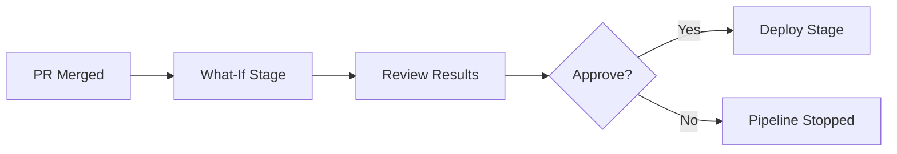

# How to Use Azure Bicep What-If Command to Preview Infrastructure Changes Before Deployment

Author: [nawazdhandala](https://www.github.com/nawazdhandala)

Tags: Azure Bicep, What-If, Infrastructure as Code, Azure, Deployment Preview, DevOps, Cloud Infrastructure

Description: Use the Azure Bicep what-if command to preview infrastructure changes before deploying, reducing risk and catching unintended modifications.

---

Deploying infrastructure changes to production without knowing exactly what will change is a recipe for disaster. A mistyped parameter could delete a database. A changed SKU could take down a service. A removed resource block could wipe out something you did not intend to touch.

The `what-if` command for Azure Bicep and ARM template deployments shows you exactly what will change before you deploy. It is the equivalent of Terraform's `plan` command - a dry run that compares your template against the current state of your Azure resources and tells you what will be created, modified, or deleted.

In this post, I will walk through using `what-if` effectively, integrating it into your CI/CD pipeline, reading the output, and handling the scenarios where it gets tricky.

## How What-If Works

When you run a what-if operation, Azure Resource Manager:

1. Reads your Bicep file (compiles it to ARM JSON behind the scenes)
2. Fetches the current state of resources in the target resource group
3. Compares the desired state from your template against the current state
4. Generates a diff showing what would change

The result categorizes each resource into one of these change types:

- **Create**: The resource does not exist and will be created
- **Delete**: The resource exists but is not in the template (only in Complete mode)
- **Modify**: The resource exists and some properties will change
- **No change**: The resource exists and matches the template exactly
- **Ignore**: The resource exists but is not managed by this template
- **Deploy**: The resource will be deployed but what-if cannot determine the exact changes (common with certain resource types)

## Running What-If from the CLI

The simplest way to run what-if is through the Azure CLI.

```bash
# Run what-if for a Bicep file targeting a resource group
az deployment group what-if \
  --resource-group my-resource-group \
  --template-file main.bicep \
  --parameters main.parameters.json
```

The output is color-coded in the terminal:

- Green (+) for resources being created
- Red (-) for resources being deleted
- Yellow (~) for resources being modified
- White for no changes

Here is what typical output looks like.

```
Resource and property changes are indicated with these symbols:
  + Create
  ~ Modify
  - Delete
  = NoChange

The deployment will update the following scope:

Scope: /subscriptions/xxxx/resourceGroups/my-resource-group

  ~ Microsoft.Web/serverfarms/myapp-plan [2023-01-01]
    ~ sku.name:  "B1" => "P1v3"
    ~ sku.tier:  "Basic" => "PremiumV3"

  ~ Microsoft.Web/sites/myapp-web [2023-01-01]
    ~ properties.siteConfig.alwaysOn:  false => true

  + Microsoft.Cache/redis/myapp-cache [2023-04-01]

  = Microsoft.Storage/storageAccounts/myappstorage [2023-01-01]
```

This tells you that the App Service plan is being upgraded from B1 to P1v3, the web app is getting `alwaysOn` enabled, a new Redis cache is being created, and the storage account is unchanged.

## What-If for Subscription-Level Deployments

If your Bicep file targets the subscription scope (for example, creating resource groups), use the subscription-level command.

```bash
# What-if for subscription-level deployment
az deployment sub what-if \
  --location eastus2 \
  --template-file main.bicep \
  --parameters environment='prod'
```

## Integrating What-If into Azure Pipelines

The real power of what-if comes when you integrate it into your CI/CD pipeline. I use it in two ways: as an automated check in PR validation, and as a manual review step before production deployments.

### PR Validation with What-If

This pipeline runs what-if on every pull request that changes infrastructure files and posts the results as a comment on the PR.

```yaml
# azure-pipelines-infra-pr.yml - What-if on infrastructure PRs
trigger: none

pr:
  branches:
    include:
      - main
  paths:
    include:
      - infra/**

pool:
  vmImage: 'ubuntu-latest'

steps:
  # Log in to Azure
  - task: AzureCLI@2
    displayName: 'Run what-if analysis'
    inputs:
      azureSubscription: 'my-service-connection'
      scriptType: 'bash'
      scriptLocation: 'inlineScript'
      inlineScript: |
        # Run what-if and capture the output
        WHATIF_OUTPUT=$(az deployment group what-if \
          --resource-group my-resource-group \
          --template-file infra/main.bicep \
          --parameters infra/main.parameters.dev.json \
          --no-pretty-print 2>&1)

        echo "What-If Results:"
        echo "$WHATIF_OUTPUT"

        # Save output to a file for the publish step
        echo "$WHATIF_OUTPUT" > $(Build.ArtifactStagingDirectory)/whatif-results.txt

  # Publish what-if results as an artifact
  - task: PublishBuildArtifacts@1
    displayName: 'Publish what-if results'
    inputs:
      pathToPublish: '$(Build.ArtifactStagingDirectory)/whatif-results.txt'
      artifactName: 'whatif-results'
```

### Production Deployment with What-If Gate

For production deployments, run what-if as a separate stage, then require manual approval before the actual deployment.

```yaml
# Multi-stage pipeline with what-if review before deployment
stages:
  - stage: WhatIf
    displayName: 'Preview Changes'
    jobs:
      - job: WhatIfAnalysis
        pool:
          vmImage: 'ubuntu-latest'
        steps:
          - task: AzureCLI@2
            displayName: 'Run what-if'
            inputs:
              azureSubscription: 'prod-connection'
              scriptType: 'bash'
              scriptLocation: 'inlineScript'
              inlineScript: |
                echo "## Infrastructure Changes Preview"
                echo ""
                az deployment group what-if \
                  --resource-group rg-production \
                  --template-file infra/main.bicep \
                  --parameters infra/main.parameters.prod.json

  - stage: Deploy
    displayName: 'Deploy Infrastructure'
    dependsOn: WhatIf
    jobs:
      - deployment: DeployInfra
        pool:
          vmImage: 'ubuntu-latest'
        environment: 'production-infra'  # Has approval gate configured
        strategy:
          runOnce:
            deploy:
              steps:
                - task: AzureCLI@2
                  displayName: 'Deploy Bicep'
                  inputs:
                    azureSubscription: 'prod-connection'
                    scriptType: 'bash'
                    scriptLocation: 'inlineScript'
                    inlineScript: |
                      az deployment group create \
                        --resource-group rg-production \
                        --template-file infra/main.bicep \
                        --parameters infra/main.parameters.prod.json
```

The flow looks like this:



## Reading What-If Output Effectively

The what-if output can be verbose, especially for large deployments. Here are some tips for reading it effectively.

### Focus on Deletions First

Deletions are the most dangerous changes. Always scan for red minus signs first. If you see unexpected deletions, stop and investigate before deploying.

### Understand Deployment Modes

What-if behavior depends on the deployment mode:

**Incremental mode** (default): Only resources in the template are changed. Resources that exist in Azure but are not in the template are left alone. Deletions only show for resources that are explicitly removed from the template.

**Complete mode**: Azure Resource Manager treats the template as the complete desired state. Any resource in the resource group that is not in the template will be deleted. This mode is powerful but dangerous.

```bash
# What-if in complete mode (shows potential deletions)
az deployment group what-if \
  --resource-group my-resource-group \
  --template-file main.bicep \
  --parameters main.parameters.json \
  --mode Complete
```

I strongly recommend running what-if in the same mode you plan to deploy in. If you run what-if in Incremental mode but deploy in Complete mode, you will miss the deletions.

### Filtering Results

For large deployments, you can filter the what-if output to focus on specific change types.

```bash
# Show only resources that will be modified or deleted
az deployment group what-if \
  --resource-group my-resource-group \
  --template-file main.bicep \
  --parameters main.parameters.json \
  --result-format ResourceIdOnly \
  --exclude-change-types NoChange Ignore
```

The `--result-format ResourceIdOnly` gives you a compact view showing just the resource IDs and change types, which is useful for large deployments where the full property diff is overwhelming.

## Known Limitations

What-if is not perfect. There are scenarios where it gives incomplete or inaccurate results.

**Some resource types are not fully supported.** What-if might show "Deploy" instead of the specific changes for certain resource types. This means it knows the resource will be deployed but cannot determine the exact property changes.

**Dynamic values are estimated.** Properties that are computed at deployment time (like passwords generated by `uniqueString()`) show as changes even when they would actually resolve to the same value.

**Cross-resource-group references.** If your template references resources in other resource groups, what-if might not accurately predict changes to those resources.

**Extension resources.** Resources like role assignments, diagnostic settings, and locks sometimes show inaccurate results in what-if.

Despite these limitations, what-if catches the vast majority of unintended changes and is far better than deploying blind.

## Automating What-If Checks

You can write scripts that parse the what-if output and fail the pipeline if certain conditions are met.

```bash
#!/bin/bash
# check-whatif.sh - Fail if what-if shows unexpected deletions

# Run what-if and capture JSON output
RESULT=$(az deployment group what-if \
  --resource-group my-resource-group \
  --template-file main.bicep \
  --parameters main.parameters.json \
  --result-format FullResourcePayloads \
  --no-pretty-print \
  -o json 2>/dev/null)

# Count deletions
DELETE_COUNT=$(echo "$RESULT" | jq '[.changes[] | select(.changeType == "Delete")] | length')

# Fail if there are any unexpected deletions
if [ "$DELETE_COUNT" -gt 0 ]; then
  echo "##vso[task.logissue type=error]What-if detected $DELETE_COUNT resource deletion(s)!"
  echo "Deletions detected:"
  echo "$RESULT" | jq -r '.changes[] | select(.changeType == "Delete") | .resourceId'
  echo ""
  echo "If these deletions are intentional, add the --allow-deletions flag."
  exit 1
fi

# Count modifications
MODIFY_COUNT=$(echo "$RESULT" | jq '[.changes[] | select(.changeType == "Modify")] | length')
CREATE_COUNT=$(echo "$RESULT" | jq '[.changes[] | select(.changeType == "Create")] | length')

echo "What-if summary:"
echo "  Creates: $CREATE_COUNT"
echo "  Modifications: $MODIFY_COUNT"
echo "  Deletions: $DELETE_COUNT"
```

## Best Practices

**Run what-if on every infrastructure PR.** Make it a required check so reviewers can see what changes the PR introduces.

**Run what-if before every production deployment.** Even if the same changes were reviewed in a PR, the production environment might have drifted.

**Use the same parameters you will deploy with.** Running what-if with dev parameters when you plan to deploy with prod parameters defeats the purpose.

**Do not ignore "Deploy" change types.** When what-if shows "Deploy" instead of specific changes, manually verify what those resources look like in production.

**Compare what-if results across environments.** If what-if shows different changes in dev versus prod for the same template changes, investigate why. It usually means the environments have drifted.

## Wrapping Up

The what-if command is your safety net for infrastructure deployments. It takes seconds to run and can prevent hours of incident response. Integrate it into your PR validation to give reviewers visibility into infrastructure changes, and add it as a gate before production deployments. The few minutes it adds to your deployment process is nothing compared to the confidence it provides.
