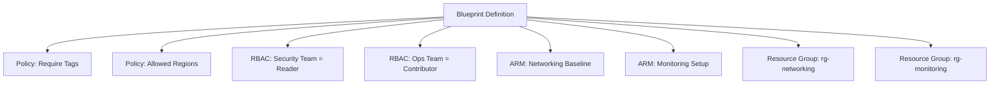

# How to Use Azure Blueprints to Define Repeatable Compliant Environments

Author: [nawazdhandala](https://www.github.com/nawazdhandala)

Tags: Azure, Blueprints, Governance, Compliance, Infrastructure as Code, ARM Templates, Enterprise

Description: Learn how to create Azure Blueprints that package policies, RBAC assignments, and ARM templates into a single deployable definition for repeatable compliant environments.

---

Every time your organization spins up a new Azure subscription for a project or team, someone has to configure the policies, set up the role assignments, deploy the baseline infrastructure, and make sure everything meets compliance requirements. Do this manually and you end up with inconsistency, missed configurations, and audit findings. Azure Blueprints solves this by packaging all those governance artifacts - policies, RBAC roles, resource groups, and ARM templates - into a single versioned definition that you can assign to any subscription with one click.

In this post, I will walk through how Blueprints work, how to create one, and how to use them to establish consistent, compliant environments across your organization.

Note: Microsoft has announced that Azure Blueprints will eventually be superseded by Azure Deployment Stacks and other tools. However, Blueprints remain fully supported and are still the most integrated solution for packaging governance artifacts together. The concepts and patterns in this post apply regardless of which tooling you use.

## What Azure Blueprints Include

A Blueprint definition can contain four types of artifacts:

1. **Policy assignments** - Azure Policy assignments that enforce compliance rules
2. **Role assignments** - RBAC role assignments that grant access to specific groups or users
3. **ARM templates** - Infrastructure deployments for baseline resources (networking, monitoring, security)
4. **Resource groups** - Resource group definitions that organize the deployed resources

When you assign a Blueprint to a subscription, all artifacts are deployed together as a single, tracked unit.



## Creating a Blueprint Definition

### Through the Portal

1. Search for "Blueprints" in the Azure portal
2. Click "Blueprint definitions"
3. Click "Create blueprint"
4. Choose "Start with blank blueprint" or use one of the built-in samples
5. Set the definition location (management group or subscription where the blueprint will be stored)
6. Give it a name and description

### Through the REST API

Blueprints do not have full Azure CLI support, so we use the REST API:

```bash
# Create a blueprint definition at a management group
az rest --method put \
  --url "https://management.azure.com/providers/Microsoft.Management/managementGroups/Workloads/providers/Microsoft.Blueprint/blueprints/compliant-subscription?api-version=2018-11-01-preview" \
  --body '{
    "properties": {
      "displayName": "Compliant Subscription Baseline",
      "description": "Baseline configuration for new subscriptions including networking, monitoring, policies, and access control",
      "targetScope": "subscription",
      "parameters": {
        "organizationName": {
          "type": "string",
          "metadata": {
            "displayName": "Organization Name",
            "description": "Short name of the business unit or team"
          }
        },
        "environment": {
          "type": "string",
          "allowedValues": ["dev", "staging", "production"],
          "metadata": {
            "displayName": "Environment",
            "description": "Deployment environment"
          }
        },
        "allowedLocations": {
          "type": "array",
          "metadata": {
            "displayName": "Allowed Locations",
            "description": "Regions where resources can be deployed"
          }
        }
      }
    }
  }'
```

## Adding Artifacts

### Adding a Resource Group Artifact

```bash
# Add a resource group for networking resources
az rest --method put \
  --url "https://management.azure.com/providers/Microsoft.Management/managementGroups/Workloads/providers/Microsoft.Blueprint/blueprints/compliant-subscription/artifacts/rg-networking?api-version=2018-11-01-preview" \
  --body '{
    "kind": "resourceGroup",
    "properties": {
      "displayName": "Networking Resource Group",
      "description": "Contains all networking baseline resources",
      "resourceGroup": {
        "name": "[concat(parameters(\"organizationName\"), \"-rg-networking-\", parameters(\"environment\"))]",
        "location": "eastus"
      }
    }
  }'
```

### Adding a Policy Assignment Artifact

```bash
# Add a policy artifact that restricts allowed locations
az rest --method put \
  --url "https://management.azure.com/providers/Microsoft.Management/managementGroups/Workloads/providers/Microsoft.Blueprint/blueprints/compliant-subscription/artifacts/policy-allowed-locations?api-version=2018-11-01-preview" \
  --body '{
    "kind": "policyAssignment",
    "properties": {
      "displayName": "Restrict resource locations",
      "description": "Only allow resources in approved Azure regions",
      "policyDefinitionId": "/providers/Microsoft.Authorization/policyDefinitions/e56962a6-4747-49cd-b67b-bf8b01975c4c",
      "parameters": {
        "listOfAllowedLocations": {
          "value": "[parameters(\"allowedLocations\")]"
        }
      }
    }
  }'
```

### Adding an RBAC Assignment Artifact

```bash
# Add an RBAC artifact that grants the security team Reader access
az rest --method put \
  --url "https://management.azure.com/providers/Microsoft.Management/managementGroups/Workloads/providers/Microsoft.Blueprint/blueprints/compliant-subscription/artifacts/rbac-security-reader?api-version=2018-11-01-preview" \
  --body '{
    "kind": "roleAssignment",
    "properties": {
      "displayName": "Security Team - Reader",
      "description": "Grants the security team read-only access for audit purposes",
      "roleDefinitionId": "/providers/Microsoft.Authorization/roleDefinitions/acdd72a7-3385-48ef-bd42-f606fba81ae7",
      "principalIds": ["<security-team-group-object-id>"]
    }
  }'
```

### Adding an ARM Template Artifact

This is where you deploy baseline infrastructure. Here is an example that sets up a Log Analytics workspace and diagnostic settings:

```bash
# Add an ARM template artifact for monitoring setup
az rest --method put \
  --url "https://management.azure.com/providers/Microsoft.Management/managementGroups/Workloads/providers/Microsoft.Blueprint/blueprints/compliant-subscription/artifacts/template-monitoring?api-version=2018-11-01-preview" \
  --body '{
    "kind": "template",
    "properties": {
      "displayName": "Monitoring Baseline",
      "description": "Deploys Log Analytics workspace and baseline monitoring",
      "resourceGroup": "rg-monitoring",
      "template": {
        "$schema": "https://schema.management.azure.com/schemas/2019-04-01/deploymentTemplate.json#",
        "contentVersion": "1.0.0.0",
        "resources": [
          {
            "type": "Microsoft.OperationalInsights/workspaces",
            "apiVersion": "2021-06-01",
            "name": "[concat(parameters(\"organizationName\"), \"-la-\", parameters(\"environment\"))]",
            "location": "eastus",
            "properties": {
              "sku": {
                "name": "PerGB2018"
              },
              "retentionInDays": 90
            }
          }
        ]
      },
      "parameters": {}
    }
  }'
```

## Publishing the Blueprint

Before a Blueprint can be assigned, it must be published with a version number:

```bash
# Publish the blueprint with a version number
az rest --method put \
  --url "https://management.azure.com/providers/Microsoft.Management/managementGroups/Workloads/providers/Microsoft.Blueprint/blueprints/compliant-subscription/versions/1.0.0?api-version=2018-11-01-preview" \
  --body '{
    "properties": {
      "description": "Initial release with networking, monitoring, policies, and RBAC"
    }
  }'
```

Versioning is important because it lets you:
- Track changes over time
- Roll back to a previous version if a new one causes issues
- Assign different versions to different subscriptions during a phased rollout

## Assigning the Blueprint to a Subscription

```bash
# Assign the published blueprint to a subscription
az rest --method put \
  --url "https://management.azure.com/subscriptions/<subscription-id>/providers/Microsoft.Blueprint/blueprintAssignments/baseline-assignment?api-version=2018-11-01-preview" \
  --body '{
    "identity": {
      "type": "SystemAssigned"
    },
    "location": "eastus",
    "properties": {
      "blueprintId": "/providers/Microsoft.Management/managementGroups/Workloads/providers/Microsoft.Blueprint/blueprints/compliant-subscription/versions/1.0.0",
      "parameters": {
        "organizationName": { "value": "sales" },
        "environment": { "value": "production" },
        "allowedLocations": { "value": ["eastus", "eastus2"] }
      },
      "resourceGroups": {
        "rg-networking": {
          "name": "sales-rg-networking-prod",
          "location": "eastus"
        },
        "rg-monitoring": {
          "name": "sales-rg-monitoring-prod",
          "location": "eastus"
        }
      },
      "locks": {
        "mode": "AllResourcesDoNotDelete"
      }
    }
  }'
```

### Blueprint Locks

The `locks` property is one of the most powerful features of Blueprints. When set to `AllResourcesDoNotDelete`, it places a deny assignment on all resources deployed by the Blueprint, preventing anyone from deleting them - even users with Owner permissions on the subscription. This is how you ensure that baseline infrastructure cannot be accidentally removed.

Lock modes:
- **None** - no locks applied
- **AllResourcesReadOnly** - resources cannot be modified or deleted
- **AllResourcesDoNotDelete** - resources cannot be deleted but can be modified

## Blueprint Lifecycle

### Updating a Blueprint

When you need to change the Blueprint:

1. Edit the draft version of the Blueprint definition (add/modify/remove artifacts)
2. Publish a new version (e.g., 1.1.0)
3. Update existing assignments to use the new version

```bash
# Update an existing assignment to use a new blueprint version
az rest --method put \
  --url "https://management.azure.com/subscriptions/<subscription-id>/providers/Microsoft.Blueprint/blueprintAssignments/baseline-assignment?api-version=2018-11-01-preview" \
  --body '{
    "identity": {
      "type": "SystemAssigned"
    },
    "location": "eastus",
    "properties": {
      "blueprintId": "/providers/Microsoft.Management/managementGroups/Workloads/providers/Microsoft.Blueprint/blueprints/compliant-subscription/versions/1.1.0",
      "parameters": {
        "organizationName": { "value": "sales" },
        "environment": { "value": "production" },
        "allowedLocations": { "value": ["eastus", "eastus2"] }
      }
    }
  }'
```

### Unassigning a Blueprint

If you need to remove a Blueprint assignment:

```bash
# Unassign a blueprint from a subscription
az rest --method delete \
  --url "https://management.azure.com/subscriptions/<subscription-id>/providers/Microsoft.Blueprint/blueprintAssignments/baseline-assignment?api-version=2018-11-01-preview"
```

Unassigning a Blueprint removes the policy assignments and RBAC assignments it created, but does not delete the resources deployed by ARM templates. Those resources persist and need to be cleaned up separately if desired.

## Practical Blueprint Examples

### Landing Zone Blueprint

A comprehensive landing zone blueprint might include:

- Policy: Allowed locations
- Policy: Require resource tags (CostCenter, Environment, Owner)
- Policy: Require encryption at rest for storage accounts
- Policy: Deny public IP addresses
- RBAC: Security team as Reader
- RBAC: Operations team as Contributor
- ARM: Hub virtual network with peering to central hub
- ARM: Log Analytics workspace connected to central monitoring
- ARM: Network Security Group with baseline rules
- ARM: Azure Key Vault for subscription-level secrets
- Resource groups: rg-networking, rg-monitoring, rg-security, rg-shared

### Compliance Blueprint

For regulated industries:

- Policy initiative: CIS Azure Foundations Benchmark
- Policy initiative: NIST SP 800-53
- Policy: Audit diagnostic settings
- ARM: Azure Defender (Microsoft Defender for Cloud) standard tier enablement
- ARM: Azure Sentinel workspace
- RBAC: Compliance team as Security Reader

## Best Practices

- **Start simple and iterate.** Your first Blueprint does not need to cover everything. Start with policies and RBAC, then add ARM templates for baseline infrastructure in later versions.
- **Use parameters generously.** Make anything that varies between subscriptions a parameter (organization name, environment, team name, allowed locations).
- **Version every change.** Even small changes should get a new version number. This gives you a clear audit trail and rollback path.
- **Test in a sandbox subscription first.** Always assign a new Blueprint version to a non-critical subscription before rolling it out to production.
- **Use locks for critical resources.** Blueprint locks are your safety net against accidental deletion of governance infrastructure.
- **Store Blueprint definitions in source control.** Export your Blueprint JSON and keep it in Git alongside your other infrastructure as code.

## Wrapping Up

Azure Blueprints give you a declarative, versioned, and repeatable way to stand up compliant Azure environments. By packaging policies, RBAC, and baseline infrastructure into a single artifact, you ensure that every new subscription starts from a consistent, governance-compliant foundation. While the tooling landscape is evolving, the pattern of defining environment baselines as code and applying them consistently is fundamental to cloud governance at any scale.
