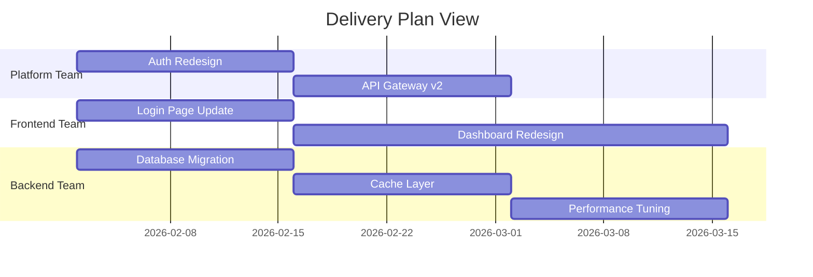

# How to Use Azure Boards Delivery Plans to Visualize Work Across Multiple Teams and Sprints

Author: [nawazdhandala](https://www.github.com/nawazdhandala)

Tags: Azure Boards, Delivery Plans, Agile, Project Management, Azure DevOps, Sprint Planning, Team Collaboration

Description: Learn how to set up and use Azure Boards Delivery Plans to visualize work across multiple teams, sprints, and projects in a single timeline view.

---

When you have one team working on one project, tracking work is simple. Open the sprint board, see what is in progress, done. But real organizations have multiple teams working on interconnected features, shared dependencies, and coordinated release dates. Suddenly, the sprint board for a single team is not enough. You need to see the big picture - what every team is working on, how their timelines overlap, and where the dependencies and conflicts are.

Azure Boards Delivery Plans provide exactly this view. A Delivery Plan is a timeline that shows work items across multiple teams and sprints on a single screen. Think of it as a planning wall that spans your entire organization. In this post, I will show you how to set up Delivery Plans, configure them for multi-team visibility, and use them effectively in your planning process.

## What Delivery Plans Show You

A Delivery Plan displays work items on a calendar timeline. Each row represents a team (or a backlog level), and the columns represent time periods (sprints or months). Work items appear as cards on the timeline, positioned according to the sprint they are assigned to.

At a glance, you can see:

- What each team is committed to for the current and upcoming sprints
- How work is distributed across time
- Where teams have too much or too little work
- Dependencies between work items across teams
- Milestones and key dates

## Creating a Delivery Plan

To create a Delivery Plan, navigate to your Azure DevOps project and click on Boards, then Delivery Plans. Click "New Plan" and configure the basics:

1. **Name**: Give it a descriptive name like "Q1 2026 Feature Delivery" or "Platform Team Roadmap"
2. **Description**: Explain what this plan covers and who should use it

After creating the plan, you need to add teams and configure the timeline.

## Adding Teams to the Plan

Click the settings gear icon on the plan and go to the "Teams" section. Click "Add team" and select the teams you want to include. For each team, you configure:

- **Team**: The Azure DevOps team to display
- **Backlog level**: Which backlog items to show (Epics, Features, Stories, or a combination)

For a feature delivery plan, you might add:

- Platform Team showing Features
- Frontend Team showing Features
- Backend Team showing Features
- QA Team showing Features

For a higher-level roadmap, show Epics instead:

- All teams showing Epics

You can mix and match. Maybe you want to see Epics for executive-level planning and Features for a specific team's sprint planning.

## Configuring Sprint Timelines

The Delivery Plan timeline is driven by the sprint (iteration) configurations of the teams you add. If Team A has two-week sprints and Team B has three-week sprints, the plan will display both cadences accurately.

Make sure your teams have their sprints configured correctly in Project Settings under Team Configuration and Iterations. The plan pulls this data automatically.

## Working with Cards on the Plan

Each work item appears as a card on the timeline. You can interact with these cards in several ways:

**Drag and drop**: Move a card from one sprint to another to reschedule it. This updates the iteration path on the work item.

**Expand cards**: Click on a card to see more details without leaving the plan view. You can see the description, assigned team member, state, and child items.

**Card fields**: Configure which fields appear on the card. Go to plan settings and customize the card fields. Common choices include:
- Title (always shown)
- Assigned To
- State
- Tags
- Story Points or Effort

## Setting Up Field Criteria and Filters

You probably do not want to see every single work item on the plan. Use field criteria to filter what appears:

In plan settings, go to "Field criteria" and add filters like:

- **State**: Not Equal to "Closed" (hide completed items)
- **Tags**: Contains "Q1-Release" (show only items tagged for the current release)
- **Priority**: Less than or equal to 2 (show only high-priority items)
- **Area Path**: Under "MyProject\Features" (show only feature work, not bugs)

Multiple criteria are combined with AND logic, so all conditions must be true for a work item to appear.

## Using Markers for Key Dates

Markers are vertical lines on the timeline that highlight important dates. You might add markers for:

- Release dates
- Code freeze deadlines
- External dependencies
- Holiday periods
- Demo or review sessions

To add a marker, go to plan settings and click "Add marker." Set the date, give it a name, and choose a color. The marker appears as a vertical line across all team rows.

## Tracking Dependencies

Dependencies between work items from different teams are one of the most valuable things to see on a Delivery Plan. Azure DevOps supports dependency tracking through links between work items.

To create dependencies:

1. Open a work item
2. Go to the Related Work section
3. Add a link with type "Predecessor" or "Successor"
4. Select the work item it depends on

On the Delivery Plan, dependencies appear as lines connecting cards. If a dependency has a scheduling conflict (the dependent item is scheduled before the item it depends on), the line turns red, making it immediately obvious that something needs to be rescheduled.

This visual dependency tracking is incredibly useful during planning meetings. Instead of someone saying "we cannot start the dashboard redesign until the API is ready," you can see it right on the plan and adjust timelines accordingly.

## Plan Views and Zoom Levels

Delivery Plans support different zoom levels to show different amounts of detail:

- **Sprint view**: Shows individual sprints, best for near-term planning
- **Month view**: Shows work grouped by month, good for quarterly planning
- **Quarter view**: Shows work at a quarter level, suitable for roadmap discussions

You can scroll the timeline horizontally to look at past or future sprints. The current date is highlighted so you can see where you are relative to planned work.

## Sharing Plans with Stakeholders

Not everyone who needs to see the plan has an Azure DevOps account. There are a few ways to share:

**Plan links**: Anyone with access to the project can view the plan directly. Share the URL.

**Screenshots and exports**: Use the browser's print function or a screenshot tool to capture the plan for presentations.

**Dashboards**: Add a Delivery Plan widget to an Azure DevOps dashboard. This gives stakeholders a glanceable view without navigating to the full plan.

## Best Practices for Delivery Plans

**Keep plans focused.** Do not try to put everything on one plan. Create separate plans for different purposes - one for the leadership roadmap (showing Epics), one for the sprint planning wall (showing Features/Stories), and one for release tracking.

**Review plans in ceremonies.** Use the Delivery Plan as the primary artifact in cross-team planning sessions, PI planning, or sprint reviews. Walking through the timeline together helps everyone see the same picture.

**Update regularly.** A plan is only useful if the data behind it is current. Make sure teams keep their work items updated with correct sprint assignments and states.

**Use consistent sprint naming.** If teams use different sprint naming conventions, the timeline can look confusing. Standardize on a format like "Sprint 2026.03" or use shared iteration paths.

**Start with a small scope.** If you are new to Delivery Plans, start with two or three teams and one backlog level. Add more complexity once people are comfortable with the tool.

## Combining with Other Azure Boards Features

Delivery Plans work well alongside other Azure Boards features:

- **Queries**: Create queries that find work items not assigned to any sprint. These are gaps in your plan that need attention.
- **Sprint Boards**: For day-to-day work tracking within a team, the sprint board is still the right tool. Delivery Plans are for cross-team visibility.
- **Analytics views**: Use the Analytics service to create reports on velocity and progress that complement the visual timeline.

## Wrapping Up

Azure Boards Delivery Plans bridge the gap between team-level sprint boards and organization-level roadmap views. They give you a single timeline where you can see what every team is working on, spot dependency conflicts, and ensure that coordinated features are landing in the right sprints. Set up a plan for your next planning cycle and use it as the centerpiece of your cross-team coordination. The visual clarity it provides makes planning meetings far more productive.
