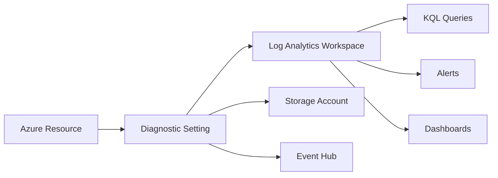

# How to Use Azure CLI to Configure Diagnostic Settings and Log Analytics for Azure Resources

Author: [nawazdhandala](https://www.github.com/nawazdhandala)

Tags: Azure CLI, Diagnostic Settings, Log Analytics, Azure Monitor, Observability, Logging, Azure Resources

Description: Learn how to use Azure CLI to configure diagnostic settings and route logs and metrics from Azure resources to Log Analytics workspaces for centralized monitoring.

---

Every Azure resource generates diagnostic data - logs, metrics, and activity records that tell you what is happening under the hood. By default, most of this data goes nowhere useful. It exists briefly in the platform and then ages out. Configuring diagnostic settings routes this data to a Log Analytics workspace where you can query it, build dashboards, set up alerts, and retain it for as long as you need.

The Azure CLI is the fastest way to configure diagnostic settings across many resources. Instead of clicking through the portal for each resource (which gets old fast when you have 50 resources), you can script the entire setup and run it as part of your infrastructure provisioning.

## Understanding Diagnostic Settings

A diagnostic setting is a configuration on an Azure resource that tells it where to send its diagnostic data. Each resource can have multiple diagnostic settings, and each setting can route data to different destinations.

The three possible destinations are:

- Log Analytics workspace - for querying and alerting
- Storage account - for long-term archival
- Event Hub - for streaming to external systems like Splunk or Datadog

Most teams use Log Analytics as their primary destination because it supports Kusto Query Language (KQL), which is powerful for ad-hoc analysis and alerting.



## Creating a Log Analytics Workspace

Before configuring diagnostic settings, you need a Log Analytics workspace. If you do not have one, create it with the CLI.

```bash
# Create a resource group for monitoring infrastructure
az group create \
  --name "rg-monitoring" \
  --location "eastus"

# Create a Log Analytics workspace
# The --retention-in-days flag sets how long data is kept (30-730 days)
az monitor log-analytics workspace create \
  --resource-group "rg-monitoring" \
  --workspace-name "law-central-monitoring" \
  --location "eastus" \
  --retention-in-days 90 \
  --sku "PerGB2018"

# Get the workspace ID (you will need this for diagnostic settings)
WORKSPACE_ID=$(az monitor log-analytics workspace show \
  --resource-group "rg-monitoring" \
  --workspace-name "law-central-monitoring" \
  --query id \
  --output tsv)

echo "Workspace ID: $WORKSPACE_ID"
```

## Checking Available Diagnostic Categories

Different resource types support different log categories and metrics. Before configuring a diagnostic setting, check what is available for your resource type.

```bash
# List available diagnostic log categories for a specific resource
# Replace with your actual resource ID
RESOURCE_ID="/subscriptions/12345678-xxxx-xxxx-xxxx-123456789012/resourceGroups/my-rg/providers/Microsoft.Web/sites/my-web-app"

az monitor diagnostic-settings categories list \
  --resource "$RESOURCE_ID" \
  --output table
```

This outputs a table showing each category name, whether it is a Log or Metric category, and the category group it belongs to. Use this information to decide which categories to enable.

## Configuring Diagnostic Settings for a Web App

Here is how to enable diagnostic settings for an Azure App Service web app.

```bash
# Configure diagnostic settings for an App Service web app
# This routes HTTP logs, app logs, and metrics to Log Analytics

RESOURCE_ID="/subscriptions/12345678-xxxx-xxxx-xxxx-123456789012/resourceGroups/my-rg/providers/Microsoft.Web/sites/my-web-app"
WORKSPACE_ID="/subscriptions/12345678-xxxx-xxxx-xxxx-123456789012/resourceGroups/rg-monitoring/providers/Microsoft.OperationalInsights/workspaces/law-central-monitoring"

az monitor diagnostic-settings create \
  --name "send-to-log-analytics" \
  --resource "$RESOURCE_ID" \
  --workspace "$WORKSPACE_ID" \
  --logs '[
    {
      "category": "AppServiceHTTPLogs",
      "enabled": true,
      "retentionPolicy": { "enabled": false, "days": 0 }
    },
    {
      "category": "AppServiceConsoleLogs",
      "enabled": true,
      "retentionPolicy": { "enabled": false, "days": 0 }
    },
    {
      "category": "AppServiceAppLogs",
      "enabled": true,
      "retentionPolicy": { "enabled": false, "days": 0 }
    },
    {
      "category": "AppServicePlatformLogs",
      "enabled": true,
      "retentionPolicy": { "enabled": false, "days": 0 }
    }
  ]' \
  --metrics '[
    {
      "category": "AllMetrics",
      "enabled": true,
      "retentionPolicy": { "enabled": false, "days": 0 }
    }
  ]'
```

## Configuring Diagnostic Settings for SQL Database

SQL databases have their own set of diagnostic categories that are critical for performance monitoring and security auditing.

```bash
# Configure diagnostic settings for Azure SQL Database
SQL_RESOURCE_ID="/subscriptions/12345678-xxxx-xxxx-xxxx-123456789012/resourceGroups/my-rg/providers/Microsoft.Sql/servers/my-sql-server/databases/my-database"

az monitor diagnostic-settings create \
  --name "sql-diagnostics" \
  --resource "$SQL_RESOURCE_ID" \
  --workspace "$WORKSPACE_ID" \
  --logs '[
    {
      "category": "SQLInsights",
      "enabled": true,
      "retentionPolicy": { "enabled": false, "days": 0 }
    },
    {
      "category": "AutomaticTuning",
      "enabled": true,
      "retentionPolicy": { "enabled": false, "days": 0 }
    },
    {
      "category": "QueryStoreRuntimeStatistics",
      "enabled": true,
      "retentionPolicy": { "enabled": false, "days": 0 }
    },
    {
      "category": "Errors",
      "enabled": true,
      "retentionPolicy": { "enabled": false, "days": 0 }
    },
    {
      "category": "SQLSecurityAuditEvents",
      "enabled": true,
      "retentionPolicy": { "enabled": false, "days": 0 }
    }
  ]' \
  --metrics '[
    {
      "category": "Basic",
      "enabled": true,
      "retentionPolicy": { "enabled": false, "days": 0 }
    },
    {
      "category": "InstanceAndAppAdvanced",
      "enabled": true,
      "retentionPolicy": { "enabled": false, "days": 0 }
    }
  ]'
```

## Bulk Configuration Across All Resources

The real power of the CLI comes when you need to configure diagnostic settings for many resources at once. Here is a script that finds all resources of a given type in a subscription and enables diagnostics on all of them.

```bash
#!/bin/bash
# bulk-diagnostics.sh
# Configure diagnostic settings for all App Service web apps in a subscription

WORKSPACE_ID="/subscriptions/12345678-xxxx-xxxx-xxxx-123456789012/resourceGroups/rg-monitoring/providers/Microsoft.OperationalInsights/workspaces/law-central-monitoring"
SETTING_NAME="centralized-monitoring"

# Get all App Service web apps in the subscription
WEBAPP_IDS=$(az webapp list --query "[].id" --output tsv)

# Loop through each web app and configure diagnostics
for RESOURCE_ID in $WEBAPP_IDS; do
    WEBAPP_NAME=$(echo "$RESOURCE_ID" | rev | cut -d'/' -f1 | rev)
    echo "Configuring diagnostics for: $WEBAPP_NAME"

    # Check if a diagnostic setting already exists
    EXISTING=$(az monitor diagnostic-settings list \
      --resource "$RESOURCE_ID" \
      --query "[?name=='$SETTING_NAME'].name" \
      --output tsv)

    if [ -n "$EXISTING" ]; then
        echo "  Diagnostic setting already exists, skipping."
        continue
    fi

    # Create the diagnostic setting
    az monitor diagnostic-settings create \
      --name "$SETTING_NAME" \
      --resource "$RESOURCE_ID" \
      --workspace "$WORKSPACE_ID" \
      --logs '[{"categoryGroup": "allLogs", "enabled": true}]' \
      --metrics '[{"category": "AllMetrics", "enabled": true}]' \
      --output none

    echo "  Diagnostics configured successfully."
done

echo "Bulk configuration complete."
```

Note the use of `categoryGroup: allLogs` instead of listing individual categories. This is a shortcut that enables all available log categories for the resource, which is convenient for bulk operations.

## Verifying Diagnostic Settings

After configuring diagnostic settings, verify they are active and data is flowing.

```bash
# List all diagnostic settings for a resource
az monitor diagnostic-settings list \
  --resource "$RESOURCE_ID" \
  --output table

# Show details of a specific diagnostic setting
az monitor diagnostic-settings show \
  --name "send-to-log-analytics" \
  --resource "$RESOURCE_ID"
```

To verify data is actually arriving in Log Analytics, run a KQL query.

```bash
# Query Log Analytics to verify data is flowing
# This checks for recent App Service HTTP logs
az monitor log-analytics query \
  --workspace "$WORKSPACE_ID" \
  --analytics-query "AppServiceHTTPLogs | take 10 | project TimeGenerated, CsMethod, CsUriStem, ScStatus" \
  --timespan "PT1H" \
  --output table
```

## Configuring Activity Log Diagnostics

The Azure Activity Log is a subscription-level log that records control plane operations (resource creation, deletion, role assignments, etc.). It has its own diagnostic setting configuration.

```bash
# Configure Activity Log to send to Log Analytics
# This is configured at the subscription level, not the resource level
SUBSCRIPTION_ID="12345678-xxxx-xxxx-xxxx-123456789012"

az monitor diagnostic-settings subscription create \
  --name "activity-to-law" \
  --subscription "$SUBSCRIPTION_ID" \
  --workspace "$WORKSPACE_ID" \
  --logs '[
    {"category": "Administrative", "enabled": true},
    {"category": "Security", "enabled": true},
    {"category": "ServiceHealth", "enabled": true},
    {"category": "Alert", "enabled": true},
    {"category": "Recommendation", "enabled": true},
    {"category": "Policy", "enabled": true},
    {"category": "Autoscale", "enabled": true},
    {"category": "ResourceHealth", "enabled": true}
  ]'
```

## Setting Up Alerts on Diagnostic Data

Once your logs are in Log Analytics, you can create alerts that fire when specific conditions are met.

```bash
# Create an alert rule that fires when there are too many HTTP 500 errors
az monitor scheduled-query create \
  --name "high-error-rate" \
  --resource-group "rg-monitoring" \
  --scopes "$WORKSPACE_ID" \
  --condition "count 'AppServiceHTTPLogs | where ScStatus >= 500' > 50" \
  --condition-query "AppServiceHTTPLogs | where ScStatus >= 500 | summarize ErrorCount=count() by bin(TimeGenerated, 5m)" \
  --evaluation-frequency "5m" \
  --window-size "5m" \
  --severity 2 \
  --action-groups "/subscriptions/$SUBSCRIPTION_ID/resourceGroups/rg-monitoring/providers/Microsoft.Insights/actionGroups/ops-team"
```

## Cleaning Up Diagnostic Settings

When you decommission resources or change your monitoring strategy, clean up diagnostic settings to avoid unnecessary costs.

```bash
# Delete a specific diagnostic setting
az monitor diagnostic-settings delete \
  --name "send-to-log-analytics" \
  --resource "$RESOURCE_ID"

# Delete all diagnostic settings for a resource
SETTINGS=$(az monitor diagnostic-settings list \
  --resource "$RESOURCE_ID" \
  --query "[].name" \
  --output tsv)

for SETTING in $SETTINGS; do
    echo "Deleting diagnostic setting: $SETTING"
    az monitor diagnostic-settings delete \
      --name "$SETTING" \
      --resource "$RESOURCE_ID"
done
```

Diagnostic settings are the foundation of Azure observability. Without them, your resources are black boxes. With them, you get full visibility into what is happening, why it is happening, and when things go wrong. The CLI makes it practical to configure and maintain these settings at scale, turning a tedious portal-clicking exercise into a repeatable, scriptable process.
