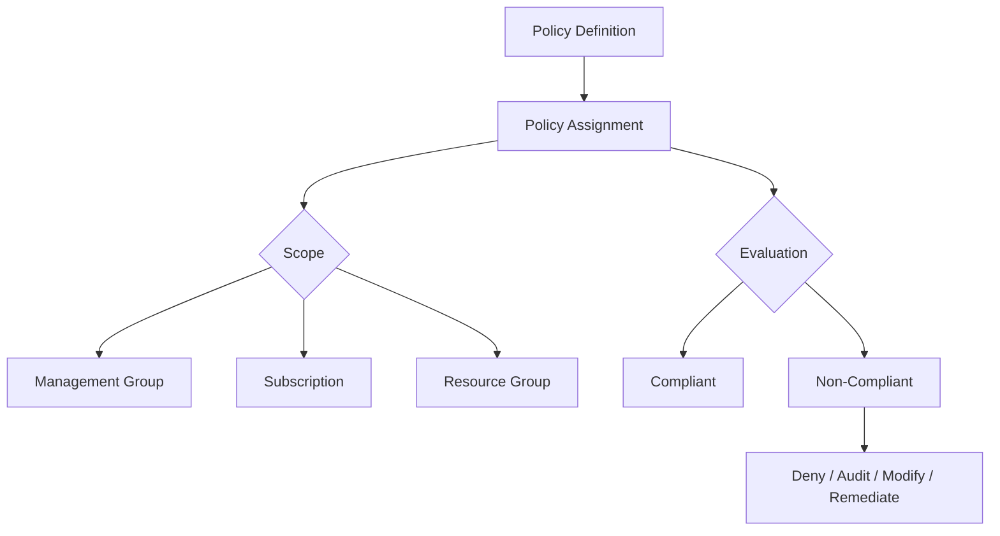

# How to Use Azure CLI to Create and Manage Azure Policy Assignments for Governance

Author: [nawazdhandala](https://www.github.com/nawazdhandala)

Tags: Azure CLI, Azure Policy, Governance, Cloud Compliance, Azure, Security, Infrastructure

Description: A practical guide to creating, assigning, and managing Azure Policy definitions using the Azure CLI for cloud governance and compliance enforcement.

---

Cloud governance at scale requires automation. You cannot manually check every resource creation to see if it complies with your organization's rules. Azure Policy automates this enforcement - it evaluates resources against rules you define and can deny non-compliant creations, audit existing resources, or automatically remediate issues.

While the Azure portal provides a graphical interface for working with policies, the Azure CLI is where you get real power. CLI commands can be scripted, version-controlled, and integrated into CI/CD pipelines. In this post, I will walk through using the Azure CLI to create policy definitions, assign them to scopes, check compliance, and manage policies at scale.

## Understanding Azure Policy Concepts

Before diving into commands, let's clarify the key concepts:

- **Policy definition**: The rule itself - what to check and what to do about it. Written in JSON.
- **Policy assignment**: The act of applying a policy to a specific scope (management group, subscription, or resource group).
- **Policy initiative (policy set)**: A group of related policy definitions bundled together.
- **Effect**: What happens when a resource violates the policy - deny, audit, modify, deployIfNotExists, or append.
- **Compliance state**: Whether resources meet the policy requirements - compliant, non-compliant, or exempt.



## Listing Built-In Policies

Azure provides hundreds of built-in policy definitions. Before writing custom ones, check if a built-in policy already covers your need:

```bash
# List all built-in policy definitions (there are hundreds)
az policy definition list --query "[?policyType=='BuiltIn'].{Name:displayName, Id:name}" --output table

# Search for policies related to a specific topic
az policy definition list \
  --query "[?policyType=='BuiltIn' && contains(displayName, 'tag')].{Name:displayName, Category:metadata.category}" \
  --output table

# Search for storage-related policies
az policy definition list \
  --query "[?policyType=='BuiltIn' && contains(displayName, 'storage')].{Name:displayName, Id:name}" \
  --output table

# Get details of a specific built-in policy
az policy definition show --name "1e30110a-5ceb-460c-a204-c1c3969c6d62" --output json
```

## Creating a Custom Policy Definition

When built-in policies do not cover your requirement, create a custom one. Policy rules are written in JSON:

```bash
# Create a policy rule file
# This policy denies the creation of public IP addresses
```

First, create the policy rule JSON file:

```json
{
  "if": {
    "allOf": [
      {
        "field": "type",
        "equals": "Microsoft.Network/publicIPAddresses"
      },
      {
        "field": "Microsoft.Network/publicIPAddresses/publicIPAllocationMethod",
        "equals": "Static"
      }
    ]
  },
  "then": {
    "effect": "deny"
  }
}
```

Save this as `deny-static-public-ip-rule.json`, then create the policy definition:

```bash
# Create a custom policy definition at the subscription level
az policy definition create \
  --name "deny-static-public-ip" \
  --display-name "Deny static public IP addresses" \
  --description "Prevents creation of static public IP addresses for security compliance" \
  --rules @deny-static-public-ip-rule.json \
  --mode "Indexed" \
  --metadata '{"category": "Network Security"}'
```

## Policy with Parameters

Parameterized policies are more flexible. Here is a policy that requires specific tags, with the tag names passed as parameters:

```json
{
  "if": {
    "field": "[concat('tags[', parameters('tagName'), ']')]",
    "exists": "false"
  },
  "then": {
    "effect": "[parameters('effect')]"
  }
}
```

Save the parameters definition separately:

```json
{
  "tagName": {
    "type": "String",
    "metadata": {
      "displayName": "Tag Name",
      "description": "Name of the required tag"
    }
  },
  "effect": {
    "type": "String",
    "metadata": {
      "displayName": "Effect",
      "description": "The effect to apply (deny or audit)"
    },
    "allowedValues": ["deny", "audit"],
    "defaultValue": "audit"
  }
}
```

Create the definition with parameters:

```bash
# Create a parameterized policy definition
az policy definition create \
  --name "require-tag" \
  --display-name "Require a specific tag on resources" \
  --description "Ensures a specified tag exists on all resources" \
  --rules @require-tag-rule.json \
  --params @require-tag-params.json \
  --mode "Indexed"
```

## Assigning Policies

Creating a definition is only half the job. You need to assign it to a scope for it to take effect:

```bash
# Assign a built-in policy to a subscription
# This example assigns "Require a tag on resources"
az policy assignment create \
  --name "require-environment-tag" \
  --display-name "Require Environment tag on all resources" \
  --policy "require-tag" \
  --scope "/subscriptions/YOUR_SUBSCRIPTION_ID" \
  --params '{"tagName": {"value": "Environment"}, "effect": {"value": "deny"}}'

# Assign a policy to a resource group (narrower scope)
az policy assignment create \
  --name "require-env-tag-prod" \
  --display-name "Require Environment tag in production" \
  --policy "require-tag" \
  --scope "/subscriptions/YOUR_SUB_ID/resourceGroups/production-rg" \
  --params '{"tagName": {"value": "Environment"}, "effect": {"value": "deny"}}'

# Assign a policy to a management group (broader scope)
az policy assignment create \
  --name "require-env-tag-org" \
  --policy "require-tag" \
  --scope "/providers/Microsoft.Management/managementGroups/my-mgmt-group" \
  --params '{"tagName": {"value": "Environment"}, "effect": {"value": "audit"}}'
```

## Creating and Assigning Policy Initiatives

Policy initiatives (also called policy sets) bundle multiple related policies together. This is useful for compliance frameworks where you need to enforce many rules at once:

```bash
# Define an initiative that bundles multiple tagging policies
```

Create the initiative definition file:

```json
[
  {
    "policyDefinitionId": "/subscriptions/YOUR_SUB_ID/providers/Microsoft.Authorization/policyDefinitions/require-tag",
    "parameters": {
      "tagName": {
        "value": "Environment"
      },
      "effect": {
        "value": "deny"
      }
    }
  },
  {
    "policyDefinitionId": "/subscriptions/YOUR_SUB_ID/providers/Microsoft.Authorization/policyDefinitions/require-tag",
    "parameters": {
      "tagName": {
        "value": "CostCenter"
      },
      "effect": {
        "value": "deny"
      }
    }
  },
  {
    "policyDefinitionId": "/subscriptions/YOUR_SUB_ID/providers/Microsoft.Authorization/policyDefinitions/require-tag",
    "parameters": {
      "tagName": {
        "value": "Owner"
      },
      "effect": {
        "value": "audit"
      }
    }
  }
]
```

```bash
# Create the policy initiative
az policy set-definition create \
  --name "required-tags-initiative" \
  --display-name "Required Tags Initiative" \
  --description "Ensures all required tags are present on resources" \
  --definitions @initiative-definitions.json \
  --metadata '{"category": "Tags"}'

# Assign the initiative to a subscription
az policy assignment create \
  --name "required-tags-assignment" \
  --display-name "Enforce required tags" \
  --policy-set-definition "required-tags-initiative" \
  --scope "/subscriptions/YOUR_SUBSCRIPTION_ID"
```

## Checking Compliance

After assigning policies, check how your existing resources stack up:

```bash
# Trigger a policy evaluation (on-demand scan)
az policy state trigger-scan --subscription YOUR_SUBSCRIPTION_ID

# Check overall compliance summary
az policy state summarize \
  --subscription YOUR_SUBSCRIPTION_ID \
  --output table

# List non-compliant resources for a specific policy assignment
az policy state list \
  --subscription YOUR_SUBSCRIPTION_ID \
  --filter "complianceState eq 'NonCompliant' and policyAssignmentName eq 'require-environment-tag'" \
  --query "[].{Resource:resourceId, Policy:policyDefinitionName}" \
  --output table

# Get compliance details for a specific resource group
az policy state list \
  --resource-group production-rg \
  --filter "complianceState eq 'NonCompliant'" \
  --output table
```

## Exempting Resources

Sometimes you need to exempt specific resources from a policy. Maybe a legacy resource cannot be tagged, or a special-purpose resource legitimately needs a public IP:

```bash
# Create a policy exemption for a specific resource
az policy exemption create \
  --name "legacy-vm-exemption" \
  --policy-assignment "require-environment-tag" \
  --scope "/subscriptions/SUB_ID/resourceGroups/legacy-rg/providers/Microsoft.Compute/virtualMachines/old-vm" \
  --exemption-category "Waiver" \
  --description "Legacy VM pending migration - exempt until 2026-06-30" \
  --expires-on "2026-06-30T00:00:00Z"

# List all exemptions
az policy exemption list --output table
```

Exemptions can have expiration dates, which is great for temporary exceptions. The two exemption categories are "Waiver" (organization chooses to accept the risk) and "Mitigated" (the policy intent is met through other means).

## Remediation for Existing Resources

Policies with `modify` or `deployIfNotExists` effects can automatically fix non-compliant resources. This is called remediation:

```bash
# Create a remediation task to fix non-compliant resources
az policy remediation create \
  --name "add-missing-environment-tags" \
  --policy-assignment "require-environment-tag" \
  --resource-group "production-rg"

# Check remediation progress
az policy remediation show \
  --name "add-missing-environment-tags" \
  --resource-group "production-rg" \
  --output table

# List all remediation tasks
az policy remediation list --output table
```

Note that remediation requires the policy assignment to have a managed identity with appropriate permissions. When you create an assignment for a policy with `modify` or `deployIfNotExists` effect, use the `--mi-system-assigned` flag:

```bash
# Create assignment with managed identity for remediation
az policy assignment create \
  --name "inherit-rg-tags" \
  --policy "your-modify-policy" \
  --scope "/subscriptions/YOUR_SUB_ID" \
  --mi-system-assigned \
  --location "eastus"
```

## Scripting Policy Management

For organizations managing many policies, scripting is essential. Here is a pattern for deploying policies from a Git repository:

```bash
#!/bin/bash
# deploy-policies.sh - Deploy all policy definitions and assignments from a directory

set -euo pipefail

POLICY_DIR="./policies"
SUBSCRIPTION_ID=$(az account show --query id -o tsv)

echo "Deploying policies to subscription: $SUBSCRIPTION_ID"

# Deploy all policy definitions
for rule_file in "$POLICY_DIR"/definitions/*/rule.json; do
    dir=$(dirname "$rule_file")
    name=$(basename "$dir")
    params_file="$dir/params.json"

    echo "Creating policy definition: $name"

    cmd="az policy definition create --name $name --rules @$rule_file --mode Indexed"
    if [ -f "$params_file" ]; then
        cmd="$cmd --params @$params_file"
    fi

    # Read display name from metadata if it exists
    if [ -f "$dir/metadata.json" ]; then
        display_name=$(jq -r '.displayName' "$dir/metadata.json")
        cmd="$cmd --display-name \"$display_name\""
    fi

    eval "$cmd" 2>/dev/null || echo "  (already exists, updating...)"
done

# Deploy all policy assignments
for assignment_file in "$POLICY_DIR"/assignments/*.json; do
    name=$(basename "$assignment_file" .json)
    echo "Creating policy assignment: $name"

    az policy assignment create \
      --name "$name" \
      --from-file "$assignment_file" \
      2>/dev/null || echo "  (already exists, updating...)"
done

echo "Policy deployment complete"
```

## Wrapping Up

Azure Policy through the CLI gives you version-controlled, scriptable governance that scales with your organization. Start with built-in policies for common requirements like tagging and allowed resource types. Create custom policies for organization-specific rules. Bundle them into initiatives for compliance frameworks. And use the compliance checking and remediation capabilities to keep your existing resources in line. The CLI makes it possible to treat policies as code, deploy them through pipelines, and manage them at scale.
