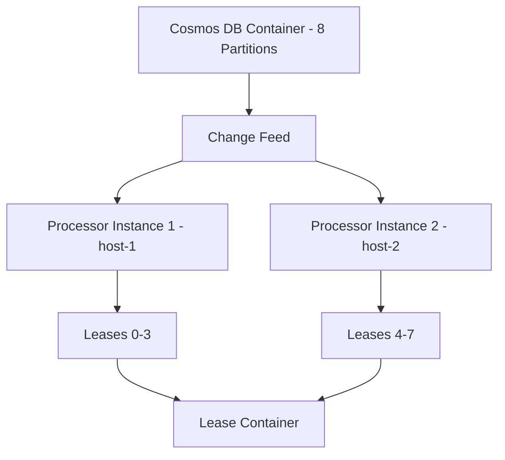

# How to Use Azure Cosmos DB Change Feed with the Java SDK for Real-Time Processing

Author: [nawazdhandala](https://www.github.com/nawazdhandala)

Tags: Azure Cosmos DB, Change Feed, Java SDK, Real-Time Processing, Event-Driven, NoSQL, Azure

Description: Learn how to use the Azure Cosmos DB Change Feed with the Java SDK to process data changes in real time for event-driven applications.

---

Azure Cosmos DB's Change Feed provides an ordered stream of changes to documents in a container. Every time a document is created or updated, the change appears in the feed. This makes it possible to react to data changes in real time without polling or building complex trigger mechanisms. The Java SDK includes a Change Feed Processor that handles the heavy lifting of reading the feed, distributing work across consumers, and checkpointing progress.

In this post, we will build a Java application that uses the Cosmos DB Change Feed Processor to listen for document changes and process them in real time. We will cover setup, configuration, scaling, and error handling.

## What the Change Feed Gives You

The Change Feed is not a separate service you need to provision. It is a built-in feature of every Cosmos DB container. When you insert or update a document, Cosmos DB records the change in a persistent, ordered log. Your application subscribes to this log and receives changes as they happen.

Common use cases include:

- Keeping a materialized view in sync with the source data
- Feeding changes into a search index like Azure Cognitive Search
- Triggering workflows when specific data changes occur
- Replicating data to another data store or region
- Building an audit trail

One important thing to note: the Change Feed captures inserts and updates, but not deletes. If you need to track deletes, use a soft-delete pattern where you set a `deleted` flag instead of actually removing the document.

## Setting Up the Project

Create a Java project with the Cosmos DB SDK dependency.

```xml
<!-- pom.xml -->
<dependencies>
    <!-- Azure Cosmos DB SDK -->
    <dependency>
        <groupId>com.azure</groupId>
        <artifactId>azure-cosmos</artifactId>
        <version>4.54.0</version>
    </dependency>

    <!-- SLF4J for logging -->
    <dependency>
        <groupId>org.slf4j</groupId>
        <artifactId>slf4j-simple</artifactId>
        <version>2.0.9</version>
    </dependency>
</dependencies>
```

## Creating the Cosmos DB Resources

Set up a Cosmos DB account with the necessary containers.

```bash
# Create a Cosmos DB account
az cosmosdb create \
  --name my-cosmos-account \
  --resource-group cosmos-demo-rg \
  --kind GlobalDocumentDB

# Create a database
az cosmosdb sql database create \
  --account-name my-cosmos-account \
  --resource-group cosmos-demo-rg \
  --name EventStore

# Create the main container for documents
az cosmosdb sql container create \
  --account-name my-cosmos-account \
  --resource-group cosmos-demo-rg \
  --database-name EventStore \
  --name Orders \
  --partition-key-path "/customerId" \
  --throughput 400

# Create the lease container for change feed tracking
az cosmosdb sql container create \
  --account-name my-cosmos-account \
  --resource-group cosmos-demo-rg \
  --database-name EventStore \
  --name Leases \
  --partition-key-path "/id" \
  --throughput 400
```

The lease container is essential. It stores checkpoints that track each processor's position in the change feed. Without it, the processor would not know where to resume after a restart.

## Connecting to Cosmos DB

Initialize the Cosmos client and get references to your containers.

```java
import com.azure.cosmos.*;
import com.azure.cosmos.models.*;

public class CosmosDbSetup {

    // Connection string from the Azure Portal
    private static final String ENDPOINT = "https://my-cosmos-account.documents.azure.com:443/";
    private static final String KEY = "your-primary-key";
    private static final String DATABASE_NAME = "EventStore";

    public static CosmosAsyncClient createClient() {
        // Build the async client with recommended settings
        return new CosmosClientBuilder()
            .endpoint(ENDPOINT)
            .key(KEY)
            .consistencyLevel(ConsistencyLevel.SESSION)
            .contentResponseOnWriteEnabled(true)
            .buildAsyncClient();
    }

    public static void main(String[] args) throws Exception {
        CosmosAsyncClient client = createClient();

        // Get references to the database and containers
        CosmosAsyncDatabase database = client.getDatabase(DATABASE_NAME);
        CosmosAsyncContainer ordersContainer = database.getContainer("Orders");
        CosmosAsyncContainer leaseContainer = database.getContainer("Leases");

        System.out.println("Connected to Cosmos DB successfully");

        // Start the change feed processor
        startChangeFeedProcessor(ordersContainer, leaseContainer);

        // Insert some test documents to trigger the change feed
        insertTestOrders(ordersContainer);

        // Keep the application running
        System.out.println("Press Enter to stop...");
        System.in.read();

        client.close();
    }
}
```

## Building the Change Feed Processor

The Change Feed Processor manages partition distribution, checkpointing, and failover. You provide a handler function that processes each batch of changes.

```java
import com.azure.cosmos.*;
import com.azure.cosmos.models.*;
import com.fasterxml.jackson.databind.JsonNode;
import org.slf4j.Logger;
import org.slf4j.LoggerFactory;
import reactor.core.publisher.Mono;

import java.util.List;

public class OrderChangeFeedProcessor {

    private static final Logger log = LoggerFactory.getLogger(OrderChangeFeedProcessor.class);

    public static ChangeFeedProcessor startChangeFeedProcessor(
            CosmosAsyncContainer feedContainer,
            CosmosAsyncContainer leaseContainer) {

        // Build the change feed processor
        ChangeFeedProcessor processor = new ChangeFeedProcessorBuilder()
            .hostName("processor-host-1")  // Unique name for this instance
            .feedContainer(feedContainer)   // Container to watch for changes
            .leaseContainer(leaseContainer) // Container for storing checkpoints
            .handleChanges((List<JsonNode> changes) -> {
                log.info("Received {} changes", changes.size());

                for (JsonNode change : changes) {
                    processChange(change);
                }
            })
            .buildChangeFeedProcessor();

        // Start the processor asynchronously
        processor.start()
            .doOnSuccess(v -> log.info("Change Feed Processor started"))
            .doOnError(e -> log.error("Failed to start Change Feed Processor", e))
            .subscribe();

        return processor;
    }

    private static void processChange(JsonNode document) {
        // Extract fields from the changed document
        String orderId = document.get("id").asText();
        String customerId = document.get("customerId").asText();
        String status = document.has("status") ? document.get("status").asText() : "unknown";

        log.info("Processing order change - ID: {}, Customer: {}, Status: {}",
            orderId, customerId, status);

        // React based on the change type
        switch (status) {
            case "CREATED":
                handleNewOrder(document);
                break;
            case "PAID":
                handlePaymentReceived(document);
                break;
            case "SHIPPED":
                handleOrderShipped(document);
                break;
            default:
                log.info("Unhandled status: {}", status);
        }
    }

    private static void handleNewOrder(JsonNode order) {
        log.info("New order detected: {}", order.get("id").asText());
        // Send to payment processing, update inventory, etc.
    }

    private static void handlePaymentReceived(JsonNode order) {
        log.info("Payment received for order: {}", order.get("id").asText());
        // Trigger fulfillment workflow
    }

    private static void handleOrderShipped(JsonNode order) {
        log.info("Order shipped: {}", order.get("id").asText());
        // Send shipping notification email
    }
}
```

## Using Strongly Typed Models

Instead of working with JsonNode, you can use POJO classes.

```java
// Order model class
public class Order {
    private String id;
    private String customerId;
    private String productName;
    private int quantity;
    private double totalAmount;
    private String status;
    private long createdAt;

    // Default constructor for deserialization
    public Order() {}

    public Order(String customerId, String productName, int quantity, double totalAmount) {
        this.id = java.util.UUID.randomUUID().toString();
        this.customerId = customerId;
        this.productName = productName;
        this.quantity = quantity;
        this.totalAmount = totalAmount;
        this.status = "CREATED";
        this.createdAt = System.currentTimeMillis();
    }

    // Getters and setters
    public String getId() { return id; }
    public void setId(String id) { this.id = id; }
    public String getCustomerId() { return customerId; }
    public void setCustomerId(String customerId) { this.customerId = customerId; }
    public String getProductName() { return productName; }
    public void setProductName(String productName) { this.productName = productName; }
    public int getQuantity() { return quantity; }
    public void setQuantity(int quantity) { this.quantity = quantity; }
    public double getTotalAmount() { return totalAmount; }
    public void setTotalAmount(double totalAmount) { this.totalAmount = totalAmount; }
    public String getStatus() { return status; }
    public void setStatus(String status) { this.status = status; }
    public long getCreatedAt() { return createdAt; }
    public void setCreatedAt(long createdAt) { this.createdAt = createdAt; }
}
```

## Inserting Test Data

Create some documents to trigger the change feed.

```java
import reactor.core.publisher.Flux;

public static void insertTestOrders(CosmosAsyncContainer container) {
    // Create several test orders
    List<Order> orders = List.of(
        new Order("cust-001", "Laptop", 1, 999.99),
        new Order("cust-002", "Headphones", 2, 149.98),
        new Order("cust-001", "Mouse", 1, 29.99),
        new Order("cust-003", "Keyboard", 1, 79.99)
    );

    // Insert each order into the container
    Flux.fromIterable(orders)
        .flatMap(order -> container.createItem(order, new PartitionKey(order.getCustomerId()), new CosmosItemRequestOptions()))
        .doOnNext(response -> System.out.println("Inserted order: " + response.getItem().getId()))
        .doOnError(e -> System.err.println("Error inserting order: " + e.getMessage()))
        .blockLast();

    System.out.println("Test orders inserted");
}
```

## Scaling the Change Feed Processor

The Change Feed Processor distributes partitions across multiple instances automatically. When you run multiple instances with different host names, they coordinate through the lease container.



If Instance 1 goes down, Instance 2 automatically picks up its leases. When Instance 1 comes back, the leases are rebalanced.

## Configuring Processing Options

Fine-tune the processor behavior.

```java
ChangeFeedProcessor processor = new ChangeFeedProcessorBuilder()
    .hostName("processor-host-1")
    .feedContainer(feedContainer)
    .leaseContainer(leaseContainer)
    .handleChanges(this::processChanges)
    // Start from the beginning of the feed (useful for initial data load)
    .options(new ChangeFeedProcessorOptions()
        .setStartFromBeginning(true)
        // Maximum number of items per batch
        .setMaxItemCount(100)
        // How often to check for new changes (in milliseconds)
        .setFeedPollDelay(java.time.Duration.ofSeconds(1)))
    .buildChangeFeedProcessor();
```

## Error Handling

When processing fails, you need to decide whether to retry, skip, or dead-letter the change. The Change Feed Processor does not automatically retry failed batches, so you need to handle errors in your delegate.

```java
.handleChanges((List<JsonNode> changes) -> {
    for (JsonNode change : changes) {
        try {
            processChange(change);
        } catch (Exception e) {
            log.error("Failed to process change for document {}: {}",
                change.get("id"), e.getMessage());

            // Write to a dead letter container for later inspection
            try {
                deadLetterContainer.createItem(Map.of(
                    "id", java.util.UUID.randomUUID().toString(),
                    "originalId", change.get("id").asText(),
                    "error", e.getMessage(),
                    "document", change.toString(),
                    "failedAt", System.currentTimeMillis()
                )).block();
            } catch (Exception dlEx) {
                log.error("Failed to write to dead letter: {}", dlEx.getMessage());
            }
        }
    }
})
```

## Monitoring the Change Feed Lag

Monitor how far behind your processor is using the estimator.

```java
// Build an estimator to monitor the change feed lag
ChangeFeedProcessor estimator = new ChangeFeedProcessorBuilder()
    .hostName("estimator-host")
    .feedContainer(feedContainer)
    .leaseContainer(leaseContainer)
    .handleLatestVersionChanges(changes -> {
        // This estimator handler is required but not used for lag estimation
    })
    .buildChangeFeedProcessor();
```

In production, push the lag metric to your monitoring system and alert when it exceeds a threshold.

## Wrapping Up

The Cosmos DB Change Feed with the Java SDK gives you a reliable way to react to data changes in real time. The Change Feed Processor handles partition distribution, checkpointing, and failover automatically. Define your handler, start the processor, and let it run. Make your processing idempotent since changes can be delivered more than once. Use the lease container for coordination and the estimator for monitoring. Whether you are building materialized views, search indexes, or event-driven workflows, the Change Feed is a clean way to decouple your read and write paths.
