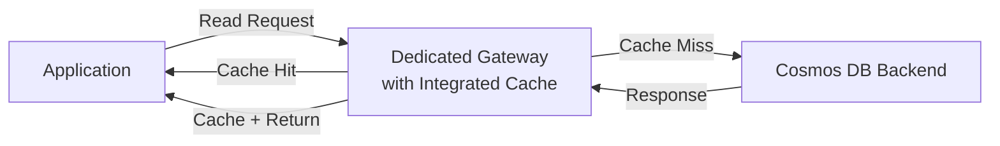

# How to Use Azure Cosmos DB Integrated Cache to Reduce Read Costs

Author: [nawazdhandala](https://www.github.com/nawazdhandala)

Tags: Azure, Cosmos DB, Integrated Cache, Caching, Cost Optimization, Performance

Description: Configure and use the Azure Cosmos DB integrated cache to serve repeated reads from an in-memory cache, reducing both RU consumption and read latency.

---

If your application reads the same documents or runs the same queries repeatedly, you are paying full RU costs for each read even though the data has not changed. The Azure Cosmos DB integrated cache is a built-in, in-memory cache that sits in front of your Cosmos DB account. It transparently caches point reads and query results, serving subsequent requests from memory instead of hitting the database. This reduces both your RU costs and your read latency.

## How the Integrated Cache Works

The integrated cache runs on your Cosmos DB dedicated gateway. When a read request comes in:

1. The gateway checks if the result is in the cache
2. If yes (cache hit), it returns the cached result - zero RU cost
3. If no (cache miss), it reads from Cosmos DB, caches the result, and returns it



The cache is fully transparent to your application. You do not need to change your data access code, manage cache invalidation, or handle cache-aside logic. It all happens at the gateway level.

## Prerequisites

The integrated cache requires:

- A Cosmos DB dedicated gateway (this is the compute layer that runs the cache)
- Your application must connect through the gateway endpoint (not the direct endpoint)
- The account must use the SQL (Core) API

## Setting Up the Dedicated Gateway

### Using Azure Portal

1. Navigate to your Cosmos DB account
2. Under Settings, click Dedicated Gateway
3. Select the SKU (D4s, D8s, or D16s)
4. Choose the number of instances
5. Click Save

### Using Azure CLI

```bash
# Create a dedicated gateway for your Cosmos DB account
# The SKU determines the cache size
az cosmosdb service create \
    --account-name myCosmosAccount \
    --resource-group myResourceGroup \
    --name SqlDedicatedGateway \
    --kind SqlDedicatedGateway \
    --count 1 \
    --size Cosmos.D4s
```

Available SKUs and their cache sizes:

| SKU | vCores | RAM | Cache Size |
|-----|--------|-----|------------|
| Cosmos.D4s | 4 | 16 GB | ~5 GB usable |
| Cosmos.D8s | 8 | 32 GB | ~10 GB usable |
| Cosmos.D16s | 16 | 64 GB | ~20 GB usable |

Choose the SKU based on how much data you want to cache. If your hot data set is 8 GB, the D8s or D16s is appropriate.

## Connecting Through the Dedicated Gateway

The integrated cache only works when you connect through the dedicated gateway endpoint, not the standard endpoint. The gateway endpoint has a different URL format:

```
Standard endpoint: https://myCosmosAccount.documents.azure.com:443/
Gateway endpoint:  https://myCosmosAccount.sqlx.cosmos.azure.com:443/
```

Note the `.sqlx.` in the gateway endpoint.

### .NET SDK Configuration

```csharp
// Connect through the dedicated gateway to enable the integrated cache
// The key difference is the endpoint URL and ConnectionMode
CosmosClient client = new CosmosClient(
    // Use the dedicated gateway endpoint (note the .sqlx. subdomain)
    accountEndpoint: "https://myCosmosAccount.sqlx.cosmos.azure.com:443/",
    authKeyOrResourceToken: "YOUR_KEY",
    clientOptions: new CosmosClientOptions
    {
        // IMPORTANT: Must use Gateway mode, not Direct
        // The cache only works with Gateway connection mode
        ConnectionMode = ConnectionMode.Gateway
    }
);
```

### Python SDK Configuration

```python
# Connect through the dedicated gateway in Python
from azure.cosmos import CosmosClient

# Use the dedicated gateway endpoint
client = CosmosClient(
    url="https://myCosmosAccount.sqlx.cosmos.azure.com:443/",
    credential="YOUR_KEY",
    connection_mode="Gateway"  # Must be Gateway mode
)
```

### Java SDK Configuration

```java
// Connect through the dedicated gateway in Java
CosmosClient client = new CosmosClientBuilder()
    .endpoint("https://myCosmosAccount.sqlx.cosmos.azure.com:443/")
    .key("YOUR_KEY")
    .gatewayMode()  // Required for integrated cache
    .buildClient();
```

## Controlling Cache Behavior

You can control caching behavior per request using the DedicatedGatewayRequestOptions:

### Setting Maximum Cache Staleness

```csharp
// Control how stale cached data can be
// maxIntegratedCacheStaleness determines the acceptable age of cached data
Container container = client.GetContainer("mydb", "mycontainer");

// Accept cached data up to 5 minutes old
ItemRequestOptions options = new ItemRequestOptions
{
    DedicatedGatewayRequestOptions = new DedicatedGatewayRequestOptions
    {
        MaxIntegratedCacheStaleness = TimeSpan.FromMinutes(5)
    }
};

// This read will use cached data if it is less than 5 minutes old
ItemResponse<MyDoc> response = await container.ReadItemAsync<MyDoc>(
    "doc-123",
    new PartitionKey("pk-1"),
    options
);

Console.WriteLine($"RU charge: {response.RequestCharge}");
// If cache hit: 0 RUs
// If cache miss: normal RU cost
```

### Bypassing the Cache

For operations that must always read the latest data, bypass the cache:

```csharp
// Bypass the cache for critical reads that need fresh data
// Set MaxIntegratedCacheStaleness to zero
ItemRequestOptions freshReadOptions = new ItemRequestOptions
{
    DedicatedGatewayRequestOptions = new DedicatedGatewayRequestOptions
    {
        MaxIntegratedCacheStaleness = TimeSpan.Zero
    }
};

// This always reads from the backend, bypassing the cache
var freshResponse = await container.ReadItemAsync<MyDoc>(
    "doc-123",
    new PartitionKey("pk-1"),
    freshReadOptions
);
```

### Caching Query Results

The integrated cache also caches query results:

```csharp
// Cache query results for repeated queries
QueryRequestOptions queryOptions = new QueryRequestOptions
{
    DedicatedGatewayRequestOptions = new DedicatedGatewayRequestOptions
    {
        MaxIntegratedCacheStaleness = TimeSpan.FromMinutes(10)
    }
};

var query = new QueryDefinition("SELECT * FROM c WHERE c.category = @cat")
    .WithParameter("@cat", "electronics");

var iterator = container.GetItemQueryIterator<MyDoc>(query, requestOptions: queryOptions);
var results = await iterator.ReadNextAsync();

Console.WriteLine($"Query RU charge: {results.RequestCharge}");
// Second time running this same query: 0 RUs (cached)
```

## What Gets Cached

The integrated cache operates on two levels:

### Item Cache

Point reads (ReadItemAsync) are cached individually by their ID and partition key. Each cached item takes up space proportional to the document size.

### Query Cache

Query results are cached by the exact query text and parameters. If you run the same query with the same parameters, the cached result set is returned. Changing any parameter creates a new cache entry.

```csharp
// These two queries are cached separately because the parameter differs
var query1 = "SELECT * FROM c WHERE c.status = 'active'";   // Cached as entry A
var query2 = "SELECT * FROM c WHERE c.status = 'inactive'"; // Cached as entry B

// Running query1 again hits cache entry A
```

## Measuring Cache Effectiveness

Monitor cache hit rates and RU savings:

```csharp
// Track cache hits by monitoring RU charges
// A cache hit results in 0 RU charge
double totalRUs = 0;
int cacheHits = 0;
int cacheMisses = 0;

for (int i = 0; i < 100; i++)
{
    var response = await container.ReadItemAsync<MyDoc>(
        "popular-doc",
        new PartitionKey("pk-1"),
        new ItemRequestOptions
        {
            DedicatedGatewayRequestOptions = new DedicatedGatewayRequestOptions
            {
                MaxIntegratedCacheStaleness = TimeSpan.FromMinutes(5)
            }
        }
    );

    totalRUs += response.RequestCharge;

    if (response.RequestCharge == 0)
        cacheHits++;
    else
        cacheMisses++;
}

double hitRate = (double)cacheHits / (cacheHits + cacheMisses) * 100;
Console.WriteLine($"Cache hit rate: {hitRate:F1}%");
Console.WriteLine($"Total RUs consumed: {totalRUs}");
Console.WriteLine($"RUs saved by cache: approximately {cacheMisses * 1.0 - totalRUs} RUs");
```

In Azure Monitor, check these metrics:

```bash
# Monitor dedicated gateway metrics
az monitor metrics list \
    --resource "/subscriptions/{sub}/resourceGroups/{rg}/providers/Microsoft.DocumentDB/databaseAccounts/myCosmosAccount" \
    --metric "DedicatedGatewayAverageCpuUsage" \
    --interval PT5M

# Also check: DedicatedGatewayMaxCpuUsage, DedicatedGatewayMemoryUsage
```

## Cache Eviction

The cache uses an LRU (Least Recently Used) eviction policy. When the cache is full, the least recently accessed items are evicted to make room for new ones. There is no way to manually evict specific items or clear the cache.

If you need deterministic cache invalidation, the integrated cache might not be the right choice. Consider an external cache like Azure Cache for Redis instead.

## Cost Analysis

The dedicated gateway has a fixed hourly cost based on the SKU:

| SKU | Approximate Monthly Cost |
|-----|------------------------|
| Cosmos.D4s (1 instance) | ~$300/month |
| Cosmos.D8s (1 instance) | ~$600/month |
| Cosmos.D16s (1 instance) | ~$1,200/month |

For the cache to be cost-effective, the RU savings from cache hits must exceed the gateway cost. Calculate your breakeven:

```
Monthly RU savings needed = Gateway cost / RU price per million
Example: $300 / $0.25 per million RU = 1.2 billion RUs saved per month
```

This means you need to save at least 1.2 billion RUs per month to break even on a D4s gateway. For read-heavy workloads with repeated access patterns, this is very achievable.

## When to Use the Integrated Cache

The integrated cache works best for:

- Read-heavy workloads with repeated access patterns (same documents read many times)
- Dashboard queries that run the same aggregations repeatedly
- Product catalog reads where the same popular items are fetched constantly
- Configuration data that changes infrequently but is read often

It is less effective for:

- Write-heavy workloads (the cache is read-only)
- Unique reads where every request fetches a different document
- Data that changes every few seconds (the cache just adds latency)

The integrated cache is the easiest way to add caching to your Cosmos DB reads because it requires zero application code changes beyond updating the endpoint URL and connection mode. If your workload has a clear hot data set that is read repeatedly, it can cut your RU costs substantially while also reducing read latency.
