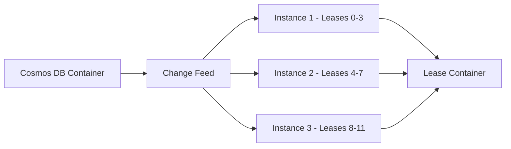

# How to Use Azure Cosmos DB with the .NET SDK and Change Feed Processor

Author: [nawazdhandala](https://www.github.com/nawazdhandala)

Tags: Azure Cosmos DB, .NET SDK, Change Feed Processor, NoSQL, C#, Cloud Database, Event-Driven

Description: Learn how to use Azure Cosmos DB with the .NET SDK and leverage the Change Feed Processor to react to real-time data changes in your applications.

---

Azure Cosmos DB is a globally distributed, multi-model database service that offers low-latency reads and writes at any scale. One of its most powerful features is the Change Feed, which provides a sorted list of documents within a container in the order they were modified. When you pair the Change Feed with the .NET SDK's Change Feed Processor, you get a robust mechanism for reacting to data changes in near real-time.

In this post, we will walk through setting up a Cosmos DB account, connecting to it with the .NET SDK, performing basic CRUD operations, and then building a Change Feed Processor that listens for changes and processes them as they happen.

## Why Cosmos DB and the Change Feed?

Traditional polling approaches to detect data changes are wasteful. You keep hitting the database asking "anything new?" over and over. The Change Feed flips this model on its head. Cosmos DB maintains an ordered log of changes for each logical partition. Your application subscribes to this feed and receives a push notification whenever something changes. This is useful for:

- Triggering downstream workflows when a document is created or updated
- Keeping a materialized view in sync with the source data
- Feeding events into an analytics pipeline or event hub
- Building audit trails without adding complexity to your write path

The Change Feed Processor library, built into the .NET SDK (Microsoft.Azure.Cosmos), handles the heavy lifting of reading the feed, checkpointing progress, and distributing work across multiple consumers.

## Setting Up the Project

Start by creating a new .NET console application and adding the Cosmos DB NuGet package.

```bash
# Create a new console application
dotnet new console -n CosmosChangeFeedDemo
cd CosmosChangeFeedDemo

# Add the Azure Cosmos DB SDK package
dotnet add package Microsoft.Azure.Cosmos
```

You will also need an Azure Cosmos DB account. You can create one through the Azure Portal or the Azure CLI. Make sure you choose the NoSQL (formerly SQL) API.

## Connecting to Cosmos DB

The first step in any Cosmos DB application is creating a CosmosClient. This client is thread-safe and designed to be a singleton for the lifetime of your application.

```csharp
using Microsoft.Azure.Cosmos;

// Replace with your actual connection string from the Azure Portal
string connectionString = "AccountEndpoint=https://your-account.documents.azure.com:443/;AccountKey=your-key;";

// Create a singleton CosmosClient - reuse this throughout your app
CosmosClient client = new CosmosClient(connectionString, new CosmosClientOptions
{
    // Use Direct mode for better performance in production
    ConnectionMode = ConnectionMode.Direct,
    // Serialize enums as strings for readability
    SerializerOptions = new CosmosSerializationOptions
    {
        PropertyNamingPolicy = CosmosPropertyNamingPolicy.CamelCase
    }
});
```

## Creating the Database and Container

Before you can store documents, you need a database and a container. The container is where your documents live, and it requires a partition key.

```csharp
// Create the database if it does not already exist
Database database = await client.CreateDatabaseIfNotExistsAsync("OrdersDb");

// Create the main container for orders, partitioned by customerId
Container ordersContainer = await database.CreateContainerIfNotExistsAsync(
    new ContainerProperties
    {
        Id = "Orders",
        PartitionKeyPath = "/customerId"
    },
    // Set throughput - use autoscale in production
    throughput: 400
);

// The Change Feed Processor needs a lease container to track progress
Container leaseContainer = await database.CreateContainerIfNotExistsAsync(
    new ContainerProperties
    {
        Id = "Leases",
        PartitionKeyPath = "/id"
    },
    throughput: 400
);
```

The lease container is a critical piece. It stores checkpoints so the processor knows where it left off. If your application restarts, it picks up right where it stopped.

## Defining a Document Model

Let's define a simple Order model that we will store in Cosmos DB.

```csharp
public class Order
{
    // Cosmos DB requires an 'id' property
    public string Id { get; set; } = Guid.NewGuid().ToString();

    // This is our partition key
    public string CustomerId { get; set; } = string.Empty;

    public string ProductName { get; set; } = string.Empty;
    public int Quantity { get; set; }
    public decimal TotalPrice { get; set; }
    public DateTime CreatedAt { get; set; } = DateTime.UtcNow;
    public string Status { get; set; } = "Pending";
}
```

## Performing CRUD Operations

Here is how you insert and read documents using the .NET SDK.

```csharp
// Create a new order
var newOrder = new Order
{
    CustomerId = "customer-123",
    ProductName = "Wireless Headphones",
    Quantity = 2,
    TotalPrice = 79.99m
};

// Insert the document into the container
ItemResponse<Order> createResponse = await ordersContainer.CreateItemAsync(
    newOrder,
    new PartitionKey(newOrder.CustomerId)
);
Console.WriteLine($"Created order {createResponse.Resource.Id}, cost: {createResponse.RequestCharge} RUs");

// Read the document back
ItemResponse<Order> readResponse = await ordersContainer.ReadItemAsync<Order>(
    newOrder.Id,
    new PartitionKey(newOrder.CustomerId)
);
Console.WriteLine($"Read order for product: {readResponse.Resource.ProductName}");

// Update the order status
readResponse.Resource.Status = "Shipped";
ItemResponse<Order> updateResponse = await ordersContainer.ReplaceItemAsync(
    readResponse.Resource,
    readResponse.Resource.Id,
    new PartitionKey(readResponse.Resource.CustomerId)
);
Console.WriteLine($"Updated order status to: {updateResponse.Resource.Status}");
```

Each operation returns the request charge in RUs (Request Units), which is useful for monitoring costs.

## Building the Change Feed Processor

Now for the main event. The Change Feed Processor watches the Orders container and fires a delegate whenever documents change.

```csharp
// Define what happens when changes are detected
async Task HandleChangesAsync(
    ChangeFeedProcessorContext context,
    IReadOnlyCollection<Order> changes,
    CancellationToken cancellationToken)
{
    Console.WriteLine($"Change Feed: received {changes.Count} changes from partition {context.LeaseToken}");

    foreach (Order order in changes)
    {
        // Process each changed document
        Console.WriteLine($"  Order {order.Id}: {order.ProductName} - Status: {order.Status}");

        // In a real application, you might:
        // - Send a notification email
        // - Update a search index
        // - Publish an event to a message queue
        // - Write to an analytics database
    }
}

// Build and start the Change Feed Processor
ChangeFeedProcessor processor = ordersContainer
    .GetChangeFeedProcessorBuilder<Order>(
        processorName: "orderProcessor",  // A name to identify this processor
        onChangesDelegate: HandleChangesAsync)
    .WithInstanceName("instance-1")       // Unique name for this host
    .WithLeaseContainer(leaseContainer)   // Where to store checkpoints
    .WithStartTime(DateTime.MinValue.ToUniversalTime()) // Start from the beginning
    .Build();

// Start listening for changes
await processor.StartAsync();
Console.WriteLine("Change Feed Processor started. Press any key to stop.");
Console.ReadKey();

// Gracefully stop the processor
await processor.StopAsync();
```

The processor handles partition distribution automatically. If you run multiple instances of your application, they will coordinate through the lease container and split the work.

## Scaling with Multiple Instances

One of the best things about the Change Feed Processor is horizontal scaling. Each instance picks up a set of leases (partitions) and processes them independently.



When a new instance comes online, the processor automatically rebalances the leases. If an instance goes down, its leases get picked up by the remaining instances. You do not need to write any coordination logic yourself.

## Error Handling and Dead Letter Patterns

In production, you want to handle errors gracefully. If processing a change fails, you might want to retry or move it to a dead letter queue.

```csharp
async Task HandleChangesWithErrorHandling(
    ChangeFeedProcessorContext context,
    IReadOnlyCollection<Order> changes,
    CancellationToken cancellationToken)
{
    foreach (Order order in changes)
    {
        try
        {
            // Attempt to process the change
            await ProcessOrderChange(order);
        }
        catch (Exception ex)
        {
            // Log the error and write to a dead letter container
            Console.WriteLine($"Error processing order {order.Id}: {ex.Message}");

            await deadLetterContainer.CreateItemAsync(new
            {
                id = Guid.NewGuid().ToString(),
                originalOrderId = order.Id,
                error = ex.Message,
                timestamp = DateTime.UtcNow,
                // Store the original document for reprocessing
                originalDocument = order
            }, new PartitionKey(order.CustomerId));
        }
    }
}
```

## Monitoring the Change Feed Processor

The SDK includes an estimator that tells you how far behind the processor is. This is valuable for alerting and dashboards.

```csharp
// Build a change feed estimator to monitor lag
ChangeFeedProcessor estimator = ordersContainer
    .GetChangeFeedEstimatorBuilder(
        processorName: "orderProcessor",
        estimationDelegate: async (long estimation, CancellationToken token) =>
        {
            // Report the estimated number of pending changes
            Console.WriteLine($"Pending changes: {estimation}");

            // In production, push this metric to your monitoring system
            // e.g., Application Insights, Prometheus, etc.
        },
        TimeSpan.FromSeconds(5))  // Check every 5 seconds
    .WithLeaseContainer(leaseContainer)
    .Build();

await estimator.StartAsync();
```

If the pending count keeps growing, it means your processor cannot keep up. That is your signal to add more instances or optimize your processing logic.

## Performance Tips

After working with the Change Feed Processor in several production systems, here are some things I have found that make a real difference:

First, keep your processing logic fast. The Change Feed Processor batches changes and delivers them to your delegate. If your delegate is slow, you create backpressure. Move heavy work to a background queue.

Second, choose your partition key wisely. The Change Feed operates at the partition level. If you have hot partitions with a ton of writes, a single processor instance has to handle all those changes sequentially. Distribute writes evenly.

Third, use the WithMaxItems option to control batch sizes. Smaller batches mean lower latency per change but higher overhead. Larger batches mean better throughput but higher latency for individual changes. Find the right balance for your workload.

Fourth, do not forget to handle the case where the lease container gets corrupted or cleared. Your processor will start from the beginning of the feed, and you need to make sure your processing logic is idempotent.

## Wrapping Up

The combination of Azure Cosmos DB's .NET SDK and the Change Feed Processor gives you a powerful, event-driven architecture without the complexity of managing message queues or polling loops. You get automatic checkpointing, horizontal scaling, and reliable delivery of changes.

The pattern is simple: write data to Cosmos DB as you normally would, and let the Change Feed Processor notify your application whenever something changes. Whether you are building materialized views, syncing data to a search index, or triggering downstream workflows, this approach keeps your write path clean and your reactive logic decoupled.

Start with a simple processor, monitor its lag, and scale out as needed. The SDK handles the coordination, so you can focus on your business logic.
