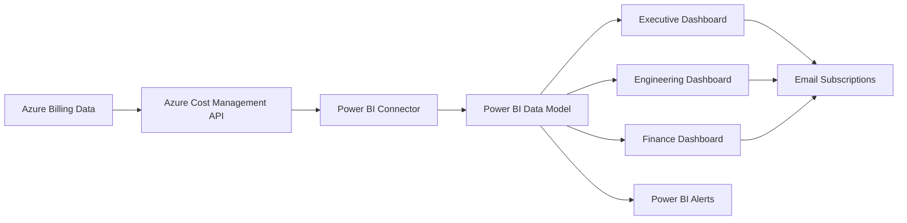

# How to Use Azure Cost Management Power BI Reports for Detailed Spending Analysis

Author: [nawazdhandala](https://www.github.com/nawazdhandala)

Tags: Azure, Cost Management, Power BI, FinOps, Reporting, Cloud Costs, Analytics

Description: Learn how to connect Azure Cost Management to Power BI for detailed spending analysis dashboards and reports with visual breakdowns.

---

The Azure portal's built-in cost analysis is useful for quick checks, but when you need to build detailed spending reports, track trends over months, create executive dashboards, or slice costs by custom dimensions, you need Power BI. Azure Cost Management integrates directly with Power BI, giving you access to the same billing data in a tool built for deep analysis and visualization.

In this post, I will walk through how to set up the connection, what reports come out of the box, and how to build custom reports that actually help you understand where your money goes.

## Option 1: Use the Azure Cost Management Power BI App

Microsoft provides a free Power BI app for Azure Cost Management that comes pre-built with useful reports. This is the fastest way to get started.

### For Enterprise Agreement (EA) Customers

1. Open Power BI (https://app.powerbi.com)
2. Go to **Apps > Get apps**
3. Search for "Azure Cost Management" by Microsoft
4. Install the app
5. Enter your EA enrollment number when prompted

### For Microsoft Customer Agreement (MCA) Customers

1. Open Power BI
2. Go to **Apps > Get apps**
3. Search for "Azure Cost Management" for Microsoft Customer Agreement
4. Install and enter your billing profile ID

The pre-built app includes these reports:

- **Account overview**: High-level spending summary with trends
- **Usage by subscriptions**: Cost breakdown per subscription
- **Usage by services**: Which Azure services cost the most
- **Top 5 usage drivers**: The biggest cost contributors
- **Windows Server AHB savings**: Potential savings from Azure Hybrid Benefit

## Option 2: Use the Azure Cost Management Connector

For custom reports, use the Power BI connector to pull raw cost data and build your own visualizations.

1. Open Power BI Desktop
2. Click **Get Data > Azure > Azure Cost Management**
3. Choose your scope:
   - **Enrollment Number** (for EA)
   - **Billing Profile ID** (for MCA)
   - **Subscription ID** (for individual subscriptions)
4. Select the data tables you want:
   - **Usage Details**: Line-item cost data for every resource
   - **Marketplaces**: Third-party marketplace charges
   - **Price Sheets**: Current pricing for your agreement
   - **Reservation Recommendations**: RI purchase recommendations
   - **Reservation Details**: Current reservation utilization

The Usage Details table is the most important. Each row represents a charge line item with columns for:

- Date
- Service name and category
- Resource group
- Resource name
- Location
- Meter category and subcategory
- Quantity and unit price
- Cost (pretax and post-tax)
- Tags

## Step 1: Build a Monthly Cost Trend Report

Start with a basic monthly trend to understand spending direction:

In Power BI Desktop, after connecting to the Azure Cost Management data source:

1. Create a **Line Chart** visualization
2. Set the X-axis to `Date` (month granularity)
3. Set the Y-axis to `Sum of PreTaxCost`
4. Add `ServiceName` to the Legend to see which services are driving the trend

This immediately shows you if costs are growing, stable, or declining, and which services are responsible.

To add a forecast, right-click the line chart, select **Analytics > Forecast**, and configure the forecast length (I recommend 3 months).

## Step 2: Build a Cost Breakdown by Resource Group

Resource group breakdowns are essential for chargeback and showback:

Create a report page with:

1. A **Matrix** table with:
   - Rows: `ResourceGroup`
   - Columns: `Date` (month)
   - Values: `Sum of PreTaxCost`
   - Enable conditional formatting to highlight high-cost groups

2. A **Treemap** visualization with:
   - Group: `ResourceGroup`
   - Values: `Sum of PreTaxCost`

This gives you both a detailed table and a visual representation of where money is being spent.

## Step 3: Build a Tag-Based Cost Allocation Report

If you tag your resources (and you should), you can build cost allocation reports by team, project, environment, or application.

In Power BI, tags are typically stored as a JSON string in the `Tags` column. You need to parse them:

```
// Power Query M code to extract a specific tag value
// Add this as a custom column in Power Query Editor

let
    // Parse the JSON tags column
    TagsJson = Json.Document([Tags]),
    // Extract the "CostCenter" tag value, or return "Untagged" if missing
    CostCenter = try TagsJson[CostCenter] otherwise "Untagged"
in
    CostCenter
```

Steps:
1. In Power BI Desktop, go to **Transform Data** (Power Query Editor)
2. Select the `Tags` column
3. Add a Custom Column using the formula above
4. Rename it to `CostCenter` (or whatever your tag is)
5. Close and apply

Now you can create visualizations grouped by CostCenter, Team, Environment, or any other tag you use.

## Step 4: Build an Idle Resource Report

Combine cost data with utilization metrics to find wasted spending:

1. Connect to Azure Monitor metrics in Power BI (separate data source)
2. Join the cost data with CPU utilization data on resource name
3. Create a scatter chart:
   - X-axis: Average CPU utilization
   - Y-axis: Monthly cost
   - Size: vCPU count
   - Color: Resource group

VMs in the lower-right quadrant (high cost, low utilization) are your biggest right-sizing opportunities.

## Step 5: Build a Reservation Utilization Dashboard

Track whether your Reserved Instances are being fully utilized:

1. Connect to the **Reservation Details** and **Reservation Transactions** tables
2. Create a card showing overall utilization percentage
3. Create a table showing each reservation with its utilization
4. Add a line chart showing utilization trends over time

Highlight any reservations below 80% utilization - these might need to be exchanged or their scope adjusted.

## Step 6: Set Up Scheduled Refresh

Power BI reports are only useful if the data is current. Set up automatic refresh:

1. Publish your report to the Power BI service (Publish button in Desktop)
2. Go to the dataset settings in Power BI service
3. Under **Scheduled refresh**, enable it
4. Set the refresh frequency (daily is recommended for cost data)
5. Configure credentials for the Azure Cost Management data source

Azure cost data typically updates with a 24-48 hour delay, so daily refresh is sufficient.

## Step 7: Share Reports with Stakeholders

Create different views for different audiences:

### Executive Dashboard
- Total monthly spend with month-over-month trend
- Top 10 cost drivers by service
- Budget vs. actual comparison
- Forecast for the remainder of the month

### Engineering Team Dashboard
- Cost per resource group (their team's resources)
- Idle resource alerts
- Cost per environment (dev, staging, production)
- Daily cost trends to catch spikes

### Finance Dashboard
- Cost by cost center or business unit
- Chargeback/showback breakdown
- Reserved Instance savings and utilization
- Year-over-year cost comparison

Share via Power BI workspaces:

1. Create a workspace for cost reports
2. Add team members with appropriate access (Viewer for most, Contributor for analysts)
3. Set up email subscriptions so stakeholders get report snapshots on a schedule

## Step 8: Create Alerts in Power BI

Power BI allows you to set alerts on dashboard tiles. For cost management:

1. Pin a card showing current month-to-date spend to a dashboard
2. Click the card, then click **Manage alerts**
3. Set a threshold (for example, alert when month-to-date exceeds $10,000)
4. Choose notification frequency (at most once a day, once an hour, etc.)

This provides an additional layer of cost monitoring on top of the Azure Cost Management alerts.

## Example DAX Measures for Cost Reports

Here are useful DAX measures to add to your Power BI model:

```
// Monthly cost growth percentage
Monthly Growth % =
VAR CurrentMonth = SUM('Usage Details'[PreTaxCost])
VAR PreviousMonth = CALCULATE(
    SUM('Usage Details'[PreTaxCost]),
    DATEADD('Usage Details'[Date], -1, MONTH)
)
RETURN
IF(
    PreviousMonth <> 0,
    (CurrentMonth - PreviousMonth) / PreviousMonth * 100,
    BLANK()
)

// Running total for the month
MTD Cost =
TOTALMTD(
    SUM('Usage Details'[PreTaxCost]),
    'Usage Details'[Date]
)

// Average daily cost
Avg Daily Cost =
DIVIDE(
    SUM('Usage Details'[PreTaxCost]),
    DISTINCTCOUNT('Usage Details'[Date])
)

// Projected month-end cost based on current daily average
Projected Monthly Cost =
VAR AvgDaily = [Avg Daily Cost]
VAR DaysInMonth = DAY(EOMONTH(MAX('Usage Details'[Date]), 0))
RETURN AvgDaily * DaysInMonth
```

## Architecture Overview



## Summary

Azure Cost Management with Power BI gives you the flexibility to build detailed, visual spending reports that go far beyond what the Azure portal offers. Use the pre-built app for quick insights, then build custom reports with the connector for tag-based allocation, trend analysis, and idle resource identification. Set up scheduled refresh and email subscriptions so the right people see cost data regularly. The combination of Azure Cost Management alerts (for real-time notifications) and Power BI reports (for deep analysis) gives you comprehensive cost visibility.
