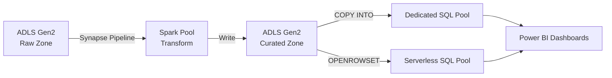

# How to Use Azure Data Lake Storage Gen2 with Azure Synapse Analytics

Author: [nawazdhandala](https://www.github.com/nawazdhandala)

Tags: Azure, Data Lake Storage, Synapse Analytics, Big Data, SQL, Data Warehousing, Gen2

Description: Learn how to connect Azure Synapse Analytics to Azure Data Lake Storage Gen2 for querying, transforming, and loading data at scale.

---

Azure Synapse Analytics and Azure Data Lake Storage Gen2 form the backbone of many enterprise analytics platforms on Azure. Synapse gives you SQL-based querying (both serverless and dedicated pools), Spark-based processing, and pipeline orchestration. ADLS Gen2 provides the scalable, cost-effective storage layer. In this post, I will cover how to connect these services, query data directly in the lake, and set up efficient data workflows.

## How Synapse Connects to ADLS Gen2

When you create a Synapse workspace, you specify a primary ADLS Gen2 account. This becomes the workspace's default storage location. Synapse uses managed identity authentication to access this primary account automatically, so there is no credential setup needed for the default storage.

For additional ADLS Gen2 accounts, you can configure linked services with various authentication methods.

## Setting Up the Primary Storage Account

```bash
# Create a Synapse workspace with ADLS Gen2 as primary storage
az synapse workspace create \
  --name my-synapse-workspace \
  --resource-group my-resource-group \
  --storage-account mydatalakeaccount \
  --file-system synapse-data \
  --sql-admin-login-user sqladmin \
  --sql-admin-login-password "YourSecurePassword123!" \
  --location eastus

# Grant the Synapse workspace's managed identity access to the storage account
# This is required for Synapse to read and write data
az role assignment create \
  --assignee $(az synapse workspace show --name my-synapse-workspace --resource-group my-resource-group --query identity.principalId -o tsv) \
  --role "Storage Blob Data Contributor" \
  --scope "/subscriptions/<sub-id>/resourceGroups/my-resource-group/providers/Microsoft.Storage/storageAccounts/mydatalakeaccount"
```

## Querying Data with Serverless SQL Pool

The serverless SQL pool in Synapse lets you query files in ADLS Gen2 directly using T-SQL, without loading the data into a dedicated database first. You pay only for the data scanned.

```sql
-- Query a CSV file directly in the data lake
-- OPENROWSET reads files without needing to create a table first
SELECT
    TOP 100 *
FROM
    OPENROWSET(
        BULK 'https://mydatalakeaccount.dfs.core.windows.net/analytics/raw-data/sales-2026.csv',
        FORMAT = 'CSV',
        PARSER_VERSION = '2.0',
        HEADER_ROW = TRUE
    ) AS sales_data;
```

You can query Parquet files just as easily.

```sql
-- Query Parquet files - Synapse automatically reads the schema
SELECT
    product_category,
    SUM(amount) AS total_revenue,
    COUNT(*) AS transaction_count
FROM
    OPENROWSET(
        BULK 'https://mydatalakeaccount.dfs.core.windows.net/analytics/processed/sales-parquet/**',
        FORMAT = 'PARQUET'
    ) AS sales
WHERE
    sale_date >= '2026-01-01'
GROUP BY
    product_category
ORDER BY
    total_revenue DESC;
```

## Creating External Tables

For files you query repeatedly, create external tables so you do not have to specify the OPENROWSET syntax every time.

```sql
-- Create a database for your analytics
CREATE DATABASE analytics_db;
GO

USE analytics_db;
GO

-- Create a data source pointing to your ADLS Gen2 container
CREATE EXTERNAL DATA SOURCE datalake
WITH (
    LOCATION = 'https://mydatalakeaccount.dfs.core.windows.net/analytics'
);
GO

-- Define the file format
CREATE EXTERNAL FILE FORMAT parquet_format
WITH (
    FORMAT_TYPE = PARQUET
);
GO

-- Create an external table over the Parquet files
-- This lets you query the data like a regular SQL table
CREATE EXTERNAL TABLE sales_data (
    sale_id VARCHAR(50),
    sale_date DATE,
    product_category VARCHAR(100),
    amount DECIMAL(10, 2),
    customer_id VARCHAR(50)
)
WITH (
    LOCATION = 'processed/sales-parquet/',
    DATA_SOURCE = datalake,
    FILE_FORMAT = parquet_format
);
GO

-- Now query it like any SQL table
SELECT
    product_category,
    AVG(amount) AS avg_sale
FROM
    sales_data
WHERE
    sale_date >= '2026-02-01'
GROUP BY
    product_category;
```

## Using Synapse Spark to Process Data in ADLS Gen2

Synapse includes built-in Spark pools for big data processing. Since the workspace is already connected to ADLS Gen2, accessing data from Spark notebooks is straightforward.

```python
# Read data from the primary ADLS Gen2 account
# Use the abfss:// protocol for direct access
df = spark.read.parquet(
    "abfss://analytics@mydatalakeaccount.dfs.core.windows.net/raw-data/events/"
)

# Transform the data
from pyspark.sql.functions import col, to_date, count, sum as spark_sum

daily_metrics = (
    df
    .withColumn("event_date", to_date(col("timestamp")))
    .groupBy("event_date", "event_type")
    .agg(
        count("*").alias("event_count"),
        spark_sum("value").alias("total_value")
    )
)

# Write the results back to the data lake
daily_metrics.write.mode("overwrite").parquet(
    "abfss://analytics@mydatalakeaccount.dfs.core.windows.net/curated/daily-metrics/"
)
```

## Creating a Linked Service for Additional Storage Accounts

If you need to access ADLS Gen2 accounts beyond the primary one, create a linked service.

```json
{
    "name": "SecondaryDataLake",
    "type": "Microsoft.Synapse/workspaces/linkedservices",
    "properties": {
        "type": "AzureBlobFS",
        "typeProperties": {
            "url": "https://secondarydatalake.dfs.core.windows.net"
        },
        "connectVia": {
            "referenceName": "AutoResolveIntegrationRuntime",
            "type": "IntegrationRuntimeReference"
        }
    }
}
```

## Loading Data into Dedicated SQL Pool

For high-performance analytics, you might want to load data from ADLS Gen2 into a dedicated SQL pool (formerly SQL Data Warehouse). The COPY command is the fastest way to do this.

```sql
-- Create a table in the dedicated SQL pool
CREATE TABLE dbo.sales_fact (
    sale_id VARCHAR(50),
    sale_date DATE,
    product_category VARCHAR(100),
    amount DECIMAL(10, 2),
    customer_id VARCHAR(50)
)
WITH (
    DISTRIBUTION = HASH(customer_id),
    CLUSTERED COLUMNSTORE INDEX
);

-- Load data from ADLS Gen2 using the COPY command
-- This is the fastest bulk loading method for dedicated SQL pools
COPY INTO dbo.sales_fact
FROM 'https://mydatalakeaccount.dfs.core.windows.net/analytics/processed/sales-parquet/'
WITH (
    FILE_TYPE = 'PARQUET',
    CREDENTIAL = (IDENTITY = 'Managed Identity')
);
```

## Building a Synapse Pipeline

Synapse pipelines (similar to Azure Data Factory) can orchestrate data movement and transformation between ADLS Gen2 and other services.



## Querying Partitioned Data

Efficiently querying partitioned data in ADLS Gen2 is a common pattern. If your data is organized by date partitions, Synapse can leverage that structure.

```sql
-- Query partitioned Parquet data
-- Synapse reads the partition structure from the folder hierarchy
SELECT
    r.filepath(1) AS year,
    r.filepath(2) AS month,
    COUNT(*) AS record_count,
    SUM(amount) AS total_amount
FROM
    OPENROWSET(
        BULK 'https://mydatalakeaccount.dfs.core.windows.net/analytics/partitioned/year=*/month=*/*.parquet',
        FORMAT = 'PARQUET'
    )
    WITH (
        amount DECIMAL(10,2)
    ) AS r
WHERE
    r.filepath(1) = '2026'
    AND r.filepath(2) IN ('01', '02')
GROUP BY
    r.filepath(1),
    r.filepath(2);
```

## Security Configuration

For production deployments, use managed identity authentication and restrict network access.

```bash
# Enable managed private endpoints for secure connectivity
az synapse managed-private-endpoints create \
  --workspace-name my-synapse-workspace \
  --pe-name adls-private-endpoint \
  --resource-id "/subscriptions/<sub>/resourceGroups/<rg>/providers/Microsoft.Storage/storageAccounts/mydatalakeaccount" \
  --group-id dfs

# Verify the managed identity has proper RBAC roles
az role assignment list \
  --assignee $(az synapse workspace show --name my-synapse-workspace --resource-group my-resource-group --query identity.principalId -o tsv) \
  --scope "/subscriptions/<sub>/resourceGroups/<rg>/providers/Microsoft.Storage/storageAccounts/mydatalakeaccount" \
  --output table
```

## Performance Tips

For serverless SQL queries, use Parquet or Delta format instead of CSV. Parquet supports predicate pushdown and column pruning, which dramatically reduces the amount of data scanned (and your costs).

Partition your data by the columns you most frequently filter on. Date-based partitioning is the most common pattern.

When loading data into dedicated SQL pools, use the COPY command instead of PolyBase for better performance and simpler syntax.

For Spark workloads, use Delta Lake format for ACID transactions and optimized reads. Delta tables also support time travel, which is useful for auditing and debugging.

Azure Synapse Analytics combined with ADLS Gen2 gives you a unified analytics platform that can handle everything from ad-hoc SQL queries to production-scale Spark pipelines. The tight integration between the two services makes it straightforward to build data solutions that scale.
