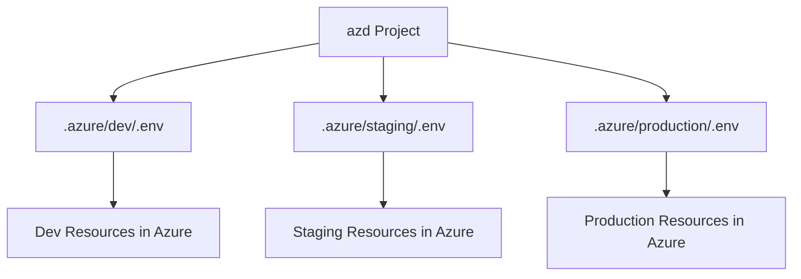

# How to Use Azure Developer CLI (azd) Environment Management for Dev, Staging, and Production Workflows

Author: [nawazdhandala](https://www.github.com/nawazdhandala)

Tags: Azure Developer CLI, azd, Environment Management, Infrastructure as Code, Azure, DevOps, Multi-Environment

Description: Learn how to use Azure Developer CLI environment management to provision and manage dev, staging, and production environments with consistent infrastructure templates.

---

The Azure Developer CLI (azd) is designed to streamline the developer inner loop for Azure applications. One of its most practical features is environment management - the ability to define, switch between, and independently manage multiple deployment environments (dev, staging, production) from a single codebase. Each environment gets its own resource group, its own configuration, and its own deployment state, all managed through simple azd commands.

This approach eliminates the common problem of environment drift where dev, staging, and production slowly diverge because they were set up manually at different times with different configurations. With azd, every environment is provisioned from the same templates with environment-specific overrides.

## Understanding azd Environments

An azd environment is a named configuration context that stores:

- Azure subscription and location settings
- Environment-specific variable values
- Deployment state and resource mappings
- Service configuration overrides

Each environment maps to a `.env` file stored locally in your project's `.azure/<environment-name>/` directory. When you run azd commands, they operate against the currently selected environment.



## Setting Up Your First Environment

After initializing an azd project, create your first environment.

```bash
# Initialize a new azd project (if not already done)
azd init --template todo-python-mongo

# Create and select the dev environment
azd env new dev

# Configure the environment settings
azd env set AZURE_SUBSCRIPTION_ID "your-dev-subscription-id"
azd env set AZURE_LOCATION "eastus"
azd env set AZURE_ENV_NAME "dev"

# Set environment-specific variables
azd env set DATABASE_SKU "Free"
azd env set APP_SERVICE_SKU "F1"
azd env set ENABLE_MONITORING "false"
```

The `azd env new` command creates a new environment context. All subsequent azd commands (provision, deploy, down) will operate against this environment until you switch to another one.

## Creating Multiple Environments

Create a full set of environments for your development workflow.

```bash
# Create staging environment
azd env new staging
azd env set AZURE_SUBSCRIPTION_ID "your-staging-subscription-id"
azd env set AZURE_LOCATION "eastus"
azd env set DATABASE_SKU "Standard"
azd env set APP_SERVICE_SKU "S1"
azd env set ENABLE_MONITORING "true"
azd env set CUSTOM_DOMAIN "staging.myapp.example.com"

# Create production environment
azd env new production
azd env set AZURE_SUBSCRIPTION_ID "your-prod-subscription-id"
azd env set AZURE_LOCATION "eastus"
azd env set DATABASE_SKU "Premium"
azd env set APP_SERVICE_SKU "P2v3"
azd env set ENABLE_MONITORING "true"
azd env set CUSTOM_DOMAIN "myapp.example.com"
azd env set MIN_INSTANCE_COUNT "3"

# List all environments
azd env list
```

The output of `azd env list` shows all environments and indicates which one is currently selected.

```
NAME        DEFAULT  LOCAL  REMOTE
dev         true     true   true
staging     false    true   true
production  false    true   true
```

## Switching Between Environments

Switch the active environment before running azd commands.

```bash
# Switch to the staging environment
azd env select staging

# Verify which environment is active
azd env list

# Now provision will target staging
azd provision

# Switch to production
azd env select production

# Deploy to production
azd deploy
```

## Using Environment Variables in Infrastructure Templates

The environment variables you set with `azd env set` are available in your Bicep templates through the `main.parameters.json` file and azd's parameter binding.

```json
{
  "$schema": "https://schema.management.azure.com/schemas/2019-04-01/deploymentParameters.json#",
  "contentVersion": "1.0.0.0",
  "parameters": {
    "environmentName": {
      "value": "${AZURE_ENV_NAME}"
    },
    "location": {
      "value": "${AZURE_LOCATION}"
    },
    "databaseSku": {
      "value": "${DATABASE_SKU}"
    },
    "appServiceSku": {
      "value": "${APP_SERVICE_SKU}"
    },
    "enableMonitoring": {
      "value": "${ENABLE_MONITORING}"
    }
  }
}
```

Your Bicep template uses these parameters to configure resources differently per environment.

```bicep
// main.bicep - Multi-environment infrastructure template

@description('Name of the environment (dev, staging, production)')
param environmentName string

@description('Azure region for resources')
param location string

@description('Database SKU tier')
param databaseSku string = 'Free'

@description('App Service plan SKU')
param appServiceSku string = 'F1'

@description('Whether to enable monitoring resources')
param enableMonitoring string = 'false'

// Resource naming convention that includes the environment
var resourcePrefix = 'myapp-${environmentName}'
var isMonitoringEnabled = enableMonitoring == 'true'

// App Service Plan - SKU varies by environment
resource appServicePlan 'Microsoft.Web/serverfarms@2023-01-01' = {
  name: '${resourcePrefix}-plan'
  location: location
  sku: {
    name: appServiceSku
  }
  properties: {
    reserved: true  // Linux
  }
}

// Web App
resource webApp 'Microsoft.Web/sites@2023-01-01' = {
  name: '${resourcePrefix}-app'
  location: location
  properties: {
    serverFarmId: appServicePlan.id
    siteConfig: {
      appSettings: [
        {
          name: 'ENVIRONMENT'
          value: environmentName
        }
      ]
    }
  }
}

// Monitoring - only provisioned in environments where enabled
resource logAnalytics 'Microsoft.OperationalInsights/workspaces@2022-10-01' = if (isMonitoringEnabled) {
  name: '${resourcePrefix}-logs'
  location: location
  properties: {
    sku: {
      name: 'PerGB2018'
    }
    retentionInDays: environmentName == 'production' ? 90 : 30
  }
}

resource appInsights 'Microsoft.Insights/components@2020-02-02' = if (isMonitoringEnabled) {
  name: '${resourcePrefix}-insights'
  location: location
  kind: 'web'
  properties: {
    Application_Type: 'web'
    WorkspaceResourceId: isMonitoringEnabled ? logAnalytics.id : ''
  }
}
```

## The azure.yaml Configuration

The `azure.yaml` file in your project root defines the services that azd manages. It stays the same across environments.

```yaml
# azure.yaml - azd project configuration
name: myapp
metadata:
  template: myapp@0.0.1-beta

services:
  api:
    project: ./src/api
    language: python
    host: appservice

  web:
    project: ./src/web
    language: js
    host: appservice

hooks:
  # Run database migrations after deployment
  postdeploy:
    shell: sh
    run: |
      echo "Running post-deployment tasks for environment: ${AZURE_ENV_NAME}"
      if [ "${AZURE_ENV_NAME}" = "production" ]; then
        echo "Production deployment - running migrations with caution"
        python scripts/migrate.py --safe
      else
        echo "Non-production - running full migration"
        python scripts/migrate.py --full
      fi
```

## Environment-Specific Hooks

azd hooks let you run custom scripts at various points in the provisioning and deployment lifecycle. These scripts can behave differently based on the active environment.

```bash
#!/bin/bash
# hooks/predeploy.sh - Runs before deployment

ENV_NAME="${AZURE_ENV_NAME}"
echo "Pre-deploy hook for environment: $ENV_NAME"

case "$ENV_NAME" in
  "dev")
    echo "Dev environment - seeding test data"
    python scripts/seed-test-data.py
    ;;
  "staging")
    echo "Staging environment - running smoke tests against current deployment"
    python scripts/smoke-test.py --url "https://myapp-staging-app.azurewebsites.net"
    ;;
  "production")
    echo "Production environment - creating backup before deployment"
    az webapp create-snapshot --name "myapp-production-app" --resource-group "myapp-production-rg"
    ;;
esac
```

## Tearing Down Environments

When you no longer need an environment (for example, a feature branch environment), tear it down completely.

```bash
# Select the environment to tear down
azd env select dev-feature-xyz

# Destroy all Azure resources for this environment
azd down --force --purge

# Remove the local environment configuration
azd env delete dev-feature-xyz
```

The `--purge` flag ensures soft-deleted resources (like Key Vault) are permanently deleted rather than recoverable. Use this carefully.

## CI/CD Integration

Use azd in your CI/CD pipeline to provision and deploy to specific environments.

```yaml
# azure-pipelines.yml - Deploy with azd to different environments

trigger:
  branches:
    include:
      - main
      - develop

pool:
  vmImage: 'ubuntu-latest'

stages:
  - stage: DeployStaging
    condition: eq(variables['Build.SourceBranch'], 'refs/heads/develop')
    jobs:
      - job: Deploy
        steps:
          - task: AzureCLI@2
            displayName: 'Deploy to staging with azd'
            inputs:
              azureSubscription: 'Azure-Staging-Connection'
              scriptType: 'bash'
              scriptLocation: 'inlineScript'
              inlineScript: |
                # Install azd
                curl -fsSL https://aka.ms/install-azd.sh | bash

                # Select and configure the staging environment
                azd env select staging

                # Provision infrastructure and deploy
                azd provision --no-prompt
                azd deploy --no-prompt

  - stage: DeployProduction
    condition: eq(variables['Build.SourceBranch'], 'refs/heads/main')
    jobs:
      - deployment: Deploy
        environment: 'production'
        strategy:
          runOnce:
            deploy:
              steps:
                - task: AzureCLI@2
                  displayName: 'Deploy to production with azd'
                  inputs:
                    azureSubscription: 'Azure-Production-Connection'
                    scriptType: 'bash'
                    scriptLocation: 'inlineScript'
                    inlineScript: |
                      curl -fsSL https://aka.ms/install-azd.sh | bash

                      azd env select production
                      azd provision --no-prompt
                      azd deploy --no-prompt
```

## Comparing Environments

Use azd with the Azure CLI to compare resource configurations across environments.

```bash
#!/bin/bash
# compare-environments.sh - Compare resource configurations between environments

echo "=== Environment Comparison ==="
echo ""

for ENV in dev staging production; do
  azd env select "$ENV"

  # Load environment variables
  source ".azure/$ENV/.env"

  echo "--- $ENV ---"
  echo "  Subscription: $AZURE_SUBSCRIPTION_ID"
  echo "  Location: $AZURE_LOCATION"
  echo "  Database SKU: $DATABASE_SKU"
  echo "  App Service SKU: $APP_SERVICE_SKU"
  echo "  Monitoring: $ENABLE_MONITORING"
  echo ""
done
```

## Best Practices

Use consistent naming conventions across environments. The `${AZURE_ENV_NAME}` variable in resource names makes it clear which environment each resource belongs to and prevents naming collisions.

Keep sensitive values out of the local `.env` files. For secrets like database passwords and API keys, reference Azure Key Vault instead. The `.env` files should only contain non-sensitive configuration like SKU names, locations, and feature flags.

Add `.azure/` to your `.gitignore` for local development, but consider storing environment configurations in a shared secret manager for CI/CD pipelines to consume.

Use the `azd env refresh` command after manual changes to Azure resources to sync the local environment state with what actually exists in Azure.

azd environment management turns multi-environment Azure deployment from a complex manual process into a streamlined, repeatable workflow. Each environment is self-contained, independently manageable, and provisioned from the same templates. This consistency across environments is what makes it possible to confidently promote changes from dev through staging to production.
