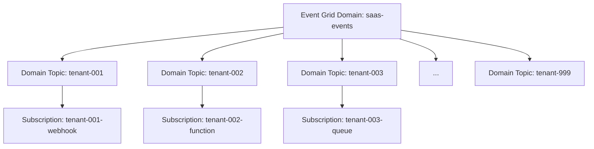

# How to Use Azure Event Grid Domains for Multi-Tenant Event Routing

Author: [nawazdhandala](https://www.github.com/nawazdhandala)

Tags: Azure, Event Grid, Event Domains, Multi-Tenant, Event Routing, SaaS Architecture, Pub/Sub

Description: Learn how to use Azure Event Grid domains to manage event routing at scale for multi-tenant SaaS applications and large event topologies.

---

If you are building a SaaS application that serves hundreds or thousands of tenants, creating a separate Event Grid topic for each tenant is not practical. Azure Event Grid domains solve this by giving you a single management endpoint with thousands of internal topics, each addressable independently. One domain can hold up to 100,000 topics, and you can publish events to any of them through a single endpoint.

## What Is an Event Grid Domain?

An Event Grid domain is a container for topics. Each topic within the domain is called a domain topic. You publish events to domain topics by specifying the topic name in the event payload. Subscribers create subscriptions on individual domain topics, just like they would on standalone topics.

Think of it as a namespace. Instead of managing 1,000 separate topics (one per tenant), you manage one domain that contains 1,000 domain topics.



## Creating an Event Grid Domain

Create the domain using the Azure CLI.

```bash
# Create an Event Grid domain
az eventgrid domain create \
  --name domain-saas-events \
  --resource-group rg-events \
  --location eastus2 \
  --input-schema eventgridschema

# Get the domain endpoint (used for publishing)
az eventgrid domain show \
  --name domain-saas-events \
  --resource-group rg-events \
  --query "endpoint" \
  --output tsv

# Get the access key
az eventgrid domain key list \
  --name domain-saas-events \
  --resource-group rg-events \
  --query "key1" \
  --output tsv
```

You do not need to explicitly create domain topics. They are created automatically the first time you publish an event to them or create a subscription on them.

## Publishing Events to Domain Topics

When publishing to a domain, you include the `topic` field in each event to specify which domain topic it belongs to. This is the key difference from standalone topics - the `topic` field routes the event within the domain.

```csharp
using Azure;
using Azure.Messaging.EventGrid;

// Create the client pointing to the domain endpoint
var domainEndpoint = new Uri("https://domain-saas-events.eastus2-1.eventgrid.azure.net/api/events");
var credential = new AzureKeyCredential("your-domain-access-key");
var client = new EventGridPublisherClient(domainEndpoint, credential);

// Build events for different tenants in a single batch
var events = new List<EventGridEvent>
{
    // Event for tenant-001
    new EventGridEvent(
        subject: "/orders/12345",
        eventType: "Orders.OrderPlaced",
        dataVersion: "1.0",
        data: new
        {
            orderId = "12345",
            tenantId = "tenant-001",
            totalAmount = 99.95
        }
    )
    {
        // The Topic property routes this event to the tenant-001 domain topic
        Topic = "tenant-001"
    },

    // Event for tenant-002 in the same batch
    new EventGridEvent(
        subject: "/orders/67890",
        eventType: "Orders.OrderPlaced",
        dataVersion: "1.0",
        data: new
        {
            orderId = "67890",
            tenantId = "tenant-002",
            totalAmount = 150.00
        }
    )
    {
        Topic = "tenant-002"
    }
};

// Single publish call routes events to their respective domain topics
await client.SendEventsAsync(events);
```

Notice how a single batch can contain events for different tenants. Event Grid routes each event to the correct domain topic based on the `Topic` field. This is much more efficient than publishing to multiple standalone topics.

## Subscribing to Domain Topics

Each tenant can have their own subscriptions on their domain topic.

```bash
# Create a subscription for tenant-001
az eventgrid domain-topic event-subscription create \
  --name sub-tenant-001 \
  --resource-group rg-events \
  --domain-name domain-saas-events \
  --domain-topic-name tenant-001 \
  --endpoint "https://tenant-001.myapp.com/api/events"

# Create a subscription for tenant-002 with a different endpoint type
az eventgrid domain-topic event-subscription create \
  --name sub-tenant-002 \
  --resource-group rg-events \
  --domain-name domain-saas-events \
  --domain-topic-name tenant-002 \
  --endpoint "/subscriptions/{sub-id}/resourceGroups/rg-events/providers/Microsoft.ServiceBus/namespaces/sb-tenant-002/queues/events" \
  --endpoint-type servicebusqueue
```

## Domain-Wide Subscriptions

Sometimes you want a single subscriber to receive events from all domain topics - for example, an analytics pipeline that ingests every event across all tenants. You can create a subscription at the domain level.

```bash
# Subscribe to all events across all domain topics
az eventgrid domain event-subscription create \
  --name sub-analytics-all \
  --domain-name domain-saas-events \
  --resource-group rg-events \
  --endpoint "/subscriptions/{sub-id}/resourceGroups/rg-events/providers/Microsoft.EventHub/namespaces/eh-analytics/eventhubs/all-events" \
  --endpoint-type eventhub
```

This is extremely useful for cross-cutting concerns like logging, analytics, and compliance monitoring.

## Setting Up with Bicep

Here is a Bicep template that creates a domain with a couple of domain topic subscriptions.

```bicep
// Bicep template for an Event Grid domain with tenant subscriptions
param location string = resourceGroup().location

// Create the Event Grid domain
resource eventDomain 'Microsoft.EventGrid/domains@2022-06-15' = {
  name: 'domain-saas-events'
  location: location
  properties: {
    inputSchema: 'EventGridSchema'
    publicNetworkAccess: 'Enabled'
  }
}

// Domain topic for tenant-001 (auto-created, but explicit for subscriptions)
resource tenant001Topic 'Microsoft.EventGrid/domains/topics@2022-06-15' = {
  parent: eventDomain
  name: 'tenant-001'
}

// Subscription for tenant-001
resource tenant001Sub 'Microsoft.EventGrid/domains/topics/eventSubscriptions@2022-06-15' = {
  parent: tenant001Topic
  name: 'sub-tenant-001-webhook'
  properties: {
    destination: {
      endpointType: 'WebHook'
      properties: {
        endpointUrl: 'https://tenant-001.myapp.com/api/events'
      }
    }
    filter: {
      includedEventTypes: [
        'Orders.OrderPlaced'
        'Orders.OrderShipped'
      ]
    }
    retryPolicy: {
      maxDeliveryAttempts: 10
      eventTimeToLiveInMinutes: 1440
    }
  }
}
```

## Access Control with RBAC

One of the biggest advantages of domains is fine-grained access control. You can grant a tenant's application permission to publish only to their specific domain topic, not to the entire domain.

```bash
# Grant tenant-001's service principal permission to publish to their topic only
az role assignment create \
  --assignee "tenant-001-service-principal-id" \
  --role "EventGrid Data Sender" \
  --scope "/subscriptions/{sub-id}/resourceGroups/rg-events/providers/Microsoft.EventGrid/domains/domain-saas-events/topics/tenant-001"
```

This prevents one tenant from publishing events to another tenant's topic - a critical security boundary for multi-tenant applications.

## Tenant Onboarding Automation

When a new tenant signs up, you need to create their domain topic and subscription programmatically.

```csharp
using Azure.Messaging.EventGrid;
using Azure.ResourceManager;
using Azure.ResourceManager.EventGrid;

public class TenantOnboardingService
{
    private readonly ArmClient _armClient;

    public TenantOnboardingService(ArmClient armClient)
    {
        _armClient = armClient;
    }

    // Called when a new tenant signs up
    public async Task OnboardTenantAsync(string tenantId, string webhookUrl)
    {
        // Get the domain resource
        var domainId = new ResourceIdentifier(
            "/subscriptions/{sub-id}/resourceGroups/rg-events/" +
            "providers/Microsoft.EventGrid/domains/domain-saas-events"
        );
        var domain = _armClient.GetEventGridDomainResource(domainId);

        // Create the domain topic (or it auto-creates on first publish)
        var topics = domain.GetDomainTopics();
        var topicOperation = await topics.CreateOrUpdateAsync(
            Azure.WaitUntil.Completed,
            tenantId
        );
        var topic = topicOperation.Value;

        // Create a subscription for the tenant
        var subscriptions = topic.GetDomainTopicEventSubscriptions();
        // Configure the subscription with the tenant's webhook
        Console.WriteLine($"Tenant {tenantId} onboarded with webhook {webhookUrl}");
    }
}
```

## Performance at Scale

Event Grid domains are designed for massive scale. Some numbers to keep in mind:

- Up to 100,000 domain topics per domain
- Up to 500 event subscriptions per domain topic
- 5,000 events per second per domain (can be increased)
- Events in a single batch can target different domain topics

For high-throughput scenarios, batch events efficiently. Since a single publish call can route events to multiple domain topics, you can group events from your application's event bus and publish them in bulk.

## Monitoring Domain Topics

Monitor the health of your domain and individual domain topics using Azure Monitor.

```bash
# Get metrics for the entire domain
az monitor metrics list \
  --resource "/subscriptions/{sub-id}/resourceGroups/rg-events/providers/Microsoft.EventGrid/domains/domain-saas-events" \
  --metric "PublishSuccessCount" "DeliverySuccessCount" "DeadLetteredCount" \
  --interval PT5M

# List all domain topics (to see which tenants have topics)
az eventgrid domain-topic list \
  --resource-group rg-events \
  --domain-name domain-saas-events \
  --output table
```

## Summary

Event Grid domains are the right tool for multi-tenant event routing. They give you a single management endpoint with thousands of internal topics, fine-grained RBAC for tenant isolation, domain-wide subscriptions for cross-cutting concerns, and the ability to batch events for different tenants in a single publish call. If your application serves multiple tenants and needs event-driven communication, domains are the scalable foundation to build on.
