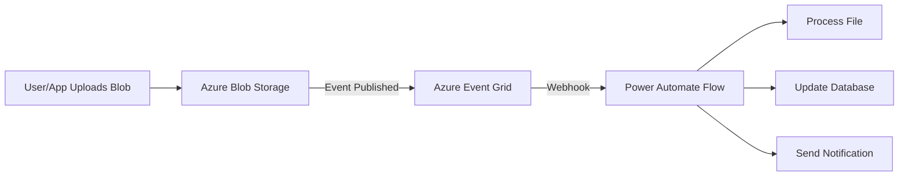

# How to Use Azure Event Grid with Power Automate to React to Blob Storage Events

Author: [nawazdhandala](https://www.github.com/nawazdhandala)

Tags: Azure Event Grid, Power Automate, Blob Storage, Events, Serverless, Power Platform, Azure

Description: Use Azure Event Grid to trigger Power Automate flows when blobs are created or deleted in Azure Blob Storage for automated file processing workflows.

---

Azure Event Grid is an event routing service that connects event sources to event handlers. When paired with Power Automate, it lets you react to Azure infrastructure events without polling. One of the most common use cases is reacting to blob storage events - a file gets uploaded to a container, and a Power Automate flow immediately kicks off to process it.

This guide walks through the complete setup: configuring Event Grid on a storage account, connecting it to Power Automate, and building practical file processing workflows.

## Why Event Grid Instead of Polling?

You could build a Power Automate flow that checks blob storage every few minutes for new files. But polling has problems:

- It wastes resources when there are no new files.
- It introduces latency between the upload and the processing (up to the polling interval).
- At high volumes, listing blobs repeatedly gets expensive.

Event Grid is push-based. The moment a blob is created, an event fires. Power Automate picks it up within seconds. No wasted calls, minimal latency.

## Architecture Overview



## Step 1: Enable Event Grid on the Storage Account

Event Grid integration is built into Azure Storage accounts, but you need to register the Event Grid resource provider first.

1. In the Azure portal, go to your subscription > Resource providers.
2. Search for "Microsoft.EventGrid".
3. If it is not registered, click Register.

Then verify your storage account supports Event Grid:

1. Go to your storage account.
2. Click Events in the left menu.
3. If you see the Events blade, Event Grid is available.

Storage accounts of kind "StorageV2 (general purpose v2)" and "BlobStorage" support Event Grid events. Classic storage accounts do not.

## Step 2: Create the Power Automate Flow

Start with the Power Automate flow because you need its webhook URL to create the Event Grid subscription.

1. Go to Power Automate and create a new automated cloud flow.
2. Search for the trigger "When a resource event occurs" from the Azure Event Grid connector.
3. Configure the trigger:
   - Resource Type: Microsoft.Storage.StorageAccounts
   - Resource Name: Select your storage account
   - Subscription: Select your Azure subscription
   - Event Type Item: Microsoft.Storage.BlobCreated

You can also add Microsoft.Storage.BlobDeleted if you want to react to deletions.

When you save this flow, Power Automate automatically creates an Event Grid subscription on your storage account. This is the simplest approach.

### Alternative: Manual Event Grid Subscription

If you prefer more control, create the subscription manually:

1. Go to your storage account > Events > Event Subscription.
2. Name it (e.g., "blob-created-to-power-automate").
3. Event Schema: Event Grid Schema.
4. Filter to Event Types: Blob Created.
5. Endpoint Type: Webhook.
6. Endpoint: The HTTP POST URL from a Power Automate "When a HTTP request is received" trigger.

The manual approach gives you access to advanced filtering options.

## Step 3: Filter Events

Not every blob creation event is relevant. Maybe you only care about files in a specific container or with a specific extension.

### Subject Filtering

Event Grid lets you filter by the event subject, which for blob events is the blob path.

In the Event Grid subscription (or the Power Automate trigger settings):

- Subject Begins With: `/blobServices/default/containers/uploads/` (only events from the "uploads" container)
- Subject Ends With: `.pdf` (only PDF files)

### Advanced Filtering

For more complex filters, use Event Grid's advanced filtering. In the Azure portal Event Subscription:

1. Go to the Filters tab.
2. Enable "Enable advanced filtering".
3. Add filters like:
   - Key: `data.contentType` Operator: String contains Value: `image/`
   - Key: `data.contentLength` Operator: Greater than Value: `1024`

This filters for image files larger than 1 KB.

### Filtering in Power Automate

You can also filter within the flow using a Condition action:

```
// Check if the blob is in the correct container and is a PDF
// Subject format: /blobServices/default/containers/{container}/blobs/{blobpath}
@contains(triggerBody()?['subject'], '/containers/uploads/')
AND
@endsWith(triggerBody()?['subject'], '.pdf')
```

However, filtering at the Event Grid level is more efficient since it prevents the flow from running at all for irrelevant events.

## Step 4: Parse the Event Data

The Event Grid trigger delivers an event payload. Parse it to extract the blob details.

Add a "Parse JSON" action after the trigger with this schema:

```json
{
    "type": "object",
    "properties": {
        "subject": { "type": "string" },
        "eventType": { "type": "string" },
        "data": {
            "type": "object",
            "properties": {
                "api": { "type": "string" },
                "clientRequestId": { "type": "string" },
                "requestId": { "type": "string" },
                "eTag": { "type": "string" },
                "contentType": { "type": "string" },
                "contentLength": { "type": "integer" },
                "blobType": { "type": "string" },
                "url": { "type": "string" },
                "sequencer": { "type": "string" },
                "storageDiagnostics": { "type": "object" }
            }
        }
    }
}
```

The key fields are:

- `data.url`: The full URL to the blob.
- `subject`: The blob path relative to the storage account.
- `data.contentType`: The MIME type of the blob.
- `data.contentLength`: The size of the blob in bytes.

### Extract Container and Blob Name

The subject looks like `/blobServices/default/containers/uploads/blobs/reports/january.pdf`. To extract the container and blob name, use expressions:

```
// Extract the container name from the event subject
// Split by '/containers/' and '/blobs/' to get the container name
@split(split(triggerBody()?['subject'], '/containers/')[1], '/blobs/')[0]

// Extract the blob name (path within the container)
@split(triggerBody()?['subject'], '/blobs/')[1]
```

## Step 5: Process the Blob

Now that you have the blob details, process it. Here are common patterns.

### Pattern 1: Copy to Another Container

Use the Azure Blob Storage connector to copy the blob to an archive container:

1. Add "Get blob content using path" action with the blob path from the event.
2. Add "Create blob" action targeting the archive container.

### Pattern 2: Extract Text from a PDF

If the uploaded blob is a PDF, use AI Builder or Azure Cognitive Services to extract text:

1. Get the blob content.
2. Pass it to the AI Builder "Extract text from a document" action.
3. Store the extracted text in Dataverse or send it to a search index.

### Pattern 3: Resize an Image

If the blob is an image, call an Azure Function to resize it:

```json
{
    "sourceUrl": "@{body('Parse_JSON')?['data']?['url']}",
    "targetContainer": "thumbnails",
    "maxWidth": 200,
    "maxHeight": 200
}
```

### Pattern 4: Notify a Team

Send a Teams message when a new file is uploaded:

1. Add "Post message in a chat or channel" action from the Teams connector.
2. Include the file name, size, uploader, and a link to the blob.

## Step 6: Handle Duplicate Events

Event Grid guarantees at-least-once delivery, which means you might receive the same event more than once. Your flow needs to handle duplicates.

### Idempotency in the Flow

Design your processing to be idempotent - running it twice with the same input produces the same result. For example:

- When copying a blob, use a deterministic name for the target. If it already exists, overwrite it.
- When creating a database record, check if one with the same blob URL already exists first.
- When sending notifications, include a deduplication key and check if the notification was already sent.

### Event Grid Deduplication

Each event has an `id` field. Store processed event IDs in a Dataverse table or Azure Table Storage. Before processing, check if the event ID was already handled.

## Step 7: Error Handling and Retry

### Event Grid Retry Policy

If Power Automate fails to acknowledge the event (returns a non-2xx status), Event Grid retries with an exponential backoff:

- Retry interval starts at 10 seconds.
- Maximum retry attempts: 30 over 24 hours.
- After exhausting retries, the event is dead-lettered (if configured).

### Configure Dead-Letter Destination

In the Event Grid subscription:

1. Enable dead-lettering.
2. Select a storage container for dead-lettered events.
3. Events that cannot be delivered after all retries are stored here.

Create a separate flow to periodically check the dead-letter container and alert the operations team.

### Flow-Level Error Handling

Inside the flow, wrap processing in a Scope with error handling:

1. **Try scope**: Contains the processing logic.
2. **Catch branch**: Runs when the try scope fails. Logs the error and the event details.
3. **Finally**: Runs regardless. Updates a metrics table with the processing result.

## Monitoring

### Event Grid Metrics

Monitor these metrics in the Azure portal:

- **Publish Success Count**: Events successfully delivered to Event Grid.
- **Delivery Success Count**: Events successfully delivered to the subscriber (Power Automate).
- **Delivery Failed Count**: Events that failed delivery.
- **Dead-Lettered Events**: Events moved to the dead-letter container.

### Set Up Alerts

Create Azure Monitor alerts for:

- Delivery failed count exceeding zero (immediate attention needed).
- Dead-lettered events exceeding a threshold.
- Delivery latency exceeding acceptable limits.

## Wrapping Up

Azure Event Grid with Power Automate gives you a reactive, event-driven approach to blob storage processing. Instead of polling, you get near-instant notifications when files are created or deleted. The setup involves enabling Event Grid on your storage account, creating a Power Automate flow with the Event Grid trigger, filtering events to only relevant ones, parsing the event data, and processing the blob. Add duplicate handling, error management, and monitoring to make the system production-ready.
