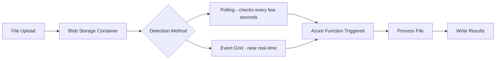

# How to Use Azure Functions Blob Trigger to Process Uploaded Files

Author: [nawazdhandala](https://www.github.com/nawazdhandala)

Tags: Azure Functions, Blob Trigger, Azure Storage, File Processing, Serverless, Azure, Event-Driven

Description: Learn how to automatically process files uploaded to Azure Blob Storage using Azure Functions blob triggers with practical examples and best practices.

---

One of the most practical use cases for Azure Functions is automatically processing files when they are uploaded to Azure Blob Storage. You upload a CSV, and a function parses it. You drop an image, and a function generates a thumbnail. You put a PDF in a container, and a function extracts text from it. The blob trigger makes all of this possible with minimal plumbing.

In this post, I will show you how to set up a blob trigger function, handle different file types, and avoid the common pitfalls that trip up most developers.

## How the Blob Trigger Works

When you configure a blob trigger, the Azure Functions host monitors a specific container in your storage account for new or updated blobs. When a change is detected, the host invokes your function and passes the blob data as input.

Under the hood, the trigger uses one of two mechanisms to detect changes. The first is polling with blob receipts, which scans the container periodically and tracks which blobs have been processed. The second is Event Grid integration, which uses push-based notifications and is significantly faster. I strongly recommend using the Event Grid approach for production workloads.



## Basic Blob Trigger Setup

Here is a straightforward blob trigger that processes CSV files and writes the parsed data to a database.

```csharp
using Azure.Storage.Blobs;
using Microsoft.Azure.Functions.Worker;
using Microsoft.Extensions.Logging;
using System.Globalization;
using CsvHelper;

public class CsvProcessor
{
    private readonly ILogger<CsvProcessor> _logger;
    private readonly IDataRepository _repository;

    public CsvProcessor(ILogger<CsvProcessor> logger, IDataRepository repository)
    {
        _logger = logger;
        _repository = repository;
    }

    // This function triggers whenever a new blob appears in the "uploads" container
    // The path pattern "uploads/{name}" captures the blob name as a parameter
    [Function("ProcessCsvUpload")]
    public async Task Run(
        [BlobTrigger("uploads/{name}", Connection = "AzureWebJobsStorage")]
        Stream blobStream,
        string name,
        FunctionContext context)
    {
        _logger.LogInformation("Processing uploaded file: {FileName}, Size: {Size} bytes",
            name, blobStream.Length);

        // Only process CSV files
        if (!name.EndsWith(".csv", StringComparison.OrdinalIgnoreCase))
        {
            _logger.LogInformation("Skipping non-CSV file: {FileName}", name);
            return;
        }

        // Parse the CSV file using CsvHelper
        using var reader = new StreamReader(blobStream);
        using var csv = new CsvReader(reader, CultureInfo.InvariantCulture);

        var records = csv.GetRecords<SalesRecord>().ToList();
        _logger.LogInformation("Parsed {Count} records from {FileName}", records.Count, name);

        // Save the parsed records to the database
        await _repository.BulkInsertAsync(records);

        _logger.LogInformation("Successfully processed {FileName}", name);
    }
}
```

## Processing Images with Thumbnails

A very common scenario is generating thumbnails when images are uploaded. Here is how you can read from one container and write the result to another.

```csharp
using SixLabors.ImageSharp;
using SixLabors.ImageSharp.Processing;

public class ImageThumbnailGenerator
{
    private readonly ILogger<ImageThumbnailGenerator> _logger;

    public ImageThumbnailGenerator(ILogger<ImageThumbnailGenerator> logger)
    {
        _logger = logger;
    }

    // Triggers on images in the "photos" container
    // Writes thumbnails to the "thumbnails" container via output binding
    [Function("GenerateThumbnail")]
    [BlobOutput("thumbnails/{name}", Connection = "AzureWebJobsStorage")]
    public async Task<byte[]> Run(
        [BlobTrigger("photos/{name}", Connection = "AzureWebJobsStorage")]
        Stream imageStream,
        string name)
    {
        _logger.LogInformation("Generating thumbnail for {FileName}", name);

        // Load the image and resize it to thumbnail dimensions
        using var image = await Image.LoadAsync(imageStream);

        // Resize to 200px width while maintaining aspect ratio
        image.Mutate(x => x.Resize(new ResizeOptions
        {
            Size = new Size(200, 0),  // 0 height means maintain aspect ratio
            Mode = ResizeMode.Max
        }));

        // Save the thumbnail to a byte array for the output binding
        using var outputStream = new MemoryStream();
        await image.SaveAsJpegAsync(outputStream);

        _logger.LogInformation("Thumbnail generated for {FileName}: {Width}x{Height}",
            name, image.Width, image.Height);

        return outputStream.ToArray();
    }
}
```

## Using Event Grid for Faster Detection

The default blob trigger polling mechanism can have delays of up to 60 seconds before detecting a new blob. For near real-time processing, use Event Grid as the source.

First, update your `host.json` to use the Event Grid blob trigger source.

```json
{
  "version": "2.0",
  "extensions": {
    "blobs": {
      "maxDegreeOfParallelism": 8
    }
  }
}
```

Then update the function to use the Event Grid-based blob trigger.

```csharp
// The BlobTrigger with Source = BlobTriggerSource.EventGrid uses
// Event Grid subscriptions instead of polling for much faster detection
[Function("ProcessUploadFast")]
public async Task Run(
    [BlobTrigger("uploads/{name}",
        Connection = "AzureWebJobsStorage",
        Source = BlobTriggerSource.EventGrid)]
    Stream blobStream,
    string name)
{
    _logger.LogInformation("Event Grid triggered for: {FileName}", name);
    // Process the blob...
}
```

You also need to create an Event Grid subscription for your storage account. This can be done through the Azure CLI.

```bash
# Create an Event Grid subscription that routes blob events to your function
az eventgrid event-subscription create \
  --name blob-upload-sub \
  --source-resource-id /subscriptions/<SUB_ID>/resourceGroups/<RG>/providers/Microsoft.Storage/storageAccounts/<STORAGE_ACCOUNT> \
  --endpoint-type azurefunction \
  --endpoint /subscriptions/<SUB_ID>/resourceGroups/<RG>/providers/Microsoft.Web/sites/<FUNC_APP>/functions/ProcessUploadFast \
  --included-event-types Microsoft.Storage.BlobCreated
```

## Handling Large Files

For large files (hundreds of MB or more), you do not want to load the entire file into memory. Stream the data instead.

```csharp
// Process large files by streaming line by line
// This keeps memory usage constant regardless of file size
[Function("ProcessLargeFile")]
public async Task ProcessLargeFile(
    [BlobTrigger("large-files/{name}", Connection = "AzureWebJobsStorage")]
    Stream blobStream,
    string name)
{
    _logger.LogInformation("Processing large file: {FileName}", name);

    long lineCount = 0;
    long errorCount = 0;

    // Read the file line by line to avoid loading it all into memory
    using var reader = new StreamReader(blobStream);
    string line;
    while ((line = await reader.ReadLineAsync()) != null)
    {
        lineCount++;

        try
        {
            // Process each line individually
            await ProcessLine(line);
        }
        catch (Exception ex)
        {
            errorCount++;
            _logger.LogWarning("Error processing line {Line}: {Error}",
                lineCount, ex.Message);
        }

        // Log progress every 10,000 lines
        if (lineCount % 10000 == 0)
        {
            _logger.LogInformation("Processed {Count} lines so far", lineCount);
        }
    }

    _logger.LogInformation(
        "Completed processing {FileName}: {Lines} lines, {Errors} errors",
        name, lineCount, errorCount);
}
```

## Avoiding Infinite Loops

A classic mistake is having a blob trigger on a container and then writing output to the same container. This creates an infinite loop where the function processes a blob, writes a new blob, which triggers the function again.

```csharp
// BAD: This creates an infinite loop!
// The function writes to the same container it monitors
[Function("BadExample")]
[BlobOutput("uploads/processed-{name}")]  // Writing back to "uploads" container
public byte[] BadExample(
    [BlobTrigger("uploads/{name}")] Stream input, string name)
{
    // This processed blob will trigger the function again!
    return ProcessBlob(input);
}

// GOOD: Write to a different container
[Function("GoodExample")]
[BlobOutput("processed/{name}")]  // Different container - no loop
public byte[] GoodExample(
    [BlobTrigger("uploads/{name}")] Stream input, string name)
{
    return ProcessBlob(input);
}
```

If you must write to the same container, use a naming convention or subfolder path in the trigger to filter which blobs trigger the function.

## Handling Failures and Poison Blobs

When a blob trigger function fails, the runtime retries it up to 5 times by default. After all retries are exhausted, the blob is considered a "poison blob." Unlike queue triggers, there is no automatic dead-letter mechanism for blob triggers. You need to handle this yourself.

```csharp
// Wrap processing in try/catch to handle and log failures
[Function("RobustBlobProcessor")]
public async Task ProcessWithErrorHandling(
    [BlobTrigger("uploads/{name}", Connection = "AzureWebJobsStorage")]
    Stream blobStream,
    string name)
{
    try
    {
        await ProcessBlob(blobStream, name);
    }
    catch (Exception ex)
    {
        _logger.LogError(ex, "Failed to process blob: {FileName}", name);

        // Move the failed blob to an error container for manual review
        var blobClient = new BlobServiceClient(
            Environment.GetEnvironmentVariable("AzureWebJobsStorage"));

        var errorContainer = blobClient.GetBlobContainerClient("processing-errors");
        await errorContainer.CreateIfNotExistsAsync();

        // Copy the failed blob to the error container with error metadata
        var errorBlob = errorContainer.GetBlobClient($"{DateTime.UtcNow:yyyy-MM-dd}/{name}");
        var sourceBlob = blobClient
            .GetBlobContainerClient("uploads")
            .GetBlobClient(name);

        await errorBlob.StartCopyFromUriAsync(sourceBlob.Uri);

        // Set metadata with the error details
        await errorBlob.SetMetadataAsync(new Dictionary<string, string>
        {
            ["ErrorMessage"] = ex.Message,
            ["ErrorTime"] = DateTime.UtcNow.ToString("O"),
            ["OriginalContainer"] = "uploads"
        });

        throw; // Re-throw so the runtime knows the function failed
    }
}
```

## Performance Tuning

You can control how many blobs are processed concurrently through the `host.json` configuration.

```json
{
  "version": "2.0",
  "extensions": {
    "blobs": {
      "maxDegreeOfParallelism": 8
    }
  }
}
```

Setting `maxDegreeOfParallelism` to 8 means the runtime will process up to 8 blobs simultaneously on a single instance. Increase this if your processing is I/O-bound (waiting on external APIs), decrease it if it is CPU-bound.

## Summary

The blob trigger is one of the most useful features of Azure Functions for building event-driven file processing pipelines. Use Event Grid integration for near real-time detection, stream large files to keep memory usage manageable, write output to a separate container to avoid loops, and implement proper error handling for failed processing. These patterns will handle most file processing scenarios you encounter in practice.
