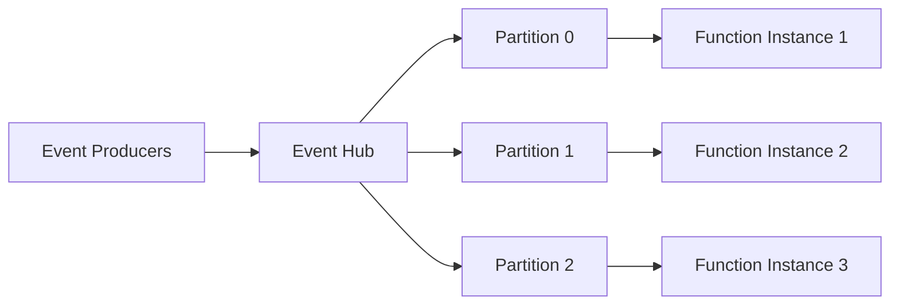

# How to Use Azure Functions with Event Hubs Trigger for Stream Processing

Author: [nawazdhandala](https://www.github.com/nawazdhandala)

Tags: Azure, Functions, Event Hubs, Stream Processing, Serverless, Real-Time, Data Pipeline

Description: Process real-time data streams using Azure Functions with Event Hubs triggers for scalable serverless stream processing pipelines.

---

Azure Event Hubs is a data streaming platform that can ingest millions of events per second. Azure Functions can consume those events in real time with the Event Hubs trigger. Together, they form a serverless stream processing pipeline where you do not manage any infrastructure - Event Hubs handles the ingestion, and Functions handles the processing, scaling automatically based on the volume of incoming events.

In this post, I will show you how to set up an Azure Function with an Event Hubs trigger, process events in batches, handle errors, and optimize for throughput.

## How the Event Hubs Trigger Works

When you create a function with an Event Hubs trigger, the Azure Functions runtime connects to the event hub as a consumer. It reads events from the hub's partitions and invokes your function with those events.

Key concepts:

- **Partitions**: Event Hubs splits data across partitions. Each partition is an ordered sequence of events. The function runtime assigns partitions to function instances.
- **Consumer group**: Your function reads events through a consumer group. Use a dedicated consumer group for each function to avoid conflicts.
- **Checkpointing**: The runtime tracks which events have been processed using checkpoints stored in Azure Storage. If your function crashes, it resumes from the last checkpoint.
- **Batching**: By default, the trigger delivers events in batches for better throughput.



The function runtime scales out to match the number of partitions. If your event hub has 8 partitions, the runtime can run up to 8 instances of your function in parallel.

## Setting Up the Event Hub

Create an event hub if you do not have one already.

```bash
# Create an Event Hubs namespace
az eventhubs namespace create \
  --name my-eventhub-ns \
  --resource-group rg-streaming \
  --location eastus \
  --sku Standard

# Create an event hub with 4 partitions
az eventhubs eventhub create \
  --name telemetry-events \
  --namespace-name my-eventhub-ns \
  --resource-group rg-streaming \
  --partition-count 4 \
  --message-retention 1

# Create a consumer group for the function
az eventhubs eventhub consumer-group create \
  --name function-processor \
  --eventhub-name telemetry-events \
  --namespace-name my-eventhub-ns \
  --resource-group rg-streaming

# Get the connection string
az eventhubs namespace authorization-rule keys list \
  --name RootManageSharedAccessKey \
  --namespace-name my-eventhub-ns \
  --resource-group rg-streaming \
  --query primaryConnectionString -o tsv
```

## Creating the Event Hubs Triggered Function

Here is a function that processes telemetry events from an event hub.

```javascript
// process-telemetry.js - Event Hubs triggered function
module.exports = async function (context, eventHubMessages) {
  // eventHubMessages is an array of events (batch mode)
  context.log(`Processing batch of ${eventHubMessages.length} events`);

  const results = {
    processed: 0,
    errors: 0,
    alerts: []
  };

  for (let i = 0; i < eventHubMessages.length; i++) {
    const event = eventHubMessages[i];

    try {
      // Access event metadata through the binding data
      const enqueuedTime = context.bindingData.enqueuedTimeUtcArray[i];
      const sequenceNumber = context.bindingData.sequenceNumberArray[i];
      const partitionKey = context.bindingData.partitionKeyArray[i];

      // Process the event based on its type
      if (event.type === 'cpu_metric') {
        if (event.value > 90) {
          results.alerts.push({
            type: 'high_cpu',
            host: event.hostname,
            value: event.value,
            timestamp: event.timestamp
          });
        }
      } else if (event.type === 'error_log') {
        // Store error logs for analysis
        await storeErrorLog(event);
      } else if (event.type === 'request_metric') {
        // Aggregate request metrics
        await updateRequestMetrics(event);
      }

      results.processed++;
    } catch (err) {
      context.log.error(`Error processing event ${i}:`, err.message);
      results.errors++;
    }
  }

  // Send any alerts that were generated
  if (results.alerts.length > 0) {
    await sendAlerts(results.alerts);
  }

  context.log(`Batch complete: ${results.processed} processed, ${results.errors} errors, ${results.alerts.length} alerts`);
};
```

Configure the function binding in `function.json`.

```json
{
  "bindings": [
    {
      "type": "eventHubTrigger",
      "name": "eventHubMessages",
      "direction": "in",
      "eventHubName": "telemetry-events",
      "connection": "EventHubConnection",
      "consumerGroup": "function-processor",
      "cardinality": "many",
      "dataType": "string"
    }
  ]
}
```

The `cardinality: "many"` setting enables batch processing. The function receives an array of events instead of being invoked once per event.

## Configuring Batch Size and Throughput

Tune the batch settings in `host.json` to optimize throughput.

```json
{
  "version": "2.0",
  "extensions": {
    "eventHubs": {
      "batchCheckpointFrequency": 5,
      "eventProcessorOptions": {
        "maxBatchSize": 100,
        "prefetchCount": 300
      },
      "initialOffsetOptions": {
        "type": "fromEnqueuedTime",
        "enqueuedTimeUtc": "2026-02-16T00:00:00Z"
      }
    }
  }
}
```

Key settings:

- **maxBatchSize**: Maximum number of events per function invocation. Higher values mean better throughput but more memory usage.
- **prefetchCount**: Number of events to prefetch from the event hub. Set this higher than maxBatchSize for smoother processing.
- **batchCheckpointFrequency**: Checkpoint every N batches instead of every batch. Higher values reduce checkpoint overhead but increase the window for reprocessing after a failure.

## Sending Events to the Event Hub

You need a producer to send events for your function to process.

```javascript
// send-events.js - Send events to the event hub
const { EventHubProducerClient } = require('@azure/event-hubs');

const connectionString = process.env.EVENTHUB_CONNECTION_STRING;
const eventHubName = 'telemetry-events';

const producer = new EventHubProducerClient(connectionString, eventHubName);

async function sendTelemetryBatch(events) {
  // Create a batch of events
  const batch = await producer.createBatch();

  for (const event of events) {
    // Try to add each event to the batch
    const added = batch.tryAdd({
      body: event,
      properties: { type: event.type }
    });

    if (!added) {
      // Batch is full, send it and start a new one
      await producer.sendBatch(batch);
      const newBatch = await producer.createBatch();
      newBatch.tryAdd({ body: event });
    }
  }

  // Send the remaining events
  if (batch.count > 0) {
    await producer.sendBatch(batch);
  }
}

// Simulate sending telemetry events
async function simulateTelemetry() {
  const events = [];
  for (let i = 0; i < 100; i++) {
    events.push({
      type: 'cpu_metric',
      hostname: `server-${i % 10}`,
      value: Math.random() * 100,
      timestamp: new Date().toISOString()
    });
  }

  await sendTelemetryBatch(events);
  console.log(`Sent ${events.length} events`);
}

simulateTelemetry().catch(console.error);
```

## Handling Errors and Poison Events

When processing a batch, a single bad event should not crash the entire batch. Wrap individual event processing in try/catch.

```javascript
// error-handling.js - Resilient event processing
module.exports = async function (context, events) {
  const deadLetterEvents = [];

  for (let i = 0; i < events.length; i++) {
    try {
      await processEvent(events[i]);
    } catch (err) {
      context.log.error(`Failed to process event ${i}:`, err.message);

      // Store the failed event for later analysis
      deadLetterEvents.push({
        event: events[i],
        error: err.message,
        timestamp: new Date().toISOString(),
        partition: context.bindingData.partitionContext?.partitionId
      });
    }
  }

  // Send dead letter events to a separate storage for investigation
  if (deadLetterEvents.length > 0) {
    await storeDeadLetterEvents(deadLetterEvents);
    context.log.warn(`${deadLetterEvents.length} events sent to dead letter`);
  }
};
```

## Output Bindings for Processed Data

You can use output bindings to write processed data to other services without explicit SDK calls.

```json
{
  "bindings": [
    {
      "type": "eventHubTrigger",
      "name": "inputEvents",
      "direction": "in",
      "eventHubName": "raw-events",
      "connection": "EventHubConnection",
      "consumerGroup": "processor",
      "cardinality": "many"
    },
    {
      "type": "eventHub",
      "name": "outputEvents",
      "direction": "out",
      "eventHubName": "processed-events",
      "connection": "EventHubConnection"
    },
    {
      "type": "cosmosDB",
      "name": "outputDocuments",
      "direction": "out",
      "databaseName": "telemetry",
      "containerName": "metrics",
      "connection": "CosmosDBConnection"
    }
  ]
}
```

```javascript
// transform-and-route.js - Process events and write to multiple outputs
module.exports = async function (context, inputEvents) {
  const processedEvents = [];
  const documents = [];

  for (const event of inputEvents) {
    // Transform the event
    const processed = {
      ...event,
      processedAt: new Date().toISOString(),
      normalized: normalizeMetric(event)
    };

    processedEvents.push(processed);

    // Create a document for Cosmos DB storage
    documents.push({
      id: `${event.hostname}-${Date.now()}`,
      partitionKey: event.hostname,
      ...processed
    });
  }

  // Set the output bindings
  context.bindings.outputEvents = processedEvents;
  context.bindings.outputDocuments = documents;

  context.log(`Processed ${inputEvents.length} events`);
};
```

## Scaling Considerations

The Event Hubs trigger scales based on partition count. Here is what to keep in mind:

- **Maximum parallelism equals partition count.** If you have 4 partitions, at most 4 function instances process events concurrently.
- **Choose partition count based on throughput needs.** More partitions means more parallelism but also more complexity in ordering guarantees.
- **Use partition keys** to group related events. Events with the same partition key go to the same partition, which means they are processed in order by the same function instance.
- **Monitor the lag.** If your function cannot keep up with the event rate, the lag (difference between latest event and last processed event) grows. Scale up by increasing partition count or optimizing processing time.

## Wrapping Up

Azure Functions with Event Hubs triggers create a powerful serverless stream processing pipeline. The runtime handles the heavy lifting of partition assignment, checkpointing, and scaling. Your code just focuses on processing events. Use batch mode for throughput, handle errors at the individual event level, and tune the batch size and prefetch settings to match your workload. For most real-time data processing scenarios, this combination of Event Hubs and Functions hits a sweet spot of simplicity, scalability, and cost efficiency.
