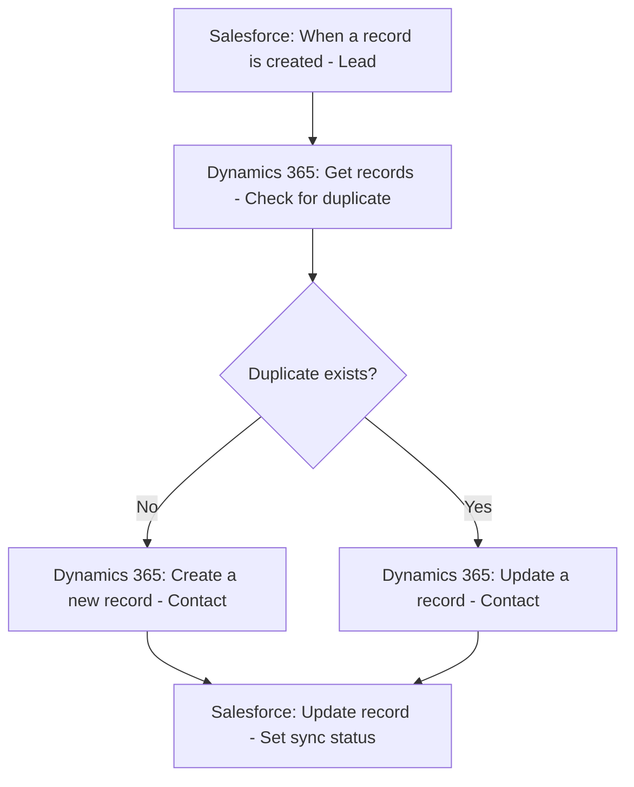

# How to Use Azure Logic Apps Connectors to Integrate with Salesforce and Dynamics 365

Author: [nawazdhandala](https://www.github.com/nawazdhandala)

Tags: Azure, Logic Apps, Salesforce, Dynamics 365, Integration, CRM, Enterprise

Description: Build real-time integrations between Salesforce and Dynamics 365 using Azure Logic Apps connectors without writing custom middleware code.

---

Enterprises that use both Salesforce and Dynamics 365 - whether from an acquisition, departmental preferences, or a migration in progress - face a constant challenge: keeping data synchronized between the two systems. Sales teams work in Salesforce while operations and finance work in Dynamics 365, and nobody wants to manually copy records back and forth.

Azure Logic Apps has native connectors for both Salesforce and Dynamics 365 that make it possible to build real-time, bidirectional integrations without writing custom middleware. In this post, I will walk through the connector setup, common integration patterns, and the gotchas you will encounter in production.

## Setting Up the Connectors

### Salesforce Connector

The Salesforce connector supports both Salesforce.com (production) and Salesforce sandbox environments.

To set up the connection in your Logic App:

1. Add any Salesforce action (e.g., "When a record is created")
2. Click "Sign in" when prompted for a connection
3. You will be redirected to Salesforce's OAuth login page
4. Sign in with a Salesforce user that has API access enabled
5. Authorize the Azure Logic Apps connected app

The connected app needs the following Salesforce permissions:
- API Enabled
- Access and manage your data (api)
- Perform requests on your behalf at any time (refresh_token, offline_access)

For production use, create a dedicated integration user in Salesforce rather than using a personal account. This avoids issues when someone changes their password or leaves the company.

### Dynamics 365 Connector

The Dynamics 365 connector authenticates using Azure AD. Setup is simpler if your Dynamics 365 instance is in the same Azure AD tenant:

1. Add any Dynamics 365 action (e.g., "When a record is created")
2. Click "Sign in"
3. Authenticate with your Azure AD credentials
4. Select the Dynamics 365 organization/environment

For automated scenarios, consider using a service principal or application user in Dynamics 365 instead of a personal account.

## Pattern 1: Sync New Salesforce Leads to Dynamics 365 Contacts

This is the most common starting point. When a new lead is created in Salesforce, automatically create a corresponding contact in Dynamics 365.

### Workflow Design



### Step-by-Step Configuration

**Trigger: Salesforce - When a record is created**
- Object type: Lead
- Frequency: Check every 1 minute (or use webhook-based trigger for near real-time)

**Action: Map fields and create in Dynamics 365**

The field mapping between Salesforce Leads and Dynamics 365 Contacts typically looks like this:

| Salesforce Lead Field | Dynamics 365 Contact Field |
|---|---|
| FirstName | firstname |
| LastName | lastname |
| Email | emailaddress1 |
| Phone | telephone1 |
| Company | company |
| Title | jobtitle |
| Street | address1_line1 |
| City | address1_city |
| State | address1_stateorprovince |
| PostalCode | address1_postalcode |
| Country | address1_country |
| LeadSource | leadsourcecode |

In the Logic App designer, use the "Create a new record" action for Dynamics 365 and map each field using dynamic content from the Salesforce trigger output.

## Pattern 2: Sync Dynamics 365 Opportunities to Salesforce

When an opportunity is created or updated in Dynamics 365, push it to Salesforce so the sales team sees it.

**Trigger: Dynamics 365 - When a record is created or modified**
- Table name: Opportunities
- Scope: Organization (to capture all users' changes)

**Actions:**

1. Check if this opportunity already exists in Salesforce by querying on a custom external ID field
2. If it exists, update the existing Salesforce record
3. If it does not exist, create a new Salesforce Opportunity

Here is how the Salesforce upsert action works in the Logic App:

```json
{
  "type": "ApiConnection",
  "inputs": {
    "host": {
      "connection": {
        "name": "@parameters('$connections')['salesforce']['connectionId']"
      }
    },
    "method": "patch",
    "path": "/v2/datasets/default/tables/Opportunity/externalIdFields/Dynamics_365_ID__c/@{triggerBody()?['opportunityid']}",
    "body": {
      "Name": "@{triggerBody()?['name']}",
      "Amount": "@{triggerBody()?['estimatedvalue']}",
      "CloseDate": "@{triggerBody()?['estimatedclosedate']}",
      "StageName": "@{body('Map_Stage_Values')}",
      "Description": "@{triggerBody()?['description']}"
    }
  }
}
```

The upsert (update or insert) operation uses an external ID field in Salesforce to determine whether to create or update. This is the recommended approach for bidirectional sync because it avoids duplicate records.

## Pattern 3: Real-Time Account Sync

Keeping accounts synchronized between both systems requires handling creates, updates, and a mechanism to prevent infinite loops.

### The Infinite Loop Problem

If Salesforce creates an account, your Logic App creates it in Dynamics 365. But if another Logic App is watching Dynamics 365 for new records, it sees the new record and tries to create it back in Salesforce. This loop continues forever.

### The Solution: Sync Flags

Add a custom field to both systems (e.g., `SyncedFromExternal__c` in Salesforce and `new_syncedfromexternal` in Dynamics 365). When the Logic App creates or updates a record, it sets this flag. The trigger Logic App checks this flag and skips records that were created by the integration.

```json
{
  "actions": {
    "Check_Sync_Flag": {
      "type": "If",
      "expression": {
        "and": [
          {
            "equals": [
              "@triggerBody()?['SyncedFromExternal__c']",
              true
            ]
          }
        ]
      },
      "actions": {
        "Terminate_Skip": {
          "type": "Terminate",
          "inputs": {
            "runStatus": "Cancelled"
          }
        }
      },
      "else": {
        "actions": {
          "Proceed_With_Sync": {
            "type": "Compose",
            "inputs": "Record not from external sync, proceeding..."
          }
        }
      }
    }
  }
}
```

## Handling Data Transformation

Salesforce and Dynamics 365 use different field formats, picklist values, and data structures. You will need transformation logic for:

### Picklist Value Mapping

Create a mapping table in your Logic App for values that differ between systems:

```json
{
  "actions": {
    "Map_Stage_Values": {
      "type": "Compose",
      "inputs": "@if(equals(triggerBody()?['stepname'], 'Qualify'), 'Prospecting', if(equals(triggerBody()?['stepname'], 'Develop'), 'Needs Analysis', if(equals(triggerBody()?['stepname'], 'Propose'), 'Proposal/Price Quote', 'Closed Won')))"
    }
  }
}
```

For complex mappings, store the mapping data in an Azure Table Storage table and look it up at runtime. This is cleaner than nested if-else expressions.

### Date Format Handling

Salesforce uses ISO 8601 date format (YYYY-MM-DD) while Dynamics 365 also uses ISO 8601 but with full datetime precision. Use the `formatDateTime` function in Logic Apps to ensure consistency:

```
@formatDateTime(triggerBody()?['CreatedDate'], 'yyyy-MM-ddTHH:mm:ssZ')
```

### Currency Handling

If your organizations operate in different currencies, you may need to convert amounts. Add a step that calls an exchange rate API or uses a stored rate table.

## Error Handling for Integration Workflows

Integration workflows between two CRM systems need robust error handling because either system can be temporarily unavailable.

### Retry Policies

Configure retry policies on each connector action:

```json
{
  "retryPolicy": {
    "type": "exponential",
    "count": 4,
    "interval": "PT30S",
    "minimumInterval": "PT10S",
    "maximumInterval": "PT1H"
  }
}
```

This retries failed requests with exponential backoff, starting at 30 seconds and growing up to 1 hour.

### Dead Letter Queue

For records that fail after all retries, push them to a dead letter queue (Azure Service Bus queue or Azure Storage queue) for manual review:

```json
{
  "actions": {
    "Send_To_Dead_Letter": {
      "type": "ApiConnection",
      "inputs": {
        "host": {
          "connection": {
            "name": "@parameters('$connections')['servicebus']['connectionId']"
          }
        },
        "method": "post",
        "path": "/dead-letter-sync/messages",
        "body": {
          "ContentData": "@{base64(concat('{\"source\":\"Salesforce\",\"recordId\":\"', triggerBody()?['Id'], '\",\"error\":\"', actions('Create_Dynamics_Record')?['error']?['message'], '\"}'))}"
        }
      },
      "runAfter": {
        "Create_Dynamics_Record": ["Failed", "TimedOut"]
      }
    }
  }
}
```

## Monitoring the Integration

Set up dashboards and alerts to monitor the health of your integration:

1. **Track success and failure rates** using Logic Apps run history metrics
2. **Monitor latency** by comparing record creation timestamps in both systems
3. **Alert on dead letter queue depth** to catch systematic failures early
4. **Review connector throttling** - both Salesforce and Dynamics 365 have API rate limits

```bash
# Create an alert for failed Logic App runs
az monitor metrics alert create \
  --resource-group rg-workflows \
  --name "SalesforceSyncFailures" \
  --scopes "/subscriptions/<sub-id>/resourceGroups/rg-workflows/providers/Microsoft.Logic/workflows/la-salesforce-sync" \
  --condition "total RunsFailed > 5" \
  --evaluation-frequency 15m \
  --window-size 1h \
  --action-group "/subscriptions/<sub-id>/resourceGroups/rg-monitoring/providers/Microsoft.Insights/actionGroups/ag-integration-team"
```

## Performance Considerations

- **Salesforce API limits** depend on your Salesforce edition. Enterprise Edition gets 100,000 API calls per 24-hour period. Monitor your usage in Salesforce Setup under "API Usage."
- **Dynamics 365 API limits** are 6,000 requests per user per 5-minute window. Use a dedicated integration user and monitor with the Dataverse analytics.
- **Bulk operations**: For initial data loads, do not use Logic Apps. Use Salesforce Data Loader and Dynamics 365 Import Wizard instead. Logic Apps are best for ongoing, incremental sync.
- **Polling frequency**: The Salesforce trigger polls for new records. More frequent polling means more API calls. Balance timeliness against API consumption.

## Wrapping Up

Azure Logic Apps makes Salesforce and Dynamics 365 integration accessible without building custom middleware, but "accessible" does not mean "trivial." The connectors handle authentication and basic CRUD operations well, but you still need to design for field mapping, duplicate prevention, infinite loop avoidance, error handling, and API rate limits. Start with a unidirectional sync (Salesforce to Dynamics 365 for a single object type), validate it thoroughly, and then expand to bidirectional sync and additional objects as you gain confidence in the integration.
