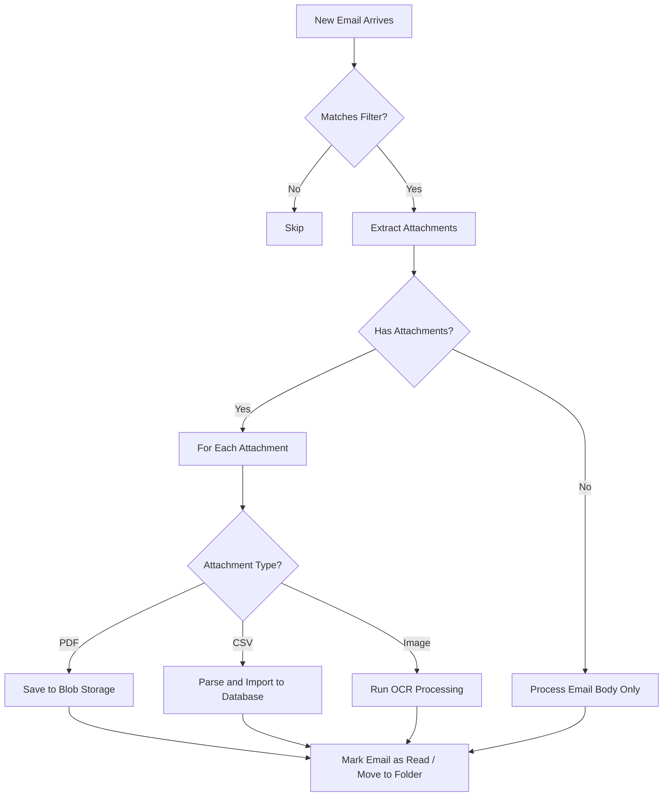

# How to Use Azure Logic Apps to Process Emails and Attachments

Author: [nawazdhandala](https://www.github.com/nawazdhandala)

Tags: Azure, Logic Apps, Email Processing, Attachments, Office 365, Outlook, Workflow Automation

Description: Automate email processing and attachment handling with Azure Logic Apps using Office 365 and Outlook connectors for real-world business scenarios.

---

Email remains one of the most common ways businesses receive data - invoices as PDF attachments, orders in CSV files, reports from automated systems, customer inquiries that need routing. Manually processing these emails is tedious and error-prone. Azure Logic Apps can automatically monitor an inbox, extract attachments, parse content, and route everything to the right system.

## The Email Processing Pipeline

A typical email processing workflow follows this pattern:

1. Monitor an inbox for new emails matching specific criteria
2. Filter by sender, subject, or other attributes
3. Extract attachments
4. Process each attachment based on its type
5. Save results to storage or database
6. Archive or move the original email


```mermaid
graph TD
    A[New Email Arrives] --> B{Matches Filter?}
    B -->|No| C[Skip]
    B -->|Yes| D[Extract Attachments]
    D --> E{Has Attachments?}
    E -->|No| F[Process Email Body Only]
    E -->|Yes| G[For Each Attachment]
    G --> H{Attachment Type?}
    H -->|PDF| I[Save to Blob Storage]
    H -->|CSV| J[Parse and Import to Database]
    H -->|Image| K[Run OCR Processing]
    I --> L[Mark Email as Read / Move to Folder]
    J --> L
    K --> L
    F --> L
```

## Setting Up the Email Trigger

The Office 365 Outlook connector provides a trigger that fires when a new email arrives. You can filter by folder, sender, subject, and importance.

```json
{
  "definition": {
    "triggers": {
      "When_a_new_email_arrives": {
        "type": "ApiConnection",
        "inputs": {
          "host": {
            "connection": {
              "name": "@parameters('$connections')['office365']['connectionId']"
            }
          },
          "method": "get",
          "path": "/v3/Mail/OnNewEmail",
          "queries": {
            "folderPath": "Inbox",
            "importance": "Any",
            "fetchOnlyWithAttachment": true,
            "includeAttachments": true,
            "subjectFilter": "Invoice"
          }
        },
        "recurrence": {
          "frequency": "Minute",
          "interval": 5
        },
        "splitOn": "@triggerBody()?['value']"
      }
    },
    "actions": {}
  }
}
```

Key settings:
- `fetchOnlyWithAttachment: true` - only trigger when the email has attachments
- `includeAttachments: true` - include attachment content in the trigger output
- `subjectFilter` - only trigger for emails with "Invoice" in the subject

## Processing Attachments

When the trigger fires, the email object includes an `attachments` array. Each attachment has a `name`, `contentType`, `contentBytes` (base64-encoded content), and `size`.

```json
{
  "actions": {
    "For_Each_Attachment": {
      "type": "Foreach",
      "foreach": "@triggerBody()?['attachments']",
      "actions": {
        "Check_Attachment_Type": {
          "type": "Switch",
          "expression": "@items('For_Each_Attachment')?['contentType']",
          "cases": {
            "PDF": {
              "case": "application/pdf",
              "actions": {
                "Save_PDF_to_Blob": {
                  "type": "ApiConnection",
                  "inputs": {
                    "host": {
                      "connection": {
                        "name": "@parameters('$connections')['azureblob']['connectionId']"
                      }
                    },
                    "method": "post",
                    "path": "/v2/datasets/@{encodeURIComponent('stinvoices')}/files",
                    "queries": {
                      "folderPath": "/invoices/@{formatDateTime(utcNow(), 'yyyy/MM/dd')}",
                      "name": "@items('For_Each_Attachment')?['name']",
                      "queryParametersSingleEncoded": true
                    },
                    "body": "@base64ToBinary(items('For_Each_Attachment')?['contentBytes'])"
                  },
                  "runAfter": {}
                }
              }
            },
            "CSV": {
              "case": "text/csv",
              "actions": {
                "Parse_CSV_Content": {
                  "type": "Compose",
                  "inputs": "@base64ToString(items('For_Each_Attachment')?['contentBytes'])",
                  "runAfter": {}
                },
                "Process_CSV_Data": {
                  "type": "Http",
                  "inputs": {
                    "method": "POST",
                    "uri": "@{parameters('DataImportApiUrl')}/csv",
                    "headers": {
                      "Content-Type": "text/csv"
                    },
                    "body": "@outputs('Parse_CSV_Content')"
                  },
                  "runAfter": {
                    "Parse_CSV_Content": ["Succeeded"]
                  }
                }
              }
            },
            "Excel": {
              "case": "application/vnd.openxmlformats-officedocument.spreadsheetml.sheet",
              "actions": {
                "Save_Excel_to_Blob": {
                  "type": "ApiConnection",
                  "inputs": {
                    "host": {
                      "connection": {
                        "name": "@parameters('$connections')['azureblob']['connectionId']"
                      }
                    },
                    "method": "post",
                    "path": "/v2/datasets/@{encodeURIComponent('stinvoices')}/files",
                    "queries": {
                      "folderPath": "/spreadsheets/@{formatDateTime(utcNow(), 'yyyy/MM/dd')}",
                      "name": "@items('For_Each_Attachment')?['name']"
                    },
                    "body": "@base64ToBinary(items('For_Each_Attachment')?['contentBytes'])"
                  },
                  "runAfter": {}
                }
              }
            }
          },
          "default": {
            "actions": {
              "Save_Other_to_Blob": {
                "type": "ApiConnection",
                "inputs": {
                  "host": {
                    "connection": {
                      "name": "@parameters('$connections')['azureblob']['connectionId']"
                    }
                  },
                  "method": "post",
                  "path": "/v2/datasets/@{encodeURIComponent('stinvoices')}/files",
                  "queries": {
                    "folderPath": "/other/@{formatDateTime(utcNow(), 'yyyy/MM/dd')}",
                    "name": "@items('For_Each_Attachment')?['name']"
                  },
                  "body": "@base64ToBinary(items('For_Each_Attachment')?['contentBytes'])"
                },
                "runAfter": {}
              }
            }
          },
          "runAfter": {}
        }
      },
      "runAfter": {}
    }
  }
}
```

## Extracting Data from Email Body

Sometimes the valuable data is in the email body, not the attachments. Use HTML parsing and string expressions to extract structured information.

```json
{
  "Extract_Order_Number": {
    "type": "Compose",
    "inputs": "@{first(split(last(split(triggerBody()?['body'], 'Order #')), '<'))}",
    "runAfter": {}
  },
  "Extract_Amount": {
    "type": "Compose",
    "inputs": "@{first(split(last(split(triggerBody()?['body'], 'Total: $')), '<'))}",
    "runAfter": {}
  }
}
```

For more complex parsing, send the email body to an Azure Function or an HTTP API that handles the extraction.

```json
{
  "Parse_Email_Content": {
    "type": "Http",
    "inputs": {
      "method": "POST",
      "uri": "@{parameters('EmailParserApiUrl')}/parse",
      "headers": {
        "Content-Type": "application/json"
      },
      "body": {
        "subject": "@triggerBody()?['subject']",
        "body": "@triggerBody()?['body']",
        "from": "@triggerBody()?['from']",
        "receivedDateTime": "@triggerBody()?['receivedDateTime']"
      }
    },
    "runAfter": {}
  }
}
```

## Routing Emails Based on Content

Route emails to different handlers based on the sender, subject, or body content.

```json
{
  "Route_By_Sender": {
    "type": "Switch",
    "expression": "@triggerBody()?['from']",
    "cases": {
      "Supplier_A": {
        "case": "invoices@supplier-a.com",
        "actions": {
          "Process_Supplier_A_Invoice": {
            "type": "Http",
            "inputs": {
              "method": "POST",
              "uri": "@{parameters('InvoiceApiUrl')}/supplier-a",
              "body": "@triggerBody()"
            },
            "runAfter": {}
          }
        }
      },
      "Supplier_B": {
        "case": "billing@supplier-b.com",
        "actions": {
          "Process_Supplier_B_Invoice": {
            "type": "Http",
            "inputs": {
              "method": "POST",
              "uri": "@{parameters('InvoiceApiUrl')}/supplier-b",
              "body": "@triggerBody()"
            },
            "runAfter": {}
          }
        }
      }
    },
    "default": {
      "actions": {
        "Forward_To_Manual_Processing": {
          "type": "ApiConnection",
          "inputs": {
            "host": {
              "connection": {
                "name": "@parameters('$connections')['office365']['connectionId']"
              }
            },
            "method": "post",
            "path": "/v2/Mail/Forward",
            "body": {
              "ToRecipients": "manual-processing@mycompany.com",
              "Comment": "This email could not be automatically processed.",
              "message_id": "@triggerBody()?['id']"
            }
          },
          "runAfter": {}
        }
      }
    },
    "runAfter": {}
  }
}
```

## Moving Processed Emails

After processing, move the email to a "Processed" folder to keep the inbox clean and prevent reprocessing.

```json
{
  "Move_To_Processed_Folder": {
    "type": "ApiConnection",
    "inputs": {
      "host": {
        "connection": {
          "name": "@parameters('$connections')['office365']['connectionId']"
        }
      },
      "method": "post",
      "path": "/v2/Mail/Move/@{encodeURIComponent(triggerBody()?['id'])}",
      "body": {
        "folderPath": "Processed"
      }
    },
    "runAfter": {
      "For_Each_Attachment": ["Succeeded"]
    }
  },
  "Move_To_Failed_Folder": {
    "type": "ApiConnection",
    "inputs": {
      "host": {
        "connection": {
          "name": "@parameters('$connections')['office365']['connectionId']"
        }
      },
      "method": "post",
      "path": "/v2/Mail/Move/@{encodeURIComponent(triggerBody()?['id'])}",
      "body": {
        "folderPath": "Failed"
      }
    },
    "runAfter": {
      "For_Each_Attachment": ["Failed"]
    }
  }
}
```

## Handling Large Attachments

The Office 365 connector skips emails whose total message size is greater than your Exchange admin limit or 50 MB, whichever is less. Including attachment content in the trigger can also cause timeouts while the connector downloads attachments. For larger or busier attachment workflows, trigger on the email without attachment content, then use the attachment metadata from the trigger and download each attachment by ID.

```json
{
  "triggers": {
    "When_a_new_email_arrives": {
      "inputs": {
        "queries": {
          "includeAttachments": false,
          "fetchOnlyWithAttachment": true
        }
      },
      "splitOn": "@triggerBody()?['value']"
    }
  },
  "actions": {
    "Download_Each_Attachment": {
      "type": "Foreach",
      "foreach": "@triggerBody()?['attachments']",
      "actions": {
        "Get_Attachment_Content": {
          "type": "ApiConnection",
          "inputs": {
            "method": "get",
            "path": "/v2/Mail/@{encodeURIComponent(triggerBody()?['id'])}/Attachments/@{encodeURIComponent(items('Download_Each_Attachment')?['id'])}"
          },
          "runAfter": {}
        }
      }
    }
  }
}
```

## Monitoring and Error Handling

Email processing workflows should have robust error handling. If an attachment fails to process, you do not want the entire workflow to fail and leave the email in an unknown state.

Wrap the attachment processing loop in a scope with try-catch semantics. On failure, move the email to a "Failed" folder and send an alert.

Set up monitoring for the workflow's failure rate. A sudden spike in failures usually indicates a changed email format, a down downstream API, or a mailbox permission issue.

## Security Considerations

The Logic App needs access to the target mailbox. Use a service account (a dedicated mailbox for automation) rather than a personal account. The Office 365 Outlook connector signs in with Office 365 credentials and currently does not support service principal-based authentication; use managed identity for other Azure resources in the workflow where possible.

Never log email content or attachment data to public logs. Email often contains sensitive business information or personal data subject to privacy regulations.

## Summary

Azure Logic Apps turns email processing from a manual task into an automated pipeline. Monitor inboxes for specific emails, extract and route attachments by type, parse email body content for structured data, and archive processed emails. The Office 365 connector handles the email interaction, and you can combine it with any other Logic Apps connector to route data to storage, databases, APIs, or other systems. Build in proper error handling and monitoring from the start, and your email automation will run reliably with minimal intervention.
