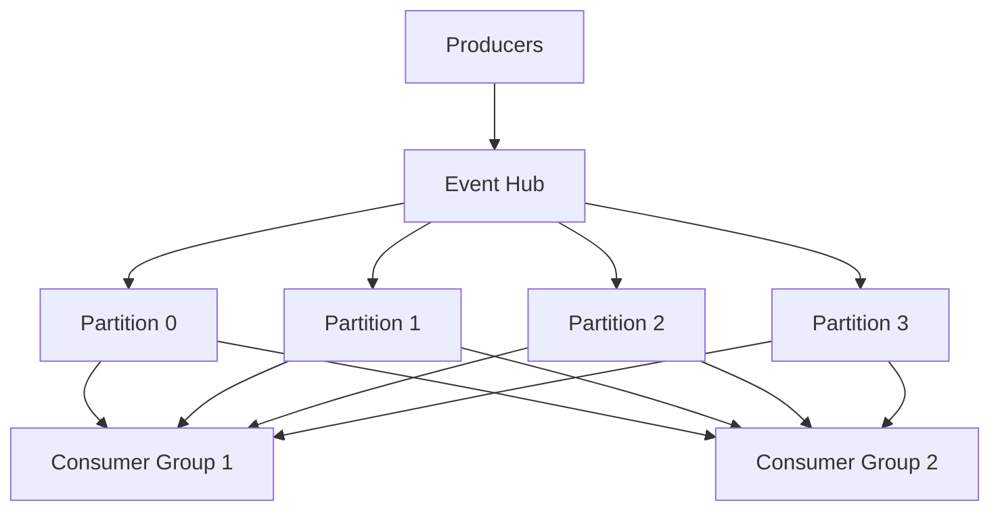

# How to Use Azure.Messaging.EventHubs SDK for Event Streaming in C# .NET

Author: [nawazdhandala](https://www.github.com/nawazdhandala)

Tags: Azure Event Hubs, Event Streaming, C#, .NET SDK, Real-Time Data, Azure Messaging, Event-Driven Architecture

Description: Learn how to use the Azure.Messaging.EventHubs SDK in C# .NET to produce and consume real-time event streams for high-throughput data processing.

---

Azure Event Hubs is a fully managed event streaming platform capable of receiving and processing millions of events per second. It is the Azure equivalent of Apache Kafka, and it is used for telemetry ingestion, log aggregation, real-time analytics, and event-driven architectures. The `Azure.Messaging.EventHubs` SDK for .NET gives you a clean, modern API for both producing and consuming events.

In this post, we will build a complete event streaming solution using the .NET SDK. We will send events from a producer, consume them with the Event Processor Client, and handle the nuances of partitioning, checkpointing, and error handling.

## Understanding Event Hubs Concepts

Before writing code, it helps to understand the key concepts.

An Event Hub is like a durable log. Events are appended to partitions, and consumers read from those partitions. Partitions are the unit of parallelism. If you have 8 partitions, you can have up to 8 consumers reading in parallel within a single consumer group.

A consumer group is a view of the entire Event Hub. Different consumer groups can read the same events independently, at their own pace. This lets you have one consumer group for real-time processing and another for batch analytics, both reading the same stream.



## Setting Up the Project

Create a new .NET solution with a producer and consumer project.

```bash
# Create the solution
dotnet new sln -n EventHubsDemo

# Create the producer console app
dotnet new console -n EventProducer
dotnet sln add EventProducer

# Create the consumer console app
dotnet new console -n EventConsumer
dotnet sln add EventConsumer

# Add the Event Hubs packages to both projects
cd EventProducer
dotnet add package Azure.Messaging.EventHubs
cd ../EventConsumer
dotnet add package Azure.Messaging.EventHubs.Processor
dotnet add package Azure.Storage.Blobs
```

The consumer uses the Processor package, which depends on Azure Blob Storage for checkpointing. Checkpointing tracks each consumer's position in the stream so it can resume from where it left off.

## Creating the Event Hub

Use the Azure CLI to create the necessary resources.

```bash
# Create a resource group
az group create --name eventhub-demo-rg --location eastus

# Create an Event Hubs namespace
az eventhubs namespace create \
  --name my-eventhub-ns \
  --resource-group eventhub-demo-rg \
  --location eastus \
  --sku Standard

# Create an Event Hub with 4 partitions
az eventhubs eventhub create \
  --name sensor-data \
  --namespace-name my-eventhub-ns \
  --resource-group eventhub-demo-rg \
  --partition-count 4 \
  --message-retention 1

# Create a storage account for checkpointing
az storage account create \
  --name eventhubcheckpoints \
  --resource-group eventhub-demo-rg \
  --location eastus \
  --sku Standard_LRS

# Create a blob container for checkpoints
az storage container create \
  --name checkpoints \
  --account-name eventhubcheckpoints
```

## Building the Event Producer

The producer sends events to the Event Hub. It can send individual events or batches.

```csharp
// EventProducer/Program.cs
using Azure.Messaging.EventHubs;
using Azure.Messaging.EventHubs.Producer;
using System.Text;
using System.Text.Json;

// Connection string from the Azure Portal -> Event Hubs Namespace -> Shared Access Policies
string connectionString = "Endpoint=sb://my-eventhub-ns.servicebus.windows.net/;SharedAccessKeyName=RootManageSharedAccessKey;SharedAccessKey=your-key";
string eventHubName = "sensor-data";

// Create the producer client - this is thread-safe and should be reused
await using var producerClient = new EventHubProducerClient(connectionString, eventHubName);

Console.WriteLine("Sending sensor data events...");

// Simulate sending sensor readings every second
var random = new Random();
for (int i = 0; i < 100; i++)
{
    // Create a batch of events
    using EventDataBatch eventBatch = await producerClient.CreateBatchAsync();

    // Generate 10 sensor readings per batch
    for (int j = 0; j < 10; j++)
    {
        var sensorReading = new
        {
            SensorId = $"sensor-{random.Next(1, 20):D3}",
            Temperature = Math.Round(20.0 + random.NextDouble() * 15.0, 2),
            Humidity = Math.Round(40.0 + random.NextDouble() * 40.0, 2),
            Timestamp = DateTime.UtcNow
        };

        string json = JsonSerializer.Serialize(sensorReading);
        var eventData = new EventData(Encoding.UTF8.GetBytes(json));

        // Add custom properties for routing or filtering
        eventData.Properties["source"] = "temperature-monitor";
        eventData.Properties["priority"] = sensorReading.Temperature > 30 ? "high" : "normal";

        // TryAdd returns false if the batch is full
        if (!eventBatch.TryAdd(eventData))
        {
            // Batch is full - send what we have and create a new batch
            await producerClient.SendAsync(eventBatch);
            Console.WriteLine($"Sent batch of {eventBatch.Count} events");
            break;
        }
    }

    // Send the batch
    if (eventBatch.Count > 0)
    {
        await producerClient.SendAsync(eventBatch);
        Console.WriteLine($"Sent batch {i + 1} with {eventBatch.Count} events");
    }

    await Task.Delay(1000);
}

Console.WriteLine("Done sending events.");
```

## Sending Events to Specific Partitions

By default, Event Hubs distributes events across partitions using a round-robin approach. You can control this with partition keys.

```csharp
// Send events with a partition key - events with the same key go to the same partition
// This is useful when you need ordering guarantees for related events
var batchOptions = new CreateBatchOptions
{
    PartitionKey = "sensor-001"  // All events for this sensor go to the same partition
};

using EventDataBatch batch = await producerClient.CreateBatchAsync(batchOptions);
```

## Building the Event Consumer

The `EventProcessorClient` handles the complexity of reading from multiple partitions, load balancing across instances, and checkpointing progress.

```csharp
// EventConsumer/Program.cs
using Azure.Messaging.EventHubs;
using Azure.Messaging.EventHubs.Consumer;
using Azure.Messaging.EventHubs.Processor;
using Azure.Storage.Blobs;
using System.Text;

string eventHubConnectionString = "Endpoint=sb://my-eventhub-ns.servicebus.windows.net/;...";
string eventHubName = "sensor-data";
string consumerGroup = EventHubConsumerClient.DefaultConsumerGroupName;
string storageConnectionString = "DefaultEndpointsProtocol=https;AccountName=eventhubcheckpoints;...";
string blobContainerName = "checkpoints";

// Create the blob container client for checkpointing
var storageClient = new BlobContainerClient(storageConnectionString, blobContainerName);

// Create the Event Processor Client
var processor = new EventProcessorClient(
    storageClient,
    consumerGroup,
    eventHubConnectionString,
    eventHubName);

// Track how many events we have processed for periodic logging
int eventsProcessed = 0;

// Register the event processing handler
processor.ProcessEventAsync += async (ProcessEventArgs args) =>
{
    if (args.Data != null)
    {
        // Read the event body
        string body = Encoding.UTF8.GetString(args.Data.EventBody.ToArray());

        // Access custom properties
        string source = args.Data.Properties.TryGetValue("source", out var s) ? s.ToString() : "unknown";
        string priority = args.Data.Properties.TryGetValue("priority", out var p) ? p.ToString() : "normal";

        Console.WriteLine($"Partition: {args.Partition.PartitionId} | " +
                          $"Priority: {priority} | Data: {body}");

        eventsProcessed++;

        // Checkpoint every 50 events to track our progress
        // Checkpointing too often adds overhead, too rarely risks reprocessing
        if (eventsProcessed % 50 == 0)
        {
            await args.UpdateCheckpointAsync();
            Console.WriteLine($"Checkpoint updated after {eventsProcessed} events");
        }
    }
};

// Register the error handler - this is required
processor.ProcessErrorAsync += (ProcessErrorEventArgs args) =>
{
    Console.WriteLine($"Error on partition {args.PartitionId}: {args.Exception.Message}");
    Console.WriteLine($"Operation: {args.Operation}");
    return Task.CompletedTask;
};

// Start processing
Console.WriteLine("Starting Event Processor...");
await processor.StartProcessingAsync();

Console.WriteLine("Processing events. Press any key to stop.");
Console.ReadKey();

// Stop processing gracefully
await processor.StopProcessingAsync();
Console.WriteLine($"Processed {eventsProcessed} total events.");
```

## Checkpointing Strategy

Checkpointing is how the processor remembers its position in the stream. When the processor restarts, it resumes from the last checkpoint. There is a trade-off:

- Checkpoint after every event: Maximum reliability, but high overhead from blob storage writes
- Checkpoint periodically: Lower overhead, but you may reprocess some events after a restart
- Checkpoint on a timer: A good middle ground - checkpoint every N seconds regardless of event count

The right strategy depends on whether your processing is idempotent. If reprocessing an event is harmless, checkpoint less frequently. If reprocessing causes problems, checkpoint more often.

## Processing Events in Parallel

The EventProcessorClient processes events from each partition sequentially, but different partitions are processed in parallel. If you need more throughput within a single partition, you can offload work to a background task.

```csharp
// Using a channel to decouple receiving from processing
var channel = System.Threading.Channels.Channel.CreateBounded<string>(1000);

processor.ProcessEventAsync += async (ProcessEventArgs args) =>
{
    if (args.Data != null)
    {
        string body = Encoding.UTF8.GetString(args.Data.EventBody.ToArray());

        // Write to channel for background processing
        await channel.Writer.WriteAsync(body);

        // Checkpoint periodically
        await args.UpdateCheckpointAsync();
    }
};

// Background task reads from the channel and processes events
_ = Task.Run(async () =>
{
    await foreach (var eventBody in channel.Reader.ReadAllAsync())
    {
        // Heavy processing happens here, off the critical path
        await ProcessEventAsync(eventBody);
    }
});
```

## Production Considerations

When running Event Hubs in production, keep these things in mind. First, partition count is set at creation time and cannot be increased later (in Standard tier). Plan for your expected peak throughput. Each partition supports up to 1 MB/s ingress and 2 MB/s egress.

Second, use managed identities instead of connection strings for authentication. The `Azure.Identity` package makes this easy.

Third, monitor your consumer lag. If your consumers fall behind, events will be dropped after the retention period (1-7 days on Standard, up to 90 days on Premium). Set up alerts for consumer lag.

Fourth, handle the `ProcessErrorAsync` event properly. Do not throw exceptions from it. Log the error and let the processor retry.

## Wrapping Up

Azure Event Hubs and the `Azure.Messaging.EventHubs` SDK give you a scalable, reliable event streaming platform without managing Kafka clusters. The producer API handles batching and partition routing. The EventProcessorClient handles load balancing, checkpointing, and partition distribution. Build your producer, build your consumer, and let the SDK handle the plumbing. Start with a small number of partitions and scale up as your throughput requirements grow.
