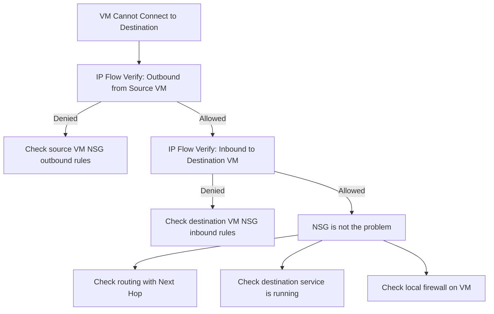

# How to Use Azure Network Watcher IP Flow Verify to Diagnose NSG Issues

Author: [nawazdhandala](https://www.github.com/nawazdhandala)

Tags: Azure, Network Watcher, IP Flow Verify, NSG, Troubleshooting, Networking, Security

Description: Learn how to use Azure Network Watcher IP Flow Verify to quickly diagnose whether network security group rules are blocking or allowing traffic to your VMs.

---

When a VM in Azure cannot reach a destination or receive incoming connections, the first suspect is usually a Network Security Group (NSG) rule. But Azure VMs can have NSGs at both the NIC level and the subnet level, and the effective rules are the intersection of both. Manually tracing through all the rules, their priorities, and their interactions is tedious and error-prone.

Azure Network Watcher IP Flow Verify does this for you. You tell it "I want to send TCP traffic from this VM's IP on this port to that destination IP on that port" and it instantly tells you whether the traffic is allowed or denied, and which specific NSG rule is responsible.

## What IP Flow Verify Does

IP Flow Verify simulates a single packet and checks it against all applicable NSG rules (NIC-level and subnet-level) for a specific VM. It returns:

1. **Access:** Allow or Deny
2. **Rule name:** The specific NSG rule that made the decision
3. **Direction:** Whether it checked inbound or outbound rules

It does not actually send traffic. It is a simulation against the current NSG configuration. This means you can test hypothetical scenarios without affecting live traffic.

## When to Use IP Flow Verify

- **Connectivity troubleshooting:** VM cannot reach a database, API, or external service
- **Post-change verification:** After modifying NSG rules, verify the expected behavior
- **Security validation:** Confirm that sensitive ports are blocked from unexpected sources
- **Pre-deployment checks:** Before deploying a new service, verify NSG rules will allow the required traffic

## Step 1: Basic Outbound Check

The most common scenario: your VM cannot reach a destination. Check if the outbound NSG rules allow it:

```bash
# Check if VM can send TCP traffic to destination on port 443
az network watcher test-ip-flow \
  --resource-group myResourceGroup \
  --vm myVM \
  --direction Outbound \
  --protocol TCP \
  --local 10.0.1.4:* \
  --remote 10.0.2.50:443
```

The output looks like:

```json
{
  "access": "Allow",
  "ruleName": "AllowVnetOutbound"
}
```

Or if blocked:

```json
{
  "access": "Deny",
  "ruleName": "DenyAllOutbound"
}
```

The `ruleName` tells you exactly which rule is responsible. This is the key information - without it, you would be manually searching through potentially dozens of rules.

## Step 2: Basic Inbound Check

Check if a source can reach your VM on a specific port:

```bash
# Check if traffic from the internet can reach VM on port 22 (SSH)
az network watcher test-ip-flow \
  --resource-group myResourceGroup \
  --vm myVM \
  --direction Inbound \
  --protocol TCP \
  --local 10.0.1.4:22 \
  --remote 203.0.113.50:*
```

For inbound checks:
- `--local` is the VM's IP and the destination port
- `--remote` is the source IP and source port (use `*` for any port)

## Step 3: Check UDP Traffic

Not all traffic is TCP. DNS uses UDP, and some applications use UDP for performance:

```bash
# Check if UDP DNS traffic can reach the VM
az network watcher test-ip-flow \
  --resource-group myResourceGroup \
  --vm myVM \
  --direction Inbound \
  --protocol UDP \
  --local 10.0.1.4:53 \
  --remote 10.0.0.5:*
```

## Step 4: Check Across VNet Peering

If two VNets are peered and a VM in VNet A cannot reach a VM in VNet B, check both directions:

```bash
# Check outbound from VM in VNet A
az network watcher test-ip-flow \
  --resource-group rgVNetA \
  --vm vmA \
  --direction Outbound \
  --protocol TCP \
  --local 10.0.1.4:* \
  --remote 10.1.1.4:5432

# Check inbound to VM in VNet B
az network watcher test-ip-flow \
  --resource-group rgVNetB \
  --vm vmB \
  --direction Inbound \
  --protocol TCP \
  --local 10.1.1.4:5432 \
  --remote 10.0.1.4:*
```

Traffic can be blocked at either end. The outbound NSG on the source VM or the inbound NSG on the destination VM could be the problem. Test both.

## Step 5: Systematic Troubleshooting

Here is a methodical approach for diagnosing connectivity issues:



If IP Flow Verify says both outbound and inbound are allowed, the problem is not NSG-related. Move on to checking routes (using Next Hop), service configuration, or the VM's local firewall (iptables on Linux, Windows Firewall on Windows).

## Common Scenarios and Examples

### Scenario 1: Web Server Not Accessible

Your web server VM should be accessible on port 80 from the internet:

```bash
# Check from an internet IP
az network watcher test-ip-flow \
  --resource-group myResourceGroup \
  --vm webVM \
  --direction Inbound \
  --protocol TCP \
  --local 10.0.1.10:80 \
  --remote 8.8.8.8:*
```

If denied, the output might show the rule name `DenyAllInBound` (the default deny rule). You need to add an explicit allow rule for port 80.

### Scenario 2: Database VM Accessible Only from App Tier

Your database should be accessible from the app subnet (10.0.2.0/24) but not from the web subnet (10.0.1.0/24):

```bash
# Should be allowed: app tier to database
az network watcher test-ip-flow \
  --resource-group myResourceGroup \
  --vm dbVM \
  --direction Inbound \
  --protocol TCP \
  --local 10.0.3.10:5432 \
  --remote 10.0.2.5:*

# Should be denied: web tier to database
az network watcher test-ip-flow \
  --resource-group myResourceGroup \
  --vm dbVM \
  --direction Inbound \
  --protocol TCP \
  --local 10.0.3.10:5432 \
  --remote 10.0.1.5:*
```

This validates your NSG rules are correctly segmenting traffic between tiers.

### Scenario 3: VM Cannot Reach External API

An app VM needs to call an external API on port 443:

```bash
# Check outbound to the external API
az network watcher test-ip-flow \
  --resource-group myResourceGroup \
  --vm appVM \
  --direction Outbound \
  --protocol TCP \
  --local 10.0.2.5:* \
  --remote 52.150.30.100:443
```

If you have a restrictive NSG that denies internet-bound traffic, you will see which rule is blocking it.

## Understanding NSG Rule Evaluation

NSG rules are evaluated in priority order (lowest number first). The first matching rule determines the outcome. Here is how IP Flow Verify works through the rules:

1. Gets all effective rules (NIC-level + subnet-level NSGs)
2. Orders them by priority
3. Checks each rule against the simulated packet
4. Returns the first matching rule

Default rules have high priority numbers (65000+) and are evaluated last:
- `AllowVnetInbound` (65000) - Allows intra-VNet traffic
- `AllowAzureLoadBalancerInbound` (65001) - Allows health probes
- `DenyAllInbound` (65500) - Denies everything else

Your custom rules (priority 100-4096) are evaluated before these defaults.

## Automating NSG Validation

You can script IP Flow Verify to validate your NSG configuration as part of your CI/CD pipeline or security audit:

```bash
#!/bin/bash
# Script to validate NSG rules for a web application

RESOURCE_GROUP="myResourceGroup"
WEB_VM="webVM"
APP_VM="appVM"
DB_VM="dbVM"
FAIL=0

# Web tier should accept port 80 from internet
check_flow() {
    local result=$(az network watcher test-ip-flow \
      --resource-group $1 --vm $2 \
      --direction $3 --protocol $4 \
      --local "$5" --remote "$6" \
      --query access --output tsv)

    if [ "$result" != "$7" ]; then
        echo "FAIL: $2 $3 $4 $5 -> $6 expected $7 got $result"
        FAIL=1
    else
        echo "PASS: $2 $3 $4 $5 -> $6 = $result"
    fi
}

# Validate expected NSG rules
check_flow $RESOURCE_GROUP $WEB_VM Inbound TCP "10.0.1.10:80" "8.8.8.8:*" "Allow"
check_flow $RESOURCE_GROUP $WEB_VM Inbound TCP "10.0.1.10:22" "8.8.8.8:*" "Deny"
check_flow $RESOURCE_GROUP $DB_VM Inbound TCP "10.0.3.10:5432" "10.0.2.5:*" "Allow"
check_flow $RESOURCE_GROUP $DB_VM Inbound TCP "10.0.3.10:5432" "10.0.1.5:*" "Deny"

if [ $FAIL -eq 1 ]; then
    echo "NSG validation failed!"
    exit 1
fi
echo "All NSG rules validated successfully."
```

## Limitations

- **NSG only.** IP Flow Verify checks NSG rules but not Azure Firewall, NVA rules, or route tables. It tells you about NSGs specifically.
- **Single NIC check.** If your VM has multiple NICs, specify which one with `--nic` parameter.
- **No FQDN support.** You must use IP addresses, not hostnames.
- **VM must be running.** You cannot check NSG rules on a stopped VM.
- **Does not check service endpoints or Private Endpoints.** These affect routing, not NSG evaluation.

## Combining with Other Network Watcher Tools

IP Flow Verify works best when combined with other diagnostic tools:

- **Next Hop:** Check if routing is correct (after confirming NSG is not the issue)
- **Connection Troubleshoot:** End-to-end connectivity test that checks NSG, routes, and connectivity in one operation
- **NSG Flow Logs:** Ongoing logging of all traffic decisions made by NSGs
- **Packet Capture:** Inspect actual packets when you need deeper analysis

## Summary

Azure Network Watcher IP Flow Verify is the fastest way to determine whether an NSG rule is blocking traffic. Instead of manually reading through NSG rules and figuring out priority ordering, you tell it the source, destination, port, and protocol, and it tells you the result and the responsible rule. Use it for troubleshooting connectivity issues, validating security policies, and automating NSG configuration testing. When IP Flow Verify says traffic is allowed but connectivity still fails, you know the problem is elsewhere - routing, local firewalls, or application configuration.
