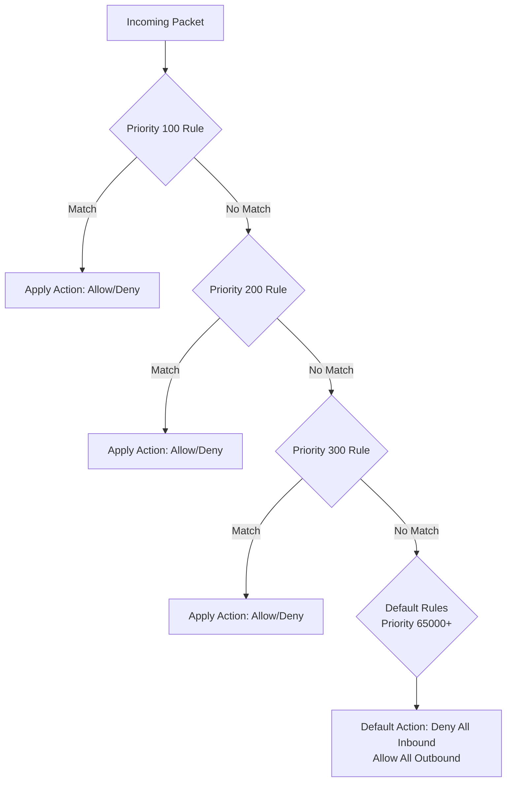

# How to Use Azure Network Watcher NSG Diagnostics to Verify Security Rules

Author: [nawazdhandala](https://www.github.com/nawazdhandala)

Tags: Azure, Network Watcher, NSG, Diagnostics, Security, Troubleshooting, Network Security

Description: Use Azure Network Watcher NSG diagnostics to verify which security rules allow or deny specific traffic flows without sending actual network packets.

---

When you have multiple Network Security Groups in Azure - one on the subnet, another on the NIC, maybe augmented by Application Security Groups - figuring out whether a specific traffic flow is allowed or blocked can feel like solving a puzzle. You end up reading through dozens of rules, mentally evaluating priority orders, and still second-guessing the result. Azure Network Watcher's NSG diagnostics takes the guesswork out by telling you exactly which rule matches a given traffic flow.

This guide covers how to use NSG diagnostics to verify security rules, troubleshoot connectivity issues, and audit your NSG configuration.

## What NSG Diagnostics Does

NSG diagnostics evaluates a hypothetical traffic flow against the NSG rules associated with a specific network interface. You provide the source, destination, protocol, and port, and it tells you:

1. Whether the traffic would be allowed or denied
2. Which specific NSG rule matches the traffic
3. Whether the matching rule is on the subnet-level NSG or the NIC-level NSG
4. The effective security rules after evaluating all NSG layers

This is a dry-run evaluation. It does not send any actual packets. It just reads the NSG rules and tells you the result, which makes it safe to run in production at any time.

## Prerequisites

- An Azure subscription
- Azure Network Watcher enabled in the region where your resources are (it is enabled by default in most cases)
- A VM or network interface to evaluate
- Azure CLI installed
- Network Contributor or equivalent role

## Step 1: Run a Basic NSG Diagnostic Check

The simplest use case is checking whether a specific traffic flow is allowed:

```bash
# Check if SSH traffic from the internet is allowed to a VM
az network watcher test-ip-flow \
  --direction Inbound \
  --protocol TCP \
  --local 10.0.1.10:22 \
  --remote 203.0.113.50:50000 \
  --resource-group myResourceGroup \
  --vm myVM
```

The output tells you the result:

```json
{
  "access": "Deny",
  "ruleName": "DefaultRule_DenyAllInBound"
}
```

This tells you that SSH from 203.0.113.50 to the VM is denied, and the rule that causes the denial is the default deny-all inbound rule.

## Step 2: Check Outbound Traffic

NSG diagnostics works for outbound traffic too:

```bash
# Check if the VM can reach an external API on port 443
az network watcher test-ip-flow \
  --direction Outbound \
  --protocol TCP \
  --local 10.0.1.10:50000 \
  --remote 52.168.100.200:443 \
  --resource-group myResourceGroup \
  --vm myVM
```

This verifies that your VM can make HTTPS calls to external services, checking both the NIC-level and subnet-level NSGs.

## Step 3: Use the NSG Diagnostics API for Detailed Analysis

For more detailed results that show every NSG and rule evaluated, use the full NSG diagnostics API:

```bash
# Run NSG diagnostics with full detail
az network watcher run-configuration-diagnostic \
  --resource "/subscriptions/{sub-id}/resourceGroups/myResourceGroup/providers/Microsoft.Compute/virtualMachines/myVM" \
  --direction Inbound \
  --queries '[{
    "direction": "Inbound",
    "protocol": "TCP",
    "source": "203.0.113.0/24",
    "destination": "10.0.1.10",
    "destinationPort": "443"
  }]'
```

The detailed output includes:

- The security group evaluated (subnet NSG, NIC NSG)
- All rules in the NSG with their evaluation result
- The specific rule that matched
- Whether the result is Allow or Deny

## Step 4: Batch Check Multiple Traffic Flows

When auditing your security configuration, you often need to verify multiple flows at once. The configuration diagnostic API supports multiple queries in a single call:

```bash
# Check multiple traffic flows at once
az network watcher run-configuration-diagnostic \
  --resource "/subscriptions/{sub-id}/resourceGroups/myResourceGroup/providers/Microsoft.Compute/virtualMachines/myVM" \
  --direction Inbound \
  --queries '[
    {
      "direction": "Inbound",
      "protocol": "TCP",
      "source": "10.0.2.0/24",
      "destination": "10.0.1.10",
      "destinationPort": "8080"
    },
    {
      "direction": "Inbound",
      "protocol": "TCP",
      "source": "10.0.3.0/24",
      "destination": "10.0.1.10",
      "destinationPort": "1433"
    },
    {
      "direction": "Inbound",
      "protocol": "TCP",
      "source": "Internet",
      "destination": "10.0.1.10",
      "destinationPort": "22"
    }
  ]'
```

This is particularly useful when you are validating micro-segmentation rules or preparing for a security audit.

## Step 5: View Effective Security Rules

Sometimes you want to see all the effective security rules for a NIC, not just evaluate a specific flow. Use the effective rules command:

```bash
# List all effective security rules for a NIC
az network nic list-effective-nsg \
  --name myvm-nic \
  --resource-group myResourceGroup \
  --output table
```

This merges the rules from both the subnet NSG and the NIC NSG into a single view, showing the effective priority order. It is the complete picture of what is allowed and denied for that network interface.

For a more readable output:

```bash
# Get effective rules in JSON format and filter for specific ports
az network nic list-effective-nsg \
  --name myvm-nic \
  --resource-group myResourceGroup \
  --output json | jq '.value[].effectiveSecurityRules[] | select(.destinationPortRange == "443" or .destinationPortRanges[] == "443")'
```

## Step 6: Automate Security Audits

Create a script that validates your expected security posture against the actual NSG configuration:

```bash
#!/bin/bash
# security-audit.sh
# Validates expected traffic flows against actual NSG rules
# Useful for CI/CD pipelines and regular security audits

RESOURCE_GROUP="myResourceGroup"
VM_NAME="myWebServer"

# Define expected flows: direction|protocol|source|destination|port|expected_result
EXPECTED_FLOWS=(
  "Inbound|TCP|Internet|10.0.1.10|443|Allow"
  "Inbound|TCP|Internet|10.0.1.10|80|Allow"
  "Inbound|TCP|Internet|10.0.1.10|22|Deny"
  "Inbound|TCP|10.0.2.0/24|10.0.1.10|8080|Allow"
  "Inbound|TCP|10.0.3.0/24|10.0.1.10|1433|Deny"
)

FAILURES=0

for flow in "${EXPECTED_FLOWS[@]}"; do
  IFS='|' read -r direction protocol source destination port expected <<< "$flow"

  # Run the IP flow check
  result=$(az network watcher test-ip-flow \
    --direction "$direction" \
    --protocol "$protocol" \
    --remote "${source}:50000" \
    --local "${destination}:${port}" \
    --resource-group "$RESOURCE_GROUP" \
    --vm "$VM_NAME" \
    --query "access" -o tsv 2>/dev/null)

  if [ "$result" == "$expected" ]; then
    echo "PASS: $direction $protocol $source -> $destination:$port = $result"
  else
    echo "FAIL: $direction $protocol $source -> $destination:$port = $result (expected $expected)"
    FAILURES=$((FAILURES + 1))
  fi
done

if [ $FAILURES -gt 0 ]; then
  echo ""
  echo "$FAILURES security rule violations detected!"
  exit 1
else
  echo ""
  echo "All security rules validated successfully."
  exit 0
fi
```

Run this script as part of your deployment pipeline to catch NSG misconfigurations before they reach production.

## Step 7: Troubleshoot Common Connectivity Issues

Here are the most common scenarios where NSG diagnostics helps:

**VM cannot reach the internet**: Check outbound rules for port 80/443:

```bash
az network watcher test-ip-flow \
  --direction Outbound \
  --protocol TCP \
  --local 10.0.1.10:50000 \
  --remote 8.8.8.8:443 \
  --resource-group myResourceGroup \
  --vm myVM
```

**Application cannot connect to database**: Check if the app tier can reach the database port:

```bash
az network watcher test-ip-flow \
  --direction Outbound \
  --protocol TCP \
  --local 10.0.1.10:50000 \
  --remote 10.0.2.20:5432 \
  --resource-group myResourceGroup \
  --vm appVM
```

**Load balancer health probes failing**: Check if the Azure Load Balancer probe can reach the VM:

```bash
# Azure Load Balancer probes come from IP 168.63.129.16
az network watcher test-ip-flow \
  --direction Inbound \
  --protocol TCP \
  --local 10.0.1.10:80 \
  --remote 168.63.129.16:50000 \
  --resource-group myResourceGroup \
  --vm myVM
```

## Understanding Rule Priority

NSG rules are evaluated in priority order (lowest number first). When NSG diagnostics tells you which rule matched, understanding the priority helps you decide whether to modify that rule or add a new one with a higher priority.



If you need to override a deny rule, add an allow rule with a lower priority number. If you need to block something that a broad allow rule permits, add a deny rule with a lower priority number.

## Wrapping Up

NSG diagnostics is one of the most underused tools in Azure networking. Instead of manually tracing through NSG rules and trying to figure out why traffic is or is not flowing, let the tool evaluate the flow for you. Use `test-ip-flow` for quick checks, `run-configuration-diagnostic` for detailed analysis, and `list-effective-nsg` for the full picture. Build audit scripts that run regularly or in your CI/CD pipeline to catch security rule drift before it becomes a problem.
