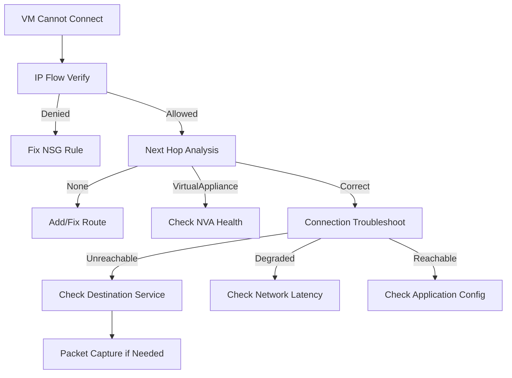

# How to Use Azure Network Watcher to Diagnose VM Connectivity Problems

Author: [nawazdhandala](https://www.github.com/nawazdhandala)

Tags: Azure, Network Watcher, Networking, VM, Troubleshooting, Connectivity, NSG

Description: Use Azure Network Watcher tools to diagnose VM connectivity problems including IP flow verify, next hop analysis, connection troubleshoot, and packet capture.

---

A VM in Azure cannot reach a database in another subnet. Or an application cannot connect to an external API. Or users cannot SSH into a VM even though the NSG rules look correct. Network connectivity problems in Azure are some of the hardest to debug because there are multiple layers - NSGs, route tables, firewalls, DNS - and the problem could be at any one of them.

Azure Network Watcher is a suite of diagnostic tools designed to help you figure out where the traffic is being blocked. This post walks through the most useful tools and when to use each one.

## Enabling Network Watcher

Network Watcher needs to be enabled for the region where your VMs run. It is usually enabled automatically, but verify.

```bash
# Check if Network Watcher is enabled in your region
az network watcher list --output table

# Enable it if not already enabled
az network watcher configure \
  --resource-group NetworkWatcherRG \
  --locations eastus \
  --enabled true
```

## Tool 1: IP Flow Verify

IP Flow Verify is the most commonly used Network Watcher tool. It tests whether a specific packet (source IP, destination IP, port, protocol) would be allowed or denied by the NSG rules applied to a VM's NIC or subnet.

```bash
# Test if a VM can reach a database server on port 5432
az network watcher test-ip-flow \
  --direction Outbound \
  --protocol TCP \
  --local 10.0.1.4:* \
  --remote 10.0.2.10:5432 \
  --vm my-app-vm \
  --resource-group prod-rg
```

The output tells you:

- **Access: Allow** - the traffic is permitted by NSGs
- **Access: Deny** - the traffic is blocked, and it tells you which NSG rule is blocking it

```bash
# Test inbound SSH connectivity to a VM
az network watcher test-ip-flow \
  --direction Inbound \
  --protocol TCP \
  --local 10.0.1.4:22 \
  --remote 203.0.113.50:* \
  --vm my-app-vm \
  --resource-group prod-rg
```

If IP Flow Verify says "Allow" but the connection still fails, the problem is not at the NSG layer. Move on to other tools.

## Tool 2: Next Hop

Next Hop shows you where Azure's routing sends traffic from a specific VM to a specific destination. This is essential for diagnosing issues with User Defined Routes (UDRs) and network virtual appliances.

```bash
# Check the next hop from a VM to an external address
az network watcher show-next-hop \
  --resource-group prod-rg \
  --vm my-app-vm \
  --source-ip 10.0.1.4 \
  --dest-ip 8.8.8.8
```

Possible next hop types:

- **Internet**: Traffic goes directly to the internet
- **VirtualNetwork**: Traffic stays within the VNet
- **VirtualNetworkGateway**: Traffic goes through a VPN or ExpressRoute gateway
- **VNetPeering**: Traffic goes to a peered VNet
- **VirtualAppliance**: Traffic is routed to an NVA (like Azure Firewall)
- **None**: Traffic is dropped (no route exists)

If the next hop is "None," there is no route for the traffic. If it is "VirtualAppliance," verify that the appliance is running, healthy, and forwarding traffic correctly.

```bash
# Check next hop for VM-to-VM connectivity within a VNet
az network watcher show-next-hop \
  --resource-group prod-rg \
  --vm my-app-vm \
  --source-ip 10.0.1.4 \
  --dest-ip 10.0.2.10
```

## Tool 3: Connection Troubleshoot

Connection Troubleshoot is a more comprehensive test than IP Flow Verify. It actually attempts to establish a TCP connection from a source VM to a destination and reports where the connection fails.

```bash
# Troubleshoot connectivity from a VM to an external endpoint
az network watcher test-connectivity \
  --resource-group prod-rg \
  --source-resource my-app-vm \
  --dest-address api.example.com \
  --dest-port 443 \
  --protocol TCP
```

The output includes:

- Connection status (Reachable, Unreachable, or Degraded)
- Latency
- The number of hops
- Details about each hop, including any drops

```bash
# Troubleshoot connectivity between two Azure VMs
az network watcher test-connectivity \
  --resource-group prod-rg \
  --source-resource my-app-vm \
  --dest-resource my-db-vm \
  --dest-port 5432 \
  --protocol TCP
```

This is the single most useful command when debugging "cannot connect" issues. It combines routing analysis, NSG evaluation, and actual connectivity testing.

## Tool 4: NSG Flow Logs

NSG Flow Logs record all traffic flowing through a Network Security Group. They show whether traffic was allowed or denied, and include source/destination IPs, ports, and protocols.

```bash
# Enable NSG flow logs
az network watcher flow-log create \
  --resource-group prod-rg \
  --name my-nsg-flow-log \
  --nsg my-nsg \
  --storage-account mystorageaccount \
  --enabled true \
  --format JSON \
  --log-version 2 \
  --retention 30 \
  --traffic-analytics true \
  --workspace "/subscriptions/<sub-id>/resourceGroups/monitoring-rg/providers/Microsoft.OperationalInsights/workspaces/my-workspace"
```

Flow logs are stored in a storage account. Enable Traffic Analytics to get aggregated insights in Log Analytics.

### Querying Flow Logs

With Traffic Analytics enabled, query the data in Log Analytics:

```kql
// Find denied traffic flows in the last hour
AzureNetworkAnalytics_CL
| where TimeGenerated > ago(1h)
| where FlowStatus_s == "D"  // Denied
| project TimeGenerated, SrcIP_s, DestIP_s, DestPort_d, L7Protocol_s, NSGRule_s
| order by TimeGenerated desc
```

```kql
// Find top talkers by traffic volume
AzureNetworkAnalytics_CL
| where TimeGenerated > ago(1h)
| where FlowStatus_s == "A"  // Allowed
| summarize TotalBytes = sum(InboundBytes_d + OutboundBytes_d) by SrcIP_s, DestIP_s
| top 10 by TotalBytes
```

## Tool 5: Packet Capture

When other tools do not reveal the issue, packet capture gives you raw network traffic for deep analysis.

```bash
# Start a packet capture on a VM
az network watcher packet-capture create \
  --resource-group prod-rg \
  --vm my-app-vm \
  --name capture-debug \
  --storage-account mystorageaccount \
  --time-limit 120 \
  --filters '[{"protocol":"TCP", "remoteIPAddress":"10.0.2.10", "remotePort":"5432"}]'
```

The capture is stored as a .cap file in the storage account. Download it and open it in Wireshark for detailed analysis.

```bash
# List active packet captures
az network watcher packet-capture list \
  --resource-group prod-rg \
  --output table

# Stop a running capture
az network watcher packet-capture stop \
  --resource-group prod-rg \
  --name capture-debug

# Get the capture status and download URL
az network watcher packet-capture show-status \
  --resource-group prod-rg \
  --name capture-debug
```

Packet capture is the heavy artillery of network debugging. Use it when:

- IP Flow Verify says traffic should be allowed but it is not working
- You suspect a TLS/SSL issue
- You need to see the actual packet exchange (SYN, SYN-ACK, etc.)
- You are debugging intermittent connectivity issues

## Tool 6: Effective Security Rules

View the effective NSG rules for a VM's NIC. This consolidates rules from both the NIC-level NSG and the subnet-level NSG, showing the actual rules in priority order.

```bash
# Show effective security rules for a NIC
az network nic list-effective-nsg \
  --resource-group prod-rg \
  --name my-vm-nic \
  --output json
```

This is useful when you have NSGs at both the subnet and NIC level and need to understand how they combine. Rules are evaluated independently - traffic must be allowed by BOTH the subnet NSG and the NIC NSG.

## Tool 7: VPN Troubleshoot

For VPN connectivity issues, Network Watcher can run diagnostics on VPN gateways.

```bash
# Troubleshoot a VPN gateway
az network watcher troubleshooting start \
  --resource-group prod-rg \
  --resource "/subscriptions/<sub-id>/resourceGroups/prod-rg/providers/Microsoft.Network/virtualNetworkGateways/my-vpn-gateway" \
  --storage-account mystorageaccount \
  --storage-path "https://mystorageaccount.blob.core.windows.net/troubleshoot"
```

This runs health checks on the VPN gateway and produces a report with findings and recommendations.

## Debugging Workflow

Here is a systematic approach to diagnosing connectivity problems:



1. Start with **IP Flow Verify** to rule out NSG issues
2. Use **Next Hop** to verify routing is correct
3. Run **Connection Troubleshoot** for an end-to-end test
4. Check **NSG Flow Logs** for historical traffic patterns
5. Use **Packet Capture** as a last resort for deep inspection

Most connectivity issues are resolved at step 1 or 2. NSG rules and routing cover the vast majority of cases. Packet capture is rarely needed but invaluable when the simpler tools do not explain the problem.

## Monitoring Network Health

Set up continuous monitoring with these Network Watcher features:

- **Connection Monitor**: Continuously tests connectivity between sources and destinations, alerting on failures
- **Traffic Analytics**: Provides insights into traffic patterns, security threats, and bandwidth utilization
- **NSG Flow Logs**: Historical record of all network flows for audit and troubleshooting

Azure Network Watcher transforms network debugging from guesswork into a structured process. Learn these tools and you will solve connectivity problems in minutes instead of hours.
