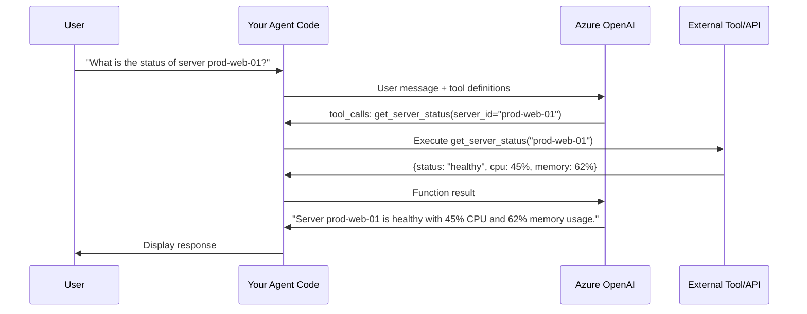

# How to Use Azure OpenAI Function Calling to Build Tool-Using AI Agents

Author: [nawazdhandala](https://www.github.com/nawazdhandala)

Tags: Azure OpenAI, Function Calling, AI Agents, GPT, Tool Use, Python, Conversational AI

Description: Build AI agents that can call external tools and APIs using Azure OpenAI function calling to perform real-world actions beyond text generation.

---

Large language models are great at generating text, but on their own they cannot look up data in a database, check the weather, or create a Jira ticket. Function calling bridges this gap. It lets the model decide when it needs to call an external tool, what arguments to pass, and then incorporate the tool's response into its answer.

Azure OpenAI supports function calling (also called tool use) with GPT-4o and GPT-4o-mini models. You define the available tools as JSON schemas, the model decides whether to call one, and your code executes the actual function and feeds the result back. This creates an agent loop where the model can reason about what it needs and take actions accordingly.

## How Function Calling Works

The flow goes like this:

1. You send a user message to the model along with a list of available functions (tools)
2. The model analyzes the message and decides if it needs to call a function
3. If yes, it responds with a `tool_calls` object specifying which function(s) to call and the arguments
4. Your code executes the function with those arguments
5. You send the function result back to the model
6. The model generates a final response incorporating the function output



## Prerequisites

- An Azure OpenAI resource with a GPT-4o or GPT-4o-mini deployment
- Python 3.9+
- The `openai` Python package (version 1.0+)

## Step 1: Define Your Tools

Tools are defined as JSON schemas that tell the model what functions are available, what they do, and what parameters they accept. Be descriptive - the model uses these descriptions to decide when to call each function.

```python
# tools.py - Tool definitions for the AI agent
# Each tool is described with a JSON schema that the model reads
tools = [
    {
        "type": "function",
        "function": {
            "name": "get_server_status",
            "description": "Get the current status, CPU usage, and memory usage of a specific server. Use this when the user asks about server health or performance.",
            "parameters": {
                "type": "object",
                "properties": {
                    "server_id": {
                        "type": "string",
                        "description": "The server identifier, e.g., 'prod-web-01'"
                    }
                },
                "required": ["server_id"]
            }
        }
    },
    {
        "type": "function",
        "function": {
            "name": "list_active_incidents",
            "description": "List all currently active incidents. Use this when the user asks about ongoing issues or incidents.",
            "parameters": {
                "type": "object",
                "properties": {
                    "severity": {
                        "type": "string",
                        "enum": ["critical", "high", "medium", "low"],
                        "description": "Optional filter by severity level"
                    }
                },
                "required": []
            }
        }
    },
    {
        "type": "function",
        "function": {
            "name": "create_incident",
            "description": "Create a new incident in the incident management system. Use this when the user reports a new issue that needs tracking.",
            "parameters": {
                "type": "object",
                "properties": {
                    "title": {
                        "type": "string",
                        "description": "A brief title for the incident"
                    },
                    "description": {
                        "type": "string",
                        "description": "A detailed description of the incident"
                    },
                    "severity": {
                        "type": "string",
                        "enum": ["critical", "high", "medium", "low"],
                        "description": "The severity level of the incident"
                    },
                    "affected_services": {
                        "type": "array",
                        "items": {"type": "string"},
                        "description": "List of affected service names"
                    }
                },
                "required": ["title", "description", "severity"]
            }
        }
    },
    {
        "type": "function",
        "function": {
            "name": "get_metrics",
            "description": "Retrieve performance metrics for a service over a time period. Use this when the user asks about performance trends or historical data.",
            "parameters": {
                "type": "object",
                "properties": {
                    "service_name": {
                        "type": "string",
                        "description": "The name of the service to get metrics for"
                    },
                    "metric_type": {
                        "type": "string",
                        "enum": ["response_time", "error_rate", "throughput", "availability"],
                        "description": "The type of metric to retrieve"
                    },
                    "time_range": {
                        "type": "string",
                        "enum": ["1h", "6h", "24h", "7d", "30d"],
                        "description": "The time range for the metrics"
                    }
                },
                "required": ["service_name", "metric_type", "time_range"]
            }
        }
    }
]
```

## Step 2: Implement the Tool Functions

These are the actual functions that get executed when the model decides to call a tool. In a real application, these would call your monitoring API, database, or other services.

```python
# tool_implementations.py - Actual implementations of the tools
import json
from datetime import datetime

def get_server_status(server_id: str) -> dict:
    """Query the monitoring system for server status."""
    # In production, this would call your monitoring API
    # Here we simulate a response
    mock_data = {
        "prod-web-01": {"status": "healthy", "cpu": 45, "memory": 62, "uptime": "15d 3h"},
        "prod-web-02": {"status": "healthy", "cpu": 38, "memory": 55, "uptime": "15d 3h"},
        "prod-db-01": {"status": "degraded", "cpu": 89, "memory": 78, "uptime": "7d 12h"},
    }
    return mock_data.get(server_id, {"status": "unknown", "error": "Server not found"})

def list_active_incidents(severity: str = None) -> list:
    """Fetch active incidents from the incident management system."""
    incidents = [
        {"id": "INC-1234", "title": "High CPU on prod-db-01", "severity": "high",
         "created": "2026-02-16T08:30:00Z", "status": "investigating"},
        {"id": "INC-1235", "title": "Elevated error rates on payment API", "severity": "critical",
         "created": "2026-02-16T09:15:00Z", "status": "identified"},
    ]
    # Filter by severity if specified
    if severity:
        incidents = [i for i in incidents if i["severity"] == severity]
    return incidents

def create_incident(title: str, description: str, severity: str,
                    affected_services: list = None) -> dict:
    """Create a new incident record."""
    incident_id = f"INC-{datetime.now().strftime('%H%M%S')}"
    return {
        "id": incident_id,
        "title": title,
        "description": description,
        "severity": severity,
        "affected_services": affected_services or [],
        "status": "open",
        "created": datetime.now().isoformat()
    }

def get_metrics(service_name: str, metric_type: str, time_range: str) -> dict:
    """Retrieve performance metrics for a service."""
    return {
        "service": service_name,
        "metric": metric_type,
        "time_range": time_range,
        "data_points": [
            {"timestamp": "2026-02-16T06:00:00Z", "value": 120},
            {"timestamp": "2026-02-16T07:00:00Z", "value": 135},
            {"timestamp": "2026-02-16T08:00:00Z", "value": 250},
            {"timestamp": "2026-02-16T09:00:00Z", "value": 180},
        ],
        "average": 171.25,
        "p95": 245,
        "p99": 250
    }

# Map function names to their implementations
TOOL_MAP = {
    "get_server_status": get_server_status,
    "list_active_incidents": list_active_incidents,
    "create_incident": create_incident,
    "get_metrics": get_metrics,
}
```

## Step 3: Build the Agent Loop

The agent loop is the core of your tool-using AI. It sends messages to the model, checks for tool calls, executes them, and feeds results back until the model produces a final text response.

```python
# agent.py - The main agent loop that orchestrates tool use
import json
from openai import AzureOpenAI
from tools import tools
from tool_implementations import TOOL_MAP

class MonitoringAgent:
    """An AI agent that can use tools to answer monitoring questions."""

    def __init__(self):
        # Initialize the Azure OpenAI client
        self.client = AzureOpenAI(
            azure_endpoint="https://your-resource.openai.azure.com/",
            api_key="your-api-key",
            api_version="2024-06-01"
        )
        self.deployment = "gpt-4o"
        self.tools = tools

        # System prompt that defines the agent's behavior
        self.system_message = {
            "role": "system",
            "content": (
                "You are an infrastructure monitoring assistant. You help users "
                "check server status, review incidents, analyze metrics, and "
                "create new incidents. Use the available tools to get real data "
                "rather than making assumptions. Be concise and actionable in "
                "your responses."
            )
        }

    def run(self, user_message: str, conversation_history: list = None) -> str:
        """
        Process a user message, executing any needed tool calls.
        Returns the final text response from the model.
        """
        # Build the messages list
        messages = [self.system_message]
        if conversation_history:
            messages.extend(conversation_history)
        messages.append({"role": "user", "content": user_message})

        # Agent loop - keep going until we get a text response
        max_iterations = 5  # Safety limit to prevent infinite loops
        for _ in range(max_iterations):
            # Call Azure OpenAI with tools
            response = self.client.chat.completions.create(
                model=self.deployment,
                messages=messages,
                tools=self.tools,
                tool_choice="auto"  # Let the model decide when to use tools
            )

            assistant_message = response.choices[0].message

            # If the model wants to call tools, execute them
            if assistant_message.tool_calls:
                # Add the assistant message (with tool calls) to history
                messages.append(assistant_message)

                # Execute each requested tool call
                for tool_call in assistant_message.tool_calls:
                    function_name = tool_call.function.name
                    arguments = json.loads(tool_call.function.arguments)

                    print(f"Calling tool: {function_name}({arguments})")

                    # Look up and execute the function
                    if function_name in TOOL_MAP:
                        result = TOOL_MAP[function_name](**arguments)
                    else:
                        result = {"error": f"Unknown function: {function_name}"}

                    # Add the tool result to the messages
                    messages.append({
                        "role": "tool",
                        "tool_call_id": tool_call.id,
                        "content": json.dumps(result)
                    })

            else:
                # No tool calls - the model produced a final text response
                return assistant_message.content

        return "I was unable to complete the request within the allowed number of steps."
```

## Step 4: Run the Agent

Here is how to use the agent in practice:

```python
# main.py - Run the monitoring agent interactively
from agent import MonitoringAgent

agent = MonitoringAgent()

# Example interactions
print("Agent:", agent.run("What is the status of prod-db-01?"))
print()
print("Agent:", agent.run("Are there any critical incidents right now?"))
print()
print("Agent:", agent.run(
    "The payment service is returning 500 errors. "
    "Create a critical incident for this."
))
print()
print("Agent:", agent.run(
    "Show me the response time metrics for the payment API over the last 24 hours"
))
```

## Handling Parallel Tool Calls

GPT-4o can request multiple tool calls in a single response. For example, if a user asks "What is the status of prod-web-01 and prod-web-02?", the model might call `get_server_status` twice in parallel. Your agent loop already handles this because it iterates over all tool calls in the response.

For actual parallel execution, you can use `asyncio.gather`:

```python
# Parallel tool execution for better performance
import asyncio

async def execute_tools_parallel(tool_calls):
    """Execute multiple tool calls concurrently."""
    tasks = []
    for tool_call in tool_calls:
        fn_name = tool_call.function.name
        args = json.loads(tool_call.function.arguments)
        # Wrap synchronous functions in the event loop executor
        task = asyncio.get_event_loop().run_in_executor(
            None, lambda n=fn_name, a=args: TOOL_MAP[n](**a)
        )
        tasks.append((tool_call.id, task))

    # Wait for all tools to finish
    results = []
    for tool_call_id, task in tasks:
        result = await task
        results.append({
            "role": "tool",
            "tool_call_id": tool_call_id,
            "content": json.dumps(result)
        })
    return results
```

## Best Practices for Tool Definitions

Writing good tool definitions makes a significant difference in how reliably the model calls your functions:

1. **Be specific in descriptions**: Instead of "Get data," write "Get the current CPU usage, memory usage, and status of a specific server by its server ID."

2. **Use enums for constrained parameters**: If a parameter only accepts certain values, list them in an `enum` array. This prevents the model from inventing invalid values.

3. **Mark required parameters correctly**: Only mark parameters as required if the function truly cannot run without them.

4. **Include examples in descriptions**: For parameters with specific formats, include an example like "The server ID, e.g., 'prod-web-01'."

5. **Keep the tool count reasonable**: Models work best with 10-20 tools. If you have more, consider grouping related operations into a single tool with a subcommand parameter.

## Error Handling

Always handle errors gracefully in your tool implementations. If a tool fails, return a structured error message rather than letting the exception propagate:

```python
# Wrap tool execution in error handling
def safe_execute_tool(function_name: str, arguments: dict) -> str:
    """Execute a tool with error handling."""
    try:
        if function_name not in TOOL_MAP:
            return json.dumps({"error": f"Unknown function: {function_name}"})
        result = TOOL_MAP[function_name](**arguments)
        return json.dumps(result)
    except TypeError as e:
        # Invalid arguments passed to the function
        return json.dumps({"error": f"Invalid arguments: {str(e)}"})
    except Exception as e:
        # Unexpected error during execution
        return json.dumps({"error": f"Tool execution failed: {str(e)}"})
```

## Summary

Function calling transforms Azure OpenAI models from text generators into capable agents that can interact with real systems. The pattern is simple but powerful: define tools with clear schemas, let the model decide when to use them, execute the actual functions in your code, and feed results back. This approach is the foundation for building AI assistants that can monitor infrastructure, manage incidents, query databases, and perform any action you can wrap in a function.
