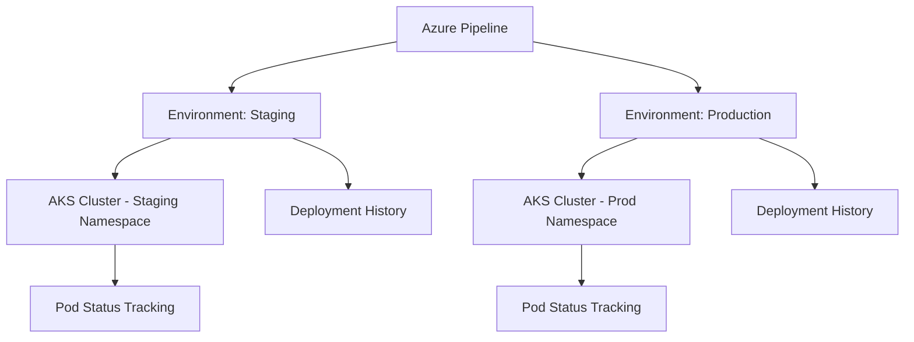

# How to Use Azure Pipelines Environments with Kubernetes Resources for Deployment Tracking

Author: [nawazdhandala](https://www.github.com/nawazdhandala)

Tags: Azure Pipelines, Kubernetes, Environments, Deployment Tracking, DevOps, CI/CD, AKS

Description: Configure Azure Pipelines environments with Kubernetes resources to track deployments, enforce approvals, and gain visibility into what is running in each cluster.

---

When you deploy to Kubernetes from Azure Pipelines, you can just run `kubectl apply` in a script task and call it a day. But that approach gives you zero visibility into what is deployed where, no approval gates, and no deployment history in Azure DevOps. Azure Pipelines environments solve this by giving you a first-class deployment target that tracks which builds are deployed to which clusters, namespaces, and pods.

This guide covers setting up environments with Kubernetes resources, configuring approval gates, and using the deployment tracking features that come with it.

## What Are Azure Pipelines Environments?

An environment in Azure Pipelines represents a deployment target - a place where your application runs. It could be a VM, a Kubernetes cluster, or a conceptual stage like "staging" or "production."

When you add a Kubernetes resource to an environment, Azure Pipelines connects to your cluster and can:

- Track which commits are currently deployed
- Show pod status and health directly in the Azure DevOps UI
- Enforce approval checks before deployments proceed
- Provide a deployment history showing who deployed what and when



## Step 1: Create an Environment

You can create environments through the Azure DevOps UI or directly in your YAML pipeline.

In the Azure DevOps UI, go to Pipelines, then Environments, and click "New environment." Give it a name like "staging" or "production" and select "Kubernetes" as the resource type.

Alternatively, referencing an environment in YAML creates it automatically:

```yaml
# Simply referencing an environment in YAML creates it if it does not exist
stages:
  - stage: DeployStaging
    jobs:
      - deployment: DeployApp
        environment: 'staging'
        strategy:
          runOnce:
            deploy:
              steps:
                - script: echo "Deploying to staging"
```

## Step 2: Add a Kubernetes Resource

To connect a Kubernetes cluster to your environment, you need to provide cluster credentials. There are two approaches.

### Option A: Using an AKS Cluster

If you are using Azure Kubernetes Service, the integration is straightforward. Go to the environment in Azure DevOps, click "Add resource," select "Kubernetes," then choose your Azure subscription and AKS cluster.

Azure DevOps will create a service account in the specified namespace and set up the necessary RBAC permissions automatically.

### Option B: Using Any Kubernetes Cluster

For non-AKS clusters, you can provide a kubeconfig or use a service account. Go to the environment, click "Add resource," select "Kubernetes," then choose "Generic provider."

You will need to provide:

- The cluster API server URL
- A kubeconfig file or service account token
- The namespace to target

Here is how to create a service account for Azure DevOps on your cluster:

```yaml
# k8s-azdo-service-account.yaml
# Service account and RBAC for Azure DevOps pipeline deployments
apiVersion: v1
kind: ServiceAccount
metadata:
  name: azure-devops-deploy
  namespace: staging
---
apiVersion: rbac.authorization.k8s.io/v1
kind: RoleBinding
metadata:
  name: azure-devops-deploy-binding
  namespace: staging
roleRef:
  apiGroup: rbac.authorization.k8s.io
  kind: ClusterRole
  name: edit
subjects:
  - kind: ServiceAccount
    name: azure-devops-deploy
    namespace: staging
```

Apply this to your cluster and use the service account token in Azure DevOps.

## Step 3: Configure Your Deployment Pipeline

Here is a complete multi-stage pipeline that deploys to both staging and production environments with Kubernetes resources:

```yaml
# azure-pipelines.yml - Multi-stage deployment with environment tracking
trigger:
  branches:
    include:
      - main

variables:
  imageRepository: 'myapp'
  containerRegistry: 'myacr.azurecr.io'
  tag: '$(Build.BuildId)'

stages:
  # Build stage - creates the container image
  - stage: Build
    jobs:
      - job: BuildAndPush
        pool:
          vmImage: 'ubuntu-latest'
        steps:
          - task: Docker@2
            inputs:
              containerRegistry: 'acr-service-connection'
              repository: '$(imageRepository)'
              command: 'buildAndPush'
              Dockerfile: '**/Dockerfile'
              tags: '$(tag)'
            displayName: 'Build and push container image'

  # Deploy to staging
  - stage: DeployStaging
    dependsOn: Build
    jobs:
      - deployment: DeployToStaging
        pool:
          vmImage: 'ubuntu-latest'
        # The environment name with the Kubernetes resource
        environment: 'staging.default'
        strategy:
          runOnce:
            deploy:
              steps:
                # Replace the image tag in the manifest
                - task: KubernetesManifest@1
                  inputs:
                    action: 'deploy'
                    namespace: 'default'
                    manifests: '$(Pipeline.Workspace)/manifests/*.yaml'
                    containers: '$(containerRegistry)/$(imageRepository):$(tag)'
                  displayName: 'Deploy to staging'

  # Deploy to production with approval gate
  - stage: DeployProduction
    dependsOn: DeployStaging
    jobs:
      - deployment: DeployToProduction
        pool:
          vmImage: 'ubuntu-latest'
        environment: 'production.default'
        strategy:
          runOnce:
            deploy:
              steps:
                - task: KubernetesManifest@1
                  inputs:
                    action: 'deploy'
                    namespace: 'default'
                    manifests: '$(Pipeline.Workspace)/manifests/*.yaml'
                    containers: '$(containerRegistry)/$(imageRepository):$(tag)'
                  displayName: 'Deploy to production'
```

Notice the environment format: `staging.default` means the "staging" environment, targeting the "default" namespace. The part after the dot is the Kubernetes namespace.

## Step 4: Configure Approval Gates

This is where environments really earn their keep. You can require manual approvals before a deployment proceeds to a specific environment.

Go to Environments, select your production environment, click the three dots menu, and select "Approvals and checks."

Add an approval check:

- **Approvers**: Select the users or groups who must approve
- **Timeout**: How long to wait before the approval request expires (default 72 hours)
- **Instructions**: Add context for approvers, like "Review staging deployment before approving production"
- **Minimum approvers**: How many people need to approve (at least 1)

You can also add other checks:

- **Business hours**: Only allow deployments during specific hours
- **Branch control**: Only allow deployments from specific branches
- **Required template**: Ensure the pipeline uses an approved template
- **Invoke Azure function**: Run custom validation logic

## Step 5: Use Deployment Strategies

The `deployment` job type supports several strategies beyond `runOnce`:

### Canary Deployment

```yaml
# Canary deployment strategy - gradually roll out to a percentage of pods
- deployment: CanaryDeploy
  environment: 'production.default'
  strategy:
    canary:
      increments: [25, 50]
      deploy:
        steps:
          - task: KubernetesManifest@1
            inputs:
              action: 'deploy'
              namespace: 'default'
              strategy: 'canary'
              percentage: '$(strategy.increment)'
              manifests: '$(Pipeline.Workspace)/manifests/*.yaml'
              containers: '$(containerRegistry)/$(imageRepository):$(tag)'
      on:
        success:
          steps:
            - script: echo "Canary at $(strategy.increment)% succeeded"
        failure:
          steps:
            - task: KubernetesManifest@1
              inputs:
                action: 'reject'
                namespace: 'default'
                strategy: 'canary'
                manifests: '$(Pipeline.Workspace)/manifests/*.yaml'
```

### Rolling Deployment

```yaml
# Rolling update strategy - update pods in batches
- deployment: RollingDeploy
  environment: 'production.default'
  strategy:
    rolling:
      maxParallel: 2
      deploy:
        steps:
          - task: KubernetesManifest@1
            inputs:
              action: 'deploy'
              namespace: 'default'
              manifests: '$(Pipeline.Workspace)/manifests/*.yaml'
              containers: '$(containerRegistry)/$(imageRepository):$(tag)'
```

## Viewing Deployment Tracking

Once your pipeline has run, go to the environment in Azure DevOps. You will see:

1. **Deployment history**: A list of every deployment to this environment, including the pipeline run, the commit, and who triggered it.
2. **Resource view**: If you added a Kubernetes resource, you can see the pods, their status, and which image they are running.
3. **Commits**: Which commits are included in each deployment.

This visibility is invaluable for incident response. When something breaks in production, you can quickly check what was last deployed and by whom.

## Kubernetes Manifests for Tracking

To get the most out of deployment tracking, use the `KubernetesManifest` task instead of raw `kubectl` commands. This task understands Kubernetes resources and can annotate them with pipeline metadata:

```yaml
# The KubernetesManifest task adds tracking annotations automatically
- task: KubernetesManifest@1
  inputs:
    action: 'deploy'
    namespace: 'default'
    manifests: |
      $(Pipeline.Workspace)/manifests/deployment.yaml
      $(Pipeline.Workspace)/manifests/service.yaml
    containers: '$(containerRegistry)/$(imageRepository):$(tag)'
    imagePullSecrets: 'acr-secret'
  displayName: 'Deploy application manifests'
```

The task automatically adds annotations to your Kubernetes resources with the pipeline run ID, commit SHA, and other metadata that Azure DevOps uses for the deployment tracking dashboard.

## Best Practices

1. **One environment per deployment target.** Do not reuse the same environment for staging and production. Create separate environments even if they point to the same cluster but different namespaces.

2. **Use approvals on production environments.** Always require at least one approval for production deployments. Staging can be automatic.

3. **Limit who can manage environments.** In Environment settings, restrict the "Administrator" and "User" roles. Not everyone needs the ability to modify approval checks.

4. **Review deployment history during incidents.** The environment view gives you a timeline of deployments that is much easier to parse than searching through pipeline run logs.

## Wrapping Up

Azure Pipelines environments with Kubernetes resources give you structured deployment tracking that goes well beyond running kubectl in a script. The combination of deployment history, approval gates, pod status visibility, and deployment strategies makes your pipeline more observable and controlled. The setup takes a bit more effort than a simple script task, but the payoff in operational visibility is substantial, especially when you are troubleshooting issues in production at 2 AM.
