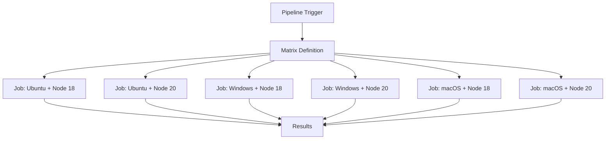

# How to Use Azure Pipelines Matrix Strategy to Test Across Multiple OS and Language Versions

Author: [nawazdhandala](https://www.github.com/nawazdhandala)

Tags: Azure Pipelines, Matrix Strategy, Cross-Platform Testing, CI/CD, DevOps, Test Automation

Description: Configure Azure Pipelines matrix strategy to automatically run your tests across multiple operating systems, language versions, and configuration combinations.

---

If your library or application needs to work on multiple platforms, you face a testing challenge. Testing against one OS and one language version is not enough. A bug might only show up on Windows, or only with Node.js 18, or only with a specific combination of OS and runtime. Running separate pipeline definitions for each combination would be tedious and error-prone.

Azure Pipelines matrix strategy solves this by letting you define a set of variable combinations and automatically creating a job for each one. You write your pipeline once, define the matrix, and Azure Pipelines fans out the execution across all combinations in parallel.

## How Matrix Strategy Works

A matrix strategy defines a set of variables and their possible values. Azure Pipelines creates one job instance for each unique combination of values. Each job runs independently, potentially in parallel, with its matrix variables available for use in steps.



## Basic Matrix Configuration

Here is a simple matrix that tests a Node.js library across multiple OS and Node versions:

```yaml
# Test a Node.js library across platforms and versions
trigger:
  - main

jobs:
  - job: Test
    strategy:
      matrix:
        linux_node18:
          vmImage: 'ubuntu-latest'
          nodeVersion: '18'
        linux_node20:
          vmImage: 'ubuntu-latest'
          nodeVersion: '20'
        windows_node18:
          vmImage: 'windows-latest'
          nodeVersion: '18'
        windows_node20:
          vmImage: 'windows-latest'
          nodeVersion: '20'
        macos_node18:
          vmImage: 'macOS-latest'
          nodeVersion: '18'
        macos_node20:
          vmImage: 'macOS-latest'
          nodeVersion: '20'
      maxParallel: 6  # Run all combinations simultaneously

    pool:
      vmImage: $(vmImage)  # Use the matrix variable

    steps:
      - task: NodeTool@0
        inputs:
          versionSpec: '$(nodeVersion)'
        displayName: 'Install Node.js $(nodeVersion)'

      - script: npm ci
        displayName: 'Install dependencies'

      - script: npm test
        displayName: 'Run tests'

      - script: npm run lint
        displayName: 'Run linter'
```

Each entry in the matrix defines a named configuration with one or more variables. The job runs once for each entry, with the variables set to the specified values.

## Matrix for .NET Projects

Here is a matrix configuration for testing a .NET library across multiple target frameworks and operating systems:

```yaml
# Test a .NET library across frameworks and platforms
trigger:
  - main

jobs:
  - job: Test
    strategy:
      matrix:
        linux_net6:
          vmImage: 'ubuntu-latest'
          framework: 'net6.0'
        linux_net8:
          vmImage: 'ubuntu-latest'
          framework: 'net8.0'
        windows_net6:
          vmImage: 'windows-latest'
          framework: 'net6.0'
        windows_net8:
          vmImage: 'windows-latest'
          framework: 'net8.0'
      maxParallel: 4

    pool:
      vmImage: $(vmImage)

    steps:
      - task: UseDotNet@2
        inputs:
          packageType: 'sdk'
          version: '$(framework)' == 'net8.0' && '8.x' || '6.x'
        displayName: 'Install .NET SDK'

      - task: DotNetCoreCLI@2
        inputs:
          command: 'test'
          projects: 'tests/**/*.csproj'
          arguments: '--framework $(framework) --configuration Release'
        displayName: 'Run tests on $(framework)'
```

## Matrix for Python Projects

Python projects often need to test across multiple Python versions:

```yaml
# Test a Python package across versions
trigger:
  - main

jobs:
  - job: Test
    strategy:
      matrix:
        python39:
          pythonVersion: '3.9'
          vmImage: 'ubuntu-latest'
        python310:
          pythonVersion: '3.10'
          vmImage: 'ubuntu-latest'
        python311:
          pythonVersion: '3.11'
          vmImage: 'ubuntu-latest'
        python312:
          pythonVersion: '3.12'
          vmImage: 'ubuntu-latest'
        python311_windows:
          pythonVersion: '3.11'
          vmImage: 'windows-latest'
      maxParallel: 5

    pool:
      vmImage: $(vmImage)

    steps:
      - task: UsePythonVersion@0
        inputs:
          versionSpec: '$(pythonVersion)'
        displayName: 'Use Python $(pythonVersion)'

      - script: |
          python -m pip install --upgrade pip
          pip install -r requirements-dev.txt
        displayName: 'Install dependencies'

      - script: pytest tests/ --junitxml=test-results.xml -v
        displayName: 'Run tests'

      - task: PublishTestResults@2
        inputs:
          testResultsFiles: 'test-results.xml'
          testRunTitle: 'Python $(pythonVersion) on $(vmImage)'
        condition: always()
        displayName: 'Publish test results'
```

## Using maxParallel to Control Concurrency

The `maxParallel` setting controls how many matrix jobs run simultaneously. This is useful when:

- You have a limited number of parallel jobs in your Azure DevOps organization
- Your tests hit a shared resource (like a test database) that cannot handle too many connections
- You want to prioritize certain pipelines over matrix fan-outs

```yaml
strategy:
  matrix:
    # 8 combinations defined here
    combo1: { os: 'ubuntu-latest', version: '18' }
    combo2: { os: 'ubuntu-latest', version: '20' }
    combo3: { os: 'ubuntu-latest', version: '22' }
    combo4: { os: 'windows-latest', version: '18' }
    combo5: { os: 'windows-latest', version: '20' }
    combo6: { os: 'windows-latest', version: '22' }
    combo7: { os: 'macOS-latest', version: '20' }
    combo8: { os: 'macOS-latest', version: '22' }
  maxParallel: 4  # Only 4 will run at a time
```

Setting `maxParallel` to 1 effectively serializes the matrix, running one combination after another. This is rarely what you want but can be useful for debugging.

## Dynamic Matrix with Runtime Expressions

For more complex scenarios, you can build the matrix dynamically using runtime expressions or script outputs:

```yaml
# Generate matrix dynamically based on a parameter
parameters:
  - name: environments
    type: object
    default:
      - name: 'dev'
        subscription: 'Dev-ServiceConnection'
        resourceGroup: 'rg-dev'
      - name: 'staging'
        subscription: 'Staging-ServiceConnection'
        resourceGroup: 'rg-staging'

jobs:
  - ${{ each env in parameters.environments }}:
    - job: Deploy_${{ env.name }}
      displayName: 'Deploy to ${{ env.name }}'
      pool:
        vmImage: 'ubuntu-latest'
      steps:
        - task: AzureCLI@2
          inputs:
            azureSubscription: '${{ env.subscription }}'
            scriptType: 'bash'
            scriptLocation: 'inlineScript'
            inlineScript: |
              echo "Deploying to ${{ env.name }}"
              echo "Resource group: ${{ env.resourceGroup }}"
```

## Matrix with Include and Exclude

Sometimes you want most combinations but need to skip a few or add some with extra variables. While Azure Pipelines does not have built-in include/exclude syntax like GitHub Actions, you can achieve similar results:

### Skip Specific Combinations

Use conditions on steps to skip certain work for specific matrix entries:

```yaml
strategy:
  matrix:
    linux_node18:
      vmImage: 'ubuntu-latest'
      nodeVersion: '18'
      runE2E: 'true'
    linux_node20:
      vmImage: 'ubuntu-latest'
      nodeVersion: '20'
      runE2E: 'true'
    windows_node20:
      vmImage: 'windows-latest'
      nodeVersion: '20'
      runE2E: 'false'  # Skip E2E tests on Windows

steps:
  - script: npm test
    displayName: 'Run unit tests'

  # Only run E2E tests when the matrix variable says so
  - script: npm run test:e2e
    displayName: 'Run E2E tests'
    condition: eq(variables['runE2E'], 'true')
```

## Combining Matrix with Multi-Stage Pipelines

You can use matrix strategy in specific stages of a multi-stage pipeline:

```yaml
# Build once, test on multiple platforms
stages:
  - stage: Build
    jobs:
      - job: BuildApp
        pool:
          vmImage: 'ubuntu-latest'
        steps:
          - script: npm ci && npm run build
            displayName: 'Build'

          - task: PublishPipelineArtifact@1
            inputs:
              targetPath: 'dist'
              artifactName: 'app'

  - stage: Test
    dependsOn: Build
    jobs:
      - job: CrossPlatformTest
        strategy:
          matrix:
            linux:
              vmImage: 'ubuntu-latest'
            windows:
              vmImage: 'windows-latest'
            macos:
              vmImage: 'macOS-latest'
          maxParallel: 3
        pool:
          vmImage: $(vmImage)
        steps:
          - task: DownloadPipelineArtifact@2
            inputs:
              artifactName: 'app'
              targetPath: 'dist'

          - script: npm ci && npm test
            displayName: 'Run tests on $(vmImage)'
```

## Viewing Matrix Results

When a matrix job completes, Azure DevOps shows each combination as a separate entry in the pipeline run summary. You can see at a glance which combinations passed and which failed.

If a single combination fails, the overall job is marked as failed, but the other combinations continue running (unless you set `continueOnError: false` at the job level).

## Best Practices

1. **Start with the combinations that matter most.** You do not need to test every possible combination. Focus on the OS and language versions that your users actually run.

2. **Use maxParallel wisely.** If you have 20 parallel job slots and your matrix creates 12 combinations, setting maxParallel to 12 uses most of your capacity for one pipeline. Consider leaving headroom for other pipelines.

3. **Fail fast with the most common combination.** Put your most common platform first in the matrix. If there is a basic test failure, you will see it quickly without waiting for all combinations to run.

4. **Publish test results for each combination.** Use the `PublishTestResults` task with a unique `testRunTitle` that includes the matrix variables. This makes it easy to identify which combination caused a failure.

5. **Cache dependencies per combination.** Include the matrix variables in your cache key so that each OS/version combination has its own cache.

## Wrapping Up

Matrix strategy is one of the most useful features in Azure Pipelines for libraries and tools that need cross-platform testing. You define the combinations once in your YAML, and Azure Pipelines handles the parallelization automatically. The time investment in setting up a matrix is minimal compared to the confidence you get from knowing your code works across all supported platforms and language versions. Start with 2-3 combinations and expand as you identify the platforms that matter for your users.
