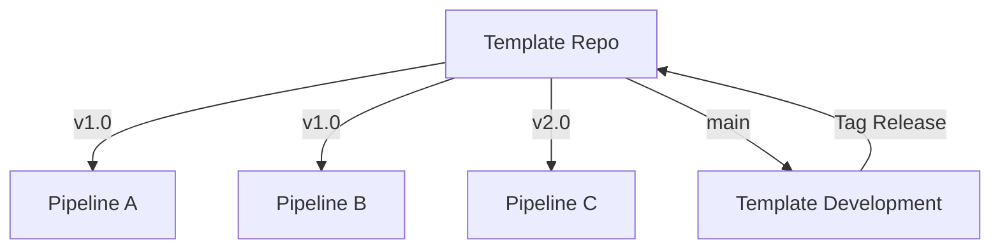

# How to Use Azure Pipelines Templates to Share Reusable Pipeline Logic Across Projects

Author: [nawazdhandala](https://www.github.com/nawazdhandala)

Tags: Azure Pipelines, YAML Templates, CI/CD, DevOps, Pipeline Reuse, Azure DevOps, Infrastructure as Code

Description: Learn how to create and consume Azure Pipelines YAML templates to avoid duplicating pipeline logic across multiple repositories.

---

Once you have more than a handful of pipelines in Azure DevOps, you start seeing the same patterns repeated everywhere. Every .NET project has the same restore-build-test-publish steps. Every Docker build has the same login-build-push sequence. Every Terraform deployment runs init-plan-apply with minor variations.

Copy-pasting pipeline YAML between projects is the natural first response, but it creates a maintenance nightmare. When you need to update a shared step - say, upgrading the Docker task version or changing a test configuration - you have to find and update every copy.

Azure Pipelines templates solve this problem by letting you define reusable pipeline logic in one place and reference it from any pipeline. In this post, I will show you how to create templates at every level, share them across repositories, and avoid the common pitfalls.

## Template Types

Azure Pipelines supports four types of templates, each operating at a different level of the pipeline hierarchy:

- **Stage templates**: Define one or more complete stages
- **Job templates**: Define one or more jobs within a stage
- **Step templates**: Define one or more steps within a job
- **Variable templates**: Define a set of variables

Step templates are the most common starting point because they are the most granular and flexible.

## Creating a Step Template

Let us start with something practical. Suppose every .NET project in your organization needs to run the same build and test steps. Here is a step template that encapsulates that logic.

This template file accepts parameters for the project path and build configuration, then runs restore, build, and test.

```yaml
# templates/steps/dotnet-build.yml
# Reusable step template for building and testing .NET projects
parameters:
  - name: projectPath
    type: string
    default: '**/*.csproj'
  - name: configuration
    type: string
    default: 'Release'
  - name: runTests
    type: boolean
    default: true

steps:
  # Restore NuGet packages
  - task: DotNetCoreCLI@2
    displayName: 'Restore packages'
    inputs:
      command: 'restore'
      projects: '${{ parameters.projectPath }}'

  # Build the solution
  - task: DotNetCoreCLI@2
    displayName: 'Build (${{ parameters.configuration }})'
    inputs:
      command: 'build'
      projects: '${{ parameters.projectPath }}'
      arguments: '--configuration ${{ parameters.configuration }} --no-restore'

  # Run tests conditionally
  - ${{ if eq(parameters.runTests, true) }}:
    - task: DotNetCoreCLI@2
      displayName: 'Run tests'
      inputs:
        command: 'test'
        projects: '**/*Tests.csproj'
        arguments: '--configuration ${{ parameters.configuration }} --no-build'
```

Now any pipeline can use this template with a single line.

```yaml
# azure-pipelines.yml - Using the step template
trigger:
  - main

pool:
  vmImage: 'ubuntu-latest'

steps:
  # Reference the template and pass parameters
  - template: templates/steps/dotnet-build.yml
    parameters:
      projectPath: 'src/MyApp/MyApp.csproj'
      configuration: 'Release'
      runTests: true
```

## Creating a Job Template

Job templates are useful when you need to define an entire job with its own pool, variables, and steps.

The following template defines a Docker build-and-push job with configurable parameters.

```yaml
# templates/jobs/docker-build-push.yml
# Reusable job template for building and pushing Docker images
parameters:
  - name: imageName
    type: string
  - name: dockerfilePath
    type: string
    default: 'Dockerfile'
  - name: registry
    type: string
    default: 'myregistry.azurecr.io'
  - name: tag
    type: string
    default: '$(Build.BuildId)'

jobs:
  - job: DockerBuildPush
    displayName: 'Build and Push Docker Image'
    pool:
      vmImage: 'ubuntu-latest'
    steps:
      # Log in to Azure Container Registry
      - task: Docker@2
        displayName: 'Login to ACR'
        inputs:
          command: 'login'
          containerRegistry: '${{ parameters.registry }}'

      # Build the Docker image
      - task: Docker@2
        displayName: 'Build image'
        inputs:
          command: 'build'
          dockerfile: '${{ parameters.dockerfilePath }}'
          repository: '${{ parameters.imageName }}'
          tags: '${{ parameters.tag }}'

      # Push the image to the registry
      - task: Docker@2
        displayName: 'Push image'
        inputs:
          command: 'push'
          repository: '${{ parameters.imageName }}'
          tags: '${{ parameters.tag }}'
```

## Creating a Stage Template

Stage templates wrap entire stages, which is perfect for standardizing deployment patterns across projects.

```yaml
# templates/stages/deploy-webapp.yml
# Reusable stage template for deploying to Azure Web Apps
parameters:
  - name: environment
    type: string
  - name: appName
    type: string
  - name: serviceConnection
    type: string
  - name: dependsOn
    type: string
    default: 'Build'

stages:
  - stage: Deploy_${{ parameters.environment }}
    displayName: 'Deploy to ${{ parameters.environment }}'
    dependsOn: ${{ parameters.dependsOn }}
    jobs:
      - deployment: Deploy
        environment: '${{ parameters.environment }}'
        strategy:
          runOnce:
            deploy:
              steps:
                # Deploy the web app
                - task: AzureWebApp@1
                  displayName: 'Deploy to ${{ parameters.appName }}'
                  inputs:
                    azureSubscription: '${{ parameters.serviceConnection }}'
                    appName: '${{ parameters.appName }}'
                    package: '$(Pipeline.Workspace)/drop/**/*.zip'
```

Now a pipeline can deploy to multiple environments by referencing the same template with different parameters.

```yaml
# azure-pipelines.yml - Multi-environment deployment using stage templates
stages:
  - stage: Build
    jobs:
      - job: BuildJob
        steps:
          - template: templates/steps/dotnet-build.yml

  # Deploy to staging using the template
  - template: templates/stages/deploy-webapp.yml
    parameters:
      environment: 'staging'
      appName: 'myapp-staging'
      serviceConnection: 'azure-staging'

  # Deploy to production using the same template
  - template: templates/stages/deploy-webapp.yml
    parameters:
      environment: 'production'
      appName: 'myapp-production'
      serviceConnection: 'azure-production'
      dependsOn: 'Deploy_staging'
```

## Sharing Templates Across Repositories

Templates within the same repository are referenced by relative path. But the real power comes when you share templates across repositories. Azure DevOps supports this through repository resources.

First, create a dedicated repository for your templates (I usually call it `pipeline-templates`). Then reference it from other pipelines.

```yaml
# azure-pipelines.yml - Referencing templates from another repository
resources:
  repositories:
    # Declare the external template repository
    - repository: templates
      type: git
      name: MyProject/pipeline-templates
      ref: refs/tags/v1.0  # Pin to a specific version

trigger:
  - main

stages:
  - stage: Build
    jobs:
      - job: BuildJob
        steps:
          # Reference template from the external repository
          - template: steps/dotnet-build.yml@templates
            parameters:
              projectPath: 'src/**/*.csproj'
```

The `@templates` suffix tells Azure Pipelines to look in the repository resource named `templates` rather than the current repository.

## Versioning Your Templates

Pinning to a specific branch or tag is critical. If you reference `ref: refs/heads/main`, every pipeline using your templates picks up changes immediately. That sounds convenient until someone makes a breaking change to a template and breaks fifty pipelines at once.

I recommend this versioning strategy:

1. Use semantic versioning tags on your templates repository (v1.0, v1.1, v2.0)
2. Pin consuming pipelines to a major version tag
3. Make non-breaking changes in minor versions
4. When you need a breaking change, create a new major version



## Template Expressions and Conditional Logic

Templates support expressions that let you make them truly flexible. You can use conditionals, iterations, and variable manipulation.

This example shows a template that generates steps dynamically based on a list of projects.

```yaml
# templates/steps/multi-project-build.yml
# Template that iterates over a list of projects
parameters:
  - name: projects
    type: object
    default: []

steps:
  # Loop through each project and build it
  - ${{ each project in parameters.projects }}:
    - task: DotNetCoreCLI@2
      displayName: 'Build ${{ project.name }}'
      inputs:
        command: 'build'
        projects: '${{ project.path }}'
        arguments: '--configuration Release'
```

The consuming pipeline passes a list of objects.

```yaml
steps:
  - template: templates/steps/multi-project-build.yml
    parameters:
      projects:
        - name: 'API'
          path: 'src/Api/Api.csproj'
        - name: 'Worker'
          path: 'src/Worker/Worker.csproj'
```

## Variable Templates

Variable templates let you centralize configuration values that are shared across pipelines.

```yaml
# templates/variables/common.yml
# Shared variables used across all pipelines
variables:
  dotnetVersion: '8.0'
  nodeVersion: '20.x'
  azureRegion: 'eastus2'
  containerRegistry: 'myregistry.azurecr.io'
```

Reference them in your pipeline with the `template` keyword under `variables`.

```yaml
variables:
  - template: templates/variables/common.yml
  - name: localVariable
    value: 'something-specific'
```

## Debugging Templates

When a template does not behave as expected, the first thing to check is the expanded YAML. In Azure DevOps, go to your pipeline run, click the three dots menu, and select **Download logs**. The logs include the fully expanded YAML after all templates have been resolved.

You can also use the Azure DevOps REST API to preview the expanded YAML without running the pipeline, which is useful for debugging.

## Wrapping Up

Templates are the key to scaling your Azure Pipelines across an organization. They enforce consistency, reduce duplication, and make it possible to update shared logic in one place. Start with step templates for your most common patterns, then work your way up to job and stage templates as your needs grow. And always version your templates - your future self will thank you when you need to make a breaking change without disrupting every pipeline in the organization.
