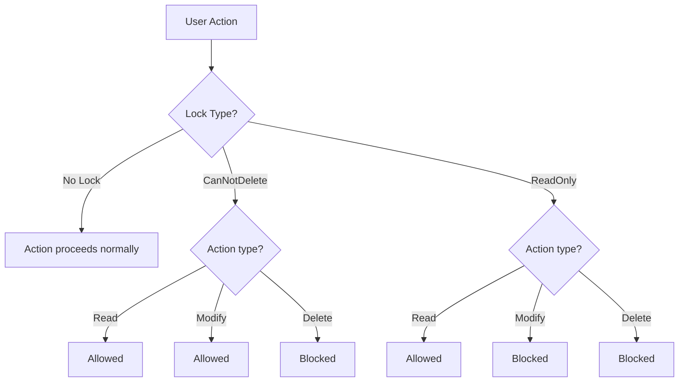

# How to Use Azure Resource Manager Locks to Prevent Accidental Deletion of Critical Resources

Author: [nawazdhandala](https://www.github.com/nawazdhandala)

Tags: Azure Resource Manager, Resource Locks, Cloud Governance, Azure Security, DevOps, Infrastructure Protection

Description: Apply Azure Resource Manager locks to prevent accidental deletion or modification of critical production resources like databases and storage accounts.

---

Every Azure admin has a horror story about someone accidentally deleting a production database or modifying a critical resource. It only takes one wrong click in the portal or one careless `az resource delete` command to cause an outage. Azure Resource Manager locks are a simple safeguard that prevents these mistakes. They take about 30 seconds to apply and can save you hours of recovery time.

This guide covers how locks work, how to apply them at different scopes, and the practical considerations you need to keep in mind when using them in production environments.

## How Resource Locks Work

A resource lock is a property you attach to an Azure resource, resource group, or subscription. When a lock is present, certain operations are blocked regardless of the user's RBAC permissions. Even a subscription Owner cannot delete a locked resource without first removing the lock.

There are two types of locks:

- **CanNotDelete (Delete lock)**: Users can read and modify the resource, but they cannot delete it.
- **ReadOnly (Read-only lock)**: Users can read the resource, but they cannot modify or delete it. This effectively makes the resource immutable.



## Applying Locks via the Azure Portal

The quickest way to lock a resource is through the portal. Navigate to the resource, click "Locks" in the left menu under Settings, then click "Add."

Fill in:
- **Lock name**: Something descriptive like "prevent-deletion-prod-db"
- **Lock type**: CanNotDelete or ReadOnly
- **Notes**: Why this lock exists (e.g., "Production SQL database - do not delete")

## Applying Locks via Azure CLI

For automation and consistency, use the CLI:

```bash
# Apply a delete lock to a production SQL database
az lock create \
  --name "prevent-deletion" \
  --resource-group "rg-production" \
  --resource-name "sql-prod-001" \
  --resource-type "Microsoft.Sql/servers" \
  --lock-type CanNotDelete \
  --notes "Production database - removal requires change approval"
```

For a resource group-level lock that protects everything inside it:

```bash
# Lock an entire resource group against deletion
az lock create \
  --name "protect-prod-rg" \
  --resource-group "rg-production" \
  --lock-type CanNotDelete \
  --notes "Production resource group - all resources protected"
```

For a subscription-level lock:

```bash
# Lock the entire subscription against deletion of any resource
az lock create \
  --name "protect-subscription" \
  --lock-type CanNotDelete \
  --notes "Subscription-level protection"
```

## Applying Locks via Bicep

If you manage infrastructure as code, you can define locks in your Bicep templates:

```bicep
// main.bicep - Deploy a storage account with a delete lock
param location string = resourceGroup().location
param storageAccountName string

// The storage account itself
resource storageAccount 'Microsoft.Storage/storageAccounts@2023-01-01' = {
  name: storageAccountName
  location: location
  sku: {
    name: 'Standard_GRS'
  }
  kind: 'StorageV2'
  properties: {
    minimumTlsVersion: 'TLS1_2'
  }
}

// Lock to prevent accidental deletion
resource storageLock 'Microsoft.Authorization/locks@2020-05-01' = {
  name: 'prevent-deletion'
  scope: storageAccount
  properties: {
    level: 'CanNotDelete'
    notes: 'Critical storage account - do not delete without change approval'
  }
}
```

You can also lock an entire resource group:

```bicep
// Resource group level lock - protects all resources in the group
resource rgLock 'Microsoft.Authorization/locks@2020-05-01' = {
  name: 'protect-resource-group'
  properties: {
    level: 'CanNotDelete'
    notes: 'Production resource group - protected against deletion'
  }
}
```

## Applying Locks via PowerShell

```powershell
# Apply a delete lock to a specific resource
New-AzResourceLock `
  -LockName "prevent-deletion" `
  -LockLevel CanNotDelete `
  -LockNotes "Production database - do not delete" `
  -ResourceGroupName "rg-production" `
  -ResourceName "sql-prod-001" `
  -ResourceType "Microsoft.Sql/servers"

# Apply a read-only lock to a resource group
New-AzResourceLock `
  -LockName "readonly-prod" `
  -LockLevel ReadOnly `
  -LockNotes "Production resources are read-only" `
  -ResourceGroupName "rg-production"
```

## Lock Inheritance

Locks follow Azure's scope hierarchy. A lock applied at a higher scope automatically applies to all child resources.

- A subscription lock applies to all resource groups and resources in the subscription
- A resource group lock applies to all resources in that group
- A resource lock applies only to that specific resource

This means you can protect an entire environment with a single resource group lock:

```bash
# One lock protects everything in the resource group
az lock create \
  --name "protect-all-prod" \
  --resource-group "rg-production" \
  --lock-type CanNotDelete \
  --notes "All production resources protected"
```

## Listing and Removing Locks

To see what locks exist:

```bash
# List all locks in a resource group
az lock list --resource-group "rg-production" --output table

# List all locks in the subscription
az lock list --output table
```

To remove a lock (required before you can delete a locked resource):

```bash
# Remove a specific lock
az lock delete \
  --name "prevent-deletion" \
  --resource-group "rg-production" \
  --resource-name "sql-prod-001" \
  --resource-type "Microsoft.Sql/servers"
```

## ReadOnly Lock Gotchas

ReadOnly locks are more restrictive than most people expect. They block any operation that modifies the resource, which includes some operations you might not think of as "modifications":

- **Storage accounts**: A ReadOnly lock blocks listing storage keys (because that is a POST operation). This can break applications that use key-based authentication.
- **App Service**: A ReadOnly lock blocks log streaming and scaling operations.
- **Virtual machines**: A ReadOnly lock prevents starting or stopping the VM.
- **SQL databases**: A ReadOnly lock blocks DTU or vCore scaling.

Because of these side effects, ReadOnly locks are best reserved for resources that genuinely should never change, like a shared VNet or a DNS zone. For most production resources, a CanNotDelete lock is the better choice.

## Automating Lock Management

Here is a script that applies delete locks to all critical resource types across all resource groups:

```bash
#!/bin/bash
# apply-production-locks.sh
# Apply delete locks to critical resources across all production resource groups

CRITICAL_TYPES=(
    "Microsoft.Sql/servers"
    "Microsoft.Storage/storageAccounts"
    "Microsoft.KeyVault/vaults"
    "Microsoft.Network/virtualNetworks"
    "Microsoft.ContainerService/managedClusters"
)

# Find all resource groups with the "production" tag
PROD_RGS=$(az group list --query "[?tags.environment=='production'].name" -o tsv)

for rg in $PROD_RGS; do
    echo "Processing resource group: $rg"

    for type in "${CRITICAL_TYPES[@]}"; do
        # Get all resources of this type in the resource group
        RESOURCES=$(az resource list \
          --resource-group "$rg" \
          --resource-type "$type" \
          --query "[].name" -o tsv)

        for resource in $RESOURCES; do
            # Check if lock already exists
            EXISTING=$(az lock list \
              --resource-group "$rg" \
              --resource-name "$resource" \
              --resource-type "$type" \
              --query "[?name=='auto-protect'].name" -o tsv)

            if [ -z "$EXISTING" ]; then
                az lock create \
                  --name "auto-protect" \
                  --resource-group "$rg" \
                  --resource-name "$resource" \
                  --resource-type "$type" \
                  --lock-type CanNotDelete \
                  --notes "Auto-applied protection for production resource"
                echo "  Locked: $resource ($type)"
            else
                echo "  Already locked: $resource ($type)"
            fi
        done
    done
done
```

## Locks and Infrastructure as Code

One common challenge is that resource locks can interfere with Bicep or Terraform deployments. If you try to delete a resource that is part of a deployment update, the lock will block the operation.

There are two approaches to handle this:

1. **Manage locks in your IaC.** Include locks in your Bicep templates (as shown above). The deployment process can remove and re-apply locks because it has the necessary permissions.

2. **Apply locks outside of IaC.** Use a separate pipeline or Azure Policy to apply locks after deployments complete. This keeps your infrastructure templates clean but adds another moving part.

## Using Azure Policy to Enforce Locks

You can create an Azure Policy that automatically applies locks to resources matching certain criteria:

```json
{
    "if": {
        "allOf": [
            {
                "field": "type",
                "equals": "Microsoft.Sql/servers"
            },
            {
                "field": "tags.environment",
                "equals": "production"
            }
        ]
    },
    "then": {
        "effect": "deployIfNotExists",
        "details": {
            "type": "Microsoft.Authorization/locks",
            "existenceCondition": {
                "field": "Microsoft.Authorization/locks/level",
                "equals": "CanNotDelete"
            }
        }
    }
}
```

This policy ensures that every production SQL server has a delete lock, and it will remediate any servers that are missing one.

## Wrapping Up

Resource locks are one of the simplest governance controls in Azure, and they are underused. It takes seconds to apply a lock to a critical resource, and it can prevent the kind of accidental deletion that leads to hours of downtime and recovery. Start with CanNotDelete locks on your most critical production resources - databases, storage accounts, key vaults, and virtual networks. Avoid ReadOnly locks unless you fully understand their side effects. And if you want to go further, use Azure Policy to ensure locks are applied consistently across your environment without relying on anyone remembering to do it manually.
