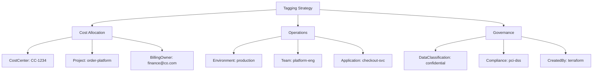

# How to Use Azure Resource Manager Tags to Organize and Track Costs Across Resources

Author: [nawazdhandala](https://www.github.com/nawazdhandala)

Tags: Azure, Resource Manager, Tags, Cost Management, Cloud Governance, Azure Policy, FinOps

Description: Learn how to use Azure Resource Manager tags to organize resources, track costs, and enforce governance policies across your Azure environment.

---

When you start working with Azure in a real organization, resources multiply fast. Before you know it, you have hundreds of virtual machines, storage accounts, databases, and networking components spread across multiple subscriptions. Without a system to organize them, it becomes nearly impossible to answer basic questions like "how much are we spending on the staging environment?" or "which team owns this storage account?"

Azure Resource Manager tags solve this problem. Tags are simple key-value pairs that you attach to resources, resource groups, and subscriptions. They are metadata labels that help you categorize, search, and report on your Azure resources. In this post, I will cover how to design a tagging strategy, apply tags at scale, and use them for cost tracking and governance.

## Understanding How Tags Work

A tag consists of a name (key) and a value. For example, `Environment: Production` or `CostCenter: CC-1234`. Each resource can have up to 50 tags, each tag name is limited to 512 characters, and each tag value is limited to 256 characters. Tag names are case-insensitive for operations but case-preserving for display.

One important thing to know: tags are not inherited. If you tag a resource group with `Environment: Production`, the resources inside that group do not automatically get that tag. You need to either apply tags explicitly to each resource or use Azure Policy to enforce inheritance (more on that later).

## Designing a Tagging Strategy

Before you start tagging things, you need a plan. Here is a tagging strategy that works well for most organizations:



The essential tags that every organization should consider include:

- **Environment** - production, staging, development, testing
- **CostCenter** - the financial code for billing allocation
- **Team** or **Owner** - the responsible team or person
- **Application** - which application this resource supports
- **Project** - the business project this ties to
- **CreatedBy** - how the resource was provisioned (manual, terraform, bicep)

## Applying Tags with Azure CLI

The Azure CLI makes it straightforward to add tags to resources. Here are the common operations:

```bash
# Add tags to a resource group
az group update \
  --name my-resource-group \
  --tags Environment=Production CostCenter=CC-1234 Team=PlatformEng

# Add tags to a specific resource by its resource ID
az resource tag \
  --ids /subscriptions/xxx/resourceGroups/my-rg/providers/Microsoft.Compute/virtualMachines/my-vm \
  --tags Environment=Production Application=OrderService

# Add a tag without overwriting existing tags (merge mode)
az resource update \
  --ids /subscriptions/xxx/resourceGroups/my-rg/providers/Microsoft.Storage/storageAccounts/mystorageacct \
  --set tags.DataClassification=Confidential

# List all resources with a specific tag
az resource list --tag Environment=Production --output table

# List all tags in use across the subscription
az tag list --output table
```

## Applying Tags with PowerShell

If PowerShell is more your style, here are the equivalent operations:

```powershell
# Get a resource and add tags to it
$resource = Get-AzResource -Name "my-vm" -ResourceGroupName "my-rg"

# Merge new tags with existing tags (preserves what is already there)
$existingTags = $resource.Tags
$existingTags["Environment"] = "Production"
$existingTags["CostCenter"] = "CC-1234"
$existingTags["Team"] = "PlatformEng"

# Apply the updated tag set
Set-AzResource -ResourceId $resource.ResourceId -Tag $existingTags -Force

# Find all resources with a specific tag value
Get-AzResource -Tag @{"Environment"="Production"} |
    Select-Object Name, ResourceGroupName, ResourceType
```

## Tagging with Bicep Templates

When you define infrastructure as code, tags should be part of the template. Here is how to do it in Bicep:

```bicep
// Define common tags as a parameter for reuse across resources
param commonTags object = {
  Environment: 'Production'
  CostCenter: 'CC-1234'
  Team: 'PlatformEng'
  ManagedBy: 'Bicep'
}

param location string = resourceGroup().location

// Apply tags to a storage account using the union function
// to merge common tags with resource-specific tags
resource storageAccount 'Microsoft.Storage/storageAccounts@2023-01-01' = {
  name: 'mystorageaccount'
  location: location
  kind: 'StorageV2'
  sku: {
    name: 'Standard_LRS'
  }
  tags: union(commonTags, {
    Application: 'DataPipeline'
    DataClassification: 'Internal'
  })
}

// Virtual machine with the same common tags plus VM-specific ones
resource virtualMachine 'Microsoft.Compute/virtualMachines@2023-07-01' = {
  name: 'my-vm'
  location: location
  tags: union(commonTags, {
    Application: 'WebServer'
    AutoShutdown: 'true'
  })
  properties: {
    // VM configuration here
  }
}
```

## Enforcing Tags with Azure Policy

Tags are only useful if they are applied consistently. Azure Policy lets you enforce tagging rules so that no one can create resources without the required tags.

Here is a policy definition that requires the `Environment` tag on all resources:

```json
{
  "mode": "Indexed",
  "policyRule": {
    "if": {
      "field": "[concat('tags[', 'Environment', ']')]",
      "exists": "false"
    },
    "then": {
      "effect": "deny"
    }
  },
  "parameters": {}
}
```

You can assign this policy via the CLI:

```bash
# Create the policy definition
az policy definition create \
  --name 'require-environment-tag' \
  --display-name 'Require Environment tag on resources' \
  --description 'Denies creation of resources without an Environment tag' \
  --rules @policy-rule.json \
  --mode Indexed

# Assign the policy to a subscription
az policy assignment create \
  --name 'require-env-tag-assignment' \
  --policy 'require-environment-tag' \
  --scope "/subscriptions/YOUR_SUBSCRIPTION_ID"
```

Azure Policy also supports tag inheritance - automatically copying tags from the resource group to child resources:

```json
{
  "mode": "Indexed",
  "policyRule": {
    "if": {
      "allOf": [
        {
          "field": "[concat('tags[', parameters('tagName'), ']')]",
          "exists": "false"
        },
        {
          "value": "[resourceGroup().tags[parameters('tagName')]]",
          "notEquals": ""
        }
      ]
    },
    "then": {
      "effect": "modify",
      "details": {
        "roleDefinitionIds": [
          "/providers/microsoft.authorization/roleDefinitions/b24988ac-6180-42a0-ab88-20f7382dd24c"
        ],
        "operations": [
          {
            "operation": "addOrReplace",
            "field": "[concat('tags[', parameters('tagName'), ']')]",
            "value": "[resourceGroup().tags[parameters('tagName')]]"
          }
        ]
      }
    }
  },
  "parameters": {
    "tagName": {
      "type": "String",
      "metadata": {
        "description": "Name of the tag to inherit from the resource group"
      }
    }
  }
}
```

## Using Tags for Cost Analysis

The real payoff of a good tagging strategy is cost visibility. Azure Cost Management lets you filter, group, and analyze costs by any tag.

In the Azure portal, navigate to Cost Management and click on Cost Analysis. You can group costs by tag and see a breakdown of spending. For example, grouping by the `Environment` tag shows you exactly how much production costs versus staging versus development.

You can also export tagged cost data programmatically:

```bash
# Export cost data grouped by a tag for the current billing period
az costmanagement query \
  --type Usage \
  --scope "subscriptions/YOUR_SUBSCRIPTION_ID" \
  --timeframe MonthToDate \
  --dataset-grouping name="Environment" type=TagKey \
  --dataset-aggregation totalCost=Sum \
  --output table
```

## Bulk Tagging Existing Resources

If you are introducing tags to an existing environment, you will need to tag resources in bulk. Here is a script that tags all resources in a resource group:

```bash
#!/bin/bash
# Tag all resources in a resource group with common tags
RESOURCE_GROUP="my-production-rg"
TAGS="Environment=Production CostCenter=CC-1234 Team=PlatformEng"

# Get all resource IDs in the resource group
RESOURCE_IDS=$(az resource list \
  --resource-group "$RESOURCE_GROUP" \
  --query "[].id" \
  --output tsv)

# Apply tags to each resource
for ID in $RESOURCE_IDS; do
  echo "Tagging: $ID"
  az resource tag --ids "$ID" --tags $TAGS --is-incremental 2>/dev/null
done

echo "Done tagging resources in $RESOURCE_GROUP"
```

The `--is-incremental` flag merges new tags with existing ones instead of replacing them.

## Tag-Based Access Control

Tags can also drive access control through Azure RBAC. You can create role assignments that are scoped to resources with specific tags, using attribute-based access control (ABAC) conditions. This is useful for scenarios like "the staging team should only be able to manage resources tagged with Environment=Staging."

## Wrapping Up

Azure Resource Manager tags are one of those features that seem simple but have outsized impact on how well you manage your cloud environment. A consistent tagging strategy, enforced through Azure Policy, gives you visibility into costs, clear ownership of resources, and the ability to automate operations based on resource metadata. Start with a small set of mandatory tags, enforce them with policy, and expand as your needs grow. The earlier you adopt tagging, the less cleanup you will have to do later.
