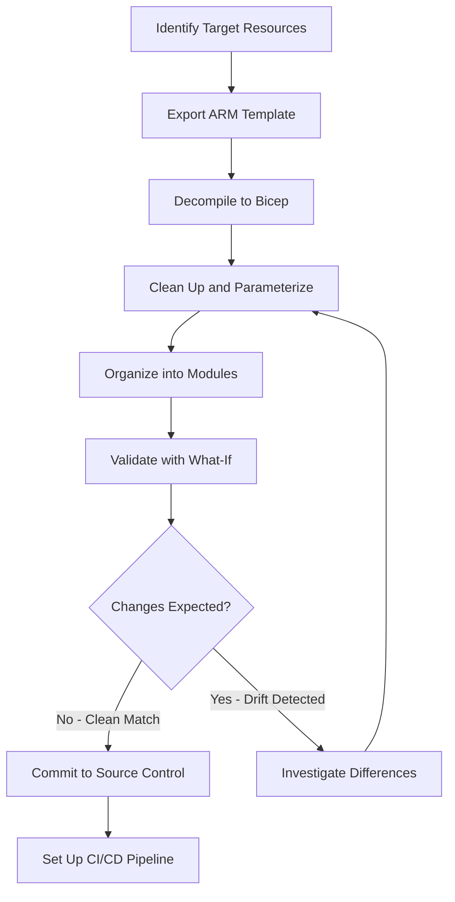

# How to Use Azure Resource Manager to Export Existing Resources as ARM Templates or Bicep

Author: [nawazdhandala](https://www.github.com/nawazdhandala)

Tags: Azure Resource Manager, ARM Templates, Bicep, Infrastructure as Code, Azure, IaC, Cloud Infrastructure

Description: Learn how to export existing Azure resources as ARM templates or Bicep files to bring manually created infrastructure under version-controlled management.

---

Most Azure environments do not start with Infrastructure as Code. They start with someone clicking through the portal to spin up a VM, a database, or a storage account. Eventually, the team realizes they need reproducibility and version control. The question then becomes: how do you take what already exists and turn it into proper IaC templates?

Azure Resource Manager provides built-in export capabilities that let you generate ARM templates from existing resources. You can then convert those ARM templates into Bicep, which is more readable and easier to maintain. This reverse-engineering approach is a practical way to adopt IaC incrementally rather than rewriting everything from scratch.

## Exporting from the Azure Portal

The simplest way to export a template is through the portal. Navigate to the resource or resource group you want to export. In the left menu, look for "Export template" under the Automation section.

When you click Export template, Azure generates a JSON ARM template that describes the current state of the resource. This includes all properties, configurations, and dependencies. You can download the template as a ZIP file or deploy it directly to a new environment.

There are two export options at the resource group level. You can export the entire resource group (all resources in it) or select specific resources. For a first pass, exporting the entire resource group is usually the right call.

## Exporting with Azure CLI

The CLI gives you more control and makes the process scriptable. Here is how to export a resource group template.

```bash
# Export all resources in a resource group as an ARM template
# The --include-parameter-default-value flag preserves current values as defaults
az group export \
  --name "my-production-rg" \
  --include-parameter-default-value \
  --output json > exported-template.json

# Export a specific resource by its resource ID
az resource export \
  --ids "/subscriptions/12345678-1234-1234-1234-123456789012/resourceGroups/my-rg/providers/Microsoft.Web/sites/my-web-app" \
  --output json > webapp-template.json
```

The exported template will be verbose. Azure exports every property, even those that match the default values. This is intentional - it gives you a complete snapshot - but you will want to clean it up before committing to source control.

## Exporting with Azure PowerShell

If your team prefers PowerShell, the experience is similar.

```powershell
# Export the entire resource group as an ARM template
# Save it to a local file for review and cleanup
Export-AzResourceGroup `
  -ResourceGroupName "my-production-rg" `
  -Path "./exported-template.json" `
  -IncludeParameterDefaultValue `
  -Force

# Export a single resource
$resource = Get-AzResource -Name "my-sql-server" -ResourceGroupName "my-production-rg"
Export-AzResourceGroup `
  -ResourceGroupName "my-production-rg" `
  -Resource $resource.ResourceId `
  -Path "./sql-template.json"
```

## Understanding Export Limitations

Before you rely entirely on exported templates, you should know the limitations. Not all resource types support export. Some resources have properties that cannot be exported for security reasons, like connection strings and passwords. Dependencies between resources might not be captured correctly if the resources span multiple resource groups.

The exported template also might not match what you would write by hand. It tends to be flat, with all resources at the top level and minimal use of parameters or variables. Consider the export as a starting point, not a finished product.

## Converting ARM to Bicep

Bicep is the preferred authoring language for Azure infrastructure these days. It compiles down to ARM JSON but is significantly more readable. The Bicep CLI has a built-in decompile command that converts ARM templates to Bicep.

```bash
# Convert an exported ARM template to Bicep
# This generates a .bicep file alongside the JSON file
az bicep decompile --file exported-template.json

# If you have the Bicep CLI installed directly
bicep decompile exported-template.json
```

The decompiler does a reasonable job, but it will leave warnings where it could not perfectly translate. Common issues include hardcoded values that should be parameters, resource API versions that might need updating, and dependency chains that could be simplified.

Here is what a typical decompiled Bicep file looks like compared to the original ARM JSON.

```json
{
  "$schema": "https://schema.management.azure.com/schemas/2019-04-01/deploymentTemplate.json#",
  "contentVersion": "1.0.0.0",
  "resources": [
    {
      "type": "Microsoft.Storage/storageAccounts",
      "apiVersion": "2023-01-01",
      "name": "mystorageaccount2024",
      "location": "eastus",
      "sku": {
        "name": "Standard_LRS"
      },
      "kind": "StorageV2",
      "properties": {
        "minimumTlsVersion": "TLS1_2",
        "supportsHttpsTrafficOnly": true,
        "accessTier": "Hot"
      }
    }
  ]
}
```

And the corresponding Bicep after decompilation.

```bicep
// Storage account resource definition
// Decompiled from ARM template - review and parameterize before production use
resource storageAccount 'Microsoft.Storage/storageAccounts@2023-01-01' = {
  name: 'mystorageaccount2024'
  location: 'eastus'
  sku: {
    name: 'Standard_LRS'
  }
  kind: 'StorageV2'
  properties: {
    minimumTlsVersion: 'TLS1_2'
    supportsHttpsTrafficOnly: true
    accessTier: 'Hot'
  }
}
```

## Cleaning Up Exported Templates

Exported templates need cleanup before they are production-ready. Here is a practical checklist.

First, extract hardcoded values into parameters. Resource names, locations, SKU sizes, and other values that change between environments should be parameters.

```bicep
// Parameterized version of the storage account
// These parameters allow reuse across dev, staging, and production

@description('The name of the storage account')
param storageAccountName string

@description('The Azure region for the resources')
param location string = resourceGroup().location

@description('The storage account SKU')
@allowed([
  'Standard_LRS'
  'Standard_GRS'
  'Standard_ZRS'
])
param skuName string = 'Standard_LRS'

resource storageAccount 'Microsoft.Storage/storageAccounts@2023-01-01' = {
  name: storageAccountName
  location: location
  sku: {
    name: skuName
  }
  kind: 'StorageV2'
  properties: {
    minimumTlsVersion: 'TLS1_2'
    supportsHttpsTrafficOnly: true
    accessTier: 'Hot'
  }
}
```

Second, remove read-only properties. Exported templates often include properties like `provisioningState` or `createdDate` that are set by Azure and should not be in your template.

Third, organize resources into modules. If you exported a resource group with 20 resources, break them into logical Bicep modules - one for networking, one for compute, one for databases, and so on.

## Validating the Exported Template

Before deploying an exported template to any environment, validate it first.

```bash
# Validate the template without actually deploying anything
# This catches syntax errors and invalid property values
az deployment group validate \
  --resource-group "my-test-rg" \
  --template-file main.bicep \
  --parameters storageAccountName="testexport2024"

# Run a what-if deployment to see what would change
az deployment group what-if \
  --resource-group "my-test-rg" \
  --template-file main.bicep \
  --parameters storageAccountName="testexport2024"
```

The what-if operation is particularly valuable. It compares your template against the current state of the target resource group and shows you exactly what would be created, modified, or deleted. This is your safety net against accidental changes.

## Workflow for Bringing Existing Resources Under IaC

Here is the workflow I recommend for teams adopting IaC on existing infrastructure.



Start with non-critical resources. Export a dev or staging environment first, clean up the templates, and deploy to a fresh resource group to verify the output matches. Once you are confident in the process, tackle production resources.

## Handling Secrets and Sensitive Data

Exported templates will not include actual secret values, but they will reference the properties where secrets are stored. You need to handle these with Key Vault references or pipeline secrets.

```bicep
// Reference secrets from Key Vault instead of hardcoding
// This keeps sensitive values out of your source control

param keyVaultName string

resource keyVault 'Microsoft.KeyVault/vaults@2023-02-01' existing = {
  name: keyVaultName
}

resource sqlServer 'Microsoft.Sql/servers@2023-05-01-preview' = {
  name: 'my-sql-server'
  location: resourceGroup().location
  properties: {
    administratorLogin: 'sqladmin'
    // Pull the password from Key Vault at deployment time
    administratorLoginPassword: keyVault.getSecret('sql-admin-password')
  }
}
```

Exporting existing Azure resources is the bridge between ad-hoc infrastructure and proper Infrastructure as Code. The process is not fully automatic, and the exported templates need significant cleanup, but it is far faster than writing templates from scratch. Start with the export, refine the Bicep, validate with what-if, and commit to source control. Over time, the templates become the source of truth and the portal becomes read-only.
