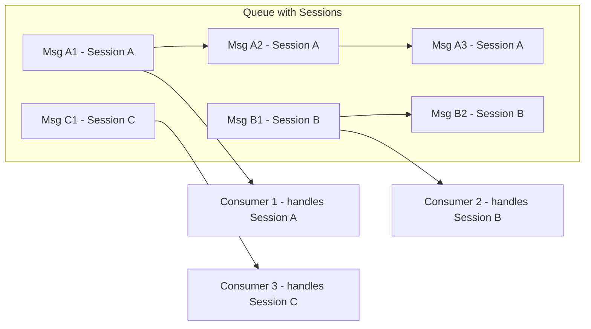

# How to Use Azure Service Bus Sessions for Ordered Message Processing

Author: [nawazdhandala](https://www.github.com/nawazdhandala)

Tags: Azure Service Bus, Sessions, Ordered Processing, Message Queue, Azure, FIFO, Messaging

Description: Implement ordered message processing in Azure Service Bus using sessions to guarantee FIFO delivery and group related messages for sequential handling.

---

By default, Azure Service Bus does not guarantee message ordering. When you have multiple consumers processing messages from a queue concurrently, messages can be processed in any order. For many workloads this is fine, but some scenarios require strict ordering. Think of financial transactions that must be applied in sequence, or state machine transitions where event order matters.

Azure Service Bus sessions solve this problem. Sessions let you group related messages together and guarantee that messages within the same session are processed in FIFO (first-in, first-out) order by a single consumer at a time. In this post, I will explain how sessions work, show you how to implement them, and cover the edge cases you need to handle.

## How Sessions Work

A session is identified by a session ID - a string value that you set on each message. All messages with the same session ID belong to the same session. Service Bus guarantees that:

1. Messages within a session are delivered in the order they were enqueued
2. Only one consumer processes a given session at a time (exclusive lock)
3. Different sessions can be processed concurrently by different consumers



Consumer 1 processes all of Session A's messages in order. Consumer 2 handles Session B. Consumer 3 handles Session C. The sessions run in parallel, but within each session, the order is guaranteed.

## Enabling Sessions on a Queue

Sessions must be enabled when the queue is created. You cannot enable them on an existing queue.

```bash
# Create a queue with sessions enabled
az servicebus queue create \
  --name orders \
  --namespace-name my-servicebus \
  --resource-group my-rg \
  --enable-session true \
  --max-delivery-count 10

# You can also enable sessions on a topic subscription
az servicebus topic subscription create \
  --name order-processor \
  --topic-name order-events \
  --namespace-name my-servicebus \
  --resource-group my-rg \
  --enable-session true
```

Once sessions are enabled, every message sent to the queue must have a session ID. Messages without a session ID will be rejected.

## Sending Session Messages

When sending messages, set the `SessionId` property to group related messages together.

```csharp
using Azure.Messaging.ServiceBus;

public class OrderEventPublisher
{
    private readonly ServiceBusSender _sender;

    public OrderEventPublisher(ServiceBusClient client)
    {
        _sender = client.CreateSender("orders");
    }

    // Send order events with the order ID as the session ID
    // This ensures all events for a given order are processed in sequence
    public async Task PublishOrderEventsAsync(string orderId, List<OrderEvent> events)
    {
        var messages = events.Select(evt => new ServiceBusMessage(
            BinaryData.FromObjectAsJson(evt))
        {
            // Use the order ID as the session ID
            // All messages with the same session ID will be processed in order
            SessionId = orderId,
            ContentType = "application/json",
            Subject = evt.EventType,
            // Optional: set the message ID for deduplication
            MessageId = $"{orderId}-{evt.EventType}-{evt.Timestamp.Ticks}"
        }).ToList();

        // Send all events for this order
        await _sender.SendMessagesAsync(messages);
    }

    // Example: publish the lifecycle events for an order
    public async Task PublishOrderLifecycle(string orderId)
    {
        var events = new List<OrderEvent>
        {
            new() { OrderId = orderId, EventType = "OrderCreated",
                     Timestamp = DateTime.UtcNow },
            new() { OrderId = orderId, EventType = "PaymentProcessed",
                     Timestamp = DateTime.UtcNow.AddSeconds(1) },
            new() { OrderId = orderId, EventType = "OrderShipped",
                     Timestamp = DateTime.UtcNow.AddSeconds(2) },
        };

        await PublishOrderEventsAsync(orderId, events);
    }
}
```

## Processing Session Messages

Receiving session messages requires a session receiver, which is different from a regular receiver. The session receiver locks an entire session and processes its messages sequentially.

```csharp
public class SessionProcessor
{
    private readonly ServiceBusClient _client;
    private readonly ILogger<SessionProcessor> _logger;

    public SessionProcessor(ServiceBusClient client, ILogger<SessionProcessor> logger)
    {
        _client = client;
        _logger = logger;
    }

    // Process sessions using the session processor
    public async Task StartProcessingAsync(CancellationToken cancellationToken)
    {
        var processor = _client.CreateSessionProcessor("orders",
            new ServiceBusSessionProcessorOptions
            {
                // Process up to 5 sessions concurrently
                MaxConcurrentSessions = 5,

                // How long to keep a session locked when there are no messages
                SessionIdleTimeout = TimeSpan.FromSeconds(30),

                // Do not auto-complete - we want explicit control
                AutoCompleteMessages = false,

                // Maximum time to lock a session
                MaxAutoLockRenewalDuration = TimeSpan.FromMinutes(10)
            });

        processor.ProcessMessageAsync += HandleMessageAsync;
        processor.ProcessErrorAsync += HandleErrorAsync;

        await processor.StartProcessingAsync(cancellationToken);
    }

    private async Task HandleMessageAsync(ProcessSessionMessageEventArgs args)
    {
        var message = args.Message;
        var sessionId = args.SessionId;

        _logger.LogInformation(
            "Processing message {Id} from session {Session}, sequence {Seq}",
            message.MessageId, sessionId, message.SequenceNumber);

        try
        {
            var orderEvent = message.Body.ToObjectFromJson<OrderEvent>();

            // Process the event knowing it is in the correct order
            // for this particular order (session)
            await ProcessOrderEvent(orderEvent);

            // You can store session state for stateful processing
            // The state persists across messages within the same session
            var stateData = await args.GetSessionStateAsync();
            var state = stateData != null
                ? stateData.ToObjectFromJson<OrderSessionState>()
                : new OrderSessionState();

            state.LastProcessedEvent = orderEvent.EventType;
            state.LastProcessedTime = DateTime.UtcNow;
            state.EventCount++;

            await args.SetSessionStateAsync(
                BinaryData.FromObjectAsJson(state));

            await args.CompleteMessageAsync(message);
        }
        catch (Exception ex)
        {
            _logger.LogError(ex,
                "Error processing message {Id} in session {Session}",
                message.MessageId, sessionId);
            await args.AbandonMessageAsync(message);
        }
    }

    private Task HandleErrorAsync(ProcessErrorEventArgs args)
    {
        _logger.LogError(args.Exception,
            "Session processing error: {Source}", args.ErrorSource);
        return Task.CompletedTask;
    }

    private async Task ProcessOrderEvent(OrderEvent evt)
    {
        _logger.LogInformation(
            "Processing {EventType} for order {OrderId}",
            evt.EventType, evt.OrderId);

        // Apply the event based on its type
        // Since sessions guarantee ordering, we know this event is
        // in the correct sequence for this order
    }
}

public class OrderSessionState
{
    public string LastProcessedEvent { get; set; }
    public DateTime LastProcessedTime { get; set; }
    public int EventCount { get; set; }
}
```

## Using Session State

One of the most powerful features of sessions is session state. You can store arbitrary data on a session that persists between messages. This is useful for building state machines.

```csharp
// State machine example: tracking order fulfillment status
private async Task ProcessWithStateMachine(ProcessSessionMessageEventArgs args)
{
    var message = args.Message;
    var evt = message.Body.ToObjectFromJson<OrderEvent>();

    // Load the current state
    var stateData = await args.GetSessionStateAsync();
    var state = stateData != null
        ? stateData.ToObjectFromJson<OrderStateMachine>()
        : new OrderStateMachine { CurrentState = "New" };

    _logger.LogInformation(
        "Order {Id}: transitioning from {Current} with event {Event}",
        evt.OrderId, state.CurrentState, evt.EventType);

    // Validate the state transition
    bool validTransition = (state.CurrentState, evt.EventType) switch
    {
        ("New", "OrderCreated") => true,
        ("Created", "PaymentProcessed") => true,
        ("Paid", "OrderShipped") => true,
        ("Shipped", "OrderDelivered") => true,
        _ => false
    };

    if (!validTransition)
    {
        _logger.LogWarning(
            "Invalid transition: {State} + {Event} for order {Id}",
            state.CurrentState, evt.EventType, evt.OrderId);
        await args.DeadLetterMessageAsync(message,
            deadLetterReason: "InvalidStateTransition");
        return;
    }

    // Apply the transition
    state.CurrentState = evt.EventType switch
    {
        "OrderCreated" => "Created",
        "PaymentProcessed" => "Paid",
        "OrderShipped" => "Shipped",
        "OrderDelivered" => "Delivered",
        _ => state.CurrentState
    };

    state.TransitionHistory.Add(new StateTransition
    {
        FromState = state.CurrentState,
        Event = evt.EventType,
        Timestamp = DateTime.UtcNow
    });

    // Save the updated state
    await args.SetSessionStateAsync(BinaryData.FromObjectAsJson(state));
    await args.CompleteMessageAsync(message);
}

public class OrderStateMachine
{
    public string CurrentState { get; set; }
    public List<StateTransition> TransitionHistory { get; set; } = new();
}

public class StateTransition
{
    public string FromState { get; set; }
    public string Event { get; set; }
    public DateTime Timestamp { get; set; }
}
```

## Using Sessions with Azure Functions

Azure Functions supports session-based Service Bus triggers with a simple configuration change.

```csharp
// Azure Function with session-enabled Service Bus trigger
[Function("ProcessOrderSession")]
public async Task Run(
    [ServiceBusTrigger("orders",
        Connection = "ServiceBusConnection",
        IsSessionsEnabled = true)]
    ServiceBusReceivedMessage message,
    ServiceBusMessageActions messageActions,
    ServiceBusSessionMessageActions sessionActions)
{
    _logger.LogInformation(
        "Session {Session}: Processing message {Id}",
        message.SessionId, message.MessageId);

    var orderEvent = message.Body.ToObjectFromJson<OrderEvent>();

    // Access and update session state
    var stateData = await sessionActions.GetSessionStateAsync();
    // Process and update state...
    await sessionActions.SetSessionStateAsync(
        BinaryData.FromObjectAsJson(updatedState));

    await messageActions.CompleteMessageAsync(message);
}
```

Configure the concurrency settings in `host.json`.

```json
{
  "version": "2.0",
  "extensions": {
    "serviceBus": {
      "sessionHandlerOptions": {
        "autoComplete": false,
        "maxConcurrentSessions": 8,
        "maxConcurrentCallsPerSession": 1,
        "sessionIdleTimeout": "00:01:00"
      }
    }
  }
}
```

The `maxConcurrentCallsPerSession` setting is critical. Keep it at 1 to guarantee ordered processing within each session. Setting it higher would allow parallel processing within a session, which defeats the purpose.

## Choosing Session IDs

Your session ID choice determines the granularity of ordering and parallelism.

- **Order ID**: All events for a specific order are processed in order. Different orders process in parallel. Good for order lifecycles.
- **Customer ID**: All operations for a customer are serialized. Good for customer account operations.
- **Tenant ID**: All operations for a tenant are serialized. Good for multi-tenant systems where per-tenant ordering matters.

Choose the most granular session ID that satisfies your ordering requirement. A session ID that is too broad (like a tenant ID when you only need per-order ordering) reduces parallelism unnecessarily.

## Summary

Azure Service Bus sessions provide guaranteed FIFO ordering within message groups while allowing parallel processing across groups. Enable sessions on the queue, set the session ID on messages, use session receivers or session-enabled Azure Function triggers, and optionally leverage session state for stateful processing patterns. Sessions are the right tool when you need ordered processing without sacrificing throughput on unrelated message groups.
