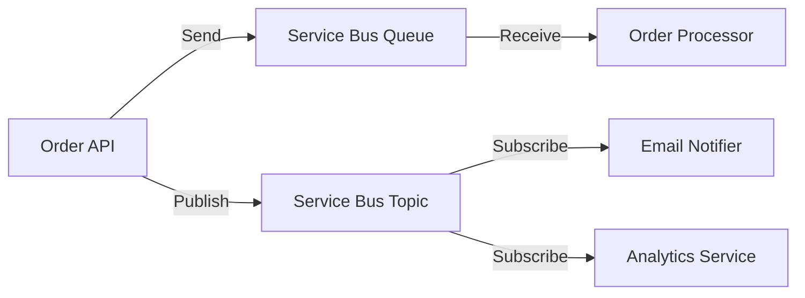

# How to Use Azure Service Bus with Spring Boot Using azure-spring-cloud-stream-binder

Author: [nawazdhandala](https://www.github.com/nawazdhandala)

Tags: Azure Service Bus, Spring Boot, Spring Cloud Stream, Message Queue, Java, Event-Driven, Microservices

Description: Learn how to integrate Azure Service Bus with Spring Boot using the Spring Cloud Stream binder for building event-driven microservices with queues and topics.

---

Azure Service Bus is an enterprise-grade message broker with support for queues and topics (publish-subscribe). Spring Cloud Stream provides an abstraction layer over messaging systems, letting you switch between Kafka, RabbitMQ, and Azure Service Bus without changing your business logic. The `azure-spring-cloud-stream-binder` connects these two worlds, giving you a Spring-native way to send and receive messages through Azure Service Bus.

In this post, we will build a Spring Boot application that uses Azure Service Bus for asynchronous messaging. We will cover both queue-based (point-to-point) and topic-based (publish-subscribe) patterns.

## The Architecture

Our application will have three components: a producer that sends order events, a consumer that processes orders, and a notification subscriber that sends email confirmations. The producer and consumer communicate through a queue, while the notification service subscribes to a topic for broadcast messages.



## Setting Up Azure Service Bus

Create a Service Bus namespace and the necessary queues and topics.

```bash
# Create a resource group
az group create --name servicebus-demo-rg --location eastus

# Create a Service Bus namespace (Standard tier for topics)
az servicebus namespace create \
  --name my-servicebus-ns \
  --resource-group servicebus-demo-rg \
  --location eastus \
  --sku Standard

# Create a queue for order processing
az servicebus queue create \
  --namespace-name my-servicebus-ns \
  --resource-group servicebus-demo-rg \
  --name order-queue \
  --max-size 1024 \
  --default-message-time-to-live P14D

# Create a topic for notifications
az servicebus topic create \
  --namespace-name my-servicebus-ns \
  --resource-group servicebus-demo-rg \
  --name order-notifications

# Create subscriptions for the topic
az servicebus topic subscription create \
  --namespace-name my-servicebus-ns \
  --resource-group servicebus-demo-rg \
  --topic-name order-notifications \
  --name email-subscription

az servicebus topic subscription create \
  --namespace-name my-servicebus-ns \
  --resource-group servicebus-demo-rg \
  --topic-name order-notifications \
  --name analytics-subscription
```

## Project Setup

Add the Spring Cloud Stream binder for Azure Service Bus to your project.

```xml
<!-- pom.xml -->
<parent>
    <groupId>org.springframework.boot</groupId>
    <artifactId>spring-boot-starter-parent</artifactId>
    <version>3.2.0</version>
</parent>

<dependencies>
    <dependency>
        <groupId>org.springframework.boot</groupId>
        <artifactId>spring-boot-starter-web</artifactId>
    </dependency>

    <!-- Spring Cloud Stream binder for Azure Service Bus -->
    <dependency>
        <groupId>com.azure.spring</groupId>
        <artifactId>spring-cloud-azure-stream-binder-servicebus</artifactId>
        <version>5.8.0</version>
    </dependency>
</dependencies>

<dependencyManagement>
    <dependencies>
        <dependency>
            <groupId>com.azure.spring</groupId>
            <artifactId>spring-cloud-azure-dependencies</artifactId>
            <version>5.8.0</version>
            <type>pom</type>
            <scope>import</scope>
        </dependency>
    </dependencies>
</dependencyManagement>
```

## Configuring Spring Cloud Stream

Define your bindings and Service Bus connection in `application.yml`.

```yaml
# application.yml
spring:
  cloud:
    azure:
      servicebus:
        connection-string: "Endpoint=sb://my-servicebus-ns.servicebus.windows.net/;SharedAccessKeyName=RootManageSharedAccessKey;SharedAccessKey=your-key"
    stream:
      bindings:
        # Producer binding for sending messages to a queue
        orderOutput-out-0:
          destination: order-queue

        # Consumer binding for receiving messages from a queue
        orderInput-in-0:
          destination: order-queue
          group: order-processor

        # Producer binding for publishing to a topic
        notificationOutput-out-0:
          destination: order-notifications

        # Consumer binding for topic subscription
        notificationInput-in-0:
          destination: order-notifications
          group: email-subscription

      servicebus:
        bindings:
          # Configure the queue binding as a queue (not topic)
          orderOutput-out-0:
            producer:
              entity-type: queue
          orderInput-in-0:
            consumer:
              entity-type: queue

          # Configure the notification binding as a topic
          notificationOutput-out-0:
            producer:
              entity-type: topic
          notificationInput-in-0:
            consumer:
              entity-type: topic
```

## Defining Message Models

Create a simple order event model.

```java
// Model class for order events
public class OrderEvent {
    private String orderId;
    private String customerId;
    private String productName;
    private double amount;
    private String status;
    private long timestamp;

    public OrderEvent() {}

    public OrderEvent(String orderId, String customerId,
                      String productName, double amount) {
        this.orderId = orderId;
        this.customerId = customerId;
        this.productName = productName;
        this.amount = amount;
        this.status = "CREATED";
        this.timestamp = System.currentTimeMillis();
    }

    // Getters and setters
    public String getOrderId() { return orderId; }
    public void setOrderId(String orderId) { this.orderId = orderId; }
    public String getCustomerId() { return customerId; }
    public void setCustomerId(String customerId) { this.customerId = customerId; }
    public String getProductName() { return productName; }
    public void setProductName(String productName) { this.productName = productName; }
    public double getAmount() { return amount; }
    public void setAmount(double amount) { this.amount = amount; }
    public String getStatus() { return status; }
    public void setStatus(String status) { this.status = status; }
    public long getTimestamp() { return timestamp; }
    public void setTimestamp(long timestamp) { this.timestamp = timestamp; }

    @Override
    public String toString() {
        return "OrderEvent{orderId='" + orderId + "', product='" + productName + "', amount=" + amount + "}";
    }
}
```

## Building the Message Producer

In Spring Cloud Stream, producers are defined as `Supplier` beans that return messages. You can also use `StreamBridge` for imperative sending.

```java
import org.springframework.cloud.stream.function.StreamBridge;
import org.springframework.web.bind.annotation.*;
import org.slf4j.Logger;
import org.slf4j.LoggerFactory;

import java.util.UUID;

@RestController
@RequestMapping("/api/orders")
public class OrderController {

    private static final Logger log = LoggerFactory.getLogger(OrderController.class);
    private final StreamBridge streamBridge;

    public OrderController(StreamBridge streamBridge) {
        this.streamBridge = streamBridge;
    }

    @PostMapping
    public OrderEvent createOrder(@RequestBody OrderEvent order) {
        // Generate an order ID
        order.setOrderId(UUID.randomUUID().toString());
        order.setStatus("CREATED");

        // Send to the order queue for processing
        boolean sent = streamBridge.send("orderOutput-out-0", order);
        log.info("Order {} sent to queue: {}", order.getOrderId(), sent);

        // Also publish to the notification topic for subscribers
        streamBridge.send("notificationOutput-out-0", order);
        log.info("Order {} published to notification topic", order.getOrderId());

        return order;
    }
}
```

## Building the Message Consumer

Consumers are defined as `Consumer` or `Function` beans. Spring Cloud Stream binds them to the input channels automatically.

```java
import org.springframework.context.annotation.Bean;
import org.springframework.context.annotation.Configuration;
import org.slf4j.Logger;
import org.slf4j.LoggerFactory;

import java.util.function.Consumer;

@Configuration
public class MessageConsumers {

    private static final Logger log = LoggerFactory.getLogger(MessageConsumers.class);

    // Consumer for the order queue - processes orders one at a time
    @Bean
    public Consumer<OrderEvent> orderInput() {
        return order -> {
            log.info("Processing order: {}", order);

            // Simulate order processing
            processOrder(order);

            log.info("Order {} processed successfully", order.getOrderId());
        };
    }

    // Consumer for the notification topic - sends email notifications
    @Bean
    public Consumer<OrderEvent> notificationInput() {
        return order -> {
            log.info("Sending notification for order: {}", order.getOrderId());

            // Simulate sending an email
            sendEmailNotification(order);

            log.info("Notification sent for order {}", order.getOrderId());
        };
    }

    private void processOrder(OrderEvent order) {
        // In a real app: validate payment, update inventory, etc.
        log.info("Charging {} for order {}", order.getAmount(), order.getOrderId());
        log.info("Updating inventory for product: {}", order.getProductName());
    }

    private void sendEmailNotification(OrderEvent order) {
        // In a real app: send an email via SMTP or a mail service
        log.info("Email sent to customer {} for order {}",
            order.getCustomerId(), order.getOrderId());
    }
}
```

## Error Handling and Dead Lettering

When message processing fails, you need a strategy for retries and dead lettering.

```yaml
# application.yml - add retry and dead letter configuration
spring:
  cloud:
    stream:
      bindings:
        orderInput-in-0:
          destination: order-queue
          group: order-processor
          consumer:
            max-attempts: 3         # Retry up to 3 times
            back-off-initial-interval: 1000  # Wait 1 second before first retry
            back-off-multiplier: 2.0         # Double the wait time for each retry
```

For messages that exhaust all retries, Azure Service Bus can automatically move them to a dead letter queue. Enable this on the queue itself.

```bash
# Enable dead lettering on the queue
az servicebus queue update \
  --namespace-name my-servicebus-ns \
  --resource-group servicebus-demo-rg \
  --name order-queue \
  --enable-dead-lettering-on-message-expiration true
```

You can then create a separate consumer to process dead-lettered messages.

```java
// Consumer for dead letter messages - for manual review or retry
@Bean
public Consumer<OrderEvent> deadLetterProcessor() {
    return order -> {
        log.error("Dead letter received for order: {}", order.getOrderId());
        // Log to monitoring system, create an alert, or store for manual review
    };
}
```

## Message Headers and Metadata

Spring Cloud Stream lets you set and read message headers for routing and metadata.

```java
import org.springframework.messaging.Message;
import org.springframework.messaging.support.MessageBuilder;

// Sending a message with custom headers
@PostMapping("/priority")
public OrderEvent createPriorityOrder(@RequestBody OrderEvent order) {
    order.setOrderId(UUID.randomUUID().toString());

    // Build a message with custom headers
    Message<OrderEvent> message = MessageBuilder
        .withPayload(order)
        .setHeader("priority", "high")
        .setHeader("source", "web-api")
        .setHeader("correlationId", UUID.randomUUID().toString())
        .build();

    streamBridge.send("orderOutput-out-0", message);
    return order;
}

// Reading headers in the consumer
@Bean
public Consumer<Message<OrderEvent>> orderInputWithHeaders() {
    return message -> {
        OrderEvent order = message.getPayload();
        String priority = (String) message.getHeaders().get("priority");
        String correlationId = (String) message.getHeaders().get("correlationId");

        log.info("Processing order {} with priority {} (correlation: {})",
            order.getOrderId(), priority, correlationId);
    };
}
```

## Testing Locally

For local development, you can use the Azure Service Bus emulator or configure your application to connect to a real namespace. The simplest approach is to use the actual Service Bus during development, since the Standard tier costs are minimal.

Run your application and send a test request.

```bash
# Start the application
mvn spring-boot:run

# Send a test order
curl -X POST http://localhost:8080/api/orders \
  -H "Content-Type: application/json" \
  -d '{"customerId": "cust-001", "productName": "Laptop", "amount": 999.99}'
```

## Wrapping Up

The Spring Cloud Stream binder for Azure Service Bus gives you a clean, declarative way to build event-driven microservices. You define your message channels in configuration, write producer and consumer beans, and let the framework handle the connection management, serialization, and error handling. The combination of queues for point-to-point messaging and topics for publish-subscribe covers most messaging patterns you will need. Start with simple producers and consumers, add error handling and dead lettering as you move toward production, and monitor your message throughput and processing latency.
