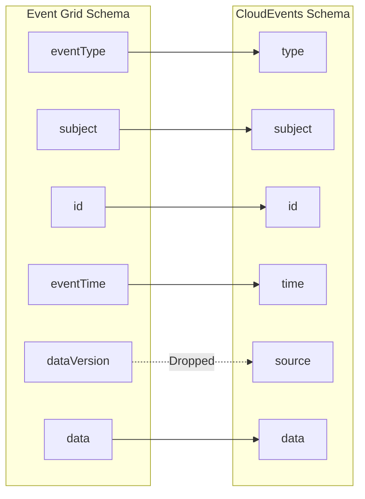

# How to Use CloudEvents Schema with Azure Event Grid

Author: [nawazdhandala](https://www.github.com/nawazdhandala)

Tags: Azure, Event Grid, CloudEvents, Event Schema, Interoperability, CNCF, Event-Driven Architecture

Description: Learn how to use the CloudEvents specification with Azure Event Grid for standards-based event publishing and consumption.

---

Azure Event Grid supports three event schemas: the native Event Grid schema, the CloudEvents v1.0 schema, and a custom input schema. If you are building systems that need to interoperate with other cloud providers, on-premises systems, or any CNCF-aligned tooling, CloudEvents is the schema you should be using.

## What Is CloudEvents?

CloudEvents is a specification from the Cloud Native Computing Foundation (CNCF) that defines a standard way to describe event data. It is vendor-neutral, and it has been adopted by Azure, Google Cloud, and many open-source projects. The core idea is simple: standardize the envelope so that event consumers do not need to understand vendor-specific metadata formats.

A CloudEvents event looks like this:

```json
{
  "specversion": "1.0",
  "type": "com.mycompany.orders.placed",
  "source": "/myapp/orders",
  "id": "A234-1234-1234",
  "time": "2026-02-16T10:30:00Z",
  "datacontenttype": "application/json",
  "data": {
    "orderId": "12345",
    "customerId": "cust-789",
    "totalAmount": 99.95
  }
}
```

Compare that to the Event Grid native schema:

```json
{
  "id": "A234-1234-1234",
  "eventType": "Orders.OrderPlaced",
  "subject": "/orders/12345",
  "eventTime": "2026-02-16T10:30:00Z",
  "data": {
    "orderId": "12345",
    "customerId": "cust-789",
    "totalAmount": 99.95
  },
  "dataVersion": "1.0"
}
```

The fields map roughly to each other, but the names and conventions are different. CloudEvents uses `type` instead of `eventType`, `source` instead of `subject`, and `specversion` to identify the schema version.

## Creating a CloudEvents Topic

When you create an Event Grid topic, specify the input schema as CloudEvents.

```bash
# Create a topic that accepts CloudEvents schema
az eventgrid topic create \
  --name topic-orders-cloudevents \
  --resource-group rg-events \
  --location eastus2 \
  --input-schema cloudeventschemav1_0
```

Once the topic is set to CloudEvents, all published events must follow the CloudEvents v1.0 specification. You cannot mix schemas on a single topic.

## Publishing CloudEvents with C#

The Azure SDK has built-in support for CloudEvents.

```csharp
using Azure;
using Azure.Messaging;
using Azure.Messaging.EventGrid;

// Create the publisher client
var endpoint = new Uri("https://topic-orders-cloudevents.eastus2-1.eventgrid.azure.net/api/events");
var credential = new AzureKeyCredential("your-topic-key");
var client = new EventGridPublisherClient(endpoint, credential);

// Build CloudEvents using the Azure SDK type
var cloudEvent = new CloudEvent(
    source: "/myapp/orders",
    type: "com.mycompany.orders.placed",
    jsonSerializableData: new
    {
        orderId = "12345",
        customerId = "cust-789",
        totalAmount = 99.95,
        currency = "USD"
    }
)
{
    // Optional: set the subject for additional routing context
    Subject = "/orders/12345",
    // The time defaults to UtcNow but you can override it
    Time = DateTimeOffset.UtcNow
};

// Publish the event
await client.SendEventAsync(cloudEvent);
Console.WriteLine("CloudEvent published successfully");
```

## Publishing CloudEvents with HTTP

You can also publish CloudEvents directly via HTTP. When publishing to Event Grid, use the structured content mode with JSON.

```bash
# Publish a CloudEvent using curl
TOPIC_ENDPOINT=$(az eventgrid topic show --name topic-orders-cloudevents --resource-group rg-events --query "endpoint" --output tsv)
TOPIC_KEY=$(az eventgrid topic key list --name topic-orders-cloudevents --resource-group rg-events --query "key1" --output tsv)

# Note the content-type header - this tells Event Grid it is a CloudEvent
curl -X POST "$TOPIC_ENDPOINT" \
  -H "Content-Type: application/cloudevents+json; charset=utf-8" \
  -H "aeg-sas-key: $TOPIC_KEY" \
  -d '{
    "specversion": "1.0",
    "type": "com.mycompany.orders.placed",
    "source": "/myapp/orders",
    "id": "order-event-001",
    "time": "2026-02-16T12:00:00Z",
    "datacontenttype": "application/json",
    "subject": "/orders/12345",
    "data": {
      "orderId": "12345",
      "customerId": "cust-789",
      "totalAmount": 99.95
    }
  }'
```

For batch publishing, use an array with the `application/cloudevents-batch+json` content type.

```bash
curl -X POST "$TOPIC_ENDPOINT" \
  -H "Content-Type: application/cloudevents-batch+json; charset=utf-8" \
  -H "aeg-sas-key: $TOPIC_KEY" \
  -d '[
    {
      "specversion": "1.0",
      "type": "com.mycompany.orders.placed",
      "source": "/myapp/orders",
      "id": "order-001",
      "time": "2026-02-16T12:00:00Z",
      "datacontenttype": "application/json",
      "data": { "orderId": "001", "totalAmount": 50.00 }
    },
    {
      "specversion": "1.0",
      "type": "com.mycompany.orders.placed",
      "source": "/myapp/orders",
      "id": "order-002",
      "time": "2026-02-16T12:00:01Z",
      "datacontenttype": "application/json",
      "data": { "orderId": "002", "totalAmount": 75.00 }
    }
  ]'
```

## Consuming CloudEvents

When your subscriber receives a CloudEvent from Event Grid, the event follows the CloudEvents format. Here is an Azure Function that handles CloudEvents.

```csharp
using Azure.Messaging;
using Microsoft.Azure.Functions.Worker;
using Microsoft.Extensions.Logging;

public class OrderEventHandler
{
    private readonly ILogger<OrderEventHandler> _logger;

    public OrderEventHandler(ILogger<OrderEventHandler> logger)
    {
        _logger = logger;
    }

    // Azure Function triggered by Event Grid CloudEvent
    [Function("ProcessOrderEvent")]
    public void Run(
        [EventGridTrigger] CloudEvent cloudEvent)
    {
        // Access CloudEvents metadata
        _logger.LogInformation("Event Type: {Type}", cloudEvent.Type);
        _logger.LogInformation("Source: {Source}", cloudEvent.Source);
        _logger.LogInformation("Subject: {Subject}", cloudEvent.Subject);
        _logger.LogInformation("Time: {Time}", cloudEvent.Time);

        // Deserialize the data payload
        var orderData = cloudEvent.Data.ToObjectFromJson<OrderData>();
        _logger.LogInformation("Order {OrderId}: ${Amount}",
            orderData.OrderId, orderData.TotalAmount);
    }
}

public class OrderData
{
    public string OrderId { get; set; }
    public string CustomerId { get; set; }
    public decimal TotalAmount { get; set; }
    public string Currency { get; set; }
}
```

## Schema Mapping Between Event Grid and CloudEvents

When Event Grid converts between schemas (for example, when a system topic emits in Event Grid schema but your subscription expects CloudEvents), it maps the fields like this:



The `source` in CloudEvents gets populated from the topic resource ID when converting from Event Grid schema. The `dataVersion` field has no direct equivalent and is typically dropped or placed in an extension attribute.

## CloudEvents Extensions

CloudEvents supports extension attributes for metadata that does not fit in the core specification. Event Grid uses some standard extensions.

```json
{
  "specversion": "1.0",
  "type": "com.mycompany.orders.placed",
  "source": "/myapp/orders",
  "id": "event-001",
  "time": "2026-02-16T12:00:00Z",
  "data": { "orderId": "12345" },
  "traceparent": "00-abc123-def456-01",
  "myapp_region": "us-east",
  "myapp_priority": "high"
}
```

Custom extension attributes are delivered to subscribers and can be used in advanced filters. This is useful for cross-cutting concerns like tracing, priority, or tenant identification.

## Filtering CloudEvents

Advanced filters work the same way with CloudEvents, but you reference the CloudEvents field names.

```bash
# Filter on the CloudEvents 'type' field
az eventgrid event-subscription create \
  --name sub-placed-orders \
  --source-resource-id "/subscriptions/{sub-id}/resourceGroups/rg-events/providers/Microsoft.EventGrid/topics/topic-orders-cloudevents" \
  --endpoint "https://func-app.azurewebsites.net/api/handle" \
  --advanced-filter type StringIn "com.mycompany.orders.placed" \
  --advanced-filter data.totalAmount NumberGreaterThan 100
```

## When to Choose CloudEvents Over Event Grid Schema

Use CloudEvents when:

- You need interoperability with non-Azure systems
- Your organization has standardized on CloudEvents
- You are building event-driven microservices that might move between cloud providers
- You are integrating with Knative, Dapr, or other CNCF projects

Use the native Event Grid schema when:

- You are staying entirely within the Azure ecosystem
- You are working with Azure system topics that emit in Event Grid schema
- You want simpler field names and do not need vendor neutrality

Both schemas are fully supported, and you can even have Event Grid convert between them on the fly for subscriptions. Pick the one that fits your architecture and stick with it.

## Summary

CloudEvents is the industry standard for event envelopes, and Azure Event Grid has first-class support for it. Create your topics with the CloudEvents input schema, publish using the CloudEvents content type, and consume using the standard Azure SDK types. The interoperability you gain by adopting CloudEvents pays off when your system needs to talk to non-Azure services or when you adopt CNCF tooling down the road.
