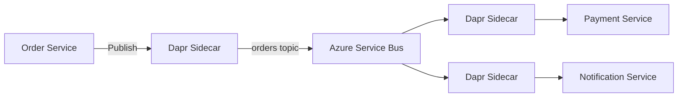

# How to Use Dapr Pub/Sub Messaging with Azure Container Apps

Author: [nawazdhandala](https://www.github.com/nawazdhandala)

Tags: Azure, Container Apps, Dapr, Pub/Sub, Messaging, Event-Driven, Service Bus

Description: Learn how to set up Dapr pub/sub messaging in Azure Container Apps using Azure Service Bus and other message brokers for event-driven architectures.

---

Event-driven architectures are one of the best ways to decouple microservices. Instead of service A directly calling service B, service A publishes an event, and any interested service subscribes to it. Dapr provides a pub/sub building block that abstracts the message broker behind a consistent API. On Azure Container Apps, you can configure Dapr pub/sub components that use Azure Service Bus, Redis Streams, or other brokers without writing broker-specific code.

## Why Use Dapr Pub/Sub?

Direct service-to-service calls create tight coupling. If the payment service is down, the order service fails too. With pub/sub, the order service publishes an "order-created" event and moves on. The payment service picks it up when it is available. Dapr adds a few things on top of raw message broker usage:

- A consistent API regardless of the underlying broker
- At-least-once delivery guarantees
- Automatic message envelope format with CloudEvents
- Topic-based routing
- Dead letter queues for failed messages
- Scoping to control which apps can publish and subscribe

## Step 1: Set Up Azure Service Bus

Azure Service Bus is the most common pub/sub backend for production workloads on Azure.

```bash
# Create a Service Bus namespace
az servicebus namespace create \
  --name my-servicebus-ns \
  --resource-group my-rg \
  --location eastus \
  --sku Standard

# Get the connection string
SB_CONN=$(az servicebus namespace authorization-rule keys list \
  --namespace-name my-servicebus-ns \
  --resource-group my-rg \
  --name RootManageSharedAccessKey \
  --query "primaryConnectionString" -o tsv)
```

You do not need to manually create topics. Dapr will create them automatically when a message is published.

## Step 2: Create the Dapr Pub/Sub Component

Configure the Dapr component in your Container Apps environment.

```yaml
# dapr-pubsub.yaml
componentType: pubsub.azure.servicebus.topics
version: v1
metadata:
  - name: connectionString
    secretRef: sb-connection
  - name: maxDeliveryCount
    value: "5"
  - name: lockDurationInSec
    value: "30"
  - name: defaultMessageTimeToLiveInSec
    value: "86400"
secrets:
  - name: sb-connection
    value: "<your-service-bus-connection-string>"
scopes:
  - order-service
  - payment-service
  - notification-service
```

Apply it to the environment.

```bash
# Create the Dapr pub/sub component
az containerapp env dapr-component set \
  --name my-env \
  --resource-group my-rg \
  --dapr-component-name pubsub \
  --yaml dapr-pubsub.yaml
```

## Step 3: Publish Events

From the order service, publish an event when an order is created.

```javascript
const axios = require('axios');

const DAPR_PORT = process.env.DAPR_HTTP_PORT || 3500;

// Publish an order-created event to the "orders" topic
async function publishOrderCreated(order) {
  const url = `http://localhost:${DAPR_PORT}/v1.0/publish/pubsub/orders`;

  await axios.post(url, {
    orderId: order.id,
    customerId: order.customerId,
    totalAmount: order.totalAmount,
    items: order.items,
    createdAt: new Date().toISOString()
  });

  console.log(`Published order-created event for order ${order.id}`);
}
```

The URL format is `http://localhost:{daprPort}/v1.0/publish/{pubsubName}/{topicName}`. The body is your event payload.

## Step 4: Subscribe to Events

Subscriber services need to tell Dapr which topics they want to listen to. There are two ways to do this: programmatic and declarative.

**Programmatic subscription** - Your app exposes an endpoint that Dapr calls to discover subscriptions.

```javascript
const express = require('express');
const app = express();
app.use(express.json());

// Dapr calls this endpoint to discover subscriptions
app.get('/dapr/subscribe', (req, res) => {
  res.json([
    {
      pubsubname: 'pubsub',
      topic: 'orders',
      route: '/handle-order'
    }
  ]);
});

// This endpoint receives order events
app.post('/handle-order', async (req, res) => {
  const event = req.body.data;
  console.log(`Processing order ${event.orderId} for $${event.totalAmount}`);

  try {
    // Process the payment
    await processPayment(event.orderId, event.totalAmount);

    // Return 200 to acknowledge the message
    res.status(200).send();
  } catch (error) {
    console.error(`Failed to process order ${event.orderId}:`, error);

    // Return 500 to retry, or 404 to drop the message
    res.status(500).send();
  }
});

app.listen(4000, () => console.log('Payment service listening on port 4000'));
```

**Declarative subscription** - Define subscriptions in a YAML file instead of code.

```yaml
# subscription.yaml
apiVersion: dapr.io/v2alpha1
kind: Subscription
metadata:
  name: order-subscription
spec:
  pubsubname: pubsub
  topic: orders
  routes:
    default: /handle-order
scopes:
  - payment-service
```

## Step 5: Handle Multiple Topics

A service can subscribe to multiple topics. Here is a notification service that listens to both order and shipping events.

```javascript
const express = require('express');
const app = express();
app.use(express.json());

// Subscribe to both order and shipping topics
app.get('/dapr/subscribe', (req, res) => {
  res.json([
    {
      pubsubname: 'pubsub',
      topic: 'orders',
      route: '/notify-order'
    },
    {
      pubsubname: 'pubsub',
      topic: 'shipments',
      route: '/notify-shipment'
    }
  ]);
});

// Handle order notifications
app.post('/notify-order', async (req, res) => {
  const event = req.body.data;
  await sendEmail(event.customerId, `Order ${event.orderId} confirmed!`);
  res.status(200).send();
});

// Handle shipment notifications
app.post('/notify-shipment', async (req, res) => {
  const event = req.body.data;
  await sendEmail(event.customerId, `Order ${event.orderId} shipped! Tracking: ${event.trackingNumber}`);
  res.status(200).send();
});

app.listen(5000);
```

## Event Flow Architecture

Here is how events flow through the system.



## Step 6: Configure Dead Letter Topics

When a message fails processing after the maximum retry count, it should go to a dead letter topic instead of being lost.

```yaml
# dapr-pubsub.yaml with dead letter configuration
componentType: pubsub.azure.servicebus.topics
version: v1
metadata:
  - name: connectionString
    secretRef: sb-connection
  - name: maxDeliveryCount
    value: "5"
  - name: deadLetteringOnMessageExpiration
    value: "true"
secrets:
  - name: sb-connection
    value: "<your-connection-string>"
scopes:
  - order-service
  - payment-service
  - notification-service
```

You can also configure dead letter routing per subscription.

```yaml
# subscription with dead letter topic
apiVersion: dapr.io/v2alpha1
kind: Subscription
metadata:
  name: order-subscription
spec:
  pubsubname: pubsub
  topic: orders
  routes:
    default: /handle-order
  deadLetterTopic: orders-deadletter
scopes:
  - payment-service
```

## Step 7: Use CloudEvents Metadata

Dapr wraps all messages in the CloudEvents format. This provides standard metadata like event type, source, and timestamp.

```javascript
// The full event envelope received by subscribers
// Dapr wraps your payload in CloudEvents format automatically
app.post('/handle-order', (req, res) => {
  const cloudEvent = req.body;

  console.log('Event ID:', cloudEvent.id);
  console.log('Source:', cloudEvent.source);
  console.log('Type:', cloudEvent.type);
  console.log('Time:', cloudEvent.time);
  console.log('Data:', cloudEvent.data); // Your actual payload

  res.status(200).send();
});
```

## Troubleshooting Pub/Sub Issues

**Messages not being delivered:** Check that the subscriber's Dapr app ID is listed in the component's scopes. Also verify that the subscriber's `/dapr/subscribe` endpoint is returning the correct topic name.

**Duplicate message processing:** Dapr guarantees at-least-once delivery, not exactly-once. Your subscriber should be idempotent. Use the CloudEvent ID to detect and skip duplicate messages.

**Messages stuck in dead letter:** Check the Service Bus dead letter queue in the Azure portal. The dead letter reason will tell you why processing failed (e.g., max delivery count exceeded).

**High latency on message delivery:** If using Service Bus, check the namespace metrics for throttling. Upgrade to a Premium tier if you need higher throughput.

## Summary

Dapr pub/sub on Azure Container Apps provides a clean way to build event-driven microservices. Your code works against a simple publish/subscribe API, and the message broker is configured externally. This means you can start with Redis Streams for development and use Azure Service Bus for production without changing your application code. Combined with dead letter handling and CloudEvents support, Dapr pub/sub gives you a solid messaging foundation for distributed systems.
