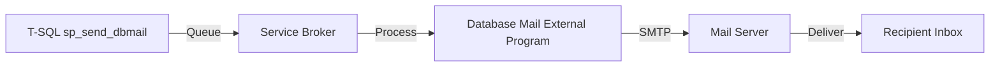

# How to Use Database Mail in Azure SQL Managed Instance

Author: [nawazdhandala](https://www.github.com/nawazdhandala)

Tags: Azure, SQL Managed Instance, Database Mail, Email Notifications, SQL Server, Automation

Description: Configure Database Mail on Azure SQL Managed Instance to send email notifications directly from your database for alerts, reports, and automated workflows.

---

Database Mail is one of those features that people take for granted in on-premises SQL Server but suddenly miss when they move to the cloud. Azure SQL Database does not support it at all, which forces teams to build external notification services. SQL Managed Instance, on the other hand, fully supports Database Mail, letting you send emails directly from T-SQL. This is incredibly useful for alerting on job failures, sending scheduled reports, and automating operational notifications.

## What is Database Mail?

Database Mail is a SQL Server component that sends email messages using SMTP. It runs asynchronously through Service Broker, which means sending an email does not block your stored procedure or query. Messages are queued and sent by a background process, so even if the SMTP server is temporarily unreachable, messages will be retried.

The architecture looks like this:



## Prerequisites

Before configuring Database Mail, you need:

- An Azure SQL Managed Instance (any tier)
- An SMTP server or service (SendGrid, Office 365, Gmail, Amazon SES, etc.)
- SMTP credentials (server address, port, username, password)
- Network connectivity from the Managed Instance to the SMTP server

The network part is important. Managed Instance runs inside a VNet, so outbound SMTP traffic (port 25, 587, or 465) must be allowed through the NSG and any firewalls. Many organizations block port 25 outbound, so using port 587 with TLS is usually the safer bet.

## Step 1: Enable Database Mail

Database Mail must be enabled at the instance level using the advanced options configuration:

```sql
-- Enable Database Mail at the instance level
-- This uses the sp_configure system stored procedure
EXEC sp_configure 'show advanced options', 1;
RECONFIGURE;

EXEC sp_configure 'Database Mail XPs', 1;
RECONFIGURE;

-- Verify it is enabled (run_value should be 1)
EXEC sp_configure 'Database Mail XPs';
```

## Step 2: Create a Mail Profile and Account

Database Mail uses profiles and accounts. A profile is a collection of accounts, and an account holds the SMTP server credentials. You can have multiple accounts in a profile for failover - if the first account's SMTP server is unreachable, Database Mail tries the next one.

```sql
-- Create a Database Mail account with SMTP settings
-- This example uses SendGrid, but any SMTP service works
EXEC msdb.dbo.sysmail_add_account_sp
    @account_name = 'SendGridAccount',
    @description = 'SendGrid SMTP account for notifications',
    @email_address = 'alerts@mycompany.com',
    @display_name = 'Database Alerts',
    @replyto_address = 'noreply@mycompany.com',
    @mailserver_name = 'smtp.sendgrid.net',
    @mailserver_type = 'SMTP',
    @port = 587,
    @enable_ssl = 1,
    @username = 'apikey',
    @password = 'SG.your_sendgrid_api_key_here';
```

Now create a profile and add the account to it:

```sql
-- Create a mail profile
EXEC msdb.dbo.sysmail_add_profile_sp
    @profile_name = 'AlertsProfile',
    @description = 'Profile for sending database alert emails';

-- Add the account to the profile with sequence number 1
-- Lower sequence numbers are tried first
EXEC msdb.dbo.sysmail_add_profileaccount_sp
    @profile_name = 'AlertsProfile',
    @account_name = 'SendGridAccount',
    @sequence_number = 1;
```

## Step 3: Set the Default Profile

Make the profile the default so any database user can send mail without specifying a profile name:

```sql
-- Grant access to the profile for the DatabaseMailUserRole
-- Setting is_default to 1 makes it the default profile
EXEC msdb.dbo.sysmail_add_principalprofile_sp
    @principal_id = 0,  -- 0 means public (all users)
    @profile_name = 'AlertsProfile',
    @is_default = 1;
```

## Step 4: Send a Test Email

Let us verify everything works:

```sql
-- Send a test email to verify the configuration
EXEC msdb.dbo.sp_send_dbmail
    @profile_name = 'AlertsProfile',
    @recipients = 'your.email@company.com',
    @subject = 'Test Email from Managed Instance',
    @body = 'If you are reading this, Database Mail is working correctly.',
    @body_format = 'TEXT';
```

Check the mail queue status to see if it was sent:

```sql
-- Check the status of sent emails
-- Look for the most recent entry
SELECT TOP 10
    mailitem_id,
    recipients,
    subject,
    sent_status,
    sent_date,
    send_request_date
FROM msdb.dbo.sysmail_allitems
ORDER BY send_request_date DESC;

-- If the email failed, check the event log for errors
SELECT TOP 10
    log_id,
    event_type,
    description,
    log_date
FROM msdb.dbo.sysmail_event_log
ORDER BY log_date DESC;
```

## Practical Use Cases

### Alerting on SQL Agent Job Failures

One of the most common uses is notifying the team when a SQL Agent job fails:

```sql
-- Create a stored procedure that sends an alert email
-- Call this from the "on failure" step of your SQL Agent jobs
CREATE PROCEDURE dbo.SendJobFailureAlert
    @JobName NVARCHAR(128),
    @StepName NVARCHAR(128),
    @ErrorMessage NVARCHAR(MAX)
AS
BEGIN
    DECLARE @subject NVARCHAR(255) = 'Job Failure: ' + @JobName;
    DECLARE @body NVARCHAR(MAX) =
        'The following SQL Agent job has failed:' + CHAR(13) + CHAR(10) +
        'Job: ' + @JobName + CHAR(13) + CHAR(10) +
        'Step: ' + @StepName + CHAR(13) + CHAR(10) +
        'Error: ' + @ErrorMessage + CHAR(13) + CHAR(10) +
        'Time: ' + CONVERT(NVARCHAR(30), GETDATE(), 120);

    EXEC msdb.dbo.sp_send_dbmail
        @profile_name = 'AlertsProfile',
        @recipients = 'dba-team@company.com',
        @subject = @subject,
        @body = @body,
        @body_format = 'TEXT';
END;
```

### Sending HTML Reports

You can send formatted HTML emails with query results:

```sql
-- Send an HTML email with a table of recent errors
DECLARE @tableHTML NVARCHAR(MAX);

-- Build an HTML table from query results
SET @tableHTML =
    N'<html><body>' +
    N'<h2>Daily Error Summary</h2>' +
    N'<table border="1" cellpadding="5">' +
    N'<tr><th>Error Number</th><th>Message</th><th>Count</th><th>Last Seen</th></tr>';

SELECT @tableHTML = @tableHTML +
    N'<tr><td>' + CAST(error_number AS NVARCHAR(10)) +
    N'</td><td>' + LEFT(message, 100) +
    N'</td><td>' + CAST(occurrence_count AS NVARCHAR(10)) +
    N'</td><td>' + CONVERT(NVARCHAR(30), last_occurrence, 120) +
    N'</td></tr>'
FROM dbo.ErrorLog
WHERE last_occurrence > DATEADD(DAY, -1, GETDATE())
ORDER BY occurrence_count DESC;

SET @tableHTML = @tableHTML + N'</table></body></html>';

EXEC msdb.dbo.sp_send_dbmail
    @profile_name = 'AlertsProfile',
    @recipients = 'ops-team@company.com',
    @subject = 'Daily Error Report',
    @body = @tableHTML,
    @body_format = 'HTML';
```

### Attaching Query Results as CSV

Database Mail can attach query results directly:

```sql
-- Send query results as an attached CSV file
-- The query runs at send time and results are attached
EXEC msdb.dbo.sp_send_dbmail
    @profile_name = 'AlertsProfile',
    @recipients = 'finance@company.com',
    @subject = 'Monthly Revenue Report',
    @body = 'Please find the monthly revenue report attached.',
    @query = 'SELECT OrderDate, ProductName, Revenue FROM dbo.MonthlyRevenue ORDER BY OrderDate',
    @attach_query_result_as_file = 1,
    @query_attachment_filename = 'monthly_revenue.csv',
    @query_result_separator = ',',
    @query_result_header = 1,
    @query_result_no_padding = 1;
```

## Configuring SMTP Providers

Here are the settings for common SMTP providers:

### Office 365

```sql
EXEC msdb.dbo.sysmail_add_account_sp
    @account_name = 'Office365Account',
    @email_address = 'alerts@mycompany.com',
    @mailserver_name = 'smtp.office365.com',
    @port = 587,
    @enable_ssl = 1,
    @username = 'alerts@mycompany.com',
    @password = 'YourPassword';
```

### Gmail

```sql
EXEC msdb.dbo.sysmail_add_account_sp
    @account_name = 'GmailAccount',
    @email_address = 'myalerts@gmail.com',
    @mailserver_name = 'smtp.gmail.com',
    @port = 587,
    @enable_ssl = 1,
    @username = 'myalerts@gmail.com',
    @password = 'YourAppPassword';
```

### Amazon SES

```sql
EXEC msdb.dbo.sysmail_add_account_sp
    @account_name = 'SESAccount',
    @email_address = 'alerts@mycompany.com',
    @mailserver_name = 'email-smtp.us-east-1.amazonaws.com',
    @port = 587,
    @enable_ssl = 1,
    @username = 'YourSESSmtpUsername',
    @password = 'YourSESSmtpPassword';
```

## Troubleshooting

If emails are not being sent, check these common issues:

1. **NSG blocking outbound SMTP**: Make sure port 587 (or your SMTP port) is allowed outbound in the Managed Instance subnet's NSG
2. **Incorrect credentials**: Double-check the SMTP username and password in the account configuration
3. **Service Broker not running**: Database Mail depends on Service Broker. Verify it is enabled on msdb
4. **Queue stuck**: If emails are stuck in the queue, try restarting Database Mail

```sql
-- Restart Database Mail if the queue is stuck
EXEC msdb.dbo.sysmail_stop_sp;
EXEC msdb.dbo.sysmail_start_sp;

-- Check if Service Broker is enabled on msdb
SELECT name, is_broker_enabled
FROM sys.databases
WHERE name = 'msdb';
```

Database Mail on Managed Instance is a straightforward way to add email capabilities to your database workflows without building external services. It handles queuing, retries, and asynchronous delivery so your T-SQL code does not block while waiting for SMTP responses. Combined with SQL Agent jobs, it gives you a solid foundation for automated monitoring and reporting.
