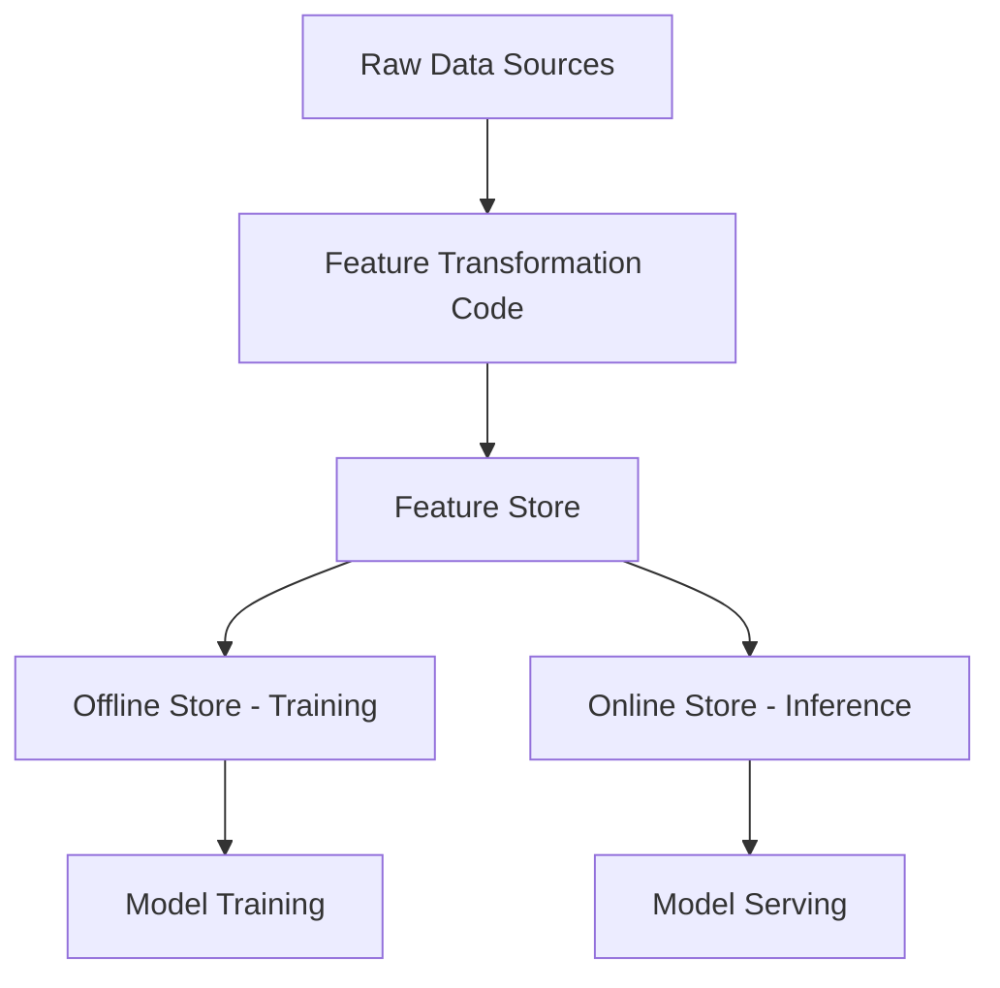

# How to Use Feature Stores in Azure Machine Learning for ML Feature Management

Author: [nawazdhandala](https://www.github.com/nawazdhandala)

Tags: Azure Machine Learning, Feature Store, MLOps, Feature Engineering, Data Management, Machine Learning, Python

Description: Learn how to use Azure Machine Learning feature stores to manage, share, and serve ML features across training and inference pipelines.

---

Feature engineering is usually the most time-consuming part of any machine learning project. Data scientists spend weeks creating features, only to find that the same features were already built by another team, or that the features used in training do not match what is available in production. Feature stores solve these problems by providing a centralized repository for ML features that can be shared across teams and served consistently in both training and inference.

Azure Machine Learning's managed feature store gives you a way to define features as reusable assets, materialize them on a schedule, and serve them at low latency for online predictions. In this guide, I will walk through setting up a feature store, defining feature sets, materializing them, and using them in both training and online serving.

## What Is a Feature Store?

A feature store sits between your raw data sources and your ML models. It provides:

- **Feature definitions**: Code that transforms raw data into ML-ready features
- **Materialization**: Pre-computed feature values stored for fast retrieval
- **Point-in-time correctness**: Historical feature values for training without data leakage
- **Online serving**: Low-latency feature retrieval for real-time inference
- **Feature discovery**: A catalog where teams can find and reuse existing features



## Prerequisites

- Azure Machine Learning workspace (v2)
- Azure CLI with the `ml` extension (v2.22.0+)
- Python 3.9+ with `azure-ai-ml` and `azureml-featurestore`
- An Azure storage account for feature materialization

```bash
# Install required packages
pip install azure-ai-ml azureml-featurestore mltable
```

## Step 1: Create a Feature Store

A feature store is a special type of Azure ML workspace optimized for feature management.

```python
# create_feature_store.py - Create an Azure ML Feature Store
from azure.ai.ml import MLClient
from azure.ai.ml.entities import (
    FeatureStore,
    FeatureStoreEntity,
    MaterializationStore
)
from azure.identity import DefaultAzureCredential

# Create the ML client for your subscription
credential = DefaultAzureCredential()
ml_client = MLClient(
    credential=credential,
    subscription_id="your-subscription-id",
    resource_group_name="rg-ml"
)

# Define the feature store
feature_store = FeatureStore(
    name="production-feature-store",
    location="eastus",
    # Offline store for batch/training feature retrieval
    offline_store=MaterializationStore(
        type="azure_data_lake_gen2",
        target="/subscriptions/{sub}/resourceGroups/rg-ml/providers/"
               "Microsoft.Storage/storageAccounts/featurestoredata"
    ),
    # Online store for low-latency feature retrieval
    online_store=MaterializationStore(
        type="redis",
        target="/subscriptions/{sub}/resourceGroups/rg-ml/providers/"
               "Microsoft.Cache/redis/feature-cache"
    )
)

# Create the feature store
ml_client.feature_stores.begin_create(feature_store).result()
print("Feature store created successfully")
```

## Step 2: Define Feature Store Entities

Entities represent the business objects that features are associated with. For example, "customer" or "transaction" would be entities. Each entity has a join key that uniquely identifies a record.

```python
# define_entities.py - Define feature store entities
from azure.ai.ml.entities import FeatureStoreEntity, DataColumn, DataColumnType

# Create a client for the feature store
fs_client = MLClient(
    credential=credential,
    subscription_id="your-subscription-id",
    resource_group_name="rg-ml",
    workspace_name="production-feature-store"
)

# Define a customer entity
customer_entity = FeatureStoreEntity(
    name="customer",
    version="1",
    description="Customer entity for feature lookup",
    # The join key is used to retrieve features for a specific customer
    index_columns=[
        DataColumn(name="customer_id", type=DataColumnType.STRING)
    ],
    stage="Development",
    tags={"team": "fraud-detection"}
)

# Register the entity in the feature store
fs_client.feature_store_entities.begin_create_or_update(customer_entity).result()

# Define a transaction entity
transaction_entity = FeatureStoreEntity(
    name="transaction",
    version="1",
    description="Transaction entity for real-time features",
    index_columns=[
        DataColumn(name="transaction_id", type=DataColumnType.STRING)
    ],
    stage="Development"
)

fs_client.feature_store_entities.begin_create_or_update(transaction_entity).result()
print("Entities registered successfully")
```

## Step 3: Create Feature Sets

Feature sets define the transformations that convert raw data into ML features. Each feature set is tied to an entity and contains one or more features.

Create the transformation code:

```python
# featuresets/customer_features/transformation.py
# This code defines how raw data is transformed into features
from pyspark.sql import DataFrame
from pyspark.sql import functions as F
from pyspark.sql.window import Window

def transform(raw_data: DataFrame) -> DataFrame:
    """
    Transform raw transaction data into customer-level features.
    These features capture spending patterns and behavior.
    """
    # Calculate aggregate features per customer
    customer_features = raw_data.groupBy("customer_id").agg(
        # Spending features
        F.avg("amount").alias("avg_transaction_amount"),
        F.sum("amount").alias("total_spend_30d"),
        F.count("*").alias("transaction_count_30d"),
        F.max("amount").alias("max_transaction_amount"),
        F.stddev("amount").alias("stddev_transaction_amount"),

        # Behavioral features
        F.countDistinct("merchant_category").alias("unique_merchants_30d"),
        F.avg(
            F.when(F.col("is_online") == 1, 1).otherwise(0)
        ).alias("online_transaction_ratio"),

        # Time-based features
        F.avg(
            F.hour("transaction_timestamp")
        ).alias("avg_transaction_hour"),

        # Get the most recent transaction timestamp
        F.max("transaction_timestamp").alias("last_transaction_time")
    )

    return customer_features
```

Define the feature set specification:

```yaml
# featuresets/customer_features/spec.yaml
$schema: https://azuremlschemas.azureedge.net/latest/featureSetSpec.schema.json
source:
  type: mltable
  path: azureml://datastores/transactions/paths/raw/
  timestamp_column:
    name: transaction_timestamp
feature_transformation_code:
  path: ./transformation.py
  transformer_class: transform
features:
  - name: avg_transaction_amount
    type: float
  - name: total_spend_30d
    type: float
  - name: transaction_count_30d
    type: integer
  - name: max_transaction_amount
    type: float
  - name: stddev_transaction_amount
    type: float
  - name: unique_merchants_30d
    type: integer
  - name: online_transaction_ratio
    type: float
  - name: avg_transaction_hour
    type: float
index_columns:
  - name: customer_id
    type: string
```

Register the feature set:

```python
# register_featureset.py - Register the feature set in the feature store
from azure.ai.ml.entities import FeatureSet, FeatureSetSpecification

customer_featureset = FeatureSet(
    name="customer_transaction_features",
    version="1",
    description="Customer spending and behavioral features derived from transactions",
    entities=["azureml:customer:1"],
    stage="Development",
    specification=FeatureSetSpecification(path="./featuresets/customer_features/"),
    tags={"source": "transactions", "team": "fraud-detection"}
)

fs_client.feature_sets.begin_create_or_update(customer_featureset).result()
print("Feature set registered")
```

## Step 4: Materialize Features

Materialization pre-computes feature values and stores them for fast retrieval. Set up a materialization schedule:

```python
# materialize.py - Configure feature materialization
from azure.ai.ml.entities import (
    MaterializationSettings,
    MaterializationComputeResource,
    RecurrenceTrigger
)

# Configure materialization settings
materialization_settings = MaterializationSettings(
    # Compute to use for materialization jobs
    resource=MaterializationComputeResource(instance_type="Standard_E8s_v3"),
    # Schedule: materialize every 6 hours
    schedule=RecurrenceTrigger(
        frequency="Hour",
        interval=6,
        start_time="2026-02-16T00:00:00Z"
    ),
    # Materialize to both offline and online stores
    offline_enabled=True,
    online_enabled=True
)

# Update the feature set with materialization settings
featureset = fs_client.feature_sets.get(
    name="customer_transaction_features",
    version="1"
)
featureset.materialization_settings = materialization_settings
fs_client.feature_sets.begin_create_or_update(featureset).result()

# Trigger an initial backfill materialization
fs_client.feature_sets.begin_backfill(
    name="customer_transaction_features",
    version="1",
    feature_window_start_time="2025-01-01T00:00:00Z",
    feature_window_end_time="2026-02-16T00:00:00Z"
).result()

print("Materialization configured and backfill started")
```

## Step 5: Use Features in Training

When training a model, retrieve features from the offline store with point-in-time correctness:

```python
# training.py - Use feature store features for model training
from azureml.featurestore import FeatureStoreClient, get_offline_features
import pandas as pd

# Initialize the feature store client
fs_client = FeatureStoreClient(
    credential=credential,
    subscription_id="your-subscription-id",
    resource_group_name="rg-ml",
    workspace_name="production-feature-store"
)

# Load the training labels (customer_id + timestamp + label)
training_labels = pd.DataFrame({
    "customer_id": ["C001", "C002", "C003", "C004", "C005"],
    "event_timestamp": pd.to_datetime([
        "2026-01-15", "2026-01-20", "2026-02-01",
        "2026-02-05", "2026-02-10"
    ]),
    "is_fraud": [0, 1, 0, 0, 1]
})

# Define which features to retrieve
features = [
    FeatureStoreClient.feature(
        "customer_transaction_features:1",  # feature_set:version
        ["avg_transaction_amount", "total_spend_30d",
         "transaction_count_30d", "online_transaction_ratio",
         "unique_merchants_30d"]
    )
]

# Get features with point-in-time join
# This ensures each training example gets features as they existed
# at the time of the event, preventing data leakage
training_data = get_offline_features(
    features=features,
    observation_data=training_labels,
    timestamp_column="event_timestamp"
)

print(f"Training data shape: {training_data.shape}")
print(training_data.head())
```

## Step 6: Serve Features Online

For real-time inference, retrieve features from the online store:

```python
# online_serving.py - Retrieve features at low latency for inference
from azureml.featurestore import FeatureStoreClient, get_online_features

fs_client = FeatureStoreClient(
    credential=credential,
    subscription_id="your-subscription-id",
    resource_group_name="rg-ml",
    workspace_name="production-feature-store"
)

# Look up features for a specific customer during real-time inference
features = get_online_features(
    feature_set="customer_transaction_features:1",
    entity_key={"customer_id": "C001"},
    feature_names=[
        "avg_transaction_amount",
        "total_spend_30d",
        "transaction_count_30d",
        "online_transaction_ratio"
    ]
)

print(f"Features for customer C001: {features}")
# Use these features as input to your model for prediction
```

## Summary

Azure ML feature stores bring order to the chaos of feature engineering. By centralizing feature definitions, automating materialization, and providing consistent serving for both training and inference, they eliminate the common problems of feature duplication, training-serving skew, and data leakage. The workflow is: define entities and feature sets with transformation code, register them in the store, configure materialization schedules, and retrieve features through the offline API for training or the online API for real-time predictions. The initial setup takes effort, but the long-term payoff in reproducibility and team collaboration is substantial.
