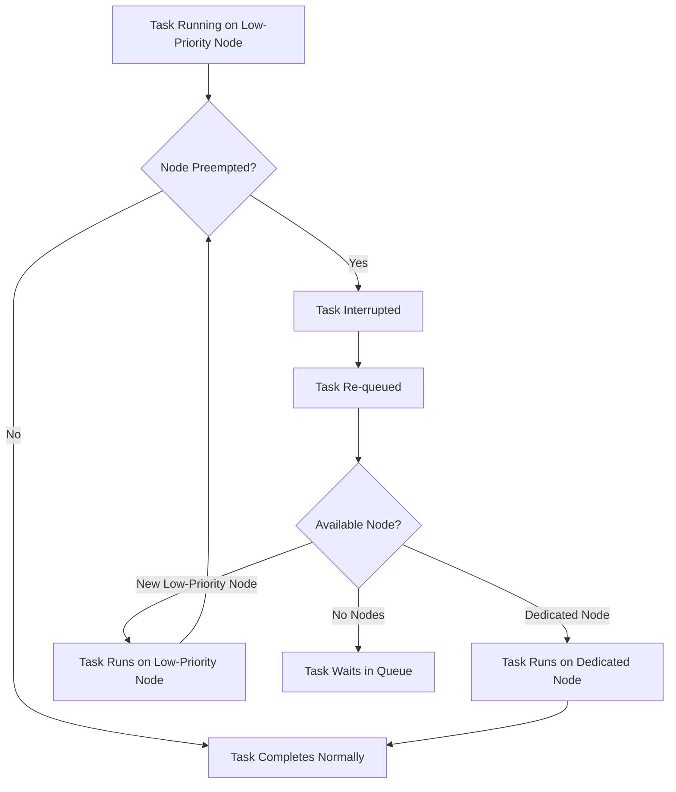

# How to Use Low-Priority Nodes in Azure Batch Pools to Reduce Costs

Author: [nawazdhandala](https://www.github.com/nawazdhandala)

Tags: Azure, Batch, Low-Priority, Spot VMs, Cost Optimization, HPC, Cloud Computing

Description: Learn how to use low-priority and spot nodes in Azure Batch pools to reduce compute costs by up to 80% while managing preemption gracefully.

---

Azure Batch compute costs can add up fast, especially for large-scale workloads that need dozens or hundreds of VMs. Low-priority nodes (also called spot VMs) let you tap into Azure's excess capacity at a steep discount - up to 80% less than regular pricing. The catch is that Azure can reclaim these nodes at any time when it needs the capacity back. This post shows you how to use low-priority nodes effectively, handle preemptions, and design your workloads to tolerate interruptions.

## What Are Low-Priority Nodes?

Low-priority nodes in Azure Batch use surplus VM capacity in Azure datacenters. Because this capacity is not guaranteed, it is offered at a significant discount. When Azure needs the capacity back for pay-as-you-go customers, low-priority nodes are preempted (stopped and deallocated).

The pricing difference is substantial. For example, a Standard_D4s_v3 VM might cost around $0.192/hour as a dedicated node, but only about $0.038/hour as a low-priority node. That is an 80% savings.

## When to Use Low-Priority Nodes

Low-priority nodes are a good fit for:

- **Batch processing** that can tolerate interruptions and resume from checkpoints
- **Rendering** workloads where individual frames can be re-rendered
- **Data processing** pipelines with idempotent tasks
- **Dev/test** environments where uptime is not critical
- **Embarrassingly parallel** workloads where each task is independent

They are not suitable for:

- Long-running tasks that cannot be checkpointed
- Time-sensitive workloads with strict deadlines
- Stateful workloads that lose progress on preemption

## Step 1: Create a Pool with Low-Priority Nodes

You can create a pool that uses only low-priority nodes or a mix of dedicated and low-priority.

```bash
# Create a pool with only low-priority nodes
az batch pool create \
  --id low-pri-pool \
  --vm-size Standard_D4s_v3 \
  --target-low-priority-nodes 20 \
  --target-dedicated-nodes 0 \
  --image "canonical:0001-com-ubuntu-server-jammy:22_04-lts" \
  --node-agent-sku-id "batch.node.ubuntu 22.04"
```

For a mixed pool with both dedicated and low-priority nodes.

```bash
# Create a mixed pool - dedicated for reliability, low-priority for cost savings
az batch pool create \
  --id mixed-pool \
  --vm-size Standard_D4s_v3 \
  --target-dedicated-nodes 5 \
  --target-low-priority-nodes 15 \
  --image "canonical:0001-com-ubuntu-server-jammy:22_04-lts" \
  --node-agent-sku-id "batch.node.ubuntu 22.04"
```

This gives you 5 dedicated nodes that will always be available, plus 15 low-priority nodes for extra capacity.

## Step 2: Handle Preemption

When a low-priority node is preempted, Azure Batch takes the following actions:

1. The node's state changes to "preempted"
2. Any running task on the node is interrupted
3. The task is re-queued and rescheduled on another available node
4. The node is removed from the pool

Batch automatically retries preempted tasks, but you need to make sure your tasks are idempotent - running the same task twice should produce the same result.

Check for preempted nodes.

```bash
# List nodes and check for preemption
az batch node list \
  --pool-id mixed-pool \
  --filter "state eq 'preempted'" \
  --output table

# View preemption events in node history
az batch node show \
  --pool-id mixed-pool \
  --node-id tvm-12345 \
  --query "recentTasks"
```

## Step 3: Design Tasks for Preemption Tolerance

The key to using low-priority nodes successfully is making your tasks resilient to interruption.

**Short tasks:** Break large jobs into small tasks. If a task takes 5 minutes and gets preempted at minute 4, you lose 4 minutes of work. If the same work is split into 5 one-minute tasks, a preemption loses at most 1 minute.

**Checkpointing:** For tasks that take longer, implement checkpointing. Save intermediate progress to Azure Storage so the task can resume from the last checkpoint when retried.

Here is a Python example of a task with checkpointing.

```python
import os
import json
from azure.storage.blob import BlobServiceClient

def load_checkpoint(blob_client, task_id):
    """Load the last checkpoint from Azure Storage"""
    try:
        blob = blob_client.get_blob_client("checkpoints", f"{task_id}.json")
        data = blob.download_blob().readall()
        return json.loads(data)
    except Exception:
        # No checkpoint found, start from the beginning
        return {"last_processed_index": 0, "partial_results": []}

def save_checkpoint(blob_client, task_id, state):
    """Save checkpoint to Azure Storage"""
    blob = blob_client.get_blob_client("checkpoints", f"{task_id}.json")
    blob.upload_blob(json.dumps(state), overwrite=True)

def process_data(task_id, data_items):
    blob_client = BlobServiceClient.from_connection_string(os.environ["STORAGE_CONN"])

    # Resume from last checkpoint
    checkpoint = load_checkpoint(blob_client, task_id)
    start_index = checkpoint["last_processed_index"]
    results = checkpoint["partial_results"]

    for i in range(start_index, len(data_items)):
        # Process one item
        result = heavy_computation(data_items[i])
        results.append(result)

        # Save checkpoint every 100 items
        if (i + 1) % 100 == 0:
            save_checkpoint(blob_client, task_id, {
                "last_processed_index": i + 1,
                "partial_results": results
            })

    return results
```

## Step 4: Configure Retry Policies

Set up retry policies so preempted tasks are automatically rescheduled.

```json
{
  "id": "resilient-task",
  "commandLine": "/bin/bash -c 'python3 process.py'",
  "constraints": {
    "maxTaskRetryCount": 5,
    "maxWallClockTime": "PT2H"
  },
  "environmentSettings": [
    {
      "name": "STORAGE_CONN",
      "value": "DefaultEndpointsProtocol=https;AccountName=..."
    }
  ]
}
```

Set `maxTaskRetryCount` to a value that accounts for potential multiple preemptions. Five retries is usually enough.

## Step 5: Use Autoscale to Maintain Target Capacity

When low-priority nodes are preempted, the pool shrinks. An autoscale formula can request replacement nodes.

```
// Maintain the desired capacity by requesting new low-priority nodes
$taskSlotsPerNode = 4;
$neededNodes = ceil($PendingTasks / $taskSlotsPerNode);

// Always try to have at least 3 dedicated nodes for reliability
$TargetDedicatedNodes = min(5, max(3, $neededNodes));

// Use low-priority for the rest of the demand
$remainingNeed = max(0, $neededNodes - $TargetDedicatedNodes);
$TargetLowPriorityNodes = min(50, $remainingNeed);
```

This formula ensures that even if all low-priority nodes are preempted, the dedicated nodes keep processing tasks. When low-priority capacity becomes available again, the pool scales back up.

## Step 6: Monitor Cost Savings

Track how much you are saving with low-priority nodes.

```bash
# View pool usage statistics
az batch pool usage-metrics list \
  --start-time "2026-02-01T00:00:00Z" \
  --end-time "2026-02-16T00:00:00Z" \
  --output table
```

You can also estimate savings by comparing the dedicated price against the low-priority price for your VM size.

| VM Size | Dedicated Price/hr | Low-Priority Price/hr | Savings |
|---------|-------------------|----------------------|---------|
| Standard_D2s_v3 | $0.096 | $0.019 | 80% |
| Standard_D4s_v3 | $0.192 | $0.038 | 80% |
| Standard_D8s_v3 | $0.384 | $0.077 | 80% |
| Standard_F16s_v2 | $0.680 | $0.136 | 80% |

Note: Prices vary by region and change over time. Check Azure pricing for current rates.

## Step 7: Manage Preemption Risk

The preemption rate varies by VM size, region, and time. Some strategies to reduce risk:

**Use less popular VM sizes:** VMs in high demand are preempted more frequently. Consider using a slightly different size that has more available capacity.

**Spread across multiple pools:** Create pools in different regions to reduce the chance that all nodes are preempted simultaneously.

**Set the right mix:** For critical workloads, use a higher ratio of dedicated to low-priority nodes. A common starting point is 20% dedicated and 80% low-priority.

## Preemption Handling Flow



## Common Pitfalls

**Not setting maxTaskRetryCount:** Without retries, a preempted task is marked as failed. Set a reasonable retry count.

**Large, monolithic tasks:** A task that runs for 8 hours and gets preempted at hour 7 loses all progress. Break it into smaller pieces or implement checkpointing.

**Ignoring preemption in progress tracking:** If you track progress by completed tasks, preempted and retried tasks can cause confusing counts. Track unique task IDs and final states.

**Overcommitting to low-priority:** If your workload has a hard deadline, do not rely solely on low-priority nodes. Preemption events can cascade and significantly delay completion.

## Summary

Low-priority nodes in Azure Batch can cut your compute costs by up to 80%, making large-scale batch processing much more affordable. The trade-off is the risk of preemption, but with proper task design - short tasks, checkpointing, retry policies, and a mix of dedicated and low-priority nodes - you can handle interruptions gracefully. Start with a mixed pool, monitor preemption rates for your chosen VM size and region, and adjust the ratio based on your experience.
