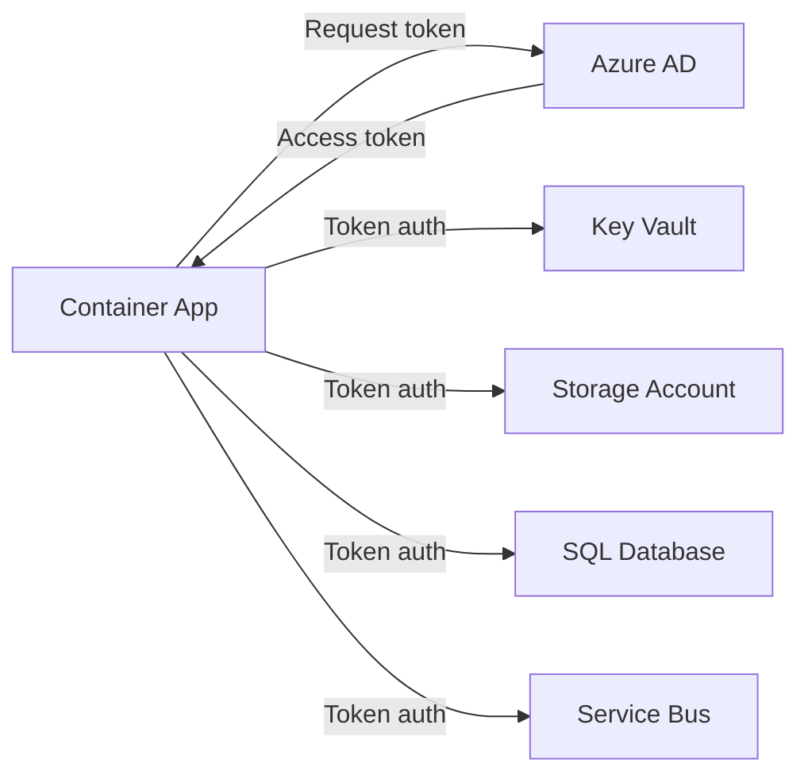

# How to Use Managed Identity with Azure Container Apps to Access Azure Services

Author: [nawazdhandala](https://www.github.com/nawazdhandala)

Tags: Azure, Container Apps, Managed Identity, Security, Azure AD, Key Vault, RBAC

Description: Learn how to configure system-assigned and user-assigned managed identities on Azure Container Apps to securely access Azure services without storing credentials.

---

Storing connection strings and API keys in environment variables or configuration files is a security liability. If those credentials leak, an attacker has direct access to your databases and services. Managed identities eliminate this problem entirely. Instead of using credentials, your container app authenticates to Azure services using an identity managed by Azure Active Directory. There are no passwords to rotate, no secrets to leak, and no credentials to store. This post shows you how to set it up.

## What Is Managed Identity?

A managed identity is an Azure AD identity automatically managed by Azure. Your container app uses this identity to authenticate to any Azure service that supports Azure AD authentication - Key Vault, Storage, SQL Database, Service Bus, and many others.

There are two types:

- **System-assigned:** Tied to the lifecycle of the container app. Created when you enable it, deleted when the container app is deleted. Each app gets its own identity.
- **User-assigned:** Created as a standalone resource. Can be shared across multiple container apps. You manage its lifecycle independently.

## Step 1: Enable System-Assigned Managed Identity

The simplest approach is a system-assigned identity. Enable it with one command.

```bash
# Enable system-assigned managed identity
az containerapp identity assign \
  --name my-api \
  --resource-group my-rg \
  --system-assigned

# Verify the identity was created
az containerapp identity show \
  --name my-api \
  --resource-group my-rg
```

The output includes the `principalId` and `tenantId` of the identity. You will need the `principalId` to grant permissions.

## Step 2: Grant the Identity Access to Azure Services

A managed identity is useless without permissions. Use Azure RBAC to grant the identity access to the services it needs.

**Access Azure Key Vault:**

```bash
# Get the identity's principal ID
PRINCIPAL_ID=$(az containerapp identity show \
  --name my-api \
  --resource-group my-rg \
  --query "principalId" -o tsv)

# Grant access to Key Vault secrets
az keyvault set-policy \
  --name my-keyvault \
  --object-id $PRINCIPAL_ID \
  --secret-permissions get list
```

**Access Azure Storage:**

```bash
# Assign the Storage Blob Data Contributor role
az role assignment create \
  --assignee $PRINCIPAL_ID \
  --role "Storage Blob Data Contributor" \
  --scope "/subscriptions/{sub-id}/resourceGroups/my-rg/providers/Microsoft.Storage/storageAccounts/mystorageaccount"
```

**Access Azure SQL Database:**

```bash
# Assign the identity as an Azure AD admin on the SQL server
az sql server ad-admin create \
  --server-name my-sql-server \
  --resource-group my-rg \
  --display-name "container-app-identity" \
  --object-id $PRINCIPAL_ID
```

**Access Azure Service Bus:**

```bash
# Assign the Service Bus Data Sender role
az role assignment create \
  --assignee $PRINCIPAL_ID \
  --role "Azure Service Bus Data Sender" \
  --scope "/subscriptions/{sub-id}/resourceGroups/my-rg/providers/Microsoft.ServiceBus/namespaces/my-sb-namespace"
```

## Step 3: Use the Identity in Your Application

Your application code uses the Azure Identity SDK to get tokens. The SDK automatically detects the managed identity when running in Azure Container Apps.

Here is a Node.js example that reads secrets from Key Vault using managed identity.

```javascript
const { SecretClient } = require('@azure/keyvault-secrets');
const { DefaultAzureCredential } = require('@azure/identity');

// DefaultAzureCredential automatically uses managed identity in Azure
// and falls back to other methods (CLI, VS Code) for local development
const credential = new DefaultAzureCredential();
const vaultUrl = 'https://my-keyvault.vault.azure.net';
const client = new SecretClient(vaultUrl, credential);

async function getDatabaseConnection() {
  // Retrieve the secret from Key Vault without storing any credentials
  const secret = await client.getSecret('db-connection-string');
  return secret.value;
}
```

Here is a Python example that accesses Azure Blob Storage.

```python
from azure.identity import DefaultAzureCredential
from azure.storage.blob import BlobServiceClient

# No credentials needed - managed identity handles authentication
credential = DefaultAzureCredential()

blob_service = BlobServiceClient(
    account_url="https://mystorageaccount.blob.core.windows.net",
    credential=credential
)

def upload_report(container_name, blob_name, data):
    # Upload a blob using managed identity for authentication
    container_client = blob_service.get_container_client(container_name)
    container_client.upload_blob(blob_name, data, overwrite=True)
```

## Step 4: Create and Use a User-Assigned Managed Identity

User-assigned identities are useful when multiple apps need the same permissions, or when you want the identity to persist independently of the container app.

```bash
# Create a user-assigned managed identity
az identity create \
  --name my-shared-identity \
  --resource-group my-rg \
  --location eastus

# Get the identity's resource ID and client ID
IDENTITY_ID=$(az identity show \
  --name my-shared-identity \
  --resource-group my-rg \
  --query "id" -o tsv)

IDENTITY_CLIENT_ID=$(az identity show \
  --name my-shared-identity \
  --resource-group my-rg \
  --query "clientId" -o tsv)

# Assign the identity to the container app
az containerapp identity assign \
  --name my-api \
  --resource-group my-rg \
  --user-assigned $IDENTITY_ID

# Assign the same identity to another app
az containerapp identity assign \
  --name my-worker \
  --resource-group my-rg \
  --user-assigned $IDENTITY_ID
```

When using a user-assigned identity in your code, specify the client ID.

```javascript
const { DefaultAzureCredential } = require('@azure/identity');

// Specify which user-assigned identity to use via the client ID
const credential = new DefaultAzureCredential({
  managedIdentityClientId: process.env.AZURE_CLIENT_ID
});
```

Set the client ID as an environment variable on your container app.

```bash
# Set the identity client ID as an environment variable
az containerapp update \
  --name my-api \
  --resource-group my-rg \
  --set-env-vars "AZURE_CLIENT_ID=$IDENTITY_CLIENT_ID"
```

## Step 5: Pull Container Images with Managed Identity

Instead of storing registry passwords, use managed identity to pull images from Azure Container Registry.

```bash
# Grant the identity AcrPull role on the container registry
az role assignment create \
  --assignee $PRINCIPAL_ID \
  --role AcrPull \
  --scope "/subscriptions/{sub-id}/resourceGroups/my-rg/providers/Microsoft.ContainerRegistry/registries/myregistry"

# Configure the container app to use managed identity for image pulls
az containerapp registry set \
  --name my-api \
  --resource-group my-rg \
  --server myregistry.azurecr.io \
  --identity system
```

This eliminates the need for registry passwords in your container app configuration.

## Step 6: Access Azure SQL with Managed Identity

Connecting to Azure SQL with managed identity requires a slightly different approach since you need an access token.

```javascript
const { DefaultAzureCredential } = require('@azure/identity');
const sql = require('mssql');

async function connectToSql() {
  const credential = new DefaultAzureCredential();

  // Get an access token for Azure SQL
  const tokenResponse = await credential.getToken(
    'https://database.windows.net/.default'
  );

  // Connect using the token instead of a password
  const config = {
    server: 'my-sql-server.database.windows.net',
    database: 'my-database',
    authentication: {
      type: 'azure-active-directory-access-token',
      options: {
        token: tokenResponse.token
      }
    },
    options: {
      encrypt: true,
      trustServerCertificate: false
    }
  };

  const pool = await sql.connect(config);
  return pool;
}
```

## Identity Architecture

Here is how managed identity fits into the overall architecture.



The container app never sees or handles any credentials. It requests a token from Azure AD, and Azure AD issues a short-lived token that is valid for the specific service being accessed.

## Best Practices

1. **Use system-assigned identity for single-purpose apps.** It is simpler and the lifecycle is automatically managed.

2. **Use user-assigned identity when sharing across apps.** This avoids duplicating role assignments for each app.

3. **Follow the principle of least privilege.** Grant only the specific permissions needed. Do not assign "Contributor" when "Reader" is sufficient.

4. **Use DefaultAzureCredential for local development compatibility.** It falls back to Azure CLI credentials locally, so the same code works in both environments.

5. **Remove old identity assignments.** When you decommission an app, clean up any role assignments to avoid stale permissions.

## Troubleshooting

**Token acquisition fails:** Make sure the managed identity is enabled and the role assignments have propagated (this can take up to 10 minutes for new assignments).

**403 Forbidden on Azure service:** The identity does not have the required role. Check the role assignments and make sure the scope is correct.

**Wrong identity used with multiple user-assigned identities:** When multiple identities are assigned, specify the client ID explicitly in your code or via the `AZURE_CLIENT_ID` environment variable.

## Summary

Managed identity is the most secure way to authenticate from Azure Container Apps to other Azure services. It eliminates the need for storing and rotating credentials, simplifies your configuration, and reduces the attack surface. Start by enabling a system-assigned identity, grant it the permissions it needs, and use the Azure Identity SDK in your application code. The setup takes minutes and the security improvement is significant.
