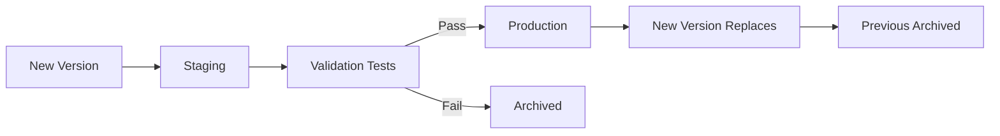

# How to Use MLflow in Azure Databricks to Track and Deploy ML Models

Author: [nawazdhandala](https://www.github.com/nawazdhandala)

Tags: MLflow, Azure Databricks, Machine Learning, Model Deployment, ML Tracking, MLOps, Azure

Description: A hands-on guide to using MLflow in Azure Databricks for experiment tracking, model versioning, and deploying ML models to production.

---

Training a machine learning model once in a notebook is straightforward. The challenge starts when you need to track hundreds of experiments, compare results across different hyperparameters, version your models, and deploy the best one to production. MLflow handles all of this, and it comes pre-installed and deeply integrated in Azure Databricks.

In this post, I will walk through the complete MLflow workflow - from tracking experiments during training to registering models and serving them in production.

## What MLflow Provides

MLflow is an open-source platform with four main components:

- **Tracking** - log parameters, metrics, and artifacts from your training runs
- **Models** - package models in a standard format that can be deployed anywhere
- **Model Registry** - version and manage models through staging and production lifecycle stages
- **Projects** - package ML code for reproducible runs (less commonly used in Databricks)

In Azure Databricks, MLflow is managed for you. The tracking server, artifact storage, and model registry are all handled automatically.

## Step 1: Track an Experiment

Let us start by training a model and tracking the experiment with MLflow.

```python
# train_model.py - Train and track a classification model with MLflow
import mlflow
import mlflow.sklearn
from sklearn.model_selection import train_test_split
from sklearn.ensemble import RandomForestClassifier
from sklearn.metrics import accuracy_score, precision_score, recall_score, f1_score
import pandas as pd

# Set the experiment name (creates it if it does not exist)
mlflow.set_experiment("/Experiments/customer-churn-prediction")

# Load the training data from a Delta table
df = spark.table("production.ml.customer_features").toPandas()

# Prepare features and target
X = df.drop(columns=["customer_id", "churned"])
y = df["churned"]

# Split into training and test sets
X_train, X_test, y_train, y_test = train_test_split(
    X, y, test_size=0.2, random_state=42
)

# Start an MLflow run to track this training session
with mlflow.start_run(run_name="random_forest_v1") as run:

    # Define hyperparameters
    n_estimators = 200
    max_depth = 10
    min_samples_split = 5

    # Log hyperparameters
    mlflow.log_param("n_estimators", n_estimators)
    mlflow.log_param("max_depth", max_depth)
    mlflow.log_param("min_samples_split", min_samples_split)
    mlflow.log_param("test_size", 0.2)

    # Train the model
    model = RandomForestClassifier(
        n_estimators=n_estimators,
        max_depth=max_depth,
        min_samples_split=min_samples_split,
        random_state=42
    )
    model.fit(X_train, y_train)

    # Make predictions on the test set
    y_pred = model.predict(X_test)

    # Calculate and log metrics
    accuracy = accuracy_score(y_test, y_pred)
    precision = precision_score(y_test, y_pred)
    recall = recall_score(y_test, y_pred)
    f1 = f1_score(y_test, y_pred)

    mlflow.log_metric("accuracy", accuracy)
    mlflow.log_metric("precision", precision)
    mlflow.log_metric("recall", recall)
    mlflow.log_metric("f1_score", f1)

    # Log the model artifact
    mlflow.sklearn.log_model(
        model,
        artifact_path="model",
        input_example=X_test.head(5)
    )

    # Log feature importances as an artifact
    importances = pd.DataFrame({
        "feature": X.columns,
        "importance": model.feature_importances_
    }).sort_values("importance", ascending=False)

    importances.to_csv("/tmp/feature_importances.csv", index=False)
    mlflow.log_artifact("/tmp/feature_importances.csv")

    print(f"Run ID: {run.info.run_id}")
    print(f"Accuracy: {accuracy:.4f}")
    print(f"F1 Score: {f1:.4f}")
```

After running this, you can view the experiment in the Databricks UI by clicking **Experiments** in the sidebar.

## Step 2: Run Multiple Experiments

The real power of tracking shows when you compare multiple runs with different configurations.

```python
# hyperparameter_search.py - Run multiple experiments to compare configurations

# Define hyperparameter combinations to test
param_grid = [
    {"n_estimators": 100, "max_depth": 5, "min_samples_split": 2},
    {"n_estimators": 200, "max_depth": 10, "min_samples_split": 5},
    {"n_estimators": 300, "max_depth": 15, "min_samples_split": 10},
    {"n_estimators": 500, "max_depth": 20, "min_samples_split": 2},
    {"n_estimators": 200, "max_depth": None, "min_samples_split": 5},
]

mlflow.set_experiment("/Experiments/customer-churn-prediction")

results = []

for i, params in enumerate(param_grid):
    with mlflow.start_run(run_name=f"rf_config_{i+1}"):
        # Log all hyperparameters
        for key, value in params.items():
            mlflow.log_param(key, value)

        # Train the model with these parameters
        model = RandomForestClassifier(
            n_estimators=params["n_estimators"],
            max_depth=params["max_depth"],
            min_samples_split=params["min_samples_split"],
            random_state=42
        )
        model.fit(X_train, y_train)

        # Evaluate
        y_pred = model.predict(X_test)
        accuracy = accuracy_score(y_test, y_pred)
        f1 = f1_score(y_test, y_pred)

        # Log metrics
        mlflow.log_metric("accuracy", accuracy)
        mlflow.log_metric("f1_score", f1)

        # Log the model
        mlflow.sklearn.log_model(model, "model")

        results.append({"config": i+1, "accuracy": accuracy, "f1": f1})
        print(f"Config {i+1}: accuracy={accuracy:.4f}, f1={f1:.4f}")
```

In the Experiments UI, you can now compare all runs side by side, sort by any metric, and visualize how different hyperparameters affect performance.

## Step 3: Register the Best Model

Once you have identified the best model from your experiments, register it in the Model Registry.

```python
# register_model.py - Register the best model in the Model Registry

# Find the best run based on f1_score
best_run = mlflow.search_runs(
    experiment_names=["/Experiments/customer-churn-prediction"],
    order_by=["metrics.f1_score DESC"],
    max_results=1
).iloc[0]

best_run_id = best_run["run_id"]
print(f"Best run: {best_run_id} with f1_score: {best_run['metrics.f1_score']:.4f}")

# Register the model from the best run
model_uri = f"runs:/{best_run_id}/model"
registered_model = mlflow.register_model(
    model_uri=model_uri,
    name="customer-churn-model"
)

print(f"Model registered: {registered_model.name}, version: {registered_model.version}")
```

### Using Unity Catalog for Model Registry

If you have Unity Catalog set up, register models there for centralized governance.

```python
# Register in Unity Catalog (three-level namespace)
mlflow.set_registry_uri("databricks-uc")

registered_model = mlflow.register_model(
    model_uri=f"runs:/{best_run_id}/model",
    name="production.ml_models.customer_churn"
)
```

## Step 4: Manage Model Lifecycle

The Model Registry supports lifecycle stages to manage model promotion.

```python
# promote_model.py - Manage model versions and stages
from mlflow.tracking import MlflowClient

client = MlflowClient()

# Transition the model to staging for testing
client.transition_model_version_stage(
    name="customer-churn-model",
    version=1,
    stage="Staging"
)

# After validation, promote to production
client.transition_model_version_stage(
    name="customer-churn-model",
    version=1,
    stage="Production"
)

# Add a description to the model version
client.update_model_version(
    name="customer-churn-model",
    version=1,
    description="Random Forest model with 200 trees, max_depth=10. F1 score: 0.87 on test set."
)
```

The typical workflow is: **None -> Staging -> Production -> Archived**.



## Step 5: Load and Use the Model

Load a registered model for inference.

```python
# inference.py - Load a registered model and make predictions

# Load the production version of the model
model = mlflow.pyfunc.load_model("models:/customer-churn-model/Production")

# Make predictions on new data
new_customers = spark.table("production.ml.new_customer_features").toPandas()
new_customers_features = new_customers.drop(columns=["customer_id"])

predictions = model.predict(new_customers_features)

# Add predictions back to the DataFrame
new_customers["churn_prediction"] = predictions
print(new_customers[["customer_id", "churn_prediction"]].head(10))
```

### Batch Inference with Spark

For large-scale batch inference, use the Spark UDF approach.

```python
# batch_inference.py - Run inference on large datasets using Spark

# Load model as a Spark UDF for distributed inference
predict_udf = mlflow.pyfunc.spark_udf(
    spark,
    model_uri="models:/customer-churn-model/Production",
    result_type="integer"
)

# Apply to a large Delta table
predictions_df = spark.table("production.ml.new_customer_features") \
    .withColumn("churn_prediction", predict_udf(*feature_columns))

# Write predictions to a Delta table
predictions_df.write.format("delta").mode("overwrite") \
    .saveAsTable("production.ml.churn_predictions")
```

## Step 6: Serve the Model

Databricks offers Model Serving for real-time inference via REST API.

1. Go to **Serving** in the Databricks sidebar
2. Click **Create serving endpoint**
3. Select your registered model and version
4. Configure the endpoint size and scaling

Once deployed, you can call the endpoint.

```python
# call_endpoint.py - Make real-time predictions via the serving endpoint
import requests
import json

# Endpoint URL
url = "https://<databricks-instance>/serving-endpoints/customer-churn/invocations"

# Authentication
headers = {
    "Authorization": "Bearer <databricks-token>",
    "Content-Type": "application/json"
}

# Input data for prediction
payload = {
    "dataframe_records": [
        {"tenure_months": 24, "monthly_charges": 85.5, "total_charges": 2052.0, "contract_type": 1}
    ]
}

response = requests.post(url, headers=headers, data=json.dumps(payload))
print(response.json())
```

## Autologging

For supported frameworks, MLflow can automatically log parameters, metrics, and models without explicit logging calls.

```python
# Enable autologging for scikit-learn
mlflow.sklearn.autolog()

# Now just train normally - everything is logged automatically
with mlflow.start_run():
    model = RandomForestClassifier(n_estimators=200, max_depth=10)
    model.fit(X_train, y_train)
    # Parameters, metrics, model, and feature importances are all logged automatically
```

Autologging supports scikit-learn, TensorFlow, PyTorch, XGBoost, LightGBM, and more.

## Wrapping Up

MLflow in Azure Databricks covers the full ML lifecycle from experimentation to production. Use experiment tracking to log and compare training runs. Use the Model Registry to version and promote models through staging to production. Use Model Serving for real-time inference or Spark UDFs for batch predictions. The integration with Databricks is seamless - no infrastructure to manage, no separate services to configure. Start by adding `mlflow.start_run()` to your training notebooks, and build up to a full MLOps pipeline as your team's needs grow.
