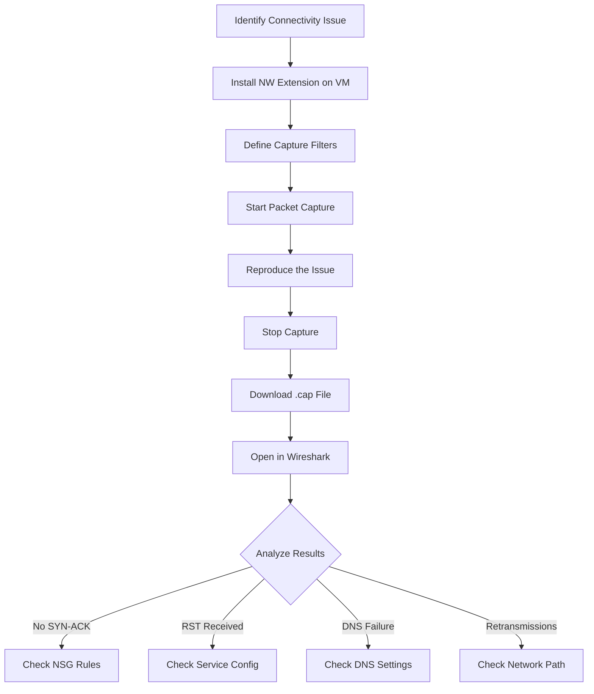

# How to Use Network Watcher Packet Capture to Troubleshoot VM Connectivity

Author: [nawazdhandala](https://www.github.com/nawazdhandala)

Tags: Azure, Network Watcher, Packet Capture, Troubleshooting, VM Connectivity, Networking, Diagnostics

Description: Learn how to use Azure Network Watcher packet capture to diagnose and troubleshoot virtual machine connectivity problems in your Azure environment.

---

When a virtual machine in Azure cannot reach a service, an endpoint, or another VM, the usual suspects are NSG rules, routing tables, and firewall settings. But sometimes you have checked all of those and the problem persists. That is when packet capture becomes invaluable. Azure Network Watcher provides a built-in packet capture feature that lets you inspect the actual network traffic on a VM without installing third-party tools.

In this post, I will walk through how to set up and use Network Watcher packet capture, apply useful filters, download the capture file, and analyze results with Wireshark.

## What Network Watcher Packet Capture Does

Packet capture records the raw network packets going in and out of a VM's network interface. It gives you visibility into what is actually happening at the network layer, not just what your configuration says should happen. This is the difference between looking at your firewall rules and seeing whether packets are actually arriving.

Network Watcher runs the capture agent on the VM itself (via the Network Watcher extension) and stores the results in a storage account or locally on the VM.

## Prerequisites

Before you can use packet capture, a few things need to be in place:

1. **Network Watcher enabled** in the region where your VM resides (it is enabled by default for most subscriptions)
2. **Network Watcher Agent VM extension** installed on the target VM
3. **A storage account** if you want to save captures outside the VM
4. **Contributor or Network Contributor role** on the subscription

## Step 1: Install the Network Watcher Extension

The packet capture agent runs as a VM extension. Install it if it is not already there.

For Linux VMs:

```bash
# Install the Network Watcher extension on a Linux VM
az vm extension set \
  --resource-group myResourceGroup \
  --vm-name myLinuxVM \
  --name NetworkWatcherAgentLinux \
  --publisher Microsoft.Azure.NetworkWatcher
```

For Windows VMs:

```bash
# Install the Network Watcher extension on a Windows VM
az vm extension set \
  --resource-group myResourceGroup \
  --vm-name myWindowsVM \
  --name NetworkWatcherAgentWindows \
  --publisher Microsoft.Azure.NetworkWatcher
```

You can verify the extension is installed:

```bash
# List extensions to confirm installation
az vm extension list \
  --resource-group myResourceGroup \
  --vm-name myLinuxVM \
  --output table
```

## Step 2: Start a Packet Capture

With the extension in place, you can start a capture. Here is a basic capture that runs for 5 minutes and stores the result in a storage account:

```bash
# Start a packet capture session with a 5-minute time limit
az network watcher packet-capture create \
  --resource-group myResourceGroup \
  --vm myLinuxVM \
  --name myCapture01 \
  --storage-account myStorageAccount \
  --time-limit 300
```

The `--time-limit` is in seconds. If you do not set it, the capture runs until you stop it manually or it hits the default limit of 18000 seconds (5 hours).

## Step 3: Apply Filters

Capturing all traffic on a busy VM generates huge files quickly. Filters let you focus on the traffic you care about.

Suppose you are troubleshooting why your VM cannot reach a specific backend service on port 443. You can filter for just that traffic:

```bash
# Start capture with a filter for specific destination IP and port
az network watcher packet-capture create \
  --resource-group myResourceGroup \
  --vm myLinuxVM \
  --name myFilteredCapture \
  --storage-account myStorageAccount \
  --time-limit 300 \
  --filters '[{
    "protocol": "TCP",
    "remoteIPAddress": "10.0.2.50",
    "remotePort": "443"
  }]'
```

You can combine multiple filters. Each filter acts as an OR condition - packets matching any filter are captured.

Common filter scenarios:

- **Specific port:** Filter by `localPort` or `remotePort` to isolate traffic to a single service
- **Specific IP:** Filter by `remoteIPAddress` to see traffic to/from one host
- **Protocol:** Filter by `TCP`, `UDP`, or leave blank for all protocols

## Step 4: Check Capture Status

While a capture is running, you can check its status:

```bash
# Check the status of a running packet capture
az network watcher packet-capture show \
  --location eastus \
  --name myCapture01
```

The status will be `Running`, `Stopped`, `Failed`, or `Error`. If it fails, the output usually includes a reason, such as insufficient storage space or extension issues.

## Step 5: Stop and Download the Capture

When you have captured enough data, stop the session:

```bash
# Stop the packet capture session
az network watcher packet-capture stop \
  --location eastus \
  --name myCapture01
```

The capture file (.cap format) will be in your storage account under the `networkwatcherpacketcapture` container. Download it:

```bash
# Download the capture file from the storage account
az storage blob download \
  --account-name myStorageAccount \
  --container-name networkwatcherpacketcapture \
  --name "myCapture01.cap" \
  --file ./myCapture01.cap \
  --auth-mode login
```

## Step 6: Analyze with Wireshark

Open the downloaded .cap file in Wireshark. Here are some useful Wireshark display filters for common troubleshooting scenarios:

**TCP connection failures (SYN without SYN-ACK):**
```
tcp.flags.syn == 1 && tcp.flags.ack == 0
```

**Retransmissions (indicating packet loss):**
```
tcp.analysis.retransmission
```

**Traffic to a specific IP:**
```
ip.dst == 10.0.2.50
```

**DNS queries:**
```
dns
```

## Troubleshooting Common Connectivity Issues

### VM Cannot Reach an External Service

Start the capture, then trigger the connection from the VM. In Wireshark, look for:

1. **DNS resolution** - Is the DNS query returning the expected IP?
2. **TCP SYN sent** - Is the VM sending the initial connection request?
3. **No SYN-ACK received** - If you see SYN packets going out but no response, the traffic is being blocked somewhere (NSG, firewall, or UDR sending traffic to a black hole).
4. **RST received** - If you get a TCP RST, the destination is actively refusing the connection.

### VM Cannot Reach Another VM in the Same VNet

This is usually an NSG issue. In the capture, look for:

1. SYN packets leaving the source VM
2. Whether those SYN packets arrive at the destination (run captures on both VMs simultaneously)
3. If packets leave the source but never arrive at the destination, there is likely an NSG blocking traffic

### Intermittent Connectivity

For intermittent issues, run a longer capture (set time-limit higher) and look for patterns in Wireshark:

- TCP retransmissions clustered at specific times
- ICMP unreachable messages
- TCP window size going to zero (indicating the receiver is overwhelmed)

## Flow Diagram for Packet Capture Workflow



## Limitations to Be Aware Of

- **Maximum file size** defaults to 1 GB. You can adjust with `--total-bytes-per-session`.
- **Maximum capture duration** is 5 hours.
- **Performance impact** is minimal but not zero. On very high-throughput VMs, packet capture may drop some packets.
- **VM must be running.** You cannot capture on a stopped or deallocated VM.
- **Extension required.** The Network Watcher agent must be installed and healthy.

## Using Packet Capture from the Portal

If you prefer the portal, navigate to Network Watcher > Packet capture > Add. The portal provides a visual interface for defining filters and selecting the storage account. The experience is essentially the same as CLI but with a point-and-click interface.

## Cleaning Up

Do not forget to delete old packet captures. They consume storage and can contain sensitive data:

```bash
# Delete a completed packet capture session
az network watcher packet-capture delete \
  --location eastus \
  --name myCapture01
```

Also remove the capture files from your storage account when you are done analyzing them.

## Summary

Packet capture is one of those tools you do not need often, but when you do, nothing else gives you the same level of insight. When NSG rules look correct and routing seems fine but connectivity still fails, capturing the actual packets tells you exactly what is happening. Combine it with other Network Watcher tools like IP Flow Verify and Connection Troubleshoot for a complete diagnostic workflow. The key is to use targeted filters so you capture only the traffic you need, making analysis faster and keeping file sizes manageable.
