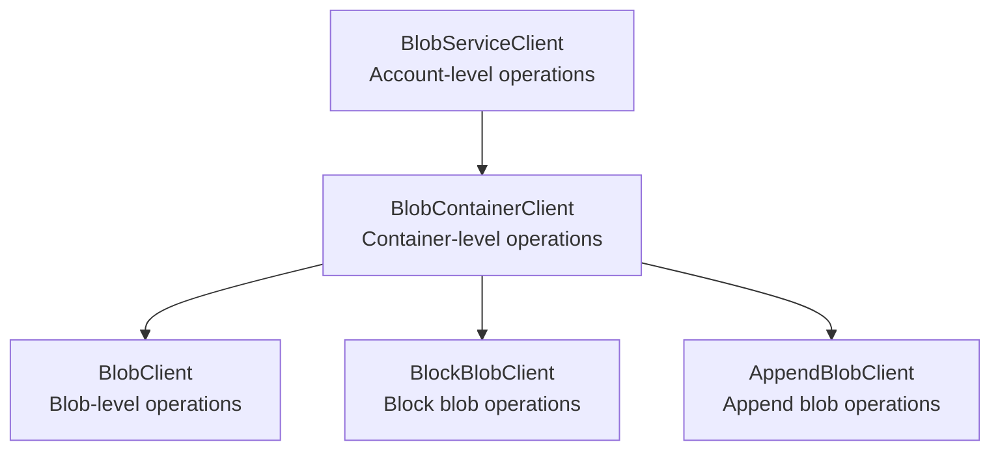

# How to Use the Azure Storage Client Library for .NET to Manage Containers and Blobs

Author: [nawazdhandala](https://www.github.com/nawazdhandala)

Tags: Azure, .NET, Blob Storage, C#, Azure SDK, Cloud Development, Storage Management

Description: A practical guide to using the Azure.Storage.Blobs .NET SDK to create containers, upload and download blobs, and manage storage resources in C# applications.

---

The Azure.Storage.Blobs NuGet package is the official .NET library for working with Azure Blob Storage. It is used in everything from ASP.NET web applications to console apps, background workers, and Azure Functions. This guide walks through the most common operations with production-quality C# code examples that you can adapt for your own projects.

## Installation

Add the required NuGet packages to your project:

```bash
# Install the Azure Storage Blobs package and Azure Identity for authentication
dotnet add package Azure.Storage.Blobs
dotnet add package Azure.Identity
```

The `Azure.Storage.Blobs` package provides the storage client classes. `Azure.Identity` provides `DefaultAzureCredential` for passwordless authentication using managed identities or Azure CLI.

## Authentication

The recommended approach is `DefaultAzureCredential`, which works across development and production environments:

```csharp
using Azure.Storage.Blobs;
using Azure.Identity;

// DefaultAzureCredential tries managed identity in Azure, Azure CLI locally
// No connection strings or keys needed
var credential = new DefaultAzureCredential();
var blobServiceClient = new BlobServiceClient(
    new Uri("https://mystorageaccount.blob.core.windows.net"),
    credential
);
```

For local development with a connection string:

```csharp
// Connection string approach - only for local development
// Never hardcode connection strings in production code
var connectionString = Environment.GetEnvironmentVariable("AZURE_STORAGE_CONNECTION_STRING");
var blobServiceClient = new BlobServiceClient(connectionString);
```

## Understanding the Client Hierarchy

The SDK has three main client classes that form a hierarchy:



- **BlobServiceClient**: Account-level operations (list containers, get account info)
- **BlobContainerClient**: Container-level operations (create/delete container, list blobs)
- **BlobClient**: Blob-level operations (upload, download, delete, get properties)

You can create any client directly without going through the parent:

```csharp
// Create a container client directly
var containerClient = new BlobContainerClient(
    new Uri("https://mystorageaccount.blob.core.windows.net/my-container"),
    new DefaultAzureCredential()
);

// Create a blob client directly
var blobClient = new BlobClient(
    new Uri("https://mystorageaccount.blob.core.windows.net/my-container/data.json"),
    new DefaultAzureCredential()
);
```

## Container Operations

### Create a Container

```csharp
var containerClient = blobServiceClient.GetBlobContainerClient("my-data");

// Create the container if it doesn't exist
// PublicAccessType.None means no anonymous access
await containerClient.CreateIfNotExistsAsync(
    publicAccessType: Azure.Storage.Blobs.Models.PublicAccessType.None
);

Console.WriteLine($"Container '{containerClient.Name}' is ready");
```

### List All Containers

```csharp
// List all containers in the storage account
await foreach (var container in blobServiceClient.GetBlobContainersAsync())
{
    Console.WriteLine($"Container: {container.Name}");
    Console.WriteLine($"  Last Modified: {container.Properties.LastModified}");
    Console.WriteLine($"  Public Access: {container.Properties.PublicAccess}");
}
```

### Delete a Container

```csharp
// Delete a container and all its blobs
await blobServiceClient.DeleteBlobContainerAsync("old-data");
```

## Uploading Blobs

### Upload from a File

```csharp
using Azure.Storage.Blobs.Models;

var containerClient = blobServiceClient.GetBlobContainerClient("my-data");
var blobClient = containerClient.GetBlobClient("reports/2026/february.pdf");

// Upload a local file with content type
var uploadOptions = new BlobUploadOptions
{
    HttpHeaders = new BlobHttpHeaders
    {
        ContentType = "application/pdf"
    }
};

await blobClient.UploadAsync("/data/february-report.pdf", uploadOptions);
Console.WriteLine($"Uploaded to {blobClient.Uri}");
```

### Upload from a Stream

```csharp
// Upload data from a memory stream
// Useful for generating content on the fly
var data = new { name = "Azure Storage", version = "12.0" };
var json = System.Text.Json.JsonSerializer.Serialize(data);
var bytes = System.Text.Encoding.UTF8.GetBytes(json);

using var stream = new MemoryStream(bytes);
var blobClient = containerClient.GetBlobClient("config/settings.json");

await blobClient.UploadAsync(stream, new BlobUploadOptions
{
    HttpHeaders = new BlobHttpHeaders
    {
        ContentType = "application/json"
    },
    // Overwrite if the blob already exists
    Conditions = null
});
```

### Upload from a String

```csharp
// Upload text content using BinaryData
var textContent = "Log entry: Application started at " + DateTime.UtcNow;
var blobClient = containerClient.GetBlobClient("logs/startup.log");

await blobClient.UploadAsync(
    BinaryData.FromString(textContent),
    overwrite: true
);
```

### Upload a Large File with Transfer Options

```csharp
// Configure parallel upload for large files
var largeBlobClient = containerClient.GetBlobClient("backups/database.bak");

var transferOptions = new StorageTransferOptions
{
    // Maximum size of each block to upload
    MaximumTransferSize = 64 * 1024 * 1024,    // 64 MB
    // Number of parallel upload streams
    MaximumConcurrency = 8,
    // Threshold for switching from single upload to block upload
    InitialTransferSize = 64 * 1024 * 1024      // 64 MB
};

await largeBlobClient.UploadAsync("/data/database.bak", new BlobUploadOptions
{
    TransferOptions = transferOptions,
    HttpHeaders = new BlobHttpHeaders
    {
        ContentType = "application/octet-stream"
    }
});
```

## Downloading Blobs

### Download to a File

```csharp
var blobClient = containerClient.GetBlobClient("reports/2026/february.pdf");

// Download to a local file
await blobClient.DownloadToAsync("/tmp/february-report.pdf");
Console.WriteLine("Downloaded successfully");
```

### Download to Memory

```csharp
// Download a blob's content into memory
var blobClient = containerClient.GetBlobClient("config/settings.json");
BlobDownloadResult result = await blobClient.DownloadContentAsync();

// Access the content as a string
string jsonContent = result.Content.ToString();
Console.WriteLine($"Content: {jsonContent}");

// Or access as bytes
byte[] bytes = result.Content.ToArray();
Console.WriteLine($"Size: {bytes.Length} bytes");
```

### Stream a Download

```csharp
// Stream a large blob without loading it all into memory
var blobClient = containerClient.GetBlobClient("data/large-dataset.csv");
BlobDownloadStreamingResult download = await blobClient.DownloadStreamingAsync();

using var reader = new StreamReader(download.Content);
int lineCount = 0;

// Process line by line
while (await reader.ReadLineAsync() is string line)
{
    lineCount++;
    // Process each line
    if (lineCount % 10000 == 0)
    {
        Console.WriteLine($"Processed {lineCount} lines...");
    }
}

Console.WriteLine($"Total lines: {lineCount}");
```

## Listing Blobs

### List All Blobs in a Container

```csharp
// List all blobs with their properties
await foreach (var blob in containerClient.GetBlobsAsync())
{
    Console.WriteLine($"{blob.Name}");
    Console.WriteLine($"  Size: {blob.Properties.ContentLength} bytes");
    Console.WriteLine($"  Type: {blob.Properties.ContentType}");
    Console.WriteLine($"  Tier: {blob.Properties.AccessTier}");
    Console.WriteLine($"  Modified: {blob.Properties.LastModified}");
}
```

### List Blobs with a Prefix

```csharp
// List blobs under a specific virtual directory
await foreach (var blob in containerClient.GetBlobsAsync(prefix: "reports/2026/"))
{
    Console.WriteLine($"{blob.Name} - {blob.Properties.ContentLength} bytes");
}
```

### List by Hierarchy (Virtual Directories)

```csharp
// Walk the virtual directory structure
// This shows immediate children only (blobs and "subdirectories")
await foreach (var item in containerClient.GetBlobsByHierarchyAsync(delimiter: "/", prefix: "data/"))
{
    if (item.IsPrefix)
    {
        // This is a virtual directory
        Console.WriteLine($"Directory: {item.Prefix}");
    }
    else
    {
        // This is a blob
        Console.WriteLine($"Blob: {item.Blob.Name}");
    }
}
```

## Blob Properties and Metadata

```csharp
var blobClient = containerClient.GetBlobClient("reports/2026/february.pdf");

// Get blob properties
BlobProperties properties = await blobClient.GetPropertiesAsync();
Console.WriteLine($"Name: {blobClient.Name}");
Console.WriteLine($"Size: {properties.ContentLength}");
Console.WriteLine($"Content Type: {properties.ContentType}");
Console.WriteLine($"Created: {properties.CreatedOn}");
Console.WriteLine($"Last Modified: {properties.LastModified}");
Console.WriteLine($"ETag: {properties.ETag}");
Console.WriteLine($"Tier: {properties.AccessTier}");

// Set custom metadata
var metadata = new Dictionary<string, string>
{
    { "author", "engineering-team" },
    { "department", "analytics" },
    { "reviewed", "true" }
};
await blobClient.SetMetadataAsync(metadata);

// Read metadata back
properties = await blobClient.GetPropertiesAsync();
foreach (var kvp in properties.Metadata)
{
    Console.WriteLine($"  {kvp.Key}: {kvp.Value}");
}
```

## Deleting Blobs

```csharp
// Delete a single blob
var blobClient = containerClient.GetBlobClient("temp/scratch.txt");
await blobClient.DeleteIfExistsAsync();

// Delete a blob and its snapshots
await blobClient.DeleteIfExistsAsync(
    snapshotsOption: DeleteSnapshotsOption.IncludeSnapshots
);

// Batch delete blobs matching a prefix
int deleted = 0;
await foreach (var blob in containerClient.GetBlobsAsync(prefix: "temp/"))
{
    await containerClient.DeleteBlobIfExistsAsync(blob.Name);
    deleted++;
}
Console.WriteLine($"Deleted {deleted} blobs");
```

## Error Handling

```csharp
using Azure;

try
{
    var blobClient = containerClient.GetBlobClient("nonexistent.txt");
    await blobClient.DownloadContentAsync();
}
catch (RequestFailedException ex) when (ex.Status == 404)
{
    Console.WriteLine("Blob not found");
}
catch (RequestFailedException ex) when (ex.Status == 403)
{
    Console.WriteLine("Access denied - check your permissions");
}
catch (RequestFailedException ex) when (ex.Status == 409)
{
    Console.WriteLine("Conflict - blob may be leased or container is being deleted");
}
catch (RequestFailedException ex)
{
    Console.WriteLine($"Storage error: {ex.Status} - {ex.Message}");
}
```

## Generating SAS URLs

```csharp
using Azure.Storage.Sas;

var blobClient = containerClient.GetBlobClient("reports/2026/february.pdf");

// Generate a read-only SAS URL valid for 1 hour
// Requires the BlobClient to be created with a storage key or user delegation key
if (blobClient.CanGenerateSasUri)
{
    var sasBuilder = new BlobSasBuilder
    {
        BlobContainerName = "my-data",
        BlobName = "reports/2026/february.pdf",
        Resource = "b",  // "b" for blob
        ExpiresOn = DateTimeOffset.UtcNow.AddHours(1)
    };
    sasBuilder.SetPermissions(BlobSasPermissions.Read);

    Uri sasUri = blobClient.GenerateSasUri(sasBuilder);
    Console.WriteLine($"SAS URL: {sasUri}");
}
```

## Putting It All Together

Here is a complete example of a simple file management service:

```csharp
public class BlobStorageService
{
    private readonly BlobContainerClient _container;

    public BlobStorageService(string accountUrl, string containerName)
    {
        // Initialize with DefaultAzureCredential for passwordless auth
        var credential = new DefaultAzureCredential();
        var serviceClient = new BlobServiceClient(new Uri(accountUrl), credential);
        _container = serviceClient.GetBlobContainerClient(containerName);
    }

    public async Task<string> UploadFileAsync(string localPath, string blobPath)
    {
        var blobClient = _container.GetBlobClient(blobPath);
        await blobClient.UploadAsync(localPath, overwrite: true);
        return blobClient.Uri.ToString();
    }

    public async Task DownloadFileAsync(string blobPath, string localPath)
    {
        var blobClient = _container.GetBlobClient(blobPath);
        await blobClient.DownloadToAsync(localPath);
    }

    public async Task<bool> ExistsAsync(string blobPath)
    {
        var blobClient = _container.GetBlobClient(blobPath);
        return await blobClient.ExistsAsync();
    }

    public async Task DeleteAsync(string blobPath)
    {
        await _container.DeleteBlobIfExistsAsync(blobPath);
    }
}
```

The Azure.Storage.Blobs SDK for .NET is well-designed and follows modern async patterns throughout. Start with `DefaultAzureCredential`, learn the three client types, and you will have everything you need for most blob storage operations. The SDK handles retry logic, connection pooling, and parallel transfers internally, so you can focus on your application logic instead of storage plumbing.
