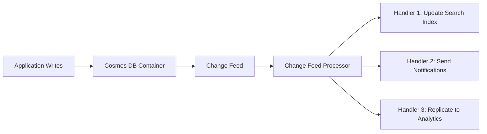
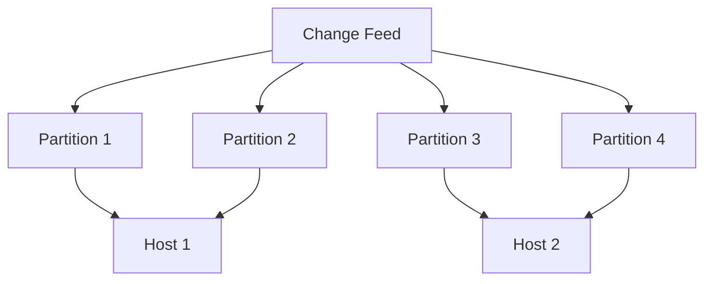

# How to Use the Change Feed Processor in Azure Cosmos DB

Author: [nawazdhandala](https://www.github.com/nawazdhandala)

Tags: Azure, Cosmos DB, Change Feed, Event-Driven, Real-Time Processing, .NET SDK

Description: Build real-time event-driven applications using the Azure Cosmos DB change feed processor to react to data changes as they happen.

---

The change feed in Azure Cosmos DB is a persistent, ordered log of changes to your data. Every time an item is created or updated, it appears in the change feed. The change feed processor is a library built on top of this feature that makes it easy to consume these changes in a distributed, fault-tolerant way. Think of it as a Kafka-like event stream built directly into your database.

## What the Change Feed Gives You

The change feed provides:

- An ordered list of documents that were changed, in the order they were modified
- Guaranteed at-least-once delivery of each change
- Automatic partitioning and load balancing across multiple consumers
- Checkpoint management so you can resume from where you left off
- Changes are available within milliseconds of the write

What it does not provide:

- Delete events (you need to use soft deletes or the change feed with "all versions and deletes" mode)
- The previous version of the document (only the current version)
- Updates in the exact SQL transaction order across partitions



## Common Use Cases

- **Materializing views**: Build denormalized views in other containers or databases
- **Event sourcing**: Capture all state changes as events
- **Real-time analytics**: Stream changes to an analytics pipeline
- **Search indexing**: Keep Azure Cognitive Search or Elasticsearch in sync
- **Notifications**: Trigger emails or push notifications when data changes
- **Cache invalidation**: Invalidate caches when source data changes

## Setting Up the Change Feed Processor

The change feed processor needs two containers:

1. **Monitored container**: The container whose changes you want to process
2. **Lease container**: A container that stores processing state (checkpoints and partition leases)

First, create the lease container:

```csharp
// Create the lease container if it does not exist
// The lease container stores processing checkpoints
Database database = cosmosClient.GetDatabase("mydb");
await database.CreateContainerIfNotExistsAsync(
    id: "leases",
    partitionKeyPath: "/id",
    throughput: 400
);
```

Now set up the change feed processor:

```csharp
using Microsoft.Azure.Cosmos;

// Initialize the Cosmos client
CosmosClient cosmosClient = new CosmosClient(endpoint, key);
Container monitoredContainer = cosmosClient.GetContainer("mydb", "orders");
Container leaseContainer = cosmosClient.GetContainer("mydb", "leases");

// Build the change feed processor
// The processorName identifies this processor instance
// The instanceName identifies this specific host (for load balancing)
ChangeFeedProcessor processor = monitoredContainer
    .GetChangeFeedProcessorBuilder<Order>(
        processorName: "orderProcessor",
        onChangesDelegate: HandleChangesAsync)
    .WithInstanceName("host-1")
    .WithLeaseContainer(leaseContainer)
    .WithStartTime(DateTime.UtcNow) // Start from now, or use DateTime.MinValue for beginning
    .Build();

// Start processing
await processor.StartAsync();
Console.WriteLine("Change feed processor started. Press any key to stop.");
Console.ReadKey();

// Stop processing gracefully
await processor.StopAsync();
```

The handler function processes batches of changes:

```csharp
// This method is called for each batch of changes
// The changes parameter contains the modified documents
static async Task HandleChangesAsync(
    ChangeFeedProcessorContext context,
    IReadOnlyCollection<Order> changes,
    CancellationToken cancellationToken)
{
    Console.WriteLine($"Processing {changes.Count} changes from partition {context.LeaseToken}");

    foreach (Order order in changes)
    {
        Console.WriteLine($"  Order {order.Id}: Status={order.Status}, Total={order.Total}");

        // Example: Send notification for new orders
        if (order.Status == "new")
        {
            await SendOrderConfirmationEmail(order);
        }

        // Example: Update a search index
        await UpdateSearchIndex(order);

        // Example: Publish to an event hub for downstream consumers
        await PublishToEventHub(order);
    }
}
```

## The Order Model

Here is a simple model class for reference:

```csharp
// Document model for the orders container
public class Order
{
    // The JSON property names map to the Cosmos DB document fields
    [JsonProperty("id")]
    public string Id { get; set; }

    [JsonProperty("customerId")]
    public string CustomerId { get; set; }

    [JsonProperty("status")]
    public string Status { get; set; }

    [JsonProperty("total")]
    public decimal Total { get; set; }

    [JsonProperty("items")]
    public List<OrderItem> Items { get; set; }

    [JsonProperty("_ts")]
    public long Timestamp { get; set; }
}
```

## Scaling with Multiple Instances

The change feed processor automatically distributes partition leases across multiple instances. Just start the processor on multiple hosts with different instance names:

```csharp
// On Host 1
ChangeFeedProcessor processor1 = monitoredContainer
    .GetChangeFeedProcessorBuilder<Order>("orderProcessor", HandleChangesAsync)
    .WithInstanceName("host-1")
    .WithLeaseContainer(leaseContainer)
    .Build();

// On Host 2 (different machine or container)
ChangeFeedProcessor processor2 = monitoredContainer
    .GetChangeFeedProcessorBuilder<Order>("orderProcessor", HandleChangesAsync)
    .WithInstanceName("host-2")
    .WithLeaseContainer(leaseContainer)
    .Build();
```

The lease container coordinates which host processes which partitions. If you have 10 physical partitions and 2 hosts, each host processes 5 partitions. If a host goes down, its leases are automatically redistributed to the remaining hosts.



## Error Handling and Retries

The change feed processor retries automatically on transient errors, but your handler code should be idempotent because the same change may be delivered more than once:

```csharp
static async Task HandleChangesAsync(
    ChangeFeedProcessorContext context,
    IReadOnlyCollection<Order> changes,
    CancellationToken cancellationToken)
{
    try
    {
        foreach (Order order in changes)
        {
            // Use the document id and timestamp to detect duplicates
            // This makes processing idempotent
            bool alreadyProcessed = await CheckIfProcessed(order.Id, order.Timestamp);
            if (alreadyProcessed)
            {
                Console.WriteLine($"Skipping duplicate: {order.Id}");
                continue;
            }

            await ProcessOrder(order);
            await MarkAsProcessed(order.Id, order.Timestamp);
        }
    }
    catch (Exception ex)
    {
        // Log the error - the processor will retry this batch
        Console.Error.WriteLine($"Error processing changes: {ex.Message}");

        // For poison messages, you might want to move them to a dead letter queue
        // rather than blocking the entire feed
        throw; // Rethrowing causes the processor to retry
    }
}
```

## Using the Change Feed with All Versions and Deletes

Starting with the newer SDK versions, you can process deletes as well:

```csharp
// Use the all versions and deletes mode to capture delete events
// This requires the container to have continuous backup enabled
ChangeFeedProcessor processor = monitoredContainer
    .GetChangeFeedProcessorBuilder(
        processorName: "fullChangeProcessor",
        onChangesDelegate: HandleFullChangesAsync)
    .WithInstanceName("host-1")
    .WithLeaseContainer(leaseContainer)
    .WithAllVersionsAndDeletesMode()
    .Build();

// The handler receives ChangeFeedItem objects with metadata
static async Task HandleFullChangesAsync(
    ChangeFeedProcessorContext context,
    IReadOnlyCollection<ChangeFeedItem<Order>> changes,
    CancellationToken cancellationToken)
{
    foreach (ChangeFeedItem<Order> change in changes)
    {
        if (change.Metadata.OperationType == ChangeFeedOperationType.Delete)
        {
            Console.WriteLine($"Order deleted: {change.Previous.Id}");
            await HandleDeletion(change.Previous);
        }
        else
        {
            Console.WriteLine($"Order created/updated: {change.Current.Id}");
            await HandleUpsert(change.Current);
        }
    }
}
```

## Estimating Change Feed Lag

Monitor how far behind your processor is with the change feed estimator:

```csharp
// Create a change feed estimator to monitor lag
// This tells you how many changes are pending
ChangeFeedEstimator estimator = monitoredContainer
    .GetChangeFeedEstimator(
        processorName: "orderProcessor",
        leaseContainer: leaseContainer);

// Read the estimated lag
FeedIterator<ChangeFeedProcessorState> estimatorIterator = estimator.GetCurrentStateIterator();
while (estimatorIterator.HasMoreResults)
{
    FeedResponse<ChangeFeedProcessorState> states = await estimatorIterator.ReadNextAsync();
    foreach (ChangeFeedProcessorState state in states)
    {
        Console.WriteLine(
            $"Partition {state.LeaseToken}: " +
            $"Estimated lag: {state.EstimatedLag} changes, " +
            $"Instance: {state.InstanceName}");
    }
}
```

## Performance Tips

1. **Size your lease container appropriately**: Use at least 400 RU/s. The lease container handles coordination traffic from all processor instances.

2. **Batch your downstream writes**: Instead of processing one change at a time, accumulate changes and batch them to downstream systems.

3. **Use a separate Cosmos DB client for reading and writing**: The change feed processor creates its own connections, so use a separate client instance if you are also writing back to Cosmos DB.

4. **Set the right start time**: Using DateTime.MinValue processes all historical changes, which can be a lot of data. Use DateTime.UtcNow for new processors that only need future changes.

5. **Monitor the estimated lag**: If lag grows consistently, add more processor instances to scale out.

The change feed processor is one of the most powerful features in Cosmos DB. It turns your database into an event streaming platform without needing a separate message broker. Combined with Azure Functions (which has a built-in Cosmos DB trigger based on the change feed), you can build sophisticated event-driven architectures with minimal infrastructure.
