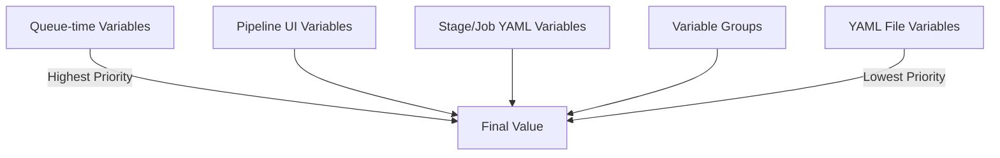

# How to Use Variable Groups and Secret Variables in Azure Pipelines YAML

Author: [nawazdhandala](https://www.github.com/nawazdhandala)

Tags: Azure Pipelines, Variables, Secrets, YAML, Azure DevOps, CI/CD, Security

Description: Learn how to manage pipeline variables and secrets securely using variable groups and secret variables in Azure Pipelines YAML.

---

Every pipeline needs configuration values - connection strings, API keys, environment names, version numbers. Hardcoding these into your YAML files is a bad idea for obvious reasons: secrets get committed to version control, environment-specific values make pipelines inflexible, and changing a value means updating the pipeline file.

Azure Pipelines provides several mechanisms for managing variables, from simple inline definitions to variable groups backed by Azure Key Vault. In this post, I will cover all of them, show when to use each approach, and share the security considerations you should keep in mind.

## Inline Variables

The simplest approach is defining variables directly in your YAML file. These are fine for non-sensitive, non-environment-specific values.

```yaml
# Inline variables defined directly in the pipeline
variables:
  buildConfiguration: 'Release'
  dotnetVersion: '8.0'
  projectPath: 'src/MyApp/MyApp.csproj'

pool:
  vmImage: 'ubuntu-latest'

steps:
  - task: UseDotNet@2
    inputs:
      version: '$(dotnetVersion)'

  - task: DotNetCoreCLI@2
    displayName: 'Build'
    inputs:
      command: 'build'
      projects: '$(projectPath)'
      arguments: '--configuration $(buildConfiguration)'
```

Inline variables are version-controlled and visible in the YAML file, which makes them easy to understand and review.

## Variable Groups

Variable groups are collections of variables stored outside your YAML file. They live in Azure DevOps under **Pipelines > Library** and can be shared across multiple pipelines.

To create a variable group:

1. Go to **Pipelines > Library**
2. Click **+ Variable group**
3. Name it something descriptive like `app-settings-dev` or `shared-config`
4. Add your variables
5. For secrets, click the lock icon to mark them as secret

Reference the group in your YAML.

```yaml
# Referencing a variable group from the Library
variables:
  - group: 'app-settings-dev'
  - name: buildConfiguration
    value: 'Release'

pool:
  vmImage: 'ubuntu-latest'

steps:
  # Variables from the group are available as $(variableName)
  - script: |
      echo "Deploying to $(environment)"
      echo "Using database at $(databaseServer)"
    displayName: 'Show config'
```

When you reference a variable group for the first time, you might need to authorize the pipeline to access it. Azure DevOps will prompt you to approve this on the first run.

## Stage-Scoped Variable Groups

For multi-stage pipelines, you often need different variable groups per environment. Each stage can reference its own group.

```yaml
# Different variable groups per stage
stages:
  - stage: DeployDev
    variables:
      - group: 'app-settings-dev'  # Dev-specific values
    jobs:
      - deployment: Deploy
        environment: 'development'
        strategy:
          runOnce:
            deploy:
              steps:
                - script: echo "DB Server: $(databaseServer)"

  - stage: DeployProd
    variables:
      - group: 'app-settings-prod'  # Production-specific values
    jobs:
      - deployment: Deploy
        environment: 'production'
        strategy:
          runOnce:
            deploy:
              steps:
                - script: echo "DB Server: $(databaseServer)"
```

This pattern lets you keep the same variable names (like `databaseServer`) but with different values per environment, making your deployment steps identical across stages.

## Secret Variables

There are two ways to store secrets: in variable groups (with the lock icon) and as pipeline-level secret variables (defined in the pipeline settings UI).

Secrets have special behavior:

- They are not printed in logs. If a step outputs a secret value, it shows as `***` in the log.
- They are not available as environment variables by default. You must explicitly map them.
- They cannot be accessed in YAML template expressions (`${{ }}` syntax). You must use runtime expressions (`$()` syntax).

Here is how to pass a secret to a script.

```yaml
variables:
  - group: 'my-secrets'  # Contains a secret variable called 'apiKey'

steps:
  # Secrets must be explicitly mapped to environment variables for scripts
  - script: |
      # The secret is available as an environment variable
      curl -H "Authorization: Bearer $API_KEY" https://api.example.com/health
    displayName: 'Call API with secret'
    env:
      API_KEY: $(apiKey)  # Map the secret variable to an env var
```

The `env` block is required because Azure Pipelines does not expose secret variables as environment variables automatically. This is a security feature - it prevents accidental leakage to processes that do not need the secret.

## Azure Key Vault Integration

For organizations that already use Azure Key Vault, you can link a variable group directly to a Key Vault. This means your pipeline variables are backed by Key Vault secrets, giving you:

- Centralized secret management
- Rotation without updating Azure DevOps
- Access policies and audit logging from Key Vault
- The same secrets available to both applications and pipelines

To set this up:

1. Create a variable group in **Pipelines > Library**
2. Toggle **Link secrets from an Azure key vault as variables**
3. Select your Azure subscription and Key Vault
4. Click **+ Add** to select which Key Vault secrets to expose

```yaml
# Variable group linked to Azure Key Vault
variables:
  - group: 'keyvault-secrets'  # Linked to Key Vault

steps:
  - task: AzureKeyVault@2
    displayName: 'Fetch secrets from Key Vault'
    inputs:
      azureSubscription: 'my-service-connection'
      KeyVaultName: 'my-keyvault'
      SecretsFilter: 'db-password,api-key,storage-connection'
      RunAsPreJob: true

  - script: |
      echo "Secrets are now available as variables"
    env:
      DB_PASSWORD: $(db-password)
      API_KEY: $(api-key)
```

Note: Key Vault secret names use hyphens, but Azure Pipelines converts them to underscores when exposing them as environment variables. So `db-password` in Key Vault becomes accessible as `$(db-password)` in pipeline syntax.

## Variable Precedence

When the same variable name is defined in multiple places, Azure Pipelines follows a precedence order:

1. **Queue-time variables** (set when manually running the pipeline) - highest
2. **Pipeline-level UI variables** (set in pipeline settings)
3. **Stage/job/step-level YAML variables**
4. **Variable groups**
5. **YAML file-level variables** - lowest

This means a variable defined at the stage level overrides the same variable from a variable group or file-level definition.



## Runtime vs. Compile-Time Expressions

Azure Pipelines has two expression syntaxes that evaluate at different times:

**Compile-time expressions** (`${{ }}`) are evaluated when the YAML is processed, before the pipeline runs. They can access parameters and statically defined variables, but not runtime values like secret variables.

**Runtime expressions** (`$[ ]` and `$()`) are evaluated during pipeline execution. They can access all variables, including secrets and dynamically set values.

```yaml
variables:
  staticVar: 'hello'

steps:
  # Compile-time expression - evaluated before the pipeline runs
  - ${{ if eq(variables.staticVar, 'hello') }}:
    - script: echo "Static var is hello"

  # Runtime expression - evaluated during execution
  - script: echo "Value is $(staticVar)"

  # Setting a variable at runtime for use in later steps
  - script: echo "##vso[task.setvariable variable=dynamicVar]world"
    displayName: 'Set dynamic variable'

  - script: echo "Dynamic value is $(dynamicVar)"
    displayName: 'Use dynamic variable'
```

## Output Variables Across Jobs and Stages

To pass variables between jobs or stages, you need output variables.

```yaml
stages:
  - stage: Build
    jobs:
      - job: BuildJob
        steps:
          # Set an output variable
          - script: |
              VERSION="1.0.$(Build.BuildId)"
              echo "##vso[task.setvariable variable=appVersion;isOutput=true]$VERSION"
            name: setVersion
            displayName: 'Calculate version'

  - stage: Deploy
    dependsOn: Build
    variables:
      # Reference the output variable from the previous stage
      appVersion: $[ stageDependencies.Build.BuildJob.outputs['setVersion.appVersion'] ]
    jobs:
      - job: DeployJob
        steps:
          - script: echo "Deploying version $(appVersion)"
```

The syntax for cross-stage references is verbose but follows a consistent pattern: `stageDependencies.<Stage>.<Job>.outputs['<Step>.<Variable>']`.

## Security Best Practices

**Never log secret values.** Even though Azure Pipelines masks them in logs, do not intentionally echo or print them.

**Use variable groups with approval gates.** You can require approval before a pipeline can access a variable group, adding a layer of human oversight.

**Scope variable groups to specific pipelines.** In the variable group settings, under **Pipeline permissions**, restrict which pipelines can access the group.

**Prefer Key Vault for sensitive secrets.** Key Vault provides better auditing, rotation, and access control than Azure DevOps variable groups alone.

**Rotate secrets regularly.** Set up alerts in Key Vault to notify you when secrets are approaching expiration.

**Do not use secret variables in conditions or template expressions.** They are not available in `${{ }}` expressions and attempting to use them there will result in empty values.

## Wrapping Up

Managing variables and secrets properly is foundational to a secure and maintainable CI/CD pipeline. Use inline variables for simple, non-sensitive values. Use variable groups for shared configuration across pipelines. Use Key Vault integration for sensitive secrets that need enterprise-grade management. The investment in setting up proper variable management pays off every time you need to rotate a secret or deploy to a new environment.
