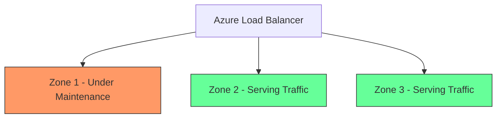

# How to View Azure Planned Maintenance Events and Prepare Your Workloads

Author: [nawazdhandala](https://www.github.com/nawazdhandala)

Tags: Azure, Planned Maintenance, Service Health, High Availability, Operations, Azure Monitor, Infrastructure

Description: Learn how to find upcoming Azure planned maintenance events and prepare your workloads so updates do not cause unexpected downtime.

---

Azure regularly performs maintenance on the underlying infrastructure that powers your cloud resources. Most of the time this happens transparently, but sometimes maintenance requires VM reboots, brief connectivity interruptions, or temporary performance degradation. If you are running production workloads, you need to know when these events are coming and have a plan to handle them gracefully.

In this post, I will show you how to find planned maintenance events, understand what they mean for your resources, and prepare your workloads to survive them without impacting your users.

## Where to Find Planned Maintenance Events

There are several places where Azure surfaces planned maintenance information.

### Azure Service Health - Planned Maintenance View

The primary place to check is Azure Service Health in the portal. Go to the Azure portal, search for "Service Health," and click on "Planned maintenance" in the left navigation. This view shows you all upcoming maintenance events that affect the services and regions tied to your subscriptions.

Each event listing includes:
- Title and description of the maintenance
- Impacted services and regions
- Start and end time windows
- Whether customer action is required
- Current status (planned, in progress, completed)

### Azure Resource Health

For individual resource-level maintenance, check Azure Resource Health. Navigate to any resource in the portal (say, a virtual machine), and click "Resource health" under the Support + troubleshooting section. If there is maintenance scheduled for that specific resource, it will show up here along with an estimated impact window.

### Service Health REST API

You can also pull planned maintenance events programmatically:

```bash
# Query Service Health events filtered to planned maintenance
# The eventType filter narrows results to maintenance events only
az rest --method get \
  --url "https://management.azure.com/subscriptions/<sub-id>/providers/Microsoft.ResourceHealth/events?api-version=2022-10-01&\$filter=eventType eq 'PlannedMaintenance'" \
  --query "value[].{name:name, title:properties.title, status:properties.status, impact:properties.impact[0].impactedService}"
```

### Azure Monitor Activity Log

Planned maintenance events also appear in the Activity Log under the ServiceHealth category. You can query them with:

```bash
# Pull planned maintenance events from the Activity Log
# The --offset flag sets how far back to look (here, 30 days)
az monitor activity-log list \
  --offset 30d \
  --query "[?category.value=='ServiceHealth' && properties.incidentType=='Maintenance'].{title:properties.title, status:properties.stage, impactStart:properties.impactStartTime, impactEnd:properties.impactMitigationTime}" \
  --output table
```

## Types of Planned Maintenance

Not all maintenance is created equal. Understanding the type helps you gauge the risk.

### Host OS Updates

Microsoft regularly patches the host operating systems running on the physical servers. Most of these updates use memory-preserving maintenance, which means your VM pauses for a few seconds while the host is updated. You typically do not notice this, but latency-sensitive workloads might experience brief hiccups.

### Hardware Replacement

When physical hardware needs replacement, VMs on that hardware get migrated to healthy nodes. Azure uses live migration when possible, but some VM sizes (like those using local SSD or GPU-attached instances) cannot be live migrated and will be stopped and restarted.

### Platform Updates

These are larger updates to the Azure platform itself. They typically roll out region by region and availability zone by availability zone. If your workloads are spread across availability zones, only a portion of your infrastructure is affected at any given time.

### Self-Service Maintenance Windows

For some maintenance events, Azure gives you a self-service window where you can choose when to trigger the maintenance on your schedule rather than waiting for Azure to do it during their scheduled window. This is valuable because it lets you pick a time that works for your business.

## Preparing Your Workloads

Knowing about maintenance is only half the battle. Here is how to make your workloads resilient.

### Use Availability Zones

The single most effective thing you can do is deploy across availability zones. When Azure performs maintenance, it operates on one zone at a time. If your application runs in at least two zones with a load balancer in front, your users should see zero downtime during maintenance.



### Configure Availability Sets

If availability zones are not available in your region or for your resource type, use availability sets. VMs in an availability set are distributed across fault domains and update domains. Azure guarantees it will not update all update domains simultaneously.

### Set Up Scheduled Event Monitoring on VMs

Azure Scheduled Events is a metadata service running inside your VMs that gives your application advance notice of upcoming maintenance. Your application can query this service and take graceful action before the maintenance hits.

Here is a script that checks for scheduled events and drains connections if maintenance is coming:

```bash
#!/bin/bash
# Poll Azure Scheduled Events API from inside the VM
# This runs on the VM itself and checks for upcoming maintenance
SCHEDULED_EVENTS_URL="http://169.254.169.254/metadata/scheduledevents?api-version=2020-07-01"

while true; do
  # Query the metadata service for scheduled events
  EVENTS=$(curl -s -H "Metadata:true" "$SCHEDULED_EVENTS_URL")

  # Check if there are any events
  EVENT_COUNT=$(echo "$EVENTS" | python3 -c "import sys,json; print(len(json.load(sys.stdin).get('Events',[])))")

  if [ "$EVENT_COUNT" -gt 0 ]; then
    echo "Maintenance event detected! Draining connections..."
    # Remove this VM from the load balancer health probe
    # by stopping your application's health endpoint
    touch /tmp/drain-connections

    # Give existing connections time to complete
    sleep 30

    # Acknowledge the event to tell Azure this VM is ready
    EVENT_ID=$(echo "$EVENTS" | python3 -c "import sys,json; print(json.load(sys.stdin)['Events'][0]['EventId'])")
    curl -s -H "Metadata:true" -X POST \
      -d "{\"StartRequests\":[{\"EventId\":\"$EVENT_ID\"}]}" \
      "$SCHEDULED_EVENTS_URL"

    echo "Event acknowledged. Maintenance will proceed."
  fi

  # Poll every 30 seconds
  sleep 30
done
```

### Enable Automatic VM Guest Patching

For OS-level patches inside your VMs (not the host maintenance), enable automatic VM guest patching. This is separate from host maintenance but equally important:

```bash
# Enable automatic guest patching on a VM
# This handles OS updates inside the VM, not host maintenance
az vm update \
  --resource-group myResourceGroup \
  --name myVM \
  --set osProfile.windowsConfiguration.patchSettings.patchMode=AutomaticByPlatform
```

### Use Maintenance Configurations

Azure Maintenance Configurations let you control when platform maintenance happens on your resources. You can define a maintenance window that aligns with your low-traffic periods:

```bash
# Create a maintenance configuration with a weekly window
# This tells Azure to perform maintenance during your preferred time
az maintenance configuration create \
  --resource-group rg-monitoring \
  --name mc-weekend-window \
  --maintenance-scope Host \
  --recur-every "Week Saturday" \
  --start-date-time "2026-02-21 02:00" \
  --duration "05:00" \
  --time-zone "Eastern Standard Time"

# Assign the maintenance configuration to a VM
az maintenance assignment create \
  --resource-group myResourceGroup \
  --resource-name myVM \
  --resource-type virtualMachines \
  --provider-name Microsoft.Compute \
  --configuration-assignment-name mc-assignment \
  --maintenance-configuration-id "/subscriptions/<sub-id>/resourceGroups/rg-monitoring/providers/Microsoft.Maintenance/maintenanceConfigurations/mc-weekend-window" \
  --location eastus
```

## Building a Maintenance Preparation Runbook

For organizations with complex environments, I recommend creating a formal runbook that your operations team follows when a planned maintenance notification arrives. Here is what it should cover:

1. **Identify affected resources.** Cross-reference the maintenance notification with your CMDB or resource inventory to determine which applications and services are impacted.

2. **Assess the impact level.** Is this memory-preserving (low risk) or does it require a reboot (medium risk) or a full stop/start (high risk)?

3. **Notify stakeholders.** Let application owners and SRE teams know about the maintenance window and expected impact.

4. **Pre-maintenance checks.** Verify that redundancy is working. Confirm that load balancers are healthy, replica sets are in sync, and failover mechanisms are tested.

5. **During maintenance.** Monitor dashboards for any anomalies. Have your incident response process ready in case the maintenance causes unexpected issues.

6. **Post-maintenance validation.** After the maintenance window closes, verify that all resources are healthy, applications are responding normally, and no data was lost.

## Setting Up Alerts for Planned Maintenance

As covered in other posts about Service Health alerts, make sure you have alerts configured specifically for planned maintenance events. These should go to a different channel than outage alerts - maybe a Slack channel or email distribution list rather than paging your on-call engineer at 3 AM.

```bash
# Create an alert specifically for planned maintenance events
az monitor activity-log alert create \
  --resource-group rg-monitoring \
  --name "PlannedMaintenanceAlert" \
  --description "Alert on Azure planned maintenance events" \
  --condition category=ServiceHealth \
  --condition properties.incidentType=Maintenance \
  --action-group ag-maintenance-notifications \
  --scope "/subscriptions/<your-subscription-id>"
```

## Wrapping Up

Azure planned maintenance is a fact of life in the cloud, but it does not have to mean downtime for your users. The combination of proactive monitoring through Service Health, architectural resilience through availability zones and sets, graceful handling through Scheduled Events, and controlled timing through Maintenance Configurations gives you the tools to ride through maintenance windows smoothly. Start by setting up the alerts and reviewing upcoming events today, then gradually layer on the resilience patterns as your team matures.
