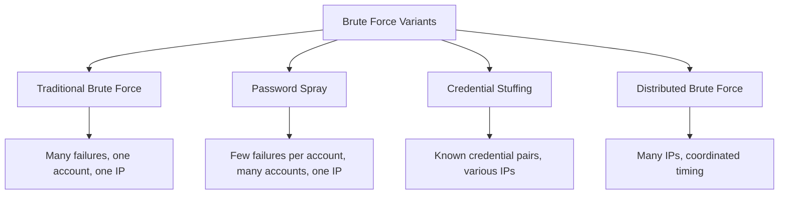

# How to Write KQL Hunting Queries in Microsoft Sentinel to Detect Brute Force Attacks

Author: [nawazdhandala](https://www.github.com/nawazdhandala)

Tags: Azure, Microsoft Sentinel, KQL, Threat Hunting, Brute Force, Security, Kusto Query Language

Description: Learn how to write effective KQL hunting queries in Microsoft Sentinel to detect brute force and password spray attacks against your Azure environment.

---

Brute force attacks remain one of the most common threats facing cloud environments. Attackers systematically try combinations of usernames and passwords hoping to find valid credentials. While automated detection rules catch many of these attacks, proactive threat hunting with KQL (Kusto Query Language) lets you find attacks that slip through the cracks or are still in progress.

In this guide, I will walk through practical KQL hunting queries for detecting brute force attacks in Microsoft Sentinel, starting from simple queries and building up to more sophisticated detection logic.

## Understanding Brute Force Attack Patterns

Before writing queries, you need to understand what brute force attacks look like in log data. There are several variations:

- **Traditional brute force**: Many password attempts against a single account from a single IP
- **Password spray**: One or two passwords tried against many accounts (harder to detect per-account)
- **Credential stuffing**: Known username/password pairs from data breaches tried against your environment
- **Distributed brute force**: Attempts spread across many source IPs to avoid rate limiting



Each variation requires a different detection approach. The sign-in logs in Microsoft Sentinel (the SigninLogs table) contain the data we need.

## Prerequisites

To follow along, you need:

- Microsoft Sentinel workspace with Microsoft Entra ID sign-in logs connected
- Access to the Logs blade in Sentinel (Security Reader role or higher)
- Basic familiarity with KQL syntax

Make sure the Microsoft Entra ID data connector is enabled and the SigninLogs table is populated.

## Query 1: Basic Failed Sign-In Detection

Let us start with a simple query that finds accounts with many failed sign-in attempts:

```kusto
// Find accounts with more than 10 failed sign-in attempts in the past 24 hours
// ResultType 50126 indicates an invalid username or password
SigninLogs
| where TimeGenerated > ago(24h)
| where ResultType == "50126"  // Invalid username or password
| summarize
    FailedAttempts = count(),
    DistinctIPs = dcount(IPAddress),
    IPAddresses = make_set(IPAddress, 10),  // Collect up to 10 unique IPs
    FirstAttempt = min(TimeGenerated),
    LastAttempt = max(TimeGenerated)
    by UserPrincipalName
| where FailedAttempts > 10
| sort by FailedAttempts desc
```

This query is a starting point, but it will generate false positives from users who simply forgot their passwords. Let us refine it.

## Query 2: Detecting Brute Force from a Single IP

A more targeted query looks for a single IP address making many failed attempts against one or more accounts:

```kusto
// Detect a single IP making excessive failed login attempts
// This catches traditional brute force where one IP hammers accounts
SigninLogs
| where TimeGenerated > ago(1h)
| where ResultType in ("50126", "50053", "50057")
    // 50126: Bad password
    // 50053: Account locked
    // 50057: Account disabled (attacker trying disabled accounts)
| summarize
    FailedAttempts = count(),
    TargetedAccounts = dcount(UserPrincipalName),
    AccountsList = make_set(UserPrincipalName, 20),
    DistinctApps = dcount(AppDisplayName)
    by IPAddress, Location = tostring(LocationDetails.city)
| where FailedAttempts > 25
| sort by FailedAttempts desc
```

If a single IP has more than 25 failed attempts in an hour, that is worth investigating regardless of how many accounts were targeted.

## Query 3: Password Spray Detection

Password spray attacks are trickier because each account might only see one or two failed attempts. The signal is in the aggregate - many accounts failing from the same IP in a short window:

```kusto
// Detect password spray attacks
// Pattern: Single IP tries a small number of passwords against many accounts
SigninLogs
| where TimeGenerated > ago(2h)
| where ResultType == "50126"  // Invalid password
| summarize
    TargetedAccounts = dcount(UserPrincipalName),
    TotalAttempts = count(),
    AttemptsPerAccount = round(count() * 1.0 / dcount(UserPrincipalName), 2),
    SampleAccounts = make_set(UserPrincipalName, 5),
    TimeSpan = datetime_diff('minute', max(TimeGenerated), min(TimeGenerated))
    by IPAddress
// Key indicator: many unique accounts with few attempts each
| where TargetedAccounts > 15 and AttemptsPerAccount < 5
| sort by TargetedAccounts desc
```

The key differentiator for password spray is a high number of targeted accounts with a low number of attempts per account. An attacker trying "Password123!" against 500 accounts will only hit each account once.

## Query 4: Successful Login After Failed Attempts

This is one of the most critical queries - detecting when a brute force attack actually succeeds:

```kusto
// Find successful sign-ins that were preceded by multiple failures
// This indicates a potentially compromised account
let failedSignIns =
    SigninLogs
    | where TimeGenerated > ago(24h)
    | where ResultType == "50126"  // Failed password
    | summarize
        FailCount = count(),
        FailIPs = make_set(IPAddress, 10)
        by UserPrincipalName;
// Now find successful sign-ins from the same accounts
let successfulSignIns =
    SigninLogs
    | where TimeGenerated > ago(24h)
    | where ResultType == "0"  // Successful sign-in
    | project
        UserPrincipalName,
        SuccessTime = TimeGenerated,
        SuccessIP = IPAddress,
        AppDisplayName,
        DeviceDetail;
// Join to find accounts that had failures followed by success
failedSignIns
| join kind=inner successfulSignIns on UserPrincipalName
| where FailCount > 5  // At least 5 failures before success
| project
    UserPrincipalName,
    FailedAttempts = FailCount,
    FailedFromIPs = FailIPs,
    SuccessfulSignInTime = SuccessTime,
    SuccessfulFromIP = SuccessIP,
    Application = AppDisplayName
| sort by FailedAttempts desc
```

When you find a match here, it could mean the attacker guessed the password. Investigate immediately by checking if the successful IP matches any of the failed IPs and whether the user recognizes the sign-in.

## Query 5: Detecting Distributed Brute Force

Sophisticated attackers distribute their attempts across many IPs. To detect this, look for many IPs targeting the same account:

```kusto
// Detect distributed brute force against specific accounts
// Pattern: Many different IPs failing against the same account
SigninLogs
| where TimeGenerated > ago(6h)
| where ResultType == "50126"
| summarize
    DistinctIPs = dcount(IPAddress),
    TotalAttempts = count(),
    IPSample = make_set(IPAddress, 20),
    CountryList = make_set(tostring(LocationDetails.countryOrRegion), 10)
    by UserPrincipalName
| where DistinctIPs > 10  // More than 10 unique IPs targeting one account
| sort by DistinctIPs desc
```

If an account is being targeted from 50 different IPs across multiple countries, that is a distributed attack, not a user mistyping their password.

## Query 6: Identify Attack Timing Patterns

Brute force attacks often run during off-hours or follow predictable timing patterns:

```kusto
// Analyze the timing pattern of failed sign-ins
// Automated attacks often show regular intervals between attempts
SigninLogs
| where TimeGenerated > ago(24h)
| where ResultType == "50126"
| where IPAddress == "SUSPICIOUS_IP_ADDRESS"  // Replace with IP from previous queries
| sort by TimeGenerated asc
| extend PreviousTime = prev(TimeGenerated)
| extend TimeBetweenAttempts = datetime_diff('second', TimeGenerated, PreviousTime)
| summarize
    AvgSecondsBetween = round(avg(TimeBetweenAttempts), 1),
    MinSecondsBetween = min(TimeBetweenAttempts),
    MaxSecondsBetween = max(TimeBetweenAttempts),
    TotalAttempts = count()
// Very consistent timing (low variance) suggests automated tooling
| extend IsLikelyAutomated = iff(MaxSecondsBetween - MinSecondsBetween < 5, true, false)
```

Human sign-in attempts have irregular timing. Automated tools typically show very consistent intervals between attempts.

## Query 7: Correlate with Threat Intelligence

If you have threat intelligence data in Sentinel, cross-reference attacking IPs:

```kusto
// Cross-reference brute force source IPs with threat intelligence
// This confirms known malicious infrastructure
let bruteForceIPs =
    SigninLogs
    | where TimeGenerated > ago(24h)
    | where ResultType == "50126"
    | summarize FailCount = count() by IPAddress
    | where FailCount > 10
    | project IPAddress;
ThreatIntelligenceIndicator
| where TimeGenerated > ago(30d)
| where NetworkIP in (bruteForceIPs) or NetworkSourceIP in (bruteForceIPs)
| project
    ThreatType,
    MaliciousIP = coalesce(NetworkIP, NetworkSourceIP),
    Description,
    ConfidenceScore,
    Source = SourceSystem
```

## Creating a Hunting Bookmark

When you find something suspicious during a hunt, create a bookmark to preserve it:

1. Run your query in the Sentinel Logs blade.
2. Select the rows that represent the finding.
3. Click Add bookmark.
4. Give the bookmark a meaningful name and add notes about why this is suspicious.
5. The bookmark can later be promoted to an incident if investigation confirms it is a real attack.

## Converting Hunts to Scheduled Analytics Rules

Once you have validated a hunting query, convert it to a scheduled analytics rule so it runs automatically:

1. In Sentinel, go to Analytics, then click Create, then Scheduled query rule.
2. Paste your KQL query.
3. Set the frequency (how often the rule runs) and the lookback period (how far back it queries).
4. Configure entity mapping to link IP addresses and user accounts to the alert.
5. Set the alert severity and create incident settings.

For example, the password spray query might run every 15 minutes with a 2-hour lookback. The successful-login-after-failures query might run every 5 minutes for more immediate detection.

## Best Practices for Threat Hunting

Keep these principles in mind when writing hunting queries:

Start with broad queries and narrow down. It is better to see too many results initially and refine than to miss something because your query was too specific.

Use the `let` statement to build up complex queries in stages. This makes your queries easier to read and debug.

Always include a time filter. Queries without time bounds will scan the entire table and may time out or incur high costs.

Document your hypotheses. Before running a query, write down what you expect to find and why. This turns hunting from random searching into structured investigation.

Share your queries with the team. Save useful queries as functions in Log Analytics or as hunting queries in Sentinel so other analysts can use them.

## Conclusion

KQL hunting queries in Microsoft Sentinel give you the ability to proactively search for brute force attacks rather than waiting for automated detections to fire. Start with the basic failed sign-in detection, then layer on password spray detection, success-after-failure correlation, and distributed attack patterns. The queries in this guide cover the most common brute force scenarios, but every environment is different, so adapt the thresholds and patterns based on your baseline traffic. Once you validate a hunt, convert it to a scheduled analytics rule so the detection runs continuously without manual effort.
