# How to Write Windowing Queries in Azure Stream Analytics for Time-Based Aggregations

Author: [nawazdhandala](https://www.github.com/nawazdhandala)

Tags: Azure Stream Analytics, Windowing Queries, Time-Based Aggregations, Real-Time Analytics, SQL, Azure

Description: Master the different windowing functions in Azure Stream Analytics to perform time-based aggregations on streaming data for real-time analytics.

---

When you process streaming data, you rarely care about individual events in isolation. What matters is the aggregate picture - average values over the last 5 minutes, total counts per hour, or trend changes over sliding time intervals. Azure Stream Analytics provides windowing functions for exactly this purpose.

Windowing functions divide a continuous stream of events into finite time-based groups so you can apply aggregate operations like COUNT, SUM, AVG, MIN, and MAX. Stream Analytics offers four types of windows, each suited to different analytical patterns.

In this post, I will explain each window type, show practical query examples, and help you choose the right one for your use case.

## The Four Window Types

Stream Analytics supports these windowing functions:

1. **Tumbling Window** - fixed-size, non-overlapping time intervals
2. **Hopping Window** - fixed-size windows that overlap by a configurable hop size
3. **Sliding Window** - windows triggered by events, capturing all events within a duration
4. **Session Window** - dynamic windows that group events by activity with timeout-based gaps

Let me visualize each one before diving into the queries.

```mermaid
gantt
    title Tumbling Window (5 min)
    dateFormat HH:mm
    axisFormat %H:%M
    section Windows
    Window 1    :w1, 00:00, 5m
    Window 2    :w2, 00:05, 5m
    Window 3    :w3, 00:10, 5m
```



## Tumbling Windows

Tumbling windows divide time into fixed-size, non-overlapping segments. Every event belongs to exactly one window. This is the most commonly used window type.

### Use Cases
- Calculate metrics at regular intervals (every 5 minutes, every hour)
- Aggregate sensor readings into periodic summaries
- Generate fixed-interval reports

### Basic Query

```sql
-- Calculate average temperature per device every 5 minutes
SELECT
    DeviceId,
    AVG(temperature) AS AvgTemperature,
    MAX(temperature) AS MaxTemperature,
    MIN(temperature) AS MinTemperature,
    COUNT(*) AS ReadingCount,
    -- System.Timestamp() returns the end time of the window
    System.Timestamp() AS WindowEndTime
INTO [output]
FROM [input]
TIMESTAMP BY EventTime
GROUP BY
    DeviceId,
    -- TumblingWindow(unit, size)
    TumblingWindow(minute, 5)
```

Every 5 minutes, this query emits one row per device with the aggregate values for that window.

### Tumbling Window with Filtering

```sql
-- Count error events per error code in hourly windows
-- Only include windows with more than 10 errors
SELECT
    ErrorCode,
    COUNT(*) AS ErrorCount,
    System.Timestamp() AS WindowEnd
INTO [error-output]
FROM [event-input]
TIMESTAMP BY EventTime
WHERE EventType = 'Error'
GROUP BY
    ErrorCode,
    TumblingWindow(hour, 1)
HAVING COUNT(*) > 10
```

## Hopping Windows

Hopping windows have a fixed size but overlap. You specify both the window size and the hop size (how far the window advances each time). Each event can belong to multiple windows.

### Use Cases
- Moving averages where you want more frequent output
- Overlapping time-based analysis for smoother trend detection
- Situations where you need both a large aggregation window and frequent updates

### Basic Query

```sql
-- Calculate a 10-minute moving average, updated every 2 minutes
SELECT
    DeviceId,
    AVG(temperature) AS MovingAvgTemperature,
    COUNT(*) AS SampleCount,
    System.Timestamp() AS WindowEndTime
INTO [output]
FROM [input]
TIMESTAMP BY EventTime
GROUP BY
    DeviceId,
    -- HoppingWindow(unit, windowSize, hopSize)
    HoppingWindow(minute, 10, 2)
```

This produces output every 2 minutes, but each output reflects the last 10 minutes of data. Events that fall in the overlap period appear in multiple windows.

### Hopping Window for Trend Detection

```sql
-- Detect increasing temperature trends by comparing
-- short-term and long-term averages using hopping windows
-- (uses two queries with different window sizes)

-- Short-term average (5-minute window, 1-minute hop)
SELECT
    DeviceId,
    AVG(temperature) AS ShortTermAvg,
    System.Timestamp() AS WindowEnd
INTO [short-term-output]
FROM [input]
TIMESTAMP BY EventTime
GROUP BY
    DeviceId,
    HoppingWindow(minute, 5, 1)
```

## Sliding Windows

Sliding windows are different from tumbling and hopping windows. They only produce output when an event enters or exits the window. The window is anchored to events rather than to the clock.

### Use Cases
- Alert when a threshold is exceeded within a time period
- Detect bursts of activity
- Find events that occur close together in time

### Basic Query

```sql
-- Alert when a device sends more than 100 events within any 1-minute window
SELECT
    DeviceId,
    COUNT(*) AS EventCount,
    System.Timestamp() AS WindowEnd
INTO [alert-output]
FROM [input]
TIMESTAMP BY EventTime
GROUP BY
    DeviceId,
    -- SlidingWindow(unit, size)
    SlidingWindow(minute, 1)
HAVING COUNT(*) > 100
```

The key difference: this window triggers every time an event enters or exits the 1-minute window, not at fixed intervals. If events arrive at irregular intervals, the output is also irregular.

### Sliding Window for Anomaly Detection

```sql
-- Detect when temperature changes rapidly
-- Alert if the range (max - min) exceeds 20 degrees in any 2-minute window
SELECT
    DeviceId,
    MAX(temperature) - MIN(temperature) AS TemperatureRange,
    MAX(temperature) AS MaxTemp,
    MIN(temperature) AS MinTemp,
    COUNT(*) AS ReadingCount,
    System.Timestamp() AS WindowEnd
INTO [anomaly-output]
FROM [input]
TIMESTAMP BY EventTime
GROUP BY
    DeviceId,
    SlidingWindow(minute, 2)
HAVING MAX(temperature) - MIN(temperature) > 20
```

## Session Windows

Session windows group events that arrive close together in time. A session starts when an event arrives and ends when no events arrive for a specified timeout period. This makes session windows dynamic - they can be different sizes depending on the activity pattern.

### Use Cases
- Group user interactions into sessions (web analytics, app usage)
- Identify active and idle periods for IoT devices
- Group related events that occur in bursts

### Basic Query

```sql
-- Group device readings into sessions
-- A session ends after 30 seconds of inactivity
-- Maximum session length is 5 minutes
SELECT
    DeviceId,
    COUNT(*) AS EventsInSession,
    MIN(EventTime) AS SessionStart,
    MAX(EventTime) AS SessionEnd,
    AVG(temperature) AS AvgTemperature,
    DATEDIFF(second, MIN(EventTime), MAX(EventTime)) AS SessionDurationSeconds,
    System.Timestamp() AS WindowEnd
INTO [session-output]
FROM [input]
TIMESTAMP BY EventTime
GROUP BY
    DeviceId,
    -- SessionWindow(unit, timeout, maxDuration)
    SessionWindow(second, 30, 300)
```

If a device sends events continuously for 3 minutes, that is one session. If it then goes silent for more than 30 seconds, the session ends. If it sends events for 6 minutes straight, the session is capped at 5 minutes (the max duration) and a new session starts.

### Session Window for Activity Analysis

```sql
-- Analyze machine operating sessions
-- Group by machine ID, track active duration and readings per session
SELECT
    MachineId,
    'active' AS Status,
    COUNT(*) AS TotalReadings,
    AVG(powerConsumption) AS AvgPower,
    MAX(powerConsumption) AS PeakPower,
    DATEDIFF(minute, MIN(EventTime), MAX(EventTime)) AS ActiveMinutes,
    System.Timestamp() AS SessionEndTime
INTO [machine-sessions]
FROM [telemetry-input]
TIMESTAMP BY EventTime
GROUP BY
    MachineId,
    SessionWindow(minute, 5, 60)
```

## Combining Windows with Joins

You can join a windowed aggregation with another stream or reference data.

```sql
-- Join windowed aggregation with device thresholds from reference data
-- Alert when average exceeds the device-specific threshold
SELECT
    agg.DeviceId,
    ref.DeviceName,
    agg.AvgTemperature,
    ref.TemperatureThreshold,
    agg.WindowEnd
INTO [threshold-alerts]
FROM (
    SELECT
        DeviceId,
        AVG(temperature) AS AvgTemperature,
        System.Timestamp() AS WindowEnd
    FROM [input]
    TIMESTAMP BY EventTime
    GROUP BY
        DeviceId,
        TumblingWindow(minute, 5)
) AS agg
JOIN [device-thresholds] AS ref
    ON agg.DeviceId = ref.DeviceId
WHERE agg.AvgTemperature > ref.TemperatureThreshold
```

## Choosing the Right Window Type

| Window Type | Output Frequency | Events Per Window | Best For |
|-------------|-----------------|-------------------|----------|
| Tumbling | Fixed intervals | Each event in exactly one | Regular periodic aggregations |
| Hopping | Fixed intervals (more frequent) | Events can appear in multiple | Moving averages, smooth trends |
| Sliding | Event-driven | Events can appear in multiple | Threshold detection, burst detection |
| Session | Activity-driven | Grouped by proximity | User sessions, active periods |

## Performance Tips for Windowing Queries

1. **Keep windows small when possible** - larger windows consume more memory and increase latency.
2. **Use PARTITION BY** - partitioning allows Stream Analytics to process groups independently, enabling better parallelism.
3. **Avoid large hopping ratios** - a hopping window with a 1-hour size and a 1-second hop generates massive overlap and is expensive to process.
4. **Test with realistic data volumes** - windowing behavior changes significantly at scale due to memory and throughput constraints.
5. **Use TIMESTAMP BY** - always specify the event time column. Without it, Stream Analytics uses the arrival time, which can cause incorrect window assignments for out-of-order events.

```sql
-- Always specify TIMESTAMP BY for correct windowing
SELECT DeviceId, AVG(temperature) AS AvgTemp, System.Timestamp() AS WindowEnd
FROM [input]
-- Use the event's own timestamp, not the arrival time
TIMESTAMP BY EventTime
GROUP BY DeviceId, TumblingWindow(minute, 5)
```

## Wrapping Up

Windowing functions are the core of real-time analytics in Azure Stream Analytics. Tumbling windows give you clean, non-overlapping time intervals for periodic reporting. Hopping windows add overlap for smoother moving averages. Sliding windows trigger on events for real-time alerting. And session windows dynamically group related events by activity patterns. Match the window type to your analytical requirement, always use TIMESTAMP BY for accurate windowing, and start with tumbling windows if you are unsure - they cover the most common use cases.
