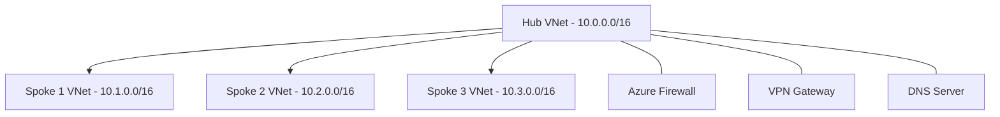

# How to Set Up Hub-and-Spoke Network Topology with Azure Virtual Network Peering

Author: [nawazdhandala](https://www.github.com/nawazdhandala)

Tags: Azure, Virtual Network Peering, Hub-and-Spoke, Networking, Azure Architecture, Cloud Infrastructure

Description: Learn how to design and deploy a hub-and-spoke network topology using Azure Virtual Network peering for centralized control and workload isolation.

---

If you have worked with Azure networking for any length of time, you have probably come across the hub-and-spoke topology. It is one of the most recommended patterns for organizing virtual networks in Azure, and for good reason. It gives you a clean separation between shared services and individual workloads while keeping traffic flows predictable and manageable.

In this guide, I will walk through the full process of setting up a hub-and-spoke topology using Azure Virtual Network (VNet) peering. We will cover the architecture, set up the hub and spoke VNets, configure the peering connections, and handle routing so that spoke-to-spoke traffic flows through the hub.

## Why Hub-and-Spoke?

The hub-and-spoke model works because it mirrors how most organizations think about their infrastructure. You have a central hub that houses shared services - things like firewalls, DNS servers, VPN gateways, and monitoring tools. Then you have spokes, each representing a separate workload or environment (dev, staging, production, a specific application, etc.).

The benefits are straightforward:

- Workload isolation: each spoke is its own VNet, so blast radius is contained.
- Centralized security: all traffic can flow through the hub where you apply firewall rules and inspection.
- Cost efficiency: shared services like VPN gateways live in one place rather than being duplicated in every spoke.
- Simplified management: network policies are applied centrally rather than scattered across dozens of VNets.

## Architecture Overview

Here is what the topology looks like at a high level.



The hub VNet peers with each spoke VNet. By default, peered VNets can communicate directly, but spoke-to-spoke traffic does not flow through the hub automatically. We will fix that with user-defined routes (UDRs).

## Step 1: Create the Hub Virtual Network

Start by creating the hub VNet. This will host your shared infrastructure.

```bash
# Create a resource group for the entire hub-and-spoke deployment
az group create \
  --name rg-hub-spoke \
  --location eastus

# Create the hub virtual network with subnets for different services
az network vnet create \
  --resource-group rg-hub-spoke \
  --name vnet-hub \
  --address-prefix 10.0.0.0/16 \
  --subnet-name snet-shared-services \
  --subnet-prefix 10.0.1.0/24

# Add a subnet for Azure Firewall (must be named AzureFirewallSubnet)
az network vnet subnet create \
  --resource-group rg-hub-spoke \
  --vnet-name vnet-hub \
  --name AzureFirewallSubnet \
  --address-prefix 10.0.2.0/24

# Add a GatewaySubnet for VPN Gateway (must be named GatewaySubnet)
az network vnet subnet create \
  --resource-group rg-hub-spoke \
  --vnet-name vnet-hub \
  --name GatewaySubnet \
  --address-prefix 10.0.3.0/27
```

Note the naming conventions for the AzureFirewallSubnet and GatewaySubnet. Azure requires these exact names for those services to work properly.

## Step 2: Create the Spoke Virtual Networks

Now create the spoke VNets. Each spoke gets its own address space.

```bash
# Create the first spoke VNet for workload A
az network vnet create \
  --resource-group rg-hub-spoke \
  --name vnet-spoke-1 \
  --address-prefix 10.1.0.0/16 \
  --subnet-name snet-workload \
  --subnet-prefix 10.1.1.0/24

# Create the second spoke VNet for workload B
az network vnet create \
  --resource-group rg-hub-spoke \
  --name vnet-spoke-2 \
  --address-prefix 10.2.0.0/16 \
  --subnet-name snet-workload \
  --subnet-prefix 10.2.1.0/24
```

Make sure the address spaces do not overlap. Azure VNet peering requires non-overlapping CIDR blocks.

## Step 3: Set Up VNet Peering

Peering in Azure is a two-way setup. You create a peering connection from the hub to the spoke, and another from the spoke back to the hub. Both sides must be configured.

```bash
# Peer hub to spoke-1
# AllowGatewayTransit lets spoke-1 use the hub's VPN gateway
az network vnet peering create \
  --resource-group rg-hub-spoke \
  --name hub-to-spoke1 \
  --vnet-name vnet-hub \
  --remote-vnet vnet-spoke-1 \
  --allow-vnet-access \
  --allow-forwarded-traffic \
  --allow-gateway-transit

# Peer spoke-1 back to hub
# UseRemoteGateways lets this spoke use the hub's VPN gateway
az network vnet peering create \
  --resource-group rg-hub-spoke \
  --name spoke1-to-hub \
  --vnet-name vnet-spoke-1 \
  --remote-vnet vnet-hub \
  --allow-vnet-access \
  --allow-forwarded-traffic \
  --use-remote-gateways

# Repeat for spoke-2
az network vnet peering create \
  --resource-group rg-hub-spoke \
  --name hub-to-spoke2 \
  --vnet-name vnet-hub \
  --remote-vnet vnet-spoke-2 \
  --allow-vnet-access \
  --allow-forwarded-traffic \
  --allow-gateway-transit

az network vnet peering create \
  --resource-group rg-hub-spoke \
  --name spoke2-to-hub \
  --vnet-name vnet-spoke-2 \
  --remote-vnet vnet-hub \
  --allow-vnet-access \
  --allow-forwarded-traffic \
  --use-remote-gateways
```

The key flags here are `--allow-gateway-transit` on the hub side and `--use-remote-gateways` on the spoke side. This lets spoke VNets use a VPN or ExpressRoute gateway deployed in the hub. If you do not have a gateway deployed yet, skip the `--use-remote-gateways` flag on the spoke side and the `--allow-gateway-transit` on the hub side - you can add them later.

## Step 4: Enable Spoke-to-Spoke Communication

By default, VNet peering is not transitive. Spoke 1 can talk to the hub, and Spoke 2 can talk to the hub, but Spoke 1 cannot talk to Spoke 2 through the hub. You need a network virtual appliance (NVA) or Azure Firewall in the hub, plus user-defined routes to make this work.

First, deploy Azure Firewall in the hub (assuming you created the AzureFirewallSubnet earlier).

```bash
# Create a public IP for the firewall
az network public-ip create \
  --resource-group rg-hub-spoke \
  --name pip-azfw \
  --sku Standard \
  --allocation-method Static

# Deploy Azure Firewall in the hub VNet
az network firewall create \
  --resource-group rg-hub-spoke \
  --name fw-hub \
  --location eastus \
  --vnet-name vnet-hub \
  --public-ip pip-azfw
```

Get the firewall's private IP address - you will need it for the route tables.

```bash
# Retrieve the firewall's private IP for use in route tables
az network firewall show \
  --resource-group rg-hub-spoke \
  --name fw-hub \
  --query "ipConfigurations[0].privateIPAddress" \
  --output tsv
```

Now create route tables for each spoke that direct inter-spoke traffic to the firewall.

```bash
# Create a route table for spoke-1
az network route-table create \
  --resource-group rg-hub-spoke \
  --name rt-spoke1

# Add a route that sends traffic destined for spoke-2 through the firewall
az network route-table route create \
  --resource-group rg-hub-spoke \
  --route-table-name rt-spoke1 \
  --name to-spoke2 \
  --address-prefix 10.2.0.0/16 \
  --next-hop-type VirtualAppliance \
  --next-hop-ip-address 10.0.2.4

# Associate the route table with spoke-1's workload subnet
az network vnet subnet update \
  --resource-group rg-hub-spoke \
  --vnet-name vnet-spoke-1 \
  --name snet-workload \
  --route-table rt-spoke1
```

Repeat the same pattern for spoke-2, pointing traffic for 10.1.0.0/16 to the firewall.

## Step 5: Configure Firewall Rules

You need network rules on the firewall to actually allow the traffic between spokes.

```bash
# Create a network rule collection that allows spoke-to-spoke communication
az network firewall network-rule create \
  --resource-group rg-hub-spoke \
  --firewall-name fw-hub \
  --collection-name spoke-to-spoke \
  --priority 200 \
  --action Allow \
  --name allow-spoke-traffic \
  --protocols Any \
  --source-addresses 10.1.0.0/16 10.2.0.0/16 \
  --destination-addresses 10.1.0.0/16 10.2.0.0/16 \
  --destination-ports '*'
```

In production, you would want more granular rules than "allow everything," but this gets the connectivity working.

## Verifying the Setup

After everything is configured, verify the peering status.

```bash
# Check peering state - should show "Connected" for all peerings
az network vnet peering list \
  --resource-group rg-hub-spoke \
  --vnet-name vnet-hub \
  --output table
```

Both peering connections should show a state of "Connected." If either shows "Initiated," the other side has not been configured yet.

You can also verify effective routes on a VM's NIC to confirm that traffic is being directed properly.

```bash
# Show effective routes for a NIC in spoke-1
az network nic show-effective-route-table \
  --resource-group rg-hub-spoke \
  --name nic-vm-spoke1 \
  --output table
```

## Common Pitfalls

There are a few things that trip people up with this topology:

**Overlapping address spaces** will prevent peering from being created. Plan your IP addressing scheme carefully before deploying anything.

**Forgetting the return route** - if you add a UDR on spoke-1 to send traffic to the firewall, you also need a UDR on spoke-2 for return traffic. Otherwise, the response packets take a different path and get dropped.

**Gateway transit requires a gateway** - do not enable `--use-remote-gateways` on a spoke if no gateway exists in the hub VNet. The peering will fail.

**NSG rules blocking peered traffic** - VNet peering respects NSGs. If your spoke has restrictive NSG rules, peered traffic might get blocked even though peering is established.

## Scaling the Topology

As you add more spokes, the pattern stays the same: create the VNet, peer it with the hub in both directions, and add route table entries. For large deployments with dozens of spokes, consider using Azure Virtual WAN instead, which handles much of this routing complexity automatically.

You can also use Azure Policy to enforce that all VNets in your subscription must be peered with the hub, preventing shadow networks from appearing.

The hub-and-spoke topology is a proven pattern that scales well for most Azure deployments. The key is getting the initial routing right and being disciplined about keeping shared services in the hub where they belong.
