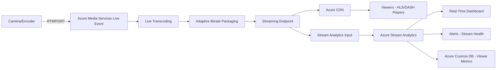

# How to Build a Live Broadcasting Pipeline with Azure Media Services Live Events and Stream Analytics

Author: [nawazdhandala](https://www.github.com/nawazdhandala)

Tags: Azure, Media Services, Live Streaming, Stream Analytics, Broadcasting, Real-Time, Video

Description: Build a live broadcasting pipeline using Azure Media Services Live Events with Stream Analytics for real-time viewer analytics and stream monitoring.

---

Live streaming has different challenges than video-on-demand. You cannot pre-encode content - the video has to be encoded, packaged, and delivered in near real-time. Latency matters. A few seconds of delay is acceptable for most broadcasts, but too much delay makes live interaction (chat, Q&A, polls) feel disconnected. Azure Media Services Live Events handles the ingestion and encoding side, while Stream Analytics gives you real-time visibility into viewer behavior and stream health.

This guide walks through building a live broadcasting pipeline from encoder to viewer, with real-time analytics running alongside.

## Architecture

The live streaming pipeline has several stages, each adding a few hundred milliseconds of latency.



## Setting Up the Live Event

Azure Media Services supports two types of live events: pass-through (your encoder does the work) and live encoding (Azure does the encoding). Live encoding is easier because you can send a single bitrate stream and Azure produces multiple output bitrates.

```bash
# Create a Media Services account (if not already created)
az ams account create \
  --name live-media-service \
  --resource-group rg-media \
  --storage-account mediastorageacct \
  --location eastus

# Create a live event with live encoding
az ams live-event create \
  --name my-live-broadcast \
  --account-name live-media-service \
  --resource-group rg-media \
  --streaming-protocol RTMP \
  --encoding-type Standard \
  --preset-name Default720p \
  --auto-start false \
  --description "Live broadcast event"

# Create a live output (recording + streaming)
az ams live-output create \
  --name my-live-output \
  --account-name live-media-service \
  --resource-group rg-media \
  --live-event-name my-live-broadcast \
  --asset-name live-archive-asset \
  --archive-window-length PT4H \
  --manifest-name "livearchive"

# Create a streaming locator for the live output
az ams streaming-locator create \
  --name live-locator \
  --account-name live-media-service \
  --resource-group rg-media \
  --streaming-policy-name Predefined_ClearStreamingOnly \
  --asset-name live-archive-asset
```

The `archive-window-length` of PT4H means the last 4 hours of live content are available for DVR-style playback. Viewers can rewind within this window.

## Getting the Ingest URL

Before starting the broadcast, get the ingest URL that your encoder will send video to.

```bash
# Get the live event ingest URLs
az ams live-event show \
  --name my-live-broadcast \
  --account-name live-media-service \
  --resource-group rg-media \
  --query "input.endpoints[].url" -o tsv
```

This returns an RTMP URL like `rtmp://liveevent-abcdef.channel.media.azure.net:1935/live/xxx`. Configure this URL in your streaming software (OBS Studio, Wirecast, etc.) or hardware encoder.

## Starting the Broadcast

```bash
# Start the live event (this allocates resources and costs begin)
az ams live-event start \
  --name my-live-broadcast \
  --account-name live-media-service \
  --resource-group rg-media

# Make sure the streaming endpoint is running
az ams streaming-endpoint start \
  --name default \
  --account-name live-media-service \
  --resource-group rg-media
```

Once the live event is started and your encoder is sending video, the stream becomes available at the streaming endpoint URL.

## Getting the Playback URL

```bash
# Get the streaming paths
az ams streaming-locator get-paths \
  --name live-locator \
  --account-name live-media-service \
  --resource-group rg-media
```

The output includes HLS and DASH manifest URLs. For CDN delivery, replace the streaming endpoint hostname with your CDN hostname.

## Encoder Configuration

Here is an example OBS Studio configuration for sending to Azure Media Services.

For OBS Studio settings:
- Stream Type: Custom Streaming Server
- URL: `rtmp://liveevent-abcdef.channel.media.azure.net:1935/live`
- Stream Key: The access token from the ingest URL
- Output Resolution: 1280x720 (since we are using Default720p preset)
- Bitrate: 2500-4500 kbps
- Keyframe Interval: 2 seconds (important for adaptive streaming)
- Profile: Main or High
- Audio: AAC, 128 kbps, 44100 Hz

If you are building a programmatic encoder, here is an FFmpeg command that sends to the live event.

```bash
# Send a test stream using FFmpeg
ffmpeg -re -i input-video.mp4 \
  -c:v libx264 \
  -preset veryfast \
  -b:v 3000k \
  -maxrate 3000k \
  -bufsize 6000k \
  -g 60 \
  -keyint_min 60 \
  -sc_threshold 0 \
  -c:a aac \
  -b:a 128k \
  -ar 44100 \
  -f flv \
  "rtmp://liveevent-abcdef.channel.media.azure.net:1935/live/ACCESS_TOKEN"
```

## Setting Up Real-Time Analytics with Stream Analytics

Create a Stream Analytics job that processes streaming endpoint logs in real time.

```bash
# Create a Stream Analytics job
az stream-analytics job create \
  --name live-stream-analytics \
  --resource-group rg-media \
  --location eastus \
  --compatibility-level 1.2 \
  --data-locale "en-US"
```

Configure the input from Azure Monitor diagnostic logs (streaming endpoint logs) or from a custom event source that your player sends viewer heartbeats to.

Here is a Stream Analytics query that calculates real-time viewer metrics.

```sql
-- Real-time concurrent viewer count (updated every 10 seconds)
SELECT
    System.Timestamp() AS WindowEnd,
    COUNT(DISTINCT sessionId) AS ConcurrentViewers,
    AVG(bufferDurationMs) AS AvgBufferTime,
    COUNT(CASE WHEN eventType = 'buffering' THEN 1 END) AS BufferingEvents,
    AVG(bitrateKbps) AS AvgBitrate
INTO [viewer-metrics-output]
FROM [viewer-events-input]
TIMESTAMP BY eventTime
GROUP BY TumblingWindow(second, 10)

-- Detect quality degradation (alert if too many buffering events)
SELECT
    System.Timestamp() AS AlertTime,
    COUNT(*) AS BufferingCount,
    'HighBufferingRate' AS AlertType
INTO [alerts-output]
FROM [viewer-events-input]
TIMESTAMP BY eventTime
WHERE eventType = 'buffering'
GROUP BY TumblingWindow(minute, 1)
HAVING COUNT(*) > 50

-- Geographic distribution of viewers
SELECT
    System.Timestamp() AS WindowEnd,
    country,
    region,
    COUNT(DISTINCT sessionId) AS ViewerCount,
    AVG(bitrateKbps) AS AvgBitrate
INTO [geo-metrics-output]
FROM [viewer-events-input]
TIMESTAMP BY eventTime
GROUP BY
    country,
    region,
    TumblingWindow(minute, 1)
```

## Player-Side Analytics

Send viewer heartbeat events from the video player to an Event Hub, which feeds Stream Analytics.

```javascript
// player-analytics.js
// Send viewer metrics from the video player to Azure Event Hub

class LiveStreamAnalytics {
  constructor(eventHubUrl, streamId) {
    this.eventHubUrl = eventHubUrl;
    this.streamId = streamId;
    this.sessionId = this.generateSessionId();
    this.heartbeatInterval = null;
  }

  // Start sending periodic heartbeats
  start(player) {
    this.player = player;

    // Send heartbeat every 10 seconds
    this.heartbeatInterval = setInterval(() => {
      this.sendEvent({
        eventType: 'heartbeat',
        sessionId: this.sessionId,
        streamId: this.streamId,
        bitrateKbps: this.getCurrentBitrate(),
        bufferDurationMs: this.getBufferLength(),
        playbackPosition: player.currentTime(),
        country: this.getCountry(),
        eventTime: new Date().toISOString()
      });
    }, 10000);

    // Track buffering events
    player.on('waiting', () => {
      this.sendEvent({
        eventType: 'buffering',
        sessionId: this.sessionId,
        streamId: this.streamId,
        playbackPosition: player.currentTime(),
        eventTime: new Date().toISOString()
      });
    });

    // Track quality changes
    player.on('qualitychange', (quality) => {
      this.sendEvent({
        eventType: 'qualityChange',
        sessionId: this.sessionId,
        streamId: this.streamId,
        newBitrateKbps: quality.bitrate,
        eventTime: new Date().toISOString()
      });
    });
  }

  // Send event to Event Hub
  async sendEvent(event) {
    try {
      await fetch(this.eventHubUrl, {
        method: 'POST',
        headers: { 'Content-Type': 'application/json' },
        body: JSON.stringify(event)
      });
    } catch (e) {
      // Don't let analytics errors affect playback
      console.debug('Analytics send failed:', e);
    }
  }

  stop() {
    if (this.heartbeatInterval) {
      clearInterval(this.heartbeatInterval);
    }
  }

  generateSessionId() {
    return 'session-' + Math.random().toString(36).substring(2, 15);
  }
}
```

## Stopping the Broadcast

When the broadcast ends, stop resources to avoid charges.

```bash
# Stop the live event (frees resources)
az ams live-event stop \
  --name my-live-broadcast \
  --account-name live-media-service \
  --resource-group rg-media

# The live output archive remains available for VOD playback
# Delete the live event when done
az ams live-event delete \
  --name my-live-broadcast \
  --account-name live-media-service \
  --resource-group rg-media
```

The archive asset remains as a VOD recording that viewers can watch after the broadcast ends.

## Wrapping Up

Azure Media Services Live Events gives you broadcast-grade live streaming infrastructure that handles encoding, adaptive bitrate packaging, and CDN delivery. Adding Stream Analytics on top gives you real-time visibility into viewer experience - concurrent viewer counts, buffering rates, geographic distribution, and quality metrics. This is the same kind of infrastructure that major streaming platforms use, packaged as Azure services. Whether you are streaming a corporate town hall, a sports event, or a concert, this pipeline scales from hundreds to hundreds of thousands of concurrent viewers.
