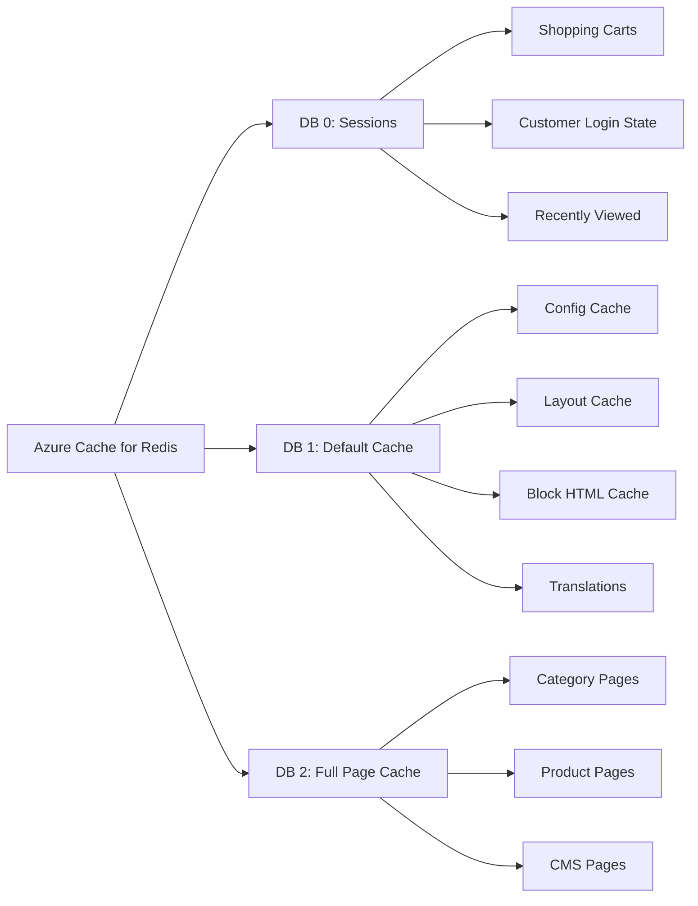

# How to Connect Magento to Azure Redis Cache for High-Performance E-Commerce Session Management

Author: [nawazdhandala](https://www.github.com/nawazdhandala)

Tags: Azure, Redis, Magento, E-Commerce, Session Management, Caching, Performance

Description: Connect Magento 2 to Azure Cache for Redis for high-performance session management, page caching, and full-page cache storage in e-commerce.

---

Magento 2 is powerful but resource-hungry. Out of the box, it stores sessions in files and uses the database for caching. Both of these approaches create serious performance problems under load. File-based sessions cause disk I/O bottlenecks and break when you scale to multiple servers. Database caching hammers MySQL with constant read and write operations for cache entries. Redis solves both problems by providing an in-memory data store that handles sessions and caching with sub-millisecond latency.

Azure Cache for Redis gives you a managed Redis instance with built-in high availability, automated patching, and easy scaling. In this guide, I will connect Magento 2 to Azure Cache for Redis for both session management and page caching.

## Why Redis for Magento

Magento uses caching extensively. There are several cache types - configuration cache, layout cache, block HTML cache, full page cache, and more. On every page load, Magento checks and reads from these caches. When those reads go to the database, each one is a SQL query. With Redis, they are in-memory lookups that complete in microseconds.

Sessions are even more critical. Every customer browsing your store has a session that tracks their cart, login state, and recently viewed products. During peak traffic, thousands of concurrent sessions need to be read and written constantly. Redis handles this effortlessly because it is purpose-built for exactly this kind of workload.

## Creating Azure Cache for Redis

Create a Redis instance sized appropriately for your Magento store.

```bash
# Create a resource group
az group create --name rg-magento --location eastus

# Create a Redis cache instance
# Standard C1 is good for small-medium stores
# Premium P1 with clustering for large stores
az redis create \
  --name magento-redis-cache \
  --resource-group rg-magento \
  --location eastus \
  --sku Standard \
  --vm-size c2 \
  --enable-non-ssl-port false \
  --minimum-tls-version 1.2

# Get the connection details
az redis show \
  --name magento-redis-cache \
  --resource-group rg-magento \
  --query "{hostname:hostName, port:sslPort}" -o table

# Get the access key
az redis list-keys \
  --name magento-redis-cache \
  --resource-group rg-magento \
  --query primaryKey -o tsv
```

For production Magento stores, I recommend at least a Standard C2 (2.5 GB cache) for small stores and a Premium P1 (6 GB) or higher for stores with large catalogs. The Premium tier also gives you data persistence, virtual network integration, and clustering.

## Configuring Magento for Redis Sessions

Magento 2 has built-in Redis support. You configure it through the `env.php` file or via the Magento CLI.

Using the CLI is the cleanest approach.

```bash
# Configure Redis for session storage
bin/magento setup:config:set \
  --session-save=redis \
  --session-save-redis-host=magento-redis-cache.redis.cache.windows.net \
  --session-save-redis-port=6380 \
  --session-save-redis-password=YOUR_REDIS_ACCESS_KEY \
  --session-save-redis-timeout=2.5 \
  --session-save-redis-persistent-id=sess-db0 \
  --session-save-redis-db=0 \
  --session-save-redis-compression-threshold=2048 \
  --session-save-redis-compression-lib=gzip \
  --session-save-redis-log-level=1 \
  --session-save-redis-max-concurrency=6 \
  --session-save-redis-break-after-frontend=5 \
  --session-save-redis-break-after-adminhtml=30 \
  --session-save-redis-first-lifetime=600 \
  --session-save-redis-bot-first-lifetime=60 \
  --session-save-redis-bot-lifetime=7200 \
  --session-save-redis-disable-locking=0 \
  --session-save-redis-min-lifetime=60 \
  --session-save-redis-max-lifetime=2592000
```

This updates the `app/etc/env.php` file. You can also edit it directly.

```php
// app/etc/env.php - Session configuration
'session' => [
    'save' => 'redis',
    'redis' => [
        'host' => 'magento-redis-cache.redis.cache.windows.net',
        'port' => '6380',
        'password' => 'YOUR_REDIS_ACCESS_KEY',
        'timeout' => '2.5',
        'persistent_identifier' => 'sess-db0',
        'database' => '0',           // Use database 0 for sessions
        'compression_threshold' => '2048',
        'compression_library' => 'gzip',
        'log_level' => '1',
        'max_concurrency' => '6',
        'break_after_frontend' => '5',
        'break_after_adminhtml' => '30',
        'first_lifetime' => '600',    // 10 minutes for new sessions
        'bot_first_lifetime' => '60', // 1 minute for bot sessions
        'bot_lifetime' => '7200',     // 2 hours for bot sessions
        'disable_locking' => '0',
        'min_lifetime' => '60',
        'max_lifetime' => '2592000',  // 30 days max session lifetime
        // SSL/TLS configuration for Azure Redis
        'scheme' => 'tls'
    ]
],
```

The session locking settings are important for Magento. Setting `disable_locking` to 0 prevents race conditions with concurrent AJAX requests that could corrupt session data (like shopping cart contents).

## Configuring Magento Default Cache

Use a separate Redis database for the default cache backend.

```bash
# Configure Redis for default cache
bin/magento setup:config:set \
  --cache-backend=redis \
  --cache-backend-redis-server=magento-redis-cache.redis.cache.windows.net \
  --cache-backend-redis-port=6380 \
  --cache-backend-redis-password=YOUR_REDIS_ACCESS_KEY \
  --cache-backend-redis-db=1
```

The corresponding env.php configuration.

```php
// app/etc/env.php - Default cache configuration
'cache' => [
    'frontend' => [
        'default' => [
            'backend' => 'Magento\\Framework\\Cache\\Backend\\Redis',
            'backend_options' => [
                'server' => 'magento-redis-cache.redis.cache.windows.net',
                'port' => '6380',
                'password' => 'YOUR_REDIS_ACCESS_KEY',
                'database' => '1',    // Use database 1 for default cache
                'compress_data' => '1',
                'compression_lib' => 'gzip',
                'scheme' => 'tls'
            ]
        ],
    ]
],
```

## Configuring Full Page Cache

Magento's full page cache (FPC) stores entire rendered HTML pages. This is the biggest performance win because it eliminates PHP execution entirely for cached pages.

```php
// app/etc/env.php - Full Page Cache configuration
'cache' => [
    'frontend' => [
        'default' => [
            // ... default cache config from above
        ],
        'page_cache' => [
            'backend' => 'Magento\\Framework\\Cache\\Backend\\Redis',
            'backend_options' => [
                'server' => 'magento-redis-cache.redis.cache.windows.net',
                'port' => '6380',
                'password' => 'YOUR_REDIS_ACCESS_KEY',
                'database' => '2',    // Use database 2 for FPC
                'compress_data' => '0', // Don't compress FPC for speed
                'scheme' => 'tls'
            ]
        ]
    ]
],
```

Notice I set `compress_data` to 0 for the full page cache. FPC entries are read very frequently, and the CPU cost of decompression can offset the memory savings. For the default cache, compression makes sense because those entries are smaller and accessed less frequently.

## Database Layout

Here is how the Redis databases are organized.



Using separate Redis databases keeps the data isolated. If you need to flush the page cache (which happens during deployments), it does not affect sessions or the default cache.

## Monitoring Redis Performance

Azure provides built-in monitoring for Redis. Key metrics to watch include memory usage, cache hit ratio, and connected clients.

```bash
# Check Redis info
az redis show \
  --name magento-redis-cache \
  --resource-group rg-magento \
  --query "{name:name, sku:sku.name, maxMemory:redisConfiguration.maxmemoryPolicy}" -o table
```

You can also connect directly via the Redis CLI to inspect cache contents.

```bash
# Connect to Azure Redis with SSL
redis-cli -h magento-redis-cache.redis.cache.windows.net \
  -p 6380 --tls -a YOUR_REDIS_ACCESS_KEY

# Check memory usage per database
INFO memory

# Check key count per database
INFO keyspace

# Check session count
SELECT 0
DBSIZE

# Check cache hit rate
INFO stats
```

A healthy Magento Redis setup should show a cache hit ratio above 90%. If it is lower, investigate whether caches are being invalidated too frequently or if the Redis instance is too small and evicting entries.

## Scaling for Peak Traffic

During sales events, session count and cache usage spike. Azure Cache for Redis lets you scale without downtime on the Premium tier.

```bash
# Scale up to a larger instance
az redis update \
  --name magento-redis-cache \
  --resource-group rg-magento \
  --sku Premium \
  --vm-size p2
```

For very large stores, use Redis clustering on the Premium tier. This distributes data across multiple Redis shards.

```bash
# Create a clustered Redis instance
az redis create \
  --name magento-redis-cluster \
  --resource-group rg-magento \
  --location eastus \
  --sku Premium \
  --vm-size p1 \
  --shard-count 3
```

## Wrapping Up

Connecting Magento to Azure Cache for Redis is one of the most impactful performance upgrades you can make. Sessions move from slow file or database storage to sub-millisecond in-memory access. Cache reads stop hitting MySQL. Full page cache serves entire pages without executing PHP. The result is a Magento store that responds faster, handles more concurrent users, and puts less stress on your database server. For any Magento store handling real traffic, Redis is not optional - it is essential.
