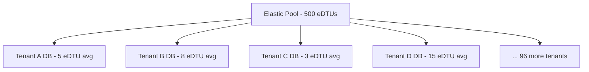

# How to Build a Multi-Tenant Application with Entity Framework Core and Azure SQL Elastic Pools

Author: [nawazdhandala](https://www.github.com/nawazdhandala)

Tags: Entity Framework Core, Azure SQL, Multi-Tenant, Elastic Pools, .NET, SaaS, Database

Description: Build a multi-tenant SaaS application using Entity Framework Core with Azure SQL Elastic Pools for cost-effective tenant isolation.

---

Multi-tenancy is the foundation of SaaS applications. Multiple customers share the same application, but each customer's data must be isolated. There are three common approaches: shared database with a tenant column, schema-per-tenant, and database-per-tenant. Azure SQL Elastic Pools make the database-per-tenant approach economically viable by pooling resources across databases. Instead of paying for dedicated compute for each tenant's database, all tenant databases share a pool of resources, and Azure distributes those resources based on demand.

This guide implements a database-per-tenant multi-tenant application using Entity Framework Core and Azure SQL Elastic Pools.

## Understanding Elastic Pools

Think of an elastic pool as a shared compute budget for multiple databases. If you have 100 tenants and each database needs 5 DTUs on average but occasionally spikes to 50 DTUs, you do not need 100 databases at 50 DTUs each (5,000 DTUs total). An elastic pool of 500 DTUs can handle all 100 tenants comfortably because they rarely all spike simultaneously.



## Prerequisites

- .NET 8 SDK
- Azure CLI
- An Azure account
- Basic Entity Framework Core knowledge

## Setting Up Azure SQL Elastic Pool

```bash
# Create resources
az group create --name saas-demo-rg --location eastus

# Create the SQL Server
az sql server create \
  --name saas-sql-server \
  --resource-group saas-demo-rg \
  --location eastus \
  --admin-user sqladmin \
  --admin-password SecureP@ss123!

# Create the elastic pool
az sql elastic-pool create \
  --name saas-pool \
  --resource-group saas-demo-rg \
  --server saas-sql-server \
  --edition Standard \
  --dtu 100 \
  --db-dtu-min 0 \
  --db-dtu-max 50

# Create a catalog database for tenant metadata
az sql db create \
  --name CatalogDB \
  --resource-group saas-demo-rg \
  --server saas-sql-server \
  --elastic-pool saas-pool
```

## Project Setup

```bash
dotnet new webapi -n MultiTenantApp
cd MultiTenantApp

dotnet add package Microsoft.EntityFrameworkCore.SqlServer
dotnet add package Microsoft.EntityFrameworkCore.Design
dotnet add package Microsoft.EntityFrameworkCore.Tools
```

## Tenant Catalog

The catalog database stores information about each tenant and which database they are in:

```csharp
// Data/CatalogDbContext.cs - Catalog database for tenant metadata
using Microsoft.EntityFrameworkCore;

namespace MultiTenantApp.Data;

public class CatalogDbContext : DbContext
{
    public CatalogDbContext(DbContextOptions<CatalogDbContext> options) : base(options) { }

    public DbSet<Tenant> Tenants => Set<Tenant>();

    protected override void OnModelCreating(ModelBuilder modelBuilder)
    {
        modelBuilder.Entity<Tenant>(entity =>
        {
            entity.HasKey(e => e.Id);
            entity.HasIndex(e => e.Identifier).IsUnique();
            entity.Property(e => e.Name).IsRequired().HasMaxLength(200);
            entity.Property(e => e.Identifier).IsRequired().HasMaxLength(100);
            entity.Property(e => e.ConnectionString).IsRequired().HasMaxLength(500);
        });
    }
}

// Models/Tenant.cs - Tenant entity in the catalog
public class Tenant
{
    public Guid Id { get; set; }
    public string Name { get; set; } = string.Empty;
    public string Identifier { get; set; } = string.Empty;  // URL-friendly name
    public string ConnectionString { get; set; } = string.Empty;
    public string Plan { get; set; } = "basic";
    public bool IsActive { get; set; } = true;
    public DateTime CreatedAt { get; set; } = DateTime.UtcNow;
}
```

## Tenant-Specific Database Context

Each tenant has their own database with the same schema:

```csharp
// Data/TenantDbContext.cs - Tenant-specific database context
using Microsoft.EntityFrameworkCore;

namespace MultiTenantApp.Data;

public class TenantDbContext : DbContext
{
    public TenantDbContext(DbContextOptions<TenantDbContext> options) : base(options) { }

    public DbSet<Project> Projects => Set<Project>();
    public DbSet<Task> Tasks => Set<Task>();
    public DbSet<User> Users => Set<User>();

    protected override void OnModelCreating(ModelBuilder modelBuilder)
    {
        modelBuilder.Entity<Project>(entity =>
        {
            entity.HasKey(e => e.Id);
            entity.Property(e => e.Name).IsRequired().HasMaxLength(200);
            entity.HasMany(e => e.Tasks).WithOne(t => t.Project).HasForeignKey(t => t.ProjectId);
        });

        modelBuilder.Entity<Task>(entity =>
        {
            entity.HasKey(e => e.Id);
            entity.Property(e => e.Title).IsRequired().HasMaxLength(300);
        });

        modelBuilder.Entity<User>(entity =>
        {
            entity.HasKey(e => e.Id);
            entity.HasIndex(e => e.Email).IsUnique();
            entity.Property(e => e.Email).IsRequired().HasMaxLength(200);
        });
    }
}

// Models for the tenant database
public class Project
{
    public int Id { get; set; }
    public string Name { get; set; } = string.Empty;
    public string Description { get; set; } = string.Empty;
    public DateTime CreatedAt { get; set; } = DateTime.UtcNow;
    public List<Task> Tasks { get; set; } = new();
}

public class Task
{
    public int Id { get; set; }
    public string Title { get; set; } = string.Empty;
    public bool Completed { get; set; }
    public int ProjectId { get; set; }
    public Project Project { get; set; } = null!;
}

public class User
{
    public int Id { get; set; }
    public string Name { get; set; } = string.Empty;
    public string Email { get; set; } = string.Empty;
    public string Role { get; set; } = "member";
}
```

## Tenant Resolution

Build middleware that identifies the tenant from the request:

```csharp
// Middleware/TenantMiddleware.cs - Resolve tenant from request
namespace MultiTenantApp.Middleware;

public class TenantMiddleware
{
    private readonly RequestDelegate _next;

    public TenantMiddleware(RequestDelegate next)
    {
        _next = next;
    }

    public async System.Threading.Tasks.Task InvokeAsync(HttpContext context, ITenantService tenantService)
    {
        // Resolve tenant from the request header or subdomain
        var tenantIdentifier = context.Request.Headers["X-Tenant-Id"].FirstOrDefault()
            ?? ExtractFromSubdomain(context.Request.Host.Host);

        if (!string.IsNullOrEmpty(tenantIdentifier))
        {
            var tenant = await tenantService.GetTenantAsync(tenantIdentifier);
            if (tenant != null && tenant.IsActive)
            {
                // Store the tenant in HttpContext for later use
                context.Items["Tenant"] = tenant;
                context.Items["TenantConnectionString"] = tenant.ConnectionString;
            }
        }

        await _next(context);
    }

    // Extract tenant identifier from subdomain (e.g., acme.myapp.com)
    private static string? ExtractFromSubdomain(string host)
    {
        var parts = host.Split('.');
        return parts.Length >= 3 ? parts[0] : null;
    }
}
```

## Tenant Service

The tenant service manages tenant lifecycle, including provisioning new databases:

```csharp
// Services/TenantService.cs - Tenant management
using Microsoft.Data.SqlClient;
using Microsoft.EntityFrameworkCore;
using MultiTenantApp.Data;

namespace MultiTenantApp.Services;

public interface ITenantService
{
    System.Threading.Tasks.Task<Tenant?> GetTenantAsync(string identifier);
    System.Threading.Tasks.Task<Tenant> ProvisionTenantAsync(string name, string identifier);
    TenantDbContext GetTenantContext(string connectionString);
}

public class TenantService : ITenantService
{
    private readonly CatalogDbContext _catalogDb;
    private readonly IConfiguration _configuration;
    private readonly IServiceProvider _serviceProvider;

    public TenantService(
        CatalogDbContext catalogDb,
        IConfiguration configuration,
        IServiceProvider serviceProvider)
    {
        _catalogDb = catalogDb;
        _configuration = configuration;
        _serviceProvider = serviceProvider;
    }

    // Look up a tenant by their identifier
    public async System.Threading.Tasks.Task<Tenant?> GetTenantAsync(string identifier)
    {
        return await _catalogDb.Tenants
            .FirstOrDefaultAsync(t => t.Identifier == identifier);
    }

    // Provision a new tenant with their own database
    public async System.Threading.Tasks.Task<Tenant> ProvisionTenantAsync(string name, string identifier)
    {
        var serverName = _configuration["AzureSql:ServerName"];
        var elasticPool = _configuration["AzureSql:ElasticPoolName"];
        var dbName = $"tenant_{identifier}";

        // Create the database in the elastic pool
        var masterConnectionString = _configuration.GetConnectionString("MasterConnection");
        using (var connection = new SqlConnection(masterConnectionString))
        {
            await connection.OpenAsync();

            // Create a new database within the elastic pool
            var createDbSql = $@"
                CREATE DATABASE [{dbName}]
                ( SERVICE_OBJECTIVE = ELASTIC_POOL ( name = [{elasticPool}] ) )";

            using var command = new SqlCommand(createDbSql, connection);
            command.CommandTimeout = 120; // Database creation can take a while
            await command.ExecuteNonQueryAsync();
        }

        // Build the connection string for the new tenant database
        var tenantConnectionString = new SqlConnectionStringBuilder(masterConnectionString)
        {
            InitialCatalog = dbName,
        }.ConnectionString;

        // Apply migrations to the new tenant database
        var tenantContext = GetTenantContext(tenantConnectionString);
        await tenantContext.Database.MigrateAsync();

        // Register the tenant in the catalog
        var tenant = new Tenant
        {
            Id = Guid.NewGuid(),
            Name = name,
            Identifier = identifier,
            ConnectionString = tenantConnectionString,
            CreatedAt = DateTime.UtcNow,
        };

        _catalogDb.Tenants.Add(tenant);
        await _catalogDb.SaveChangesAsync();

        return tenant;
    }

    // Create a TenantDbContext for a specific connection string
    public TenantDbContext GetTenantContext(string connectionString)
    {
        var options = new DbContextOptionsBuilder<TenantDbContext>()
            .UseSqlServer(connectionString, sql =>
            {
                sql.EnableRetryOnFailure(5, TimeSpan.FromSeconds(10), null);
            })
            .Options;

        return new TenantDbContext(options);
    }
}
```

## Tenant-Aware API Controller

```csharp
// Controllers/ProjectsController.cs - Tenant-aware API
using Microsoft.AspNetCore.Mvc;
using Microsoft.EntityFrameworkCore;
using MultiTenantApp.Data;
using MultiTenantApp.Services;

namespace MultiTenantApp.Controllers;

[ApiController]
[Route("api/[controller]")]
public class ProjectsController : ControllerBase
{
    private readonly ITenantService _tenantService;

    public ProjectsController(ITenantService tenantService)
    {
        _tenantService = tenantService;
    }

    // Helper to get the current tenant's database context
    private TenantDbContext GetTenantDb()
    {
        var connectionString = HttpContext.Items["TenantConnectionString"] as string;
        if (string.IsNullOrEmpty(connectionString))
            throw new UnauthorizedAccessException("No tenant context found");

        return _tenantService.GetTenantContext(connectionString);
    }

    [HttpGet]
    public async Task<IActionResult> GetProjects()
    {
        using var db = GetTenantDb();
        var projects = await db.Projects
            .Include(p => p.Tasks)
            .OrderByDescending(p => p.CreatedAt)
            .ToListAsync();

        return Ok(projects);
    }

    [HttpPost]
    public async Task<IActionResult> CreateProject([FromBody] CreateProjectDto dto)
    {
        using var db = GetTenantDb();

        var project = new Project
        {
            Name = dto.Name,
            Description = dto.Description,
        };

        db.Projects.Add(project);
        await db.SaveChangesAsync();

        return CreatedAtAction(nameof(GetProjects), new { id = project.Id }, project);
    }
}

public record CreateProjectDto(string Name, string Description);
```

## Wrapping Up

Database-per-tenant with Azure SQL Elastic Pools gives you true data isolation without the cost of dedicated databases. Each tenant has their own database, which means backups, restores, and even compliance requirements are handled independently. The elastic pool shares compute resources across all tenant databases, keeping costs manageable. Entity Framework Core makes it straightforward to switch between tenant databases at runtime using different connection strings. The provisioning flow creates a new database, applies migrations, and registers the tenant in the catalog - all automated so onboarding new tenants is a single API call. For SaaS applications where data isolation is important, this pattern scales well from tens to thousands of tenants.
