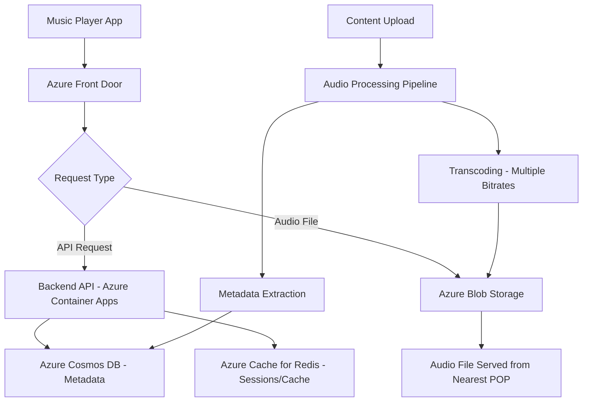

# How to Deploy a Music Streaming Backend with Azure Blob Storage and Azure Front Door

Author: [nawazdhandala](https://www.github.com/nawazdhandala)

Tags: Azure, Blob Storage, Front Door, Music Streaming, CDN, Audio, Backend

Description: Deploy a music streaming backend using Azure Blob Storage for audio file storage and Azure Front Door for global low-latency content delivery.

---

Music streaming has specific technical requirements that differ from video streaming or general web hosting. Audio files need to be delivered with low latency (no one wants to wait 3 seconds for a song to start), they need to support range requests for seeking (jumping to the middle of a track), and the backend needs to handle thousands of concurrent streams efficiently. Azure Blob Storage stores the audio files cheaply and reliably, while Azure Front Door provides global edge caching and intelligent routing to minimize playback start times.

In this guide, I will build a music streaming backend that stores audio files in Blob Storage, serves them through Front Door, and includes an API for managing playlists and track metadata.

## Architecture

The streaming backend has two main paths: the metadata API for track listings, playlists, and search, and the audio delivery path for the actual music files.



## Setting Up Audio Storage

Create a storage account optimized for streaming large files.

```bash
# Create a resource group
az group create --name rg-music --location eastus

# Create a storage account for audio files
az storage account create \
  --name musicstreamstore \
  --resource-group rg-music \
  --location eastus \
  --sku Standard_ZRS \
  --kind StorageV2 \
  --access-tier Hot \
  --allow-blob-public-access true

# Create containers for different audio qualities
az storage container create \
  --name audio-high \
  --account-name musicstreamstore \
  --public-access blob

az storage container create \
  --name audio-medium \
  --account-name musicstreamstore \
  --public-access blob

az storage container create \
  --name audio-low \
  --account-name musicstreamstore \
  --public-access blob

# Create a container for album artwork
az storage container create \
  --name artwork \
  --account-name musicstreamstore \
  --public-access blob
```

I chose Zone-Redundant Storage (ZRS) for durability across availability zones. The Hot access tier makes sense for music that gets played regularly. For older, rarely played tracks, you could use a lifecycle policy to move them to the Cool tier.

## Setting Up Azure Front Door

Azure Front Door provides global load balancing and edge caching, which is critical for music streaming. It routes users to the nearest point of presence and caches audio files at the edge.

```bash
# Create a Front Door profile
az afd profile create \
  --profile-name music-front-door \
  --resource-group rg-music \
  --sku Standard_AzureFrontDoor

# Create an endpoint
az afd endpoint create \
  --endpoint-name music-stream \
  --profile-name music-front-door \
  --resource-group rg-music

# Add the blob storage as an origin
az afd origin-group create \
  --origin-group-name audio-origin-group \
  --profile-name music-front-door \
  --resource-group rg-music \
  --probe-request-type HEAD \
  --probe-protocol Https \
  --probe-interval-in-seconds 60

az afd origin create \
  --origin-name audio-storage \
  --origin-group-name audio-origin-group \
  --profile-name music-front-door \
  --resource-group rg-music \
  --host-name musicstreamstore.blob.core.windows.net \
  --origin-host-header musicstreamstore.blob.core.windows.net \
  --http-port 80 \
  --https-port 443 \
  --priority 1

# Create a route for audio files
az afd route create \
  --route-name audio-route \
  --endpoint-name music-stream \
  --profile-name music-front-door \
  --resource-group rg-music \
  --origin-group audio-origin-group \
  --supported-protocols Https \
  --patterns-to-match "/audio-high/*" "/audio-medium/*" "/audio-low/*" "/artwork/*" \
  --forwarding-protocol HttpsOnly
```

## Caching Rules for Audio Content

Configure aggressive caching for audio files since they are immutable (a track file never changes once uploaded).

```bash
# Create a caching rule set
az afd rule-set create \
  --rule-set-name AudioCaching \
  --profile-name music-front-door \
  --resource-group rg-music

# Cache audio files for 30 days
az afd rule create \
  --rule-name CacheAudioFiles \
  --rule-set-name AudioCaching \
  --profile-name music-front-door \
  --resource-group rg-music \
  --order 1 \
  --match-variable UrlFileExtension \
  --operator Contains \
  --match-values "mp3" "m4a" "ogg" "flac" "aac" \
  --action-name RouteConfigurationOverride \
  --cache-behavior OverrideAlways \
  --cache-duration "30.00:00:00"

# Cache artwork for 7 days
az afd rule create \
  --rule-name CacheArtwork \
  --rule-set-name AudioCaching \
  --profile-name music-front-door \
  --resource-group rg-music \
  --order 2 \
  --match-variable UrlFileExtension \
  --operator Contains \
  --match-values "jpg" "jpeg" "png" "webp" \
  --action-name RouteConfigurationOverride \
  --cache-behavior OverrideAlways \
  --cache-duration "7.00:00:00"
```

## Audio Processing Pipeline

When new tracks are uploaded, process them into multiple quality levels for adaptive streaming.

```javascript
// src/services/audio-processor.js
const { BlobServiceClient } = require('@azure/storage-blob');
const ffmpeg = require('fluent-ffmpeg');
const path = require('path');
const fs = require('fs');

class AudioProcessor {
  constructor(blobConnectionString) {
    this.blobService = BlobServiceClient.fromConnectionString(blobConnectionString);
  }

  // Process an uploaded audio file into multiple qualities
  async processTrack(inputPath, trackId) {
    const qualities = [
      { name: 'high', bitrate: '320k', container: 'audio-high', format: 'mp3' },
      { name: 'medium', bitrate: '192k', container: 'audio-medium', format: 'mp3' },
      { name: 'low', bitrate: '96k', container: 'audio-low', format: 'mp3' }
    ];

    const results = {};

    for (const quality of qualities) {
      const outputPath = `/tmp/${trackId}-${quality.name}.${quality.format}`;

      // Transcode the audio to the target bitrate
      await new Promise((resolve, reject) => {
        ffmpeg(inputPath)
          .audioBitrate(quality.bitrate)
          .audioChannels(2)
          .audioFrequency(44100)
          .format(quality.format)
          .on('end', resolve)
          .on('error', reject)
          .save(outputPath);
      });

      // Upload to the appropriate blob container
      const containerClient = this.blobService
        .getContainerClient(quality.container);
      const blobClient = containerClient
        .getBlockBlobClient(`${trackId}.${quality.format}`);

      const fileBuffer = fs.readFileSync(outputPath);
      await blobClient.upload(fileBuffer, fileBuffer.length, {
        blobHTTPHeaders: {
          blobContentType: 'audio/mpeg',
          // Allow range requests for seeking
          blobCacheControl: 'public, max-age=2592000'
        }
      });

      results[quality.name] = {
        url: blobClient.url,
        bitrate: quality.bitrate,
        size: fileBuffer.length
      };

      // Clean up temporary file
      fs.unlinkSync(outputPath);
    }

    return results;
  }

  // Extract metadata from an audio file
  async extractMetadata(filePath) {
    return new Promise((resolve, reject) => {
      ffmpeg.ffprobe(filePath, (err, metadata) => {
        if (err) return reject(err);

        const audioStream = metadata.streams.find(s => s.codec_type === 'audio');
        const tags = metadata.format.tags || {};

        resolve({
          duration: metadata.format.duration,
          bitrate: metadata.format.bit_rate,
          sampleRate: audioStream ? audioStream.sample_rate : null,
          channels: audioStream ? audioStream.channels : null,
          title: tags.title || tags.TITLE || null,
          artist: tags.artist || tags.ARTIST || null,
          album: tags.album || tags.ALBUM || null,
          genre: tags.genre || tags.GENRE || null,
          year: tags.date || tags.YEAR || null,
          trackNumber: tags.track || tags.TRACKNUMBER || null
        });
      });
    });
  }
}

module.exports = AudioProcessor;
```

## Streaming API

Build a REST API for the music player to interact with.

```javascript
// src/api/streaming.js
const express = require('express');
const { CosmosClient } = require('@azure/cosmos');
const router = express.Router();

const cosmos = new CosmosClient(process.env.COSMOS_CONNECTION);
const db = cosmos.database('music');
const tracks = db.container('tracks');
const playlists = db.container('playlists');

const FRONT_DOOR_HOST = process.env.FRONT_DOOR_HOST;

// Get a streaming URL for a track
router.get('/api/tracks/:trackId/stream', async (req, res) => {
  try {
    const { trackId } = req.params;
    // Quality preference: high, medium, low
    const quality = req.query.quality || 'high';

    // Get track metadata
    const { resource: track } = await tracks.item(trackId, trackId).read();

    if (!track) {
      return res.status(404).json({ error: 'Track not found' });
    }

    // Build the streaming URL through Front Door
    const streamUrl = `https://${FRONT_DOOR_HOST}/audio-${quality}/${trackId}.mp3`;

    res.json({
      trackId: track.id,
      title: track.title,
      artist: track.artist,
      album: track.album,
      duration: track.duration,
      streamUrl: streamUrl,
      artworkUrl: `https://${FRONT_DOOR_HOST}/artwork/${track.artworkId}.jpg`,
      qualities: {
        high: `https://${FRONT_DOOR_HOST}/audio-high/${trackId}.mp3`,
        medium: `https://${FRONT_DOOR_HOST}/audio-medium/${trackId}.mp3`,
        low: `https://${FRONT_DOOR_HOST}/audio-low/${trackId}.mp3`
      }
    });
  } catch (error) {
    res.status(500).json({ error: error.message });
  }
});

// Get a playlist with all track details
router.get('/api/playlists/:playlistId', async (req, res) => {
  try {
    const { resource: playlist } = await playlists
      .item(req.params.playlistId, req.params.playlistId)
      .read();

    if (!playlist) {
      return res.status(404).json({ error: 'Playlist not found' });
    }

    // Fetch all tracks in the playlist
    const trackDetails = await Promise.all(
      playlist.trackIds.map(async (trackId) => {
        const { resource: track } = await tracks.item(trackId, trackId).read();
        return {
          id: track.id,
          title: track.title,
          artist: track.artist,
          album: track.album,
          duration: track.duration,
          artworkUrl: `https://${FRONT_DOOR_HOST}/artwork/${track.artworkId}.jpg`
        };
      })
    );

    res.json({
      ...playlist,
      tracks: trackDetails
    });
  } catch (error) {
    res.status(500).json({ error: error.message });
  }
});

// Search for tracks
router.get('/api/tracks/search', async (req, res) => {
  try {
    const { q } = req.query;
    const query = {
      query: `SELECT * FROM c WHERE CONTAINS(LOWER(c.title), @search) OR CONTAINS(LOWER(c.artist), @search) OR CONTAINS(LOWER(c.album), @search)`,
      parameters: [{ name: '@search', value: q.toLowerCase() }]
    };

    const { resources: results } = await tracks.items.query(query).fetchAll();

    res.json({
      query: q,
      results: results.map(track => ({
        id: track.id,
        title: track.title,
        artist: track.artist,
        album: track.album,
        duration: track.duration,
        artworkUrl: `https://${FRONT_DOOR_HOST}/artwork/${track.artworkId}.jpg`
      }))
    });
  } catch (error) {
    res.status(500).json({ error: error.message });
  }
});

module.exports = router;
```

## Range Request Support

Blob Storage natively supports HTTP range requests, which is essential for seeking within a track. When a user jumps to the middle of a song, the player sends a range request like `Range: bytes=1048576-2097152`, and Blob Storage returns just that portion of the file. Front Door passes these range requests through to the origin correctly.

No special configuration is needed for this - it works out of the box with both Blob Storage and Front Door.

## Cost Optimization

Audio files are smaller than video files, so storage costs are modest. A typical 4-minute MP3 at 320 kbps is about 10 MB. A library of 100,000 tracks at three quality levels is about 4.5 TB of storage, which costs roughly $80/month on Hot tier.

For rarely played tracks, use a lifecycle policy to move them to the Cool tier automatically.

```bash
# Move tracks not accessed for 90 days to Cool tier
az storage account management-policy create \
  --account-name musicstreamstore \
  --resource-group rg-music \
  --policy '{"rules":[{"name":"CoolOldTracks","type":"Lifecycle","definition":{"filters":{"blobTypes":["blockBlob"],"prefixMatch":["audio-"]},"actions":{"baseBlob":{"tierToCool":{"daysAfterLastAccessTimeGreaterThan":90}}}}}]}'
```

## Wrapping Up

Azure Blob Storage and Front Door make a solid foundation for a music streaming backend. Blob Storage provides cheap, durable storage with native range request support for seeking. Front Door caches popular tracks at edge locations worldwide, drastically reducing latency for playback start. The audio processing pipeline ensures tracks are available in multiple qualities so the player can adapt to network conditions. This architecture handles everything from a small indie music platform to a large catalog service with millions of tracks.
