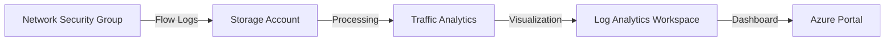

# How to Create Network Security Group Flow Log Analytics with Traffic Analytics

Author: [nawazdhandala](https://www.github.com/nawazdhandala)

Tags: Azure, NSG Flow Logs, Traffic Analytics, Network Monitoring, Security, Log Analytics

Description: Set up NSG flow logs with Traffic Analytics to gain visibility into network traffic patterns and security insights in Azure.

---

Understanding what traffic flows through your Azure virtual networks is fundamental to both security and operations. You need to know who is talking to whom, which ports are in use, how much data is moving, and whether any traffic is being blocked by your NSG rules. NSG flow logs combined with Traffic Analytics give you exactly this visibility.

In this guide, I will walk through setting up NSG flow logs, enabling Traffic Analytics, and using the resulting data to understand and troubleshoot your network traffic.

## What Are NSG Flow Logs?

NSG flow logs record information about IP traffic flowing through a Network Security Group. Each log entry captures the 5-tuple information (source IP, destination IP, source port, destination port, protocol), the direction (inbound/outbound), whether the traffic was allowed or denied, and throughput data.

These logs are stored in an Azure Storage account as JSON files. On their own, they are useful but hard to analyze. That is where Traffic Analytics comes in - it processes the raw flow logs and presents them in an interactive dashboard with map visualizations, top talkers, and security insights.



## Prerequisites

You need the following before setting up flow logs:

- A Network Security Group associated with a subnet or NIC
- A Storage Account in the same region as the NSG
- A Log Analytics workspace (for Traffic Analytics)
- The Network Watcher service enabled in the NSG's region
- The Microsoft.Insights resource provider registered on your subscription

## Step 1: Ensure Network Watcher is Enabled

Network Watcher is automatically created in each region when you create a VNet, but it is worth verifying.

```bash
# Check if Network Watcher exists in the target region
az network watcher list --output table

# If missing, create it
az network watcher configure \
  --resource-group NetworkWatcherRG \
  --locations eastus \
  --enabled true
```

## Step 2: Create the Storage Account

Flow logs need a storage account for retention. Create one in the same region as your NSG.

```bash
# Create a storage account for flow log storage
# Must be in the same region as the NSG
az storage account create \
  --resource-group rg-monitoring \
  --name stflowlogs2026 \
  --location eastus \
  --sku Standard_LRS \
  --kind StorageV2
```

## Step 3: Create a Log Analytics Workspace

Traffic Analytics needs a Log Analytics workspace to store and query the processed data.

```bash
# Create a Log Analytics workspace for Traffic Analytics
az monitor log-analytics workspace create \
  --resource-group rg-monitoring \
  --workspace-name law-traffic-analytics \
  --location eastus \
  --retention-time 90
```

## Step 4: Enable NSG Flow Logs with Traffic Analytics

Now enable flow logs on your NSG with Traffic Analytics processing.

```bash
# Get the NSG resource ID
NSG_ID=$(az network nsg show \
  --resource-group rg-production \
  --name nsg-web-tier \
  --query id \
  --output tsv)

# Get the Storage Account ID
STORAGE_ID=$(az storage account show \
  --resource-group rg-monitoring \
  --name stflowlogs2026 \
  --query id \
  --output tsv)

# Get the Log Analytics workspace ID
WORKSPACE_ID=$(az monitor log-analytics workspace show \
  --resource-group rg-monitoring \
  --workspace-name law-traffic-analytics \
  --query id \
  --output tsv)

# Enable NSG flow logs version 2 with Traffic Analytics
az network watcher flow-log create \
  --resource-group rg-production \
  --name flowlog-web-tier \
  --nsg $NSG_ID \
  --storage-account $STORAGE_ID \
  --enabled true \
  --format JSON \
  --log-version 2 \
  --retention 30 \
  --traffic-analytics true \
  --workspace $WORKSPACE_ID \
  --interval 10
```

A few important notes about the parameters:

- `--log-version 2` is important because version 2 includes throughput data (bytes and packets), which version 1 does not capture.
- `--retention 30` keeps the logs for 30 days in the storage account. Adjust based on your compliance requirements.
- `--interval 10` sets the Traffic Analytics processing interval to 10 minutes. The other option is 60 minutes. Shorter intervals give you more real-time visibility but cost more.

## Step 5: Enable Flow Logs on Multiple NSGs

In a real deployment, you have many NSGs. You can script the enablement across all of them.

```bash
# Enable flow logs on all NSGs in a subscription
# This iterates through every NSG and enables flow logging
for nsg_id in $(az network nsg list --query "[].id" -o tsv); do
  nsg_name=$(echo $nsg_id | rev | cut -d'/' -f1 | rev)
  nsg_rg=$(echo $nsg_id | cut -d'/' -f5)

  az network watcher flow-log create \
    --resource-group $nsg_rg \
    --name "flowlog-${nsg_name}" \
    --nsg $nsg_id \
    --storage-account $STORAGE_ID \
    --enabled true \
    --format JSON \
    --log-version 2 \
    --retention 30 \
    --traffic-analytics true \
    --workspace $WORKSPACE_ID \
    --interval 10

  echo "Enabled flow log for $nsg_name"
done
```

## Exploring Traffic Analytics

After about 10-30 minutes (depending on your processing interval), Traffic Analytics data starts appearing in Log Analytics. You can access the Traffic Analytics dashboard through the Azure portal under Network Watcher, or query the data directly in Log Analytics.

### Querying Flow Log Data

Here are some useful KQL (Kusto Query Language) queries you can run in Log Analytics.

This query shows the top source-destination pairs by flow count.

```
// Top 10 traffic flows by connection count
AzureNetworkAnalytics_CL
| where TimeGenerated > ago(1h)
| where SubType_s == "FlowLog"
| summarize FlowCount = count() by
    SrcIP_s,
    DestIP_s,
    DestPort_d,
    FlowStatus_s
| top 10 by FlowCount desc
```

This query identifies denied traffic, which is useful for security analysis.

```
// All denied traffic in the last 24 hours
AzureNetworkAnalytics_CL
| where TimeGenerated > ago(24h)
| where SubType_s == "FlowLog"
| where FlowStatus_s == "D"
| summarize DeniedFlows = count() by
    SrcIP_s,
    DestIP_s,
    DestPort_d,
    L7Protocol_s
| order by DeniedFlows desc
```

This query shows bandwidth consumption by destination.

```
// Bandwidth usage by destination in the last hour
AzureNetworkAnalytics_CL
| where TimeGenerated > ago(1h)
| where SubType_s == "FlowLog"
| summarize
    TotalBytesSent = sum(BytesSrcToDest_d),
    TotalBytesReceived = sum(BytesDestToSrc_d)
    by DestIP_s
| extend TotalMB = (TotalBytesSent + TotalBytesReceived) / 1048576
| order by TotalMB desc
```

## Setting Up Alerts

Create alerts based on Traffic Analytics data to catch anomalies automatically.

```bash
# Create an alert for when denied flows exceed a threshold
az monitor scheduled-query create \
  --resource-group rg-monitoring \
  --name alert-high-denied-flows \
  --scopes $(az monitor log-analytics workspace show \
    --resource-group rg-monitoring \
    --workspace-name law-traffic-analytics \
    --query id -o tsv) \
  --condition "count 'AzureNetworkAnalytics_CL | where SubType_s == \"FlowLog\" | where FlowStatus_s == \"D\"' > 1000" \
  --window-size 5m \
  --evaluation-frequency 5m \
  --severity 3 \
  --description "High number of denied network flows detected"
```

## Understanding the Traffic Analytics Dashboard

The Traffic Analytics dashboard in the Azure portal provides several views:

**Geo Map View** shows traffic flows plotted on a map. You can see where external traffic is coming from and identify unexpected geographic sources that might indicate a security concern.

**Virtual Network Distribution** shows traffic between VNets, subnets, and to/from the internet. This is useful for understanding your internal traffic patterns.

**Malicious Flows** highlights traffic from known malicious IP addresses. Traffic Analytics integrates with Microsoft Threat Intelligence to flag these automatically.

**NSG Hit Counts** shows which NSG rules are being triggered and how often. This helps you identify rules that are not being used (candidates for cleanup) or rules that are blocking legitimate traffic.

## Storage and Cost Considerations

Flow logs generate significant data, especially on busy networks. Here is what to think about:

- **Storage costs**: Flow log files are stored in your storage account. At high traffic volumes, this can add up. Use lifecycle management policies to move old logs to cool or archive storage.
- **Traffic Analytics processing**: The 10-minute interval costs roughly twice as much as the 60-minute interval. Choose based on how quickly you need insights.
- **Log Analytics ingestion**: Traffic Analytics data ingested into Log Analytics is billed at standard ingestion rates. Set appropriate retention periods and consider using data collection rules to filter unnecessary data.

```bash
# Set up a storage lifecycle policy to move old flow logs to cool storage
az storage account management-policy create \
  --resource-group rg-monitoring \
  --account-name stflowlogs2026 \
  --policy '{
    "rules": [{
      "name": "move-to-cool",
      "type": "Lifecycle",
      "definition": {
        "filters": {"blobTypes": ["blockBlob"], "prefixMatch": ["insights-logs-networksecuritygroupflowevent"]},
        "actions": {"baseBlob": {"tierToCool": {"daysAfterModificationGreaterThan": 7}}}
      }
    }]
  }'
```

## Troubleshooting

If flow logs are not appearing, check these common issues:

- Verify the Microsoft.Insights provider is registered: `az provider register --namespace Microsoft.Insights`
- Confirm the storage account is in the same region as the NSG
- Check that Network Watcher is enabled in the NSG's region
- Look for errors in the flow log configuration: `az network watcher flow-log show --name flowlog-web-tier --resource-group rg-production`

NSG flow logs with Traffic Analytics turn your network from a black box into a transparent, monitorable system. The initial setup takes about 30 minutes, but the visibility it provides pays for itself the first time you need to troubleshoot a connectivity issue or investigate a security incident.
